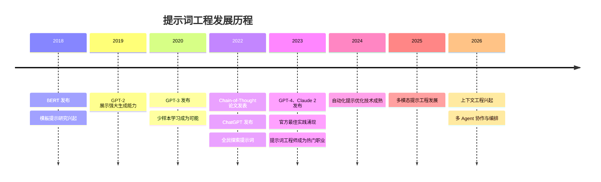

## 1.2 提示词工程的发展历程

提示词工程并非一夜之间出现的全新学科，它的演进与自然语言处理（NLP）技术和大语言模型的发展紧密交织。理解这段发展历程，有助于把握提示词工程的本质特征和未来方向。

### 1.2.1 早期探索：规则与模板时代（2010年代前）

在深度学习主导 NLP 之前，人机交互主要依赖于预设的规则系统和模板匹配。

#### 基于规则的对话系统

早期的聊天机器人（如 ELIZA，1966年）通过模式匹配和预定义规则响应用户输入。开发者需要手工编写大量的"如果-那么"规则：

```
用户输入包含"难过" → 回复"请告诉我更多关于你难过的原因"
用户输入包含"母亲" → 回复"请详细说说你的家庭情况"
```

这种方式虽然称不上真正的"提示词工程"，但体现了设计输入-输出映射的核心思想。

#### 信息检索中的查询优化

搜索引擎时代，用户逐渐学会使用关键词、布尔运算符和高级搜索语法来优化查询结果。这种"查询工程"可以视为提示词工程的早期雏形——用户需要理解系统的工作方式，并据此调整输入以获得更好的结果。

### 1.2.2 预训练语言模型的兴起（2018-2020年）

2018年标志着 NLP 领域的重大转折。BERT（Bidirectional Encoder Representations from Transformers）和 GPT（Generative Pre-trained Transformer）的发布开创了预训练语言模型的新时代。

#### BERT 与完形填空

Google 的 BERT 模型采用掩码语言建模（Masked Language Modeling），通过预测被遮盖的词来学习语言表示。使用 BERT 时，研究者发现可以通过设计特定的"完形填空"模板来执行分类任务：

```
[输入文本] 总的来说，这部电影 [MASK] 极了。
```

如果模型预测 [MASK] 为"精彩"，则判断情感为正面；若为"糟糕"，则为负面。这种将任务转化为填空问题的方法，被称为**模板提示（Prompt-based Learning）**，是提示词工程的学术起源之一。

#### GPT 系列的崛起

OpenAI 的 GPT 系列采用自回归语言模型，通过预测下一个词来生成连贯文本。GPT-2（2019年）展示了惊人的文本生成能力，而 GPT-3（2020年）凭借其 1750 亿参数规模，展现出真正的"少样本学习"能力——仅通过在提示词中提供少量示例，模型就能完成从未经过专门训练的任务。

GPT-3 的论文[《Language Models are Few-Shot Learners》](https://arxiv.org/abs/2005.14165)明确指出，模型的能力可以通过设计合适的提示词来激发，而无需对模型进行微调。这一发现将提示词设计从学术实验推向了实际应用。

### 1.2.3 提示词工程的形成与爆发（2021-2022年）

这一时期，提示词工程从研究领域逐步走向广泛的实践应用。

#### [思维链（Chain-of-Thought）](../06_chain_of_thought/README.md)的突破

2022年，Google 研究团队发表了具有里程碑意义的论文[《Chain-of-Thought Prompting Elicits Reasoning in Large Language Models》](https://arxiv.org/abs/2201.11903)。研究发现，在提示词中加入"让我们一步一步思考"这样的指令，或提供展示推理过程的示例，可以显著提升模型在数学推理、逻辑分析等复杂任务上的表现。

这一发现揭示了一个重要原理：**提示词不仅可以描述任务，还可以引导模型的思维过程**。

#### ChatGPT 的现象级发布

2022年11月，OpenAI 发布 ChatGPT，这款基于 GPT-3.5 的对话 AI 产品迅速成为现象级应用。仅两个月内，用户数突破1亿，创造了软件产品增长速度的新纪录。

ChatGPT 的成功引发了全民对 AI 对话的探索，无数用户开始尝试各种提示词技巧：
- 角色扮演提示（"你是一位专业的法律顾问..."）
- 格式指定（"请用 Markdown 表格形式..."）
- 迭代对话（"在之前的回答基础上..."）

社交媒体上涌现出大量"提示词技巧"分享，提示词工程从专业领域进入公众视野。

### 1.2.4 成熟与专业化（2023-2026年）

随着 GPT-4、Claude、Gemini 等更强大模型的发布，提示词工程进入了快速成熟的阶段。

#### 官方最佳实践的发布

主要 AI 厂商陆续发布官方提示词工程指南：
- **OpenAI**：发布[《Prompt Engineering Guide》](https://platform.openai.com/docs/guides/prompt-engineering)，系统阐述提示词设计策略
- **Anthropic**：针对 Claude 模型发布[详细的提示词技巧文档](https://docs.anthropic.com/zh-CN/docs/build-with-claude/prompt-engineering/overview)，特别强调 XML 标签的使用
- **Google**：为 Gemini 提供[多模态提示工程指南](https://ai.google.dev/gemini/docs/prompting_stats)

这些官方指南的发布标志着提示词工程从经验分享走向系统化知识体系。

#### 技术体系的深化

一系列高级技术得到深入研究和广泛应用：
- **[ReAct](../08_react_tools/8.1_react_framework.md)**（Reasoning and Acting）：结合推理与行动的提示框架
- **[Self-Consistency](../06_chain_of_thought/6.3_self_consistency.md)**：通过多路径推理提高答案一致性
- **[Tree of Thoughts](../06_chain_of_thought/6.4_tree_of_thought.md)**：探索多条推理路径的高级策略
- **[RAG](../09_rag/README.md)**（Retrieval-Augmented Generation）：将检索与生成结合的架构

#### 工具化与自动化

提示词工程开始工具化、自动化：
- **提示词管理平台**：LangChain、PromptLayer 等工具支持提示词版本控制和协作
- **自动优化**：APE（Automatic Prompt Engineering）等技术实现提示词的自动生成和优化
- **评估框架**：建立系统性的提示词效果评估方法

#### 职业化趋势

"提示词工程师"成为新兴职业：
- 大型科技公司开始招聘专门的提示词工程师岗位
- 培训课程和认证项目涌现
- 提示词设计成为产品经理、开发者的必备技能

### 1.2.5 当下与未来：从提示词工程到上下文工程

进入 2026 年，行业开始讨论提示词工程的下一步演进——**[上下文工程（Context Engineering）](../14_future/14.1_context_engineering.md)**。

上下文工程的核心观点是：优化 AI 输出质量不仅仅是优化提示词文本本身，而是要**系统性地管理整个上下文窗口**，包括：
- 系统指令的合理设计
- 动态检索和注入相关信息
- 对话历史的有效管理
- 工具调用结果的整合

这一转变反映了提示词工程正在从"单点优化"走向"系统性设计"的更高层次。

### 1.2.6 发展历程时间线



*图 1.2-1：提示词工程发展历程时间线*


### 思考

1. 结合您的实际业务场景，您认为 提示词工程的发展历程 最关键的应用价值体现在哪里？
