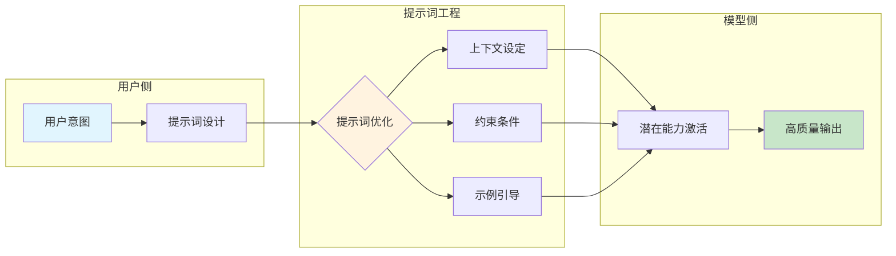
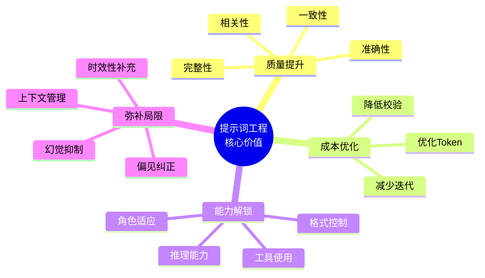
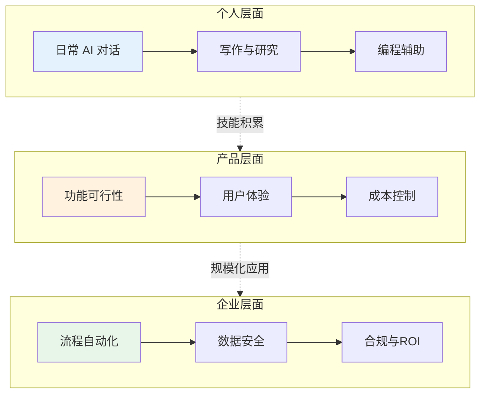

## 1.3 为什么提示词工程如此重要

在大语言模型技术快速普及的今天，提示词工程已从一项专业技术演变为广泛需求的核心技能。理解其重要性，不仅有助于认识这门学科的价值，也能为学习和实践提供明确的动力。

### 模型能力与实际效果的鸿沟

现代大语言模型拥有令人印象深刻的原始能力：它们在海量文本数据上训练，学习了人类语言的各种模式、知识和推理方式。然而，这些能力是"潜在"的——模型本身并不知道用户想要什么，也不会主动调整自己的行为方式。

**提示词是激活和引导这些潜在能力的关键。** 如下图所示，提示词工程在用户意图和模型能力之间架起了桥梁：



*图 1.3-1：提示词工程作为用户意图与模型能力之间的桥梁*

考虑以下两个提示词获得的不同结果：

**提示词 A（模糊）：**
```
写一篇关于气候变化的文章。
```

**可能的输出**：一篇泛泛而谈的科普文章，篇幅不定，深度不明，可能偏离用户的实际需求。

**提示词 B（精确）：**
```
为一份面向企业高管的月度简报撰写一段关于气候变化的摘要：
- 聚焦于过去30天内的主要政策变化和商业影响
- 篇幅控制在300字以内
- 使用数据支撑关键论点
- 结尾提供2-3条可行动建议
```

**可能的输出**：一段结构清晰、针对性强、可直接使用的商业简报内容。

两个提示词调用的是同一个模型，但输出的实用性却天差地别。这个差异正是提示词工程价值的直观体现。

### 提示词工程的核心价值

提示词工程的核心价值可以从以下四个维度来理解：



*图 1.3-2：提示词工程的四大核心价值维度*

#### 1. 提升输出质量与可靠性

精心设计的提示词可以显著提升模型输出的质量：

- **准确性**：通过提供明确的上下文和约束条件，减少模型"猜测"带来的错误
- **相关性**：确保输出紧密围绕用户的真实需求
- **一致性**：使多次调用产生风格统一、格式规范的结果
- **完整性**：引导模型覆盖任务所需的各个方面

根据 [OpenAI 的提示词工程指南](https://platform.openai.com/docs/guides/prompt-engineering)，优化后的提示词可以将模型在特定任务上的表现提升 20%-50% 甚至更高，而这种提升无需对模型本身进行任何修改。

#### 2. 降低使用成本

提示词工程可以从多个维度降低 AI 应用的成本：

**减少迭代次数**：好的提示词能够"一次成功"，避免用户反复尝试和修改。

**优化 Token 使用**：在 API 调用场景下，提示词的长度直接影响费用。高效的提示词设计可以用更少的词汇传达更丰富的信息，同时引导模型生成简洁而完整的输出。

**降低人工校验成本**：可靠的提示词产出更可预测的结果，减少人工审核和修正的工作量。

#### 3. 解锁模型的高级能力

大语言模型具备许多"隐藏"的高级能力，但这些能力需要通过特定的提示词技术来激发：

- **推理能力**：通过[思维链（Chain-of-Thought）提示](https://arxiv.org/abs/2201.11903)，模型可以完成复杂的逻辑推演和数学计算
- **角色适应**：通过角色设定，模型可以模拟不同专业领域的专家视角
- **格式控制**：通过结构化指令，模型可以输出 JSON、Markdown、代码等特定格式
- **工具使用**：通过 [ReAct 框架](https://arxiv.org/abs/2210.03629)，模型可以与外部系统和 API 交互

这些高级能力的解锁，意味着提示词工程可以扩展 AI 的应用边界，使其胜任更复杂、更专业的任务。

#### 4. 弥补模型局限性

尽管大语言模型能力强大，但它们也存在固有的局限性：

- **时效性**：模型的知识截止于训练数据的时间点
- **幻觉**：模型可能生成看似合理但实际错误的信息
- **上下文限制**：模型的上下文窗口有长度限制
- **偏见**：模型可能反映训练数据中存在的偏见

提示词工程提供了应对这些局限性的策略：
- 通过提供最新信息来补充时效性
- 通过要求引用来源来减少幻觉
- 通过任务分解来应对上下文限制
- 通过明确指令来纠正潜在偏见

### 提示词工程在不同场景的重要性

提示词工程在不同层级和场景中都发挥着关键作用：



*图 1.3-3：提示词工程在不同层级的应用价值*

#### 个人效率提升

对于日常使用 AI 工具的个人用户，掌握提示词技巧意味着：
- 更快速地获得满意的回答
- 更高效地完成写作、研究、编程等任务
- 更深入地挖掘 AI 工具的潜力

#### 产品开发

对于构建 AI 产品的开发团队，提示词工程决定了：
- 产品功能的可行性和可靠性
- 用户体验的质量
- 运营成本的高低
- 产品竞争力的差异化

#### 企业应用

对于在业务流程中引入 AI 的企业，提示词工程影响着：
- 自动化流程的效率和准确率
- 敏感数据的安全性
- 合规性要求的满足程度
- 投资回报率（ROI）

### 提示词工程的战略意义

从更宏观的视角来看，提示词工程具有重要的战略意义：

#### 模型无关的能力

提示词工程技能具有较强的可迁移性。虽然不同模型有各自的特性，但核心的提示词设计原则——清晰表达、提供上下文、示例驱动等——适用于大多数语言模型。这意味着掌握这些技能的人可以快速适应新模型和新平台。

#### 低门槛的能力放大器

相比于模型训练或微调，提示词工程的入门门槛相对较低，不需要深厚的机器学习背景或大量计算资源。它是一种"高杠杆"技能——用相对少量的投入（学习时间和实践）获得显著的能力提升（AI 应用效果）。

#### 人机协作的核心界面

随着 AI 系统在各行各业的渗透，提示词将成为人类与 AI 协作的主要界面。能够有效设计和管理这一界面的人，将在未来的工作环境中拥有显著优势。

### 忽视提示词工程的风险

反过来看，如果不重视提示词工程，可能面临以下风险：

- **效率损失**：反复尝试低效的提示词，浪费时间和资源
- **质量问题**：获得不准确、不相关或不完整的输出
- **安全隐患**：不当的提示词设计可能导致敏感信息泄露或被恶意利用
- **竞争劣势**：在 AI 能力日益重要的时代，低效的 AI 使用将成为竞争短板

### 小结

提示词工程之所以重要，是因为它是释放大语言模型潜力的关键杠杆。无论是提升输出质量、降低使用成本，还是解锁高级能力、弥补模型局限，提示词工程都在其中发挥着不可替代的作用。对于个人而言，它是提升效率的利器；对于组织而言，它是 AI 战略成功的基础。在接下来的章节中，我们将系统性地学习如何掌握这一关键技能。

### 延伸阅读

- [OpenAI Prompt Engineering Guide](https://platform.openai.com/docs/guides/prompt-engineering) - OpenAI 官方提示词工程指南
- [Anthropic Prompt Engineering](https://docs.anthropic.com/en/docs/build-with-claude/prompt-engineering/overview) - Anthropic Claude 提示词最佳实践
- [Google AI Prompt Design](https://ai.google.dev/gemini-api/docs/prompting-intro) - Google Gemini 提示词设计指南
- [Chain-of-Thought Prompting](https://arxiv.org/abs/2201.11903) - 思维链提示的开创性论文
