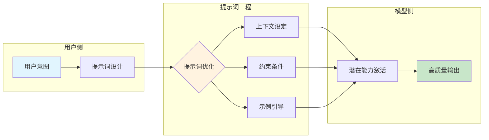
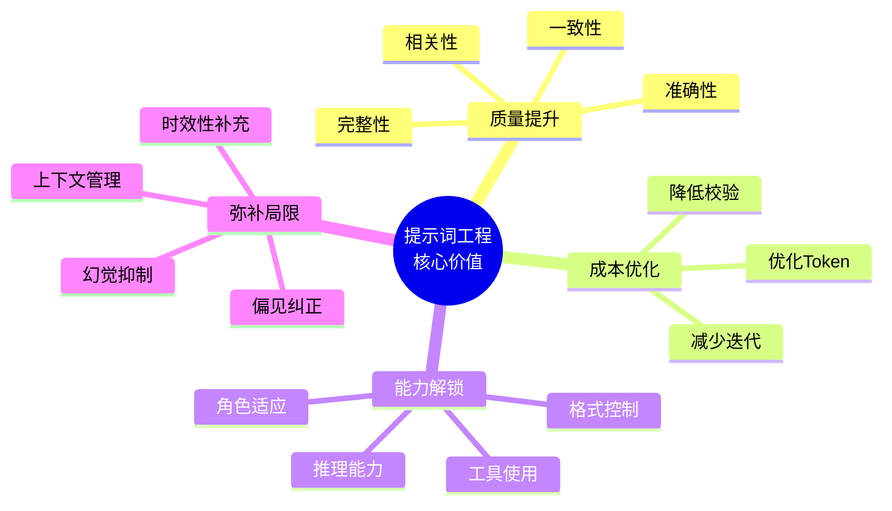
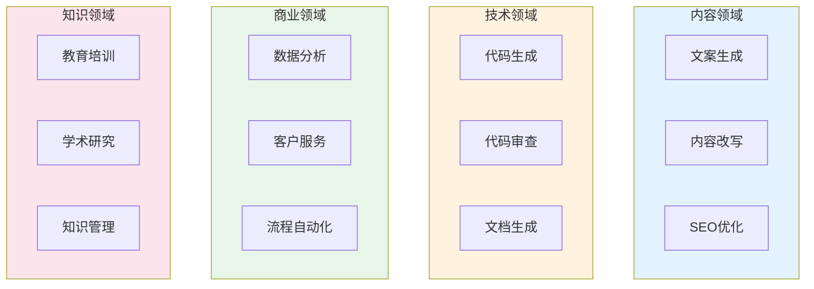

## 1.3 提示词工程的重要性与应用场景

在大语言模型技术快速普及的今天，提示词工程已从一项专业技术演变为广泛需求的核心技能。本节将从重要性和应用场景两个维度，全面阐释提示词工程的价值。

### 1.3.1 模型能力与实际效果的鸿沟

现代大语言模型拥有令人印象深刻的原始能力：它们在海量文本数据上训练，学习了人类语言的各种模式、知识和推理方式。然而，这些能力是"潜在"的——模型本身并不知道用户想要什么，也不会主动调整自己的行为方式。

**提示词是激活和引导这些潜在能力的关键。** 如下图所示，提示词工程在用户意图和模型能力之间架起了桥梁：



*图 1.3-1：提示词工程作为用户意图与模型能力之间的桥梁*

考虑以下两个提示词获得的不同结果：

**提示词 A（模糊）：**
```
写一篇关于气候变化的文章。
```

**可能的输出**：一篇泛泛而谈的科普文章，篇幅不定，深度不明，可能偏离用户的实际需求。

**提示词 B（精确）：**
```
为一份面向企业高管的月度简报撰写一段关于气候变化的摘要：
- 聚焦于过去30天内的主要政策变化和商业影响
- 篇幅控制在300字以内
- 使用数据支撑关键论点
- 结尾提供2-3条可行动建议
```

**可能的输出**：一段结构清晰、针对性强、可直接使用的商业简报内容。

两个提示词调用的是同一个模型，但输出的实用性却天差地别。这个差异正是提示词工程价值的直观体现。

### 1.3.2 核心价值体系

提示词工程的价值可从**通用价值**和**角色价值**两个层面来理解。

#### 通用四维价值



*图 1.3-2：提示词工程的四大核心价值维度*

1. **提升输出质量**：通过提供明确的上下文和约束条件，减少模型"猜测"带来的错误，确保输出准确、相关、一致。根据 [OpenAI 的提示词工程指南](https://platform.openai.com/docs/guides/prompt-engineering)，优化后的提示词可以将模型在特定任务上的表现提升 20%-50%。

2. **降低使用成本**：好的提示词能够"一次成功"，避免反复尝试。高效的提示词用更少的 Token 传达更丰富的信息，减少 API 调用费用和人工校验成本。

3. **解锁高级能力**：通过[思维链提示](https://arxiv.org/abs/2201.11903)激发推理能力，通过角色设定模拟专家视角，通过结构化指令控制输出格式，通过 [ReAct 框架](https://arxiv.org/abs/2210.03629)实现工具使用。

4. **弥补模型局限**：通过提供最新信息补充时效性，通过要求引用来源减少幻觉，通过任务分解应对上下文限制，通过明确指令纠正潜在偏见。

#### 角色差异化价值

| 角色 | 核心价值 | 典型场景 |
|------|---------|---------|
| **开发者** | 加速原型开发、简化架构、提升代码效率 | 代码生成、审查、文档编写 |
| **产品团队** | 优化用户体验、降低风险、差异化竞争 | AI 功能设计、用户交互优化 |
| **内容创作者** | 创意激发、效率提升、质量保障 | 文案生成、风格改写、批量创作 |
| **企业组织** | 流程自动化、知识管理、成本优化 | 报告生成、智能客服、数据分析 |

### 1.3.3 典型应用场景



*图 1.3-3：提示词工程的典型应用场景分类*

#### 内容创作与营销

```
示例：营销文案提示词

产品：智能水杯
目标受众：25-35岁注重健康的都市白领
营销渠道：微信朋友圈广告
限制：50字以内
风格：轻松幽默但不失专业感

请生成3个版本的广告文案。
```

#### 编程与软件开发

从代码生成到代码审查、文档编写和重构建议，提示词工程已成为开发工作流的重要组成部分。

````
示例提示词：
请审查以下 Python 函数，指出潜在的性能问题、安全风险和代码风格改进建议：

```python
def process_user_data(user_input):
    query = "SELECT * FROM users WHERE name = '" + user_input + "'"
    return execute_sql(query)
```

请按以下格式输出审查结果：
1. 问题描述
2. 风险等级（高/中/低）
3. 修复建议
4. 修复后的代码
````

#### 数据分析与商业智能

提示词工程让非技术人员也能进行复杂的数据分析：自然语言转 SQL 查询、分析报告撰写、关键洞察提炼。

#### 客户服务与支持

AI 驱动的客户服务涵盖智能问答、工单处理、情感分析等场景。设计客服提示词需注意维护品牌一致性、处理敏感话题边界、适时转接人工。

#### 教育与研究

个性化学习辅导、课程材料生成、文献研究辅助等场景正在快速增长。

### 1.3.4 应用场景选择矩阵

在选择提示词工程的应用场景时，可参考以下矩阵进行评估：

| 评估维度 | 高适用性场景 | 低适用性场景 |
|----------|-------------|-------------|
| **任务可描述性** | 能用语言清晰描述的任务 | 高度隐性/直觉性任务 |
| **错误容忍度** | 可接受一定误差的任务 | 零容错的高风险场景 |
| **时效性要求** | 对实时性要求不高的任务 | 需要毫秒级响应的任务 |
| **规模化需求** | 需要批量处理的任务 | 偶发的一次性任务 |
| **创意vs规范** | 需要创造性输出的任务 | 严格遵守固定规则的任务 |

### 1.3.5 战略意义

从更宏观的视角来看，提示词工程具有三重战略意义：

- **模型无关的能力**：核心提示词设计原则——清晰表达、提供上下文、示例驱动——适用于大多数语言模型，技能可迁移。
- **低门槛的能力放大器**：相比模型训练或微调，提示词工程入门门槛低，是一种"高杠杆"技能。
- **人机协作的核心界面**：随着 AI 在各行各业渗透，提示词将成为人类与 AI 协作的主要界面。


### 思考

1. 尝试对比"提示词 A"和"提示词 B"的范式：找一个你日常工作中的任务，分别写出模糊版和精确版的提示词，预测两者的输出差异。
2. 用"应用场景选择矩阵"评估你当前工作中的一个任务，判断它是否适合用提示词工程来优化。
