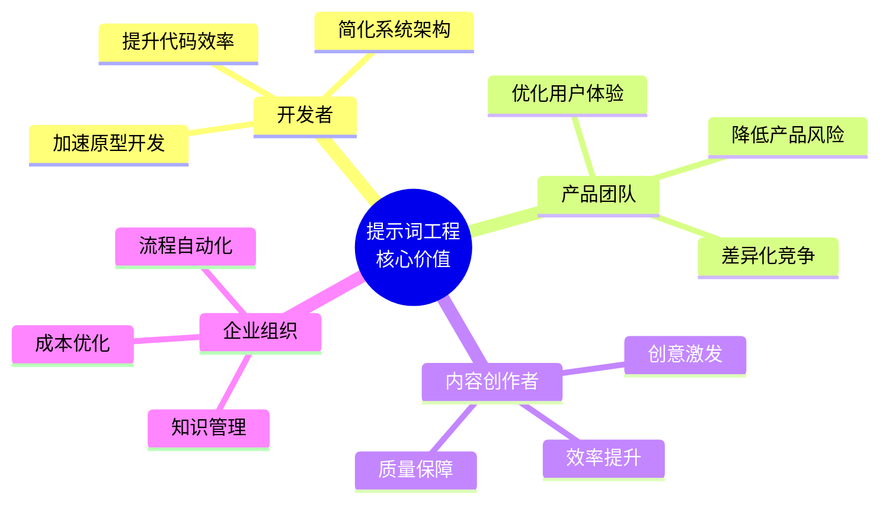
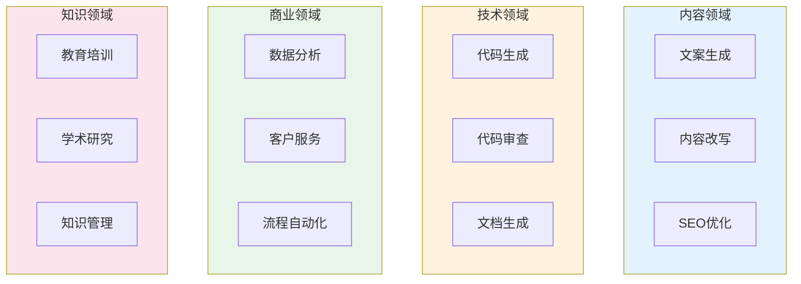

## 1.4 提示词工程的核心价值与应用场景

提示词工程不仅是一门技术，更是一种能够在各行各业创造实际价值的方法论。本节将从核心价值和具体应用场景两个维度，全面展示提示词工程的实用意义。

### 1.4.1 核心价值体系

提示词工程为不同角色的从业者提供了差异化的价值：



*图 1.4-1：提示词工程为不同角色创造的核心价值*

#### 对开发者的价值

**加速原型开发**：通过良好的提示词设计，开发者可以快速验证 AI 驱动功能的可行性，而无需等待模型训练或复杂的系统集成。

**简化系统架构**：许多传统上需要复杂规则引擎或专门机器学习模型的功能，现在可以通过精心设计的提示词来实现，降低了系统的复杂度。

**提升代码效率**：将提示词工程应用于代码生成、代码审查、文档编写等开发任务，可以显著提升开发效率。

````
示例提示词：
请审查以下 Python 函数，指出潜在的性能问题、安全风险和代码风格改进建议：

```python
def process_user_data(user_input):
    query = "SELECT * FROM users WHERE name = '" + user_input + "'"
    return execute_sql(query)
```

请按以下格式输出审查结果：
1. 问题描述
2. 风险等级（高/中/低）
3. 修复建议
4. 修复后的代码
````

#### 对产品团队的价值

**优化用户体验**：产品经理可以通过设计更好的系统提示词来改善 AI 功能的用户体验，使 AI 回应更符合产品定位和用户期望。

**降低产品风险**：通过安全性导向的提示词设计，减少 AI 生成不当内容的风险。

**差异化竞争**：精心设计的提示词可以使同样底层模型的产品展现出不同的能力和个性，形成竞争优势。

#### 对内容创作者的价值

**创意激发**：提示词可以帮助打破创作瓶颈，生成创意方向和灵感素材。

**效率提升**：批量生成初稿、改写、摘要等任务可以节省大量时间。

**质量保障**：通过规范化的提示词模板确保输出的质量一致性。

#### 对企业组织的价值

**流程自动化**：将重复性的知识工作（如报告生成、邮件撰写、数据分析）通过提示词工程实现自动化。

**知识管理**：构建基于企业知识库的 AI 助手，让员工更高效地获取和应用组织知识。

**成本优化**：高效的提示词设计可以减少 API 调用成本，提高投资回报率。

### 1.4.2 典型应用场景



*图 1.4-2：提示词工程的典型应用场景分类*

#### 场景一：内容创作与营销

提示词工程在内容领域有着广泛的应用：

**文案生成**：
- 广告语和标语创作
- 产品描述和卖点提炼
- 社交媒体帖子生成

**内容改写**：
- 风格转换（正式 ↔ 轻松）
- 语言本地化适配
- 受众定向调整

**SEO 优化**：
- 关键词融入的标题生成
- Meta 描述撰写
- 内容结构优化建议

```
示例：营销文案提示词

产品：智能水杯
目标受众：25-35岁注重健康的都市白领
营销渠道：微信朋友圈广告
限制：50字以内
风格：轻松幽默但不失专业感

请生成3个版本的广告文案。
```

#### 场景二：编程与软件开发

在软件工程领域，提示词工程已成为开发工作流的重要组成部分：

**代码生成**：
- 根据需求描述生成代码实现
- 编写测试用例
- 创建样板代码和脚手架

**代码理解**：
- 解释复杂代码逻辑
- 分析代码依赖关系
- 识别潜在问题

**文档生成**：
- API 文档编写
- 代码注释生成
- README 文件创建

**重构建议**：
- 代码优化方案
- 设计模式应用
- 性能改进建议

#### 场景三：数据分析与商业智能

提示词工程让非技术人员也能进行复杂的数据分析：

**数据探索**：
- 自然语言转 SQL 查询
- 数据模式识别
- 异常值检测

**报告生成**：
- 数据可视化建议
- 分析报告撰写
- 关键洞察提炼

**预测分析**：
- 趋势分析叙述
- 业务预测解读
- 决策建议生成

```
示例：数据分析提示词

以下是某电商平台过去6个月的销售数据摘要：
[数据表格]

请分析：
1. 主要销售趋势
2. 表现最佳和最差的产品类别
3. 可能的季节性因素
4. 针对下一季度的3条可操作建议

要求：使用具体数据支撑每个论点。
```

#### 场景四：客户服务与支持

AI 驱动的客户服务是提示词工程的重要应用领域：

**智能问答**：
- 产品常见问题解答
- 政策和流程说明
- 故障排除指导

**工单处理**：
- 问题分类和优先级评估
- 初步解决方案建议
- 升级路径推荐

**情感分析**：
- 客户情绪识别
- 满意度预判
- 危机预警

设计客服场景的提示词需要特别注意：
- 维护品牌一致性
- 处理敏感话题的边界
- 适时转接人工服务

#### 场景五：教育与培训

教育领域是提示词工程快速增长的应用场景：

**个性化学习**：
- 根据学生水平调整解释难度
- 生成针对性练习题
- 提供即时反馈

**内容创建**：
- 课程大纲设计
- 教学材料生成
- 测验和评估创建

**辅导支持**：
- 知识点解答
- 学习路径规划
- 作业辅助（注重引导而非直接给答案）

```
示例：教育辅导提示词

你是一位耐心的数学辅导老师。学生正在学习一元二次方程。

教学原则：
1. 不直接给出答案，而是通过提问引导学生思考
2. 使用生活中的类比帮助理解抽象概念
3. 当学生犯错时，指出错误但给予鼓励
4. 适时总结学习要点

学生问题：为什么要用配方法？直接用求根公式不是更简单吗？
```

#### 场景六：研究与知识工作

学术研究和专业知识工作也受益于提示词工程：

**文献研究**：
- 论文摘要和要点提取
- 研究方法分析
- 跨文献知识综合

**写作辅助**：
- 学术论文结构化
- 论点梳理和完善
- 引用格式调整

**创新探索**：
- 研究方向头脑风暴
- 假设生成和验证思路
- 跨学科连接发现

### 1.4.3 应用场景选择矩阵

在选择提示词工程的应用场景时，可以参考以下矩阵进行评估：

| 评估维度 | 高适用性场景 | 低适用性场景 |
|----------|-------------|-------------|
| **任务可描述性** | 能用语言清晰描述的任务 | 高度隐性/直觉性任务 |
| **错误容忍度** | 可接受一定误差的任务 | 零容错的高风险场景 |
| **时效性要求** | 对实时性要求不高的任务 | 需要毫秒级响应的任务 |
| **规模化需求** | 需要批量处理的任务 | 偶发的一次性任务 |
| **创意vs规范** | 需要创造性输出的任务 | 严格遵守固定规则的任务 |

### 1.4.4 小结

提示词工程的价值在于它能够将大语言模型的强大能力与各种实际应用场景相连接。从内容创作到软件开发，从数据分析到客户服务，从教育培训到学术研究，提示词工程正在重塑各行各业的工作方式。理解这些应用场景，有助于读者在自己的专业领域发现和创造价值。后续章节将深入介绍实现这些应用所需的具体技术和方法。


