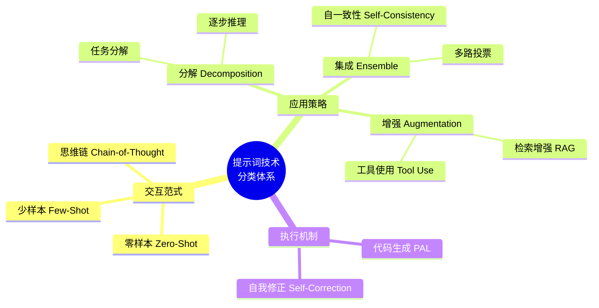
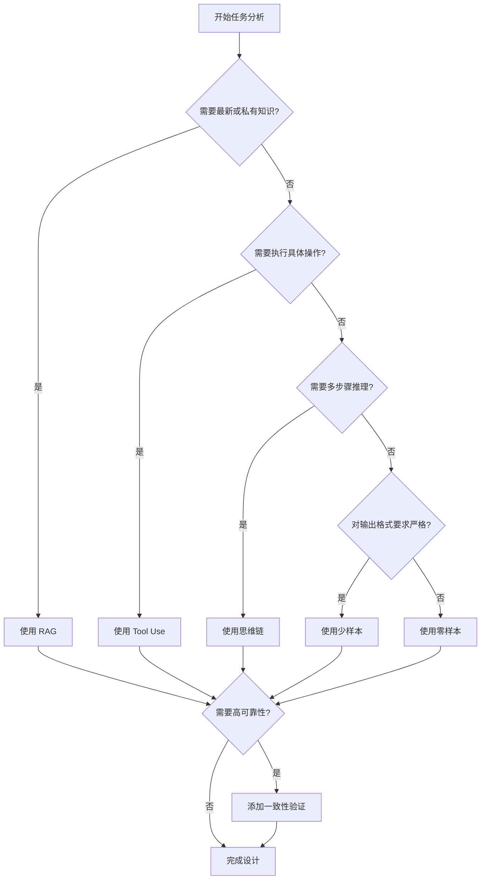

## 1.5 提示词技术分类体系

提示词工程经过数年的快速发展，已经演变出多种多样的技术和方法。为了更好地理解和应用这些技术，我们需要建立一个清晰的分类体系。本节基于最新的综述研究 [Mizrahi et al. (2024)](https://arxiv.org/abs/2402.07927)，介绍大语言模型提示词技术的系统化分类。

### 1.5.1 为什么需要分类体系

随着 *CoT*、*ReAct*、*RAG* 等技术层出不穷，初学者容易感到混乱。分类体系可以帮助我们：

1.  **建立全局认知**：了解不同技术之间的关系和区别。
2.  **指导技术选型**：根据任务需求选择合适的技术类别。
3.  **系统化学习**：按图索骥，有条不紊地掌握各项技能。

### 1.5.2 提示词技术分类图谱

我们可以从**交互范式** 和 **应用策略** 两个主要维度对提示词技术进行分类：

*图 1.5-1：提示词工程技术分类图谱*

### 1.5.3 核心类别详解

#### 1. 基础交互范式

这是提示词最基本的形态，决定了模型如何通过示例进行学习。

| 范式 | 定义 | 典型场景 | 优势 | 局限 |
|------|------|----------|------|------|
| **[Zero-Shot](../05_few_shot/5.1_zero_shot_few_shot.md)** | 不给示例，直接提问 | 通用问答、翻译、摘要 | 简单快捷，Token 成本低 | 复杂任务效果不稳定 |
| **One-Shot** | 提供单个示例 | 格式转换、简单分类 | 平衡效果与成本 | 示例选择影响大 |
| **[Few-Shot](../05_few_shot/5.1_zero_shot_few_shot.md)** | 提供2-6个示例 | 复杂分类、信息提取 | 效果可控，格式一致 | 占用上下文空间 |

选择策略：当任务足够标准化时（如翻译），优先尝试零样本；当需要特定输出格式或边界处理时，逐步增加示例数量。详见[第5章](../05_few_shot/README.md)。

#### 2. 推理增强策略

针对需要逻辑推理的复杂任务，引导模型展示思考过程。

| 策略 | 核心机制 | 最佳场景 | 示例触发语 |
|------|----------|----------|-----------|
| **[Chain-of-Thought](../06_chain_of_thought/6.1_cot_principles.md)** | 显式展示中间步骤 | 数学计算、逻辑推理 | "让我们一步步思考" |
| **[Tree-of-Thought](../06_chain_of_thought/6.4_tree_of_thought.md)** | 探索多条推理路径 | 创意问题、规划任务 | "列出3种可能的方案" |
| **Decomposition** | 将大问题拆分为子问题 | 复杂工作流、多步骤任务 | "首先...然后...最后..." |

这些策略的共同点是：**将隐式的思考过程显式化**。研究表明，在大模型（>50B 参数）上，思维链可将推理准确率提升 20-50%。详见[第6](../06_chain_of_thought/README.md)、[7章](../07_prompt_chaining/README.md)。

#### 3. 外部能力增强

弥补模型自身知识和能力的边界，使其能够访问实时信息和执行具体操作。

| 技术 | 解决的问题 | 工作原理 | 典型工具 |
|------|-----------|----------|----------|
| **[RAG](../09_rag/9.1_rag_principles.md)** | 知识截止、私有数据 | 检索相关文档注入上下文 | 向量数据库、嵌入模型 |
| **[Tool Use](../08_react_tools/README.md)** | 无法计算、无法操作 | 调用外部API执行任务 | 搜索引擎、计算器、代码解释器 |
| **Code Execution** | 复杂计算、数据处理 | 生成并执行代码 | Python 沙盒、Jupyter |

选择策略：
- 需要最新信息或私有知识 → RAG（[第9章](../09_rag/README.md)）
- 需要精确计算或外部操作 → Tool Use（[第8章](../08_react_tools/README.md)）
- 需要复杂数据处理 → Code Execution（[第8章](../08_react_tools/README.md)）

#### 4. 可靠性集成策略

通过多路径验证和自我审视机制，提升输出的稳定性和准确性。

| 策略 | 核心思想 | 适用场景 | 成本考量 |
|------|----------|----------|----------|
| **[Self-Consistency](../06_chain_of_thought/6.3_self_consistency.md)** | 多次采样+多数投票 | 数学题、逻辑推理 | 需多次API调用 |
| **Self-Correction** | 生成后自我检查和修正 | 代码生成、事实核查 | 增加一轮对话 |
| **Verification Chain** | 独立验证步骤 | 关键业务决策 | 需设计验证逻辑 |

这些策略的共同点是：**不信任单次输出，通过冗余机制提升可靠性**。详见[第6](../06_chain_of_thought/README.md)、[7章](../07_prompt_chaining/README.md)。

### 1.5.4 技术选型决策流程

面对一个具体任务，可以按以下流程选择技术：

*图 1.5-2：提示词技术选型决策流程*

### 1.5.5 本书结构与分类体系的对应

本书的章节编排大体遵循了从基础到高级的进阶路线：

- **基础篇 (第3-4章)**：涵盖基础交互范式和设计原则。
- **技术篇 (第5-7章)**：深入讲解少样本、思维链等推理增强策略。
- **应用篇 (第8-10章)**：探讨工具使用、RAG和多模态等外部增强技术。
- **进阶篇 (第11-14章)**：关注安全性、自动化及未来集成策略。

### 1.5.6 小结

理解这个分类体系，就像拥有了一张"提示词工程地图"。无论未来出现什么新技术，我们都可以将其定位到这个体系中。掌握这些底层范式，比死记硬背具体的Prompt模板更有价值。

