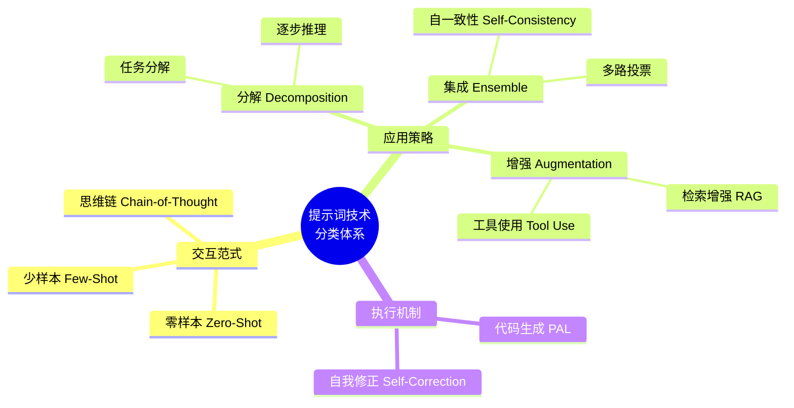

## 1.5 提示词技术分类体系

提示词工程经过数年的快速发展，已经演变出多种多样的技术和方法。为了更好地理解和应用这些技术，我们需要建立一个清晰的分类体系。本节基于最新的综述研究 [Mizrahi et al. (2024)](https://arxiv.org/abs/2402.07927)，介绍大语言模型提示词技术的系统化分类。

### 为什么需要分类体系

随着 *CoT*、*ReAct*、*RAG* 等技术层出不穷，初学者容易感到混乱。分类体系可以帮助我们：

1.  **建立全局认知**：了解不同技术之间的关系和区别。
2.  **指导技术选型**：根据任务需求选择合适的技术类别。
3.  **系统化学习**：按图索骥，有条不紊地掌握各项技能。

### 提示词技术分类图谱

我们可以从**交互范式** 和 **应用策略** 两个主要维度对提示词技术进行分类：

*图 1.5-1：提示词工程技术分类图谱*

### 核心类别详解

#### 1. 基础交互范式 (Interaction Paradigms)
这是提示词最基本的形态，决定了模型如何通过示例进行学习。
- **Zero-Shot (零样本)**：不给示例，直接提问。（详见第5章）
- **Few-Shot (少样本)**：提供少量输入输出示例，让模型通过类比学习。（详见第5章）

#### 2. 推理增强策略 (Reasoning Strategies)
针对复杂逻辑任务，引导模型进行深层思考。
- **Chain-of-Thought (思维链)**：要求模型展示中间推理步骤。（详见第6章）
- **Decomposition (分解)**：将大问题拆解为小问题，逐个击破。（详见第7章）

#### 3. 外部能力增强 (External Augmentation)
弥补模型自身知识和能力的局限。
- **RAG (检索增强)**：外挂知识库，提升知识时效性和准确性。（详见第9章）
- **Tool Use (工具使用)**：调用计算器、API等外部工具执行操作。（详见第8章）

#### 4. 可靠性集成 (Reliability & Ensembling)
通过多路径验证提升输出的稳定性。
- **Self-Consistency (自一致性)**：多次推理，投票选出最佳答案。（详见第6章）
- **Self-Correction (自我修正)**：让模型检查和修正自己的输出。（详见第7章）

### 本书结构与分类体系的对应

本书的章节编排大体遵循了从基础到高级的进阶路线：

- **基础篇 (第3-4章)**：涵盖基础交互范式和设计原则。
- **技术篇 (第5-7章)**：深入讲解少样本、思维链等推理增强策略。
- **应用篇 (第8-10章)**：探讨工具使用、RAG和多模态等外部增强技术。
- **进阶篇 (第11-14章)**：关注安全性、自动化及未来集成策略。

### 小结

理解这个分类体系，就像拥有了一张"提示词工程地图"。无论未来出现什么新技术，我们都可以将其定位到这个体系中。掌握这些底层范式，比死记硬背具体的Prompt模板更有价值。

### 延伸阅读

- [A Systematic Survey of Prompt Engineering](https://arxiv.org/abs/2402.07927) - 2024年发布的全面提示词工程综述
- [The Prompt Report](https://arxiv.org/abs/2406.06608) - 最全面的提示词技术综述（58种技术+33个术语）
- [Prompting Guide](https://www.promptingguide.ai/) - DAIR.AI 提供的提示词学习指南

