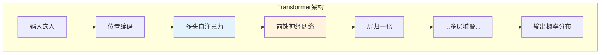

## 2.1 大语言模型的工作原理

理解大语言模型（LLM）的工作原理，是掌握提示词工程的重要基础。本节将用相对直观的方式解释这些复杂系统的核心机制，重点关注与提示词设计相关的概念。

### 2.1.1 从语言建模说起

大语言模型的核心任务是**语言建模**（Language Modeling），即学习和表示人类语言的概率分布。简单来说，模型在训练过程中学会了一件事：**给定一段文本，预测下一个最可能出现的词是什么**。

例如，给定文本"今天天气真"，模型会计算各个可能续写词的概率：
- "好" — 概率 45%
- "不错" — 概率 20%
- "糟糕" — 概率 15%
- "热" — 概率 10%
- 其他 — 概率 10%

然后根据这个概率分布选择下一个词，并重复这个过程直到生成完整的回复。

这个看似简单的"下一词预测"任务，当在海量文本数据上进行训练后，会涌现出令人惊讶的能力：模型不仅学会了语法规则，还学会了事实知识、推理模式，甚至创意表达。

### 2.1.2 Transformer 架构

现代大语言模型几乎都基于 **Transformer** 架构，这是 2017 年由 Google 研究团队在论文 [Attention Is All You Need](https://arxiv.org/abs/1706.03762)中提出的神经网络结构。



*图 2.1-1：Transformer 架构的核心组件*

#### 注意力机制

Transformer 的核心创新是**自注意力机制**（Self-Attention），它使模型能够在处理每个词时"关注"输入序列中的所有其他词，并动态计算它们之间的关联强度。

```
输入句子：北京是中国的首都

处理"首都"这个词时，注意力机制可能会：
├── 高度关注"北京" (理解这是哪个城市的首都)
├── 关注"中国" (理解地理范围)
├── 较少关注"是"和"的" (语法功能词)
```

这种机制使模型能够捕捉长距离的语义依赖关系，理解复杂的句子结构。

#### 位置编码

由于 Transformer 并行处理所有输入token，需要通过**位置编码**（Positional Encoding）告诉模型每个词在序列中的位置，从而保留语序信息。

#### 多层堆叠

Transformer 通过堆叠多个相同的层来逐步提取更高级的语言特征。底层可能学习语法和简单模式，而高层则捕捉更抽象的语义和推理能力。GPT-4 等大型模型可能有数十甚至上百层。

### 2.1.3 Token：模型理解的基本单位

大语言模型不直接处理字符或完整单词，而是处理 **Token**——一种介于字符和单词之间的文本单位。

#### 什么是 Token

Token 是模型词汇表中的基本单元，可能是：
- 一个完整的常用词（如 "the", "是"）
- 一个词的一部分（如 "understanding" 可能被拆分为 "under" + "stand" + "ing"）
- 一个汉字（中文通常每个字是一个 Token）
- 标点符号或空格

不同模型使用不同的分词器（Tokenizer），因此相同文本在不同模型中的 Token 数量可能不同。

#### Token 与提示词工程的关系

理解 Token 对提示词设计有实际意义：

**成本计算**：API 定价通常基于 Token 数量，输入和输出 Token 数直接影响费用。

**长度限制**：模型的上下文窗口以 Token 计量，过长的提示词可能被截断。

**估算方式**：
- 英文：约 1 个 Token ≈ 4 个字符或 0.75 个单词
- 中文：约 1 个汉字 ≈ 1-2 个 Token

例如，一段 1000 词的英文文章大约是 1300-1500 个 Token，而 1000 字的中文文章大约是 1000-2000 个 Token。

### 2.1.4 训练过程：预训练与微调

大语言模型的能力来源于其训练过程，通常分为两个主要阶段：

#### 预训练（Pre-training）

在预训练阶段，模型在海量文本数据上进行训练，学习预测下一个 Token。这些数据可能包括：
- 网页内容（如 Common Crawl）
- 书籍和文献
- 代码仓库
- 维基百科等百科全书
- 新闻文章

预训练需要巨大的计算资源，可能需要数千个 GPU 训练数周甚至数月。在这个过程中，模型学会了：
- 语言的语法规则
- 世界知识和事实
- 推理模式
- 各种文本风格和格式

#### 微调（Fine-tuning）与对齐（Alignment）

预训练后的模型具有强大的语言能力，但可能不太"听话"——它只会续写文本，而不是按照指令完成任务。

微调阶段使用更小但更精心策划的数据集来调整模型行为：

**监督微调（SFT）**：使用高质量的指令-回复对训练模型遵循指令。

**人类反馈强化学习（RLHF）**：收集人类对模型输出的偏好评价，训练模型生成人类更喜欢的回复。

这些对齐技术使模型从"文本预测器"转变为"智能助手"，能够理解指令、遵循格式要求，并避免生成有害内容。

### 2.1.5 推理过程：从提示词到输出

当用户发送提示词给模型时，会经历以下推理过程：


*图 2.1-2：从提示词到输出的推理流程*

#### 逐 Token 生成

模型是一个 Token 一个 Token 地生成回复。每生成一个新 Token，它就被添加到上下文中，作为预测下一个 Token 的输入。这个过程称为**自回归生成**（Autoregressive Generation）。

这解释了为什么：
- 模型生成长文本需要更多时间
- 模型"知道"自己之前说了什么（因为前文在上下文中）
- 一旦生成了某些内容，可能会影响后续生成的方向

#### 概率采样

模型不总是选择概率最高的 Token。通过调整采样参数（如 temperature），可以控制生成的随机性：
- 低随机性：更确定、更一致的输出
- 高随机性：更多样、更有创意的输出

这些参数将在 2.3 节详细讨论。

### 2.1.6 涌现能力

当模型规模（参数量、训练数据、计算资源）达到一定阈值时，会出现一些较小模型不具备的能力，这被称为**涌现能力**（Emergent Abilities）：

- **少样本学习**：只需少量示例就能学会新任务
- **思维链推理**：能够展示推理步骤
- **指令遵循**：理解并执行复杂的指令
- **代码生成**：编写和理解程序代码

涌现能力解释了为什么某些提示词技术（如[思维链](../06_chain_of_thought/README.md)）在大模型上效果显著，而在小模型上可能无效。

### 2.1.7 对提示词设计的启示

理解模型工作原理后，可以得出以下提示词设计启示：

1. **模型是模式匹配器**：模型学会了训练数据中的模式，好的提示词应该激活相关的模式。

2. **上下文决定输出**：模型根据完整的上下文生成回复，提示词中的每个部分都可能影响输出。

3. **清晰的信号更有效**：模型需要明确的"信号"来理解任务，模糊的提示词会导致模型"猜测"。

4. **顺序和位置有影响**：由于注意力机制和位置编码，信息在提示词中的位置可能影响其权重。

5. **示例是强引导**：由于训练方式，模型擅长从示例中学习模式并应用到新情况。

### 2.1.8 小结

大语言模型通过在海量文本上学习"下一词预测"任务，获得了强大的语言理解和生成能力。Transformer 架构的注意力机制使模型能够处理复杂的语义关系，而预训练加微调的范式使模型既有广博的知识，又能遵循人类指令。理解这些原理，有助于更有针对性地设计提示词，充分发挥模型的潜力。

### 2.1.9 延伸阅读

- [Attention Is All You Need](https://arxiv.org/abs/1706.03762) - Transformer 架构的原始论文
- [The Illustrated Transformer](https://jalammar.github.io/illustrated-transformer/) - Transformer 可视化详解
- [What Is ChatGPT Doing… and Why Does It Work?](https://writings.stephenwolfram.com/2023/02/what-is-chatgpt-doing-and-why-does-it-work/) - Stephen Wolfram 的深入解析
- [Emergent Abilities of Large Language Models](https://arxiv.org/abs/2206.07682) - 涌现能力研究论文
