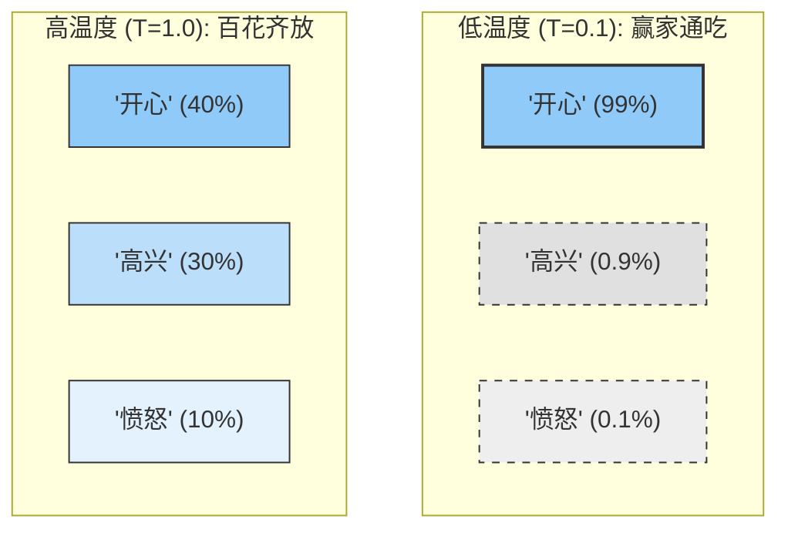

## 2.3 模型参数与输出控制

除了提示词本身，大语言模型还提供了一系列可调参数来控制输出的特性。理解这些参数的作用，可以更精细地调控模型行为，获得更符合需求的结果。

### 2.3.1 Temperature（温度）

Temperature 是控制模型输出"创意度"或"随机性"的最关键参数。为了直观理解，你可以将其想象为调节模型的"**胆量**"。

#### 直观理解：保守派 vs 冒险家

*   **低温度（如 0.1）—— 保守派**：
    模型会变得非常谨慎，只敢选择概率最高的词。它的输出会非常稳定、确定，但也可能显得刻板。这就像一个只背标准答案的学生，每次回答都一模一样。

*   **高温度（如 0.8+）—— 冒险家**：
    模型变得大胆，愿意尝试那些概率稍低、但可能更有趣的词。这就像一个充满想象力的诗人，愿意打破常规，使用更有新意的表达，但有时也可能说出不合逻辑的话。

#### 核心机制：概率的"锐化"与"拉平"

从技术上讲，Temperature 并不是直接改变词语，而是改变了模型选择下一个词的**概率分布形状**：

*   **Temperature < 1（冷却）**：概率分布被"锐化"。原本概率高的词，优势被无限放大（强者愈强）；概率低的词，机会被无限压缩。
*   **Temperature > 1（加热）**：概率分布被"拉平"。高概率词的优势被削弱，各种词被选中的机会变得更加均等，增加了多样性。



#### 实践指南：如何设置参数？

| 场景 | 推荐值 | 理由 |
| :--- | :--- | :--- |
| **需要准确性**<br>(代码、数学、事实问答) | **0 - 0.2** | 你希望答案是唯一且正确的，容忍度极低。 |
| **日常写作**<br>(邮件、摘要、文章润色) | **0.5 - 0.7** | 你希望文笔通顺自然，允许微小的措辞变化，但不希望离题。 |
| **需要创意**<br>(头脑风暴、写小说、取名) | **0.8 - 1.0+** | 你希望模型提供新颖的思路，即使偶尔不够严谨也无所谓。 |

> **提示**：Temperature 为 0 通常意味着"贪婪解码"（Greedy Decoding），即永远只选概率最高的那一个词，这在复现结果或测试调试时非常有用。

### 2.3.2 Top-p（核采样）

Top-p（也称为 Nucleus Sampling）是另一种控制随机性的方法，与 Temperature 互补使用。

#### 工作原理

Top-p 设定一个概率阈值，模型只从累积概率达到该阈值的最小 Token 集合中采样：

- **Top-p = 0.1**：只从最可能的少数 Token 中选择
- **Top-p = 0.9**：从覆盖 90% 概率质量的 Token 中选择
- **Top-p = 1.0**：考虑所有可能的 Token

```
假设预测分布：
"快乐" 40% | "高兴" 25% | "开心" 20% | "愉快" 10% | 其他 5%

Top-p = 0.65: 只从 "快乐"(40%) + "高兴"(25%) 中选择
Top-p = 0.90: 从 "快乐" + "高兴" + "开心" 中选择
```

#### 使用建议

- Top-p 和 Temperature 通常不需要同时调整
- 推荐做法：固定其中一个，调整另一个
- 常见组合：Temperature = 1 + Top-p 调整，或 Top-p = 1 + Temperature 调整

### 2.3.3 Top-k

Top-k 是更简单的采样限制方法，只从概率最高的 k 个 Token 中采样。

- **Top-k = 1**：贪婪解码，总是选最高概率
- **Top-k = 50**：从 top 50 个候选中采样

Top-k 的问题在于它不考虑概率分布的实际形状，在某些情况下可能排除合理选项或包含不合理选项。因此现代实践中 Top-p 更为常用。

### 2.3.4 Max Tokens（最大 Token 数）

Max Tokens 设定模型输出的最大长度限制。

#### 注意事项

- 这是输出的**上限**，不是固定长度
- 如果任务需要更多内容，模型可能在达到限制时突然截断
- 需要在成本控制和内容完整性之间权衡

#### 合理设置

```
任务类型        建议 Max Tokens
短答案问答      50 - 200
摘要生成        200 - 500
文章写作        500 - 2000
代码生成        500 - 4000
长文档处理      根据需要设置更高
```

### 2.3.5 停止序列

停止序列告诉模型在生成特定字符串时停止输出。

#### 应用场景

**格式控制**：
```
提示词：请列出三个要点，每个要点一行。

停止序列：["4.", "四、"]  // 防止生成超过三个要点
```

**结构化输出**：
```
提示词：生成一个 JSON 对象...

停止序列：["}"]  // 在 JSON 结束时停止（需谨慎使用）
```

**多轮对话**：
```
停止序列：["User:", "Human:"]  // 防止模型模拟用户输入
```

### 2.3.6 Presence Penalty（存在惩罚）

Presence Penalty 减少模型重复已经出现过的 Token 的倾向。

- **正值**：鼓励模型涉及新话题，减少重复
- **负值**：允许更多重复（少见）
- **取值范围**：通常 -2.0 到 2.0

适用场景：
- 需要多样化内容时增加此值
- 撰写涉及广泛话题的文章

### 2.3.7 Frequency Penalty（频率惩罚）

Frequency Penalty 根据 Token 在当前输出中的出现次数进行惩罚，出现越多，惩罚越重。

与 Presence Penalty 的区别：
- Presence Penalty：只看是否出现过（二元）
- Frequency Penalty：按出现次数累积惩罚

适用场景：
- 避免同一个词反复出现
- 需要词汇多样性的写作任务

### 2.3.8 参数组合策略

针对不同任务类型，以下是推荐的参数组合：

#### 精确型任务（事实问答、代码、数据提取）

```json
{
  "temperature": 0,
  "top_p": 1,
  "presence_penalty": 0,
  "frequency_penalty": 0
}
```

#### 平衡型任务（商业写作、技术文档）

```json
{
  "temperature": 0.5,
  "top_p": 0.9,
  "presence_penalty": 0.3,
  "frequency_penalty": 0.3
}
```

#### 创意型任务（故事创作、头脑风暴）

```json
{
  "temperature": 0.9,
  "top_p": 0.95,
  "presence_penalty": 0.6,
  "frequency_penalty": 0.5
}
```

### 2.3.9 参数调优流程

```
1. 确定任务类型
   ↓
2. 选择初始参数组合
   ↓
3. 对相同提示词运行多次
   ↓
4. 评估输出质量和一致性
   ↓
5. 微调单个参数
   ↓
6. 重复测试直到满意
```

### 2.3.10 与提示词设计的协同

参数设置和提示词设计应该协同考虑：

**互补关系**：
- 清晰的提示词可以降低对参数调整的依赖
- 好的参数设置可以增强提示词的效果

**冲突避免**：
- 如果提示词要求"发挥创意"，但 Temperature 设为 0，效果会受影响
- 如果提示词要求"精确回答"，但 Temperature 过高，可能导致不稳定

**综合考虑**：

- **目的**：提供可复用的提示词/模板，便于直接迁移到业务任务。
- **输入**：给模型的提示词/参数/上下文（必要时说明变量）。
- **输出**：期望输出格式或评价要点（最好给结构/示例）。
- **注意**（可选）：Token 成本、注入风险、以及常见失败点。

```
任务需求 → 提示词设计 + 参数选择 → 测试验证 → 迭代优化
```


### 动手试试

1. 选一个你常用的模型，分别将 temperature 设为 0、0.7、1.5 来回答同一个问题，对比三次输出有何不同。
2. 在什么业务场景下你需要把 temperature 调到接近 0？什么时候又该调高？
