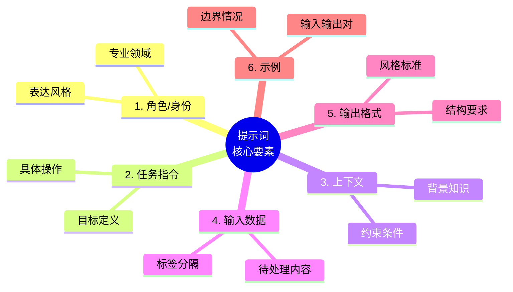

## 3.1 提示词的核心组成要素

一个结构完整的提示词通常由多个核心要素组成，每个要素承担特定的功能。理解这些要素的作用和组织方式，是设计有效提示词的基础。



*图 3.1-1：提示词的六大核心要素*

并非每个提示词都需要包含所有要素，应根据任务复杂度和具体需求灵活选择。

### 3.1.1 要素一：角色/身份

角色设定告诉模型应该以什么身份、从什么视角来处理任务。

#### 作用

- 设定专业领域和知识范围
- 确定语气和表达风格
- 建立回应的权威性和可信度
- 聚焦于特定视角的分析

#### 设计方法

**基本模式**：
```
你是一位 [专业领域] 的 [具体角色]，拥有 [相关经验/能力]。
```

**示例**：
```
你是一位拥有15年经验的资深Python开发工程师，熟悉各种设计模式和代码优化技术。

你是一位专注于B2C市场的品牌营销顾问，擅长社交媒体策略和内容营销。

你是一位儿童教育专家，能够用生动有趣的方式解释复杂概念。
```

#### 进阶技巧

**复合角色**：
```
你是一位同时具备技术和商业背景的产品经理，能够平衡技术可行性和商业价值来评估产品决策。
```

**视角限定**：
```
你是一位持怀疑态度的审计师，任务是找出这份财务报告中的潜在问题。
```

### 3.1.2 要素二：任务指令

任务指令是提示词的核心，明确告诉模型需要做什么。

#### 作用

- 定义任务的目标和范围
- 指明需要执行的具体操作
- 设定任务的边界和约束

#### 设计原则

**明确动作**：使用清晰的动词开始指令
```
分析...    总结...    比较...    生成...
解释...    转换...    评估...    设计...
```

**具体化目标**：避免模糊的描述
```
❌ 写一些关于这个产品的内容
✓ 为这款智能手表撰写一段 100 字的产品卖点描述
```

**分步骤表达**：复杂任务拆解为步骤
```
请完成以下任务：
1. 阅读下方的客户反馈
2. 识别提到的主要问题类别
3. 对每个类别计数
4. 按频率从高到低排序输出
```

### 3.1.3 要素三：上下文

上下文为模型提供完成任务所需的背景信息，帮助模型更好地理解任务环境。

#### 类型

**背景知识**：任务相关的领域知识或事实
```
背景：我们公司是一家成立于2018年的教育科技创业公司，主要产品是面向K12学生的在线学习平台，目前用户数约50万。
```

**约束条件**：限制或规范模型行为的规则
```
约束：
- 只使用公开可查证的信息
- 不要提及竞争对手的具体名称
- 所有建议须符合GDPR合规要求
```

**目标受众**：输出内容的目标读者
```
目标读者：没有技术背景的中小企业主，年龄在40-55岁之间
```

#### 设计原则

- **相关性**：只包含与任务直接相关的信息
- **准确性**：确保提供的信息是正确的
- **简洁性**：用最少的词汇传达必要信息
- **结构化**：使用列表或分节组织复杂上下文

### 3.1.4 要素四：输入数据

输入数据是需要模型处理的具体内容，可以是文本、代码、数据或其他形式。

#### 常见类型

- 待翻译/改写的文本
- 待分析的数据或代码
- 待总结的文档
- 待回答的问题
- 待评估的方案

#### 组织方式

**明确分隔**：使用分隔符区分输入数据
```
请分析以下客户评论：

---
评论内容：
"产品质量不错，但配送太慢了，等了整整一周才收到。客服态度还可以。"
---
```

**标签标注**：使用标签明确数据范围
```
<review>
产品质量不错，但配送太慢了，等了整整一周才收到。客服态度还可以。
</review>
```

**多输入处理**：清晰区分多个输入
````
请比较以下两段代码的性能差异：

代码A：
```python
result = [x**2 for x in range(1000)]
```

代码B：
```python
result = list(map(lambda x: x**2, range(1000)))
```
````

### 3.1.5 要素五：输出格式

输出格式指定模型回复的结构、形式和风格要求。

#### 常见格式类型

**结构化格式**：
- JSON / XML
- Markdown 表格
- 编号列表
- 层级大纲

**内容格式**：
- 字数/段落限制
- 语气风格（正式/非正式）
- 技术深度（入门/专业）

#### 设计示例

```
输出格式要求：
1. 使用Markdown格式
2. 包含一个总结段落（不超过100字）
3. 列出3-5个要点，每个要点用无序列表
4. 最后提供一个表格对比优缺点
```

```
请以 JSON 格式输出，包含以下字段：
{
  "sentiment": "positive/negative/neutral",
  "confidence": 0-1之间的数值,
  "key_points": ["要点1", "要点2", ...]
}
```

### 3.1.6 要素六：示例

示例通过展示期望的输入输出对，帮助模型理解任务模式。

#### 作用

- 消除指令的歧义
- 展示期望的输出风格
- 引导特定的解决思路
- 设定输出的质量标准

#### 设计原则

**代表性**：选择能覆盖常见情况的示例
**多样性**：包含不同类型或边界情况
**清晰性**：示例本身要准确、无歧义
**简洁性**：示例应精炼，不包含无关细节

#### 示例格式

```
示例：

输入：今天天气真好，阳光明媚。
输出：{"sentiment": "positive", "confidence": 0.95}

输入：产品还行，就是价格有点贵。
输出：{"sentiment": "neutral", "confidence": 0.70}

输入：服务态度太差了，再也不来了！
输出：{"sentiment": "negative", "confidence": 0.92}

---
现在请分析以下输入：
输入：虽然等了很久，但是东西质量确实不错。
```

### 3.1.7 要素组合示例

以下是一个包含所有核心要素的完整提示词示例：

```markdown
# 角色
你是一位专业的产品评论分析师，擅长从用户评论中提取洞察。

# 任务
分析电商平台的产品评论，提取关键信息并进行情感分类。

# 上下文
- 这是一款新上市的无线蓝牙耳机
- 分析结果将用于产品改进决策
- 需要识别的维度：音质、舒适度、续航、价格

# 输出格式
请以 JSON 格式输出：
{
  "overall_sentiment": "正面/负面/中性",
  "dimensions": {
    "音质": {"sentiment": "...", "comment": "..."},
    "舒适度": {"sentiment": "...", "comment": "..."},
    "续航": {"sentiment": "...", "comment": "..."},
    "价格": {"sentiment": "...", "comment": "..."}
  },
  "improvement_suggestions": ["建议1", "建议2"]
}

# 示例
输入：音质很棒，低音很有力，就是戴久了耳朵有点疼。
输出：
{
  "overall_sentiment": "正面",
  "dimensions": {
    "音质": {"sentiment": "正面", "comment": "低音表现好"},
    "舒适度": {"sentiment": "负面", "comment": "长时间佩戴不适"},
    "续航": {"sentiment": "未提及", "comment": ""},
    "价格": {"sentiment": "未提及", "comment": ""}
  },
  "improvement_suggestions": ["优化耳罩材质提升舒适度"]
}

# 待分析评论
"""
买来一个月了，音质确实可以，降噪效果也不错。电量能用一整天没问题。就是价格偏贵，而且蓝牙偶尔会断连。
"""
```


### 动手试试

1. 拿出你最近写过的一条提示词，用本节的"六大核心要素"逐项检查——缺了哪些要素？补上后效果有变化吗？
2. "角色设定"和"指令"如果互相矛盾（例如角色是"儿童教师"，但指令要求"使用学术论文风格"），模型会怎么处理？
