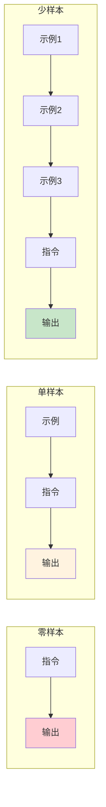

## 5.1 零样本与少样本提示

在提示词工程中，根据是否提供示例以及示例数量的多少，可以将提示方式分为零样本、单样本和少样本三种类型。这些概念源自 [GPT-3 论文](https://arxiv.org/abs/2005.14165)，理解它们的区别和适用场景，是有效应用示例驱动技术的基础。

### 5.1.1 零样本提示

零样本提示是指在不提供任何示例的情况下，仅通过指令描述任务，让模型直接生成输出。

#### 基本形式

```
指令：[任务描述]
输入：[待处理内容]
```

#### 示例

```
请将以下英文翻译成中文：

"The quick brown fox jumps over the lazy dog."
```

```
判断以下评论的情感倾向是正面、负面还是中性：

"这家餐厅的环境不错，但等位时间太长了。"
```

#### 适用场景

零样本提示适用于：
- 任务定义清晰，无歧义
- 模型已经在预训练中接触过类似任务
- 输出格式要求不严格
- 快速原型验证

#### 局限性

- 对复杂或非常规任务效果不佳
- 输出格式可能不一致
- 边界情况处理不可控

### 5.1.2 单样本提示

单样本提示提供一个示例来展示任务模式。

#### 基本形式

```
示例：
输入：[示例输入]
输出：[示例输出]

请处理：
输入：[待处理内容]
```

#### 示例

```
请按照示例的格式提取信息：

示例：
文本：张三，男，1990年出生，工程师
输出：姓名=张三；性别=男；出生年份=1990；职业=工程师

请处理：
文本：李四，女，1985年出生，医生
```

#### 作用

- 消除指令的歧义
- 展示期望的输出格式
- 设定输出的风格和详细程度

### 5.1.3 少样本提示

少样本提示提供多个示例（通常2-6个），使模型能够更好地理解任务模式和边界情况。

#### 基本形式

```
示例1：
输入：[输入1]
输出：[输出1]

示例2：
输入：[输入2]
输出：[输出2]

示例3：
输入：[输入3]
输出：[输出3]

请处理：
输入：[待处理内容]
```

#### 示例

```
请分类以下客户咨询的类型：

咨询："我的订单什么时候能到？"
类型：物流查询

咨询："这个产品支持7天无理由退货吗？"
类型：退换货政策

咨询："你们有没有红色款的？"
类型：产品咨询

咨询："付款后能开发票吗？"
类型：支付与发票

请处理：
咨询："我想改一下收货地址"
```

#### 为什么有效

少样本学习的有效性源于大语言模型的以下特性：

1. **模式识别**：模型能够从示例中识别输入到输出的映射模式
2. **类比推理**：将识别的模式应用到新的输入上
3. **格式学习**：从示例中学习输出的结构和格式
4. **边界理解**：多个示例帮助模型理解任务的边界

### 5.1.4 三种方式的对比



*图 5.1-1：零样本、单样本和少样本提示的对比*

| 特性 | 零样本 | 单样本 | 少样本 |
|------|--------|--------|--------|
| 示例数量 | 0 | 1 | 2-6+ |
| 指令依赖 | 高 | 中 | 低 |
| 格式一致性 | 低 | 中 | 高 |
| Token消耗 | 最低 | 低 | 较高 |

### 5.1.5 选择合适的方式

#### 选择零样本的情况

```
✓ 标准化任务：翻译、摘要等模型熟悉的任务
✓ 格式灵活：对输出格式没有严格要求
✓ 资源受限：上下文窗口紧张，需节省Token
✓ 快速验证：初步测试可行性
```

#### 选择单样本的情况

```
✓ 格式明确：需要展示特定输出格式
✓ 简单任务：任务逻辑简单，一个示例足够说明
✓ 平衡需求：在效果和Token成本之间取得平衡
```

#### 选择少样本的情况

```
✓ 复杂任务：任务规则复杂，需多个示例说明
✓ 边界处理：需要展示边界情况的处理方式
✓ 高一致性：要求输出格式高度一致
✓ 非标准任务：模型不常见的特殊任务
```

### 5.1.6 由零到多的渐进策略

在实践中，建议采用渐进策略：

```
1. 先尝试零样本
   ↓ 效果不满意
2. 添加单个示例
   ↓ 仍有问题
3. 增加到3-5个示例
   ↓ 覆盖边界情况
4. 如果仍不满意，考虑其他技术
   （如思维链、任务分解等）
```

### 5.1.7 上下文学习的本质

少样本学习的本质是**上下文学习**——模型在推理时通过上下文中的示例"临时学习"任务规则，而无需更新模型参数。

这与传统机器学习的关键区别：

| 方面 | 传统机器学习 | 上下文学习 |
|------|-------------|-----------|
| 学习时机 | 训练阶段 | 推理阶段 |
| 参数变化 | 参数更新 | 参数不变 |
| 示例需求 | 大量标注数据 | 少量示例 |
| 任务切换 | 需重新训练 | 只需换示例 |

### 思考

1. 在您的具体业务场景中，有哪些任务必须使用 **少样本提示 (Few-Shot)** 才能保证输出的稳定性？又有哪些任务使用 **零样本提示 (Zero-Shot)** 就足够了？
2. 尝试将一个原本使用零样本提示效果不佳的任务，改写为单样本和三样本提示，观察效果有何变化。
