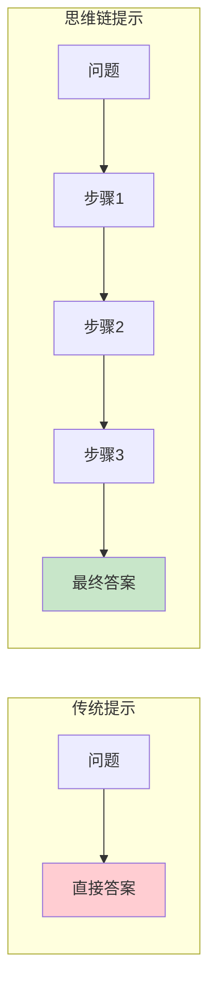

## 6.1 思维链提示的原理与价值

思维链（Chain-of-Thought, CoT）提示是一种通过引导模型展示中间推理步骤来提升复杂任务表现的技术，最早由 [Wei et al. (2022)](https://arxiv.org/abs/2201.11903) 提出。本节将介绍其基本原理、工作机制和应用价值。

### 什么是思维链提示

传统的提示方式直接要求模型输出最终答案：

```
问题：商店有23个苹果，卖出了15个，又进货了12个，现在有多少个？
答案：
```

模型可能直接输出一个数字，有时对有时错。

思维链提示则引导模型展示推理过程：

```
问题：商店有23个苹果，卖出了15个，又进货了12个，现在有多少个？

让我们一步步思考：
1. 初始数量：23个
2. 卖出后剩余：23 - 15 = 8个
3. 进货后总数：8 + 12 = 20个

答案：20个
```

通过展示中间步骤，模型的准确率显著提升。



*图 6.1-1：传统提示与思维链提示的对比*

### 为什么思维链有效

#### 1. 分解复杂问题

思维链将复杂问题分解为一系列简单的子问题，每一步都是模型更容易处理的简单操作。

```
复杂问题："如果A比B高，B比C高，C比D高，那么A和D谁高？"

分解后：
步骤1：A比B高 → A > B
步骤2：B比C高 → B > C
步骤3：C比D高 → C > D
步骤4：综合：A > B > C > D
结论：A比D高
```

#### 2. 利用生成的中间结果

模型在生成过程中可以"看到"自己之前输出的内容。当中间推理步骤被显式生成后，这些信息成为上下文的一部分，可以被后续推理利用。

#### 3. 激活训练中的推理模式

大语言模型在训练过程中接触过大量包含推理过程的文本（如教科书、论文、解题过程等）。思维链提示激活了这些模式。

#### 4. 减少跳跃性错误

直接输出答案时，模型可能"跳过"某些关键步骤导致错误。明确要求展示步骤可以减少这类遗漏。

### 思维链的适用场景

#### 高度适用

- **数学推理**：算术问题、方程求解
- **逻辑推理**：逻辑谜题、条件判断
- **多步骤问题**：需要多个步骤才能得出结论
- **常识推理**：需要结合多个常识知识点

#### 效果一般

- **简单事实问答**：直接提取即可，无需推理
- **创意生成**：不需要严格的逻辑步骤
- **格式转换**：规则明确的机械任务

### 与模型规模的关系

研究发现，思维链的效果与模型规模密切相关：

```
模型规模与CoT效果关系：

小模型（<10B参数）：效果有限，可能产生无意义的推理步骤
中型模型（10-50B参数）：有一定提升，但不稳定
大模型（>50B参数）：效果显著，推理质量高
超大模型（>100B参数）：效果最佳，复杂推理能力强
```

这种"涌现"特性意味着思维链更适合在大型模型上应用。

### 思维链提示的基本形式

#### 直接添加推理要求

```
问题：[问题描述]

请一步一步思考，展示推理过程后再给出答案。
```

#### 使用触发词

```
问题：[问题描述]

让我们逐步分析：
```

#### 结构化推理框架

```
问题：[问题描述]

请按以下结构分析：
1. 理解：这个问题要求我们做什么？
2. 已知：问题中给出了哪些信息？
3. 推理：如何从已知信息得出答案？
4. 结论：最终答案是什么？
```

### 思维链的输出示例

**问题**：
一列火车从A站出发，以每小时80公里的速度行驶。2小时后，另一列火车从B站出发，以每小时120公里的速度追赶。A站和B站相距40公里。问第二列火车何时能追上第一列？

**思维链回答**：

```
让我们一步步分析这个问题。

1. 理解问题：
   - 火车1从A站出发，速度80km/h
   - 2小时后，火车2从B站出发，速度120km/h
   - A和B相距40km
   - 问火车2何时追上火车1

2. 计算初始状态：
   - 火车1行驶2小时后的位置：80 × 2 = 160km（距A站）
   - 此时火车2刚出发，位于B站
   - 两车距离：160km - 40km = 120km（火车1领先）

3. 计算追赶速度：
   - 速度差：120 - 80 = 40 km/h
   - 这是火车2相对于火车1的追赶速度

4. 计算追赶时间：
   - 需要追赶的距离：120km
   - 追赶时间：120 ÷ 40 = 3小时

5. 得出结论：
   火车2在出发后3小时可以追上火车1。
   如果从火车1出发时算起，是2 + 3 = 5小时后。
```

### 思维链的价值总结

```
价值维度        效果
───────────────────────
准确性提升      复杂推理任务准确率可提升20-50%
可解释性        推理过程可见，便于验证和调试
可教学性        模型的推理可供人类学习参考
可纠错性        错误更容易被定位和纠正
适配性广        适用于多种需要推理的任务类型
```

### 小结

思维链提示通过引导模型展示推理过程，有效提升了复杂推理任务的表现。其原理在于问题分解、中间结果利用和推理模式激活。思维链特别适用于数学、逻辑和多步骤推理问题，在大型模型上效果最佳。掌握思维链技术，是释放大语言模型推理潜力的关键。

### 延伸阅读

- [Chain-of-Thought Prompting](https://arxiv.org/abs/2201.11903) - 思维链提示的原始论文
- [Large Language Models are Zero-Shot Reasoners](https://arxiv.org/abs/2205.11916) - 零样本思维链研究
- [Self-Consistency Improves Chain of Thought Reasoning](https://arxiv.org/abs/2203.11171) - 自一致性方法论文
- [Towards Understanding Chain-of-Thought Prompting](https://arxiv.org/abs/2212.10001) - 思维链原理深入分析
