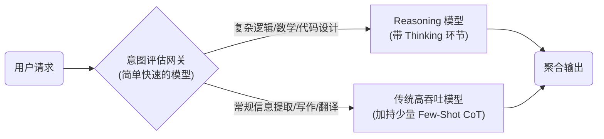

## 6.5 Reasoning 模型专题：内置推理范式

自 2024 年末起，随着 OpenAI o1/o3 系列和 DeepSeek-R1 等 **Reasoning 模型（推理模型）**的问世，大语言模型的推理能力经历了一次范式转换。这深刻地改变了思维链相关的提示词工程最佳实践。

本节将探讨在新一代推理模型上如何调整我们的提示词策略。

### 6.5.1 Reasoning 模型的工作原理

传统的大语言模型（如 GPT-4, Claude 3.5, Llama 3）采用的是**隐式推理**或纯基于外部提示词触发的推理。而在推理模型的训练阶段，研究者利用强化学习不仅教导模型"如何给出正确答案"，更教导模型"**如何自己构建思维链**"。

这些模型在回答用户问题之前，会产生大量的**思考 Token（Reasoning Tokens / Thinking Tokens）**。它们会在内部执行：
*   **自发分解问题**
*   **尝试多种路径**（类似于内置的思维树 ToT）
*   **自我纠错**（发现死胡同后回溯）
*   **综合得出结论**

由于推理过程已经被"内化"，这使得对它们的提示词设计必须彻底转变。

### 6.5.2 传统 CoT 模型 vs Reasoning 模型的提示策略

当面对一个困难的逻辑推理题时，两类模型的处理方式和期望的输入是截然不同的：

| 特性 | 传统 GPT-4 / Claude | Reasoning 模型 (o3 / DeepSeek-R1) |
| :--- | :--- | :--- |
| **需要提示词触发？** | ✅ 是（"让我们一步步思考"） | ❌ 否（模型自动触发内部思考） |
| **需要给出推理示例？** | ✅ 是（Few-shot 会提升格式和准确性） | ❌ 不建议（可能干扰模型原生的寻优路径） |
| **提示词核心重点** | 搭建推理支架、提供操作步骤 | **清晰准确地定义问题的条件与目标** |
| **格式策略** | 常见做法是输出关键步骤/核对点（不必强制冗长推理过程） | 推理过程对用户/API是"透明或折叠"的，通常只输出结果 |
| **适合的任务** | 结构化任务、文案写作、快速响应 | 复杂数学证明、硬核算法编写、高级逻辑谬误纠察 |

### 6.5.3 针对 Reasoning 模型的最佳实践

如果你正在使用 o1、o3 或 DeepSeek-R1，请遵循以下"少即是多"的策略：

#### 1. 移除显式的"思维链"指令

不要在提示词中要求模型"思考"或"展示中间步骤"。这不仅多余，还可能扰乱模型原生的强化学习思考范式。
*   **✗ 避免**："请详细写出你的思考过程，分三步走，第一步分析条件，第二步……"
*   **✓ 推荐**："解答以下微分方程系统：..."

#### 2. 注重"限制条件"与"清晰目标"

推理模型最怕的不是"问题难"，而是"问题表述有歧义"或"边界不清晰"。
*   **✗ 避免**："帮我优化这段代码的性能。"（由于目标不明确，模型可能会往奇怪的优化方向上钻牛角尖耗尽推理 Token）。
*   **✓ 推荐**："优化以下 Python 函数：目标是将时间复杂度从 $O(n^2)$ 降低到 $O(n \log n)$。不可改变输入参数数量。保证兼容 Python 3.8。"

#### 3. 简化格式和角色设定

推理模型天然对复杂的、强行加入的"人格设定"（Persona）或非必要的系统角色不敏感，有时甚至会因为过度关注角色而偏离逻辑核心。
*   保持 Prompt 极高密度的信息量（纯事实、纯条件）。

#### 4. 控制 Reasoning Token 预算

在 API 层面，通常允许开发者控制推理模型应该思考多长时间（例如 OpenAI API 中的 `reasoning_effort` 参数）。
*   **Low**：适合常规编码、中等逻辑题。极快。
*   **Medium**：适合大多数复杂问题。
*   **High**：极度耗时且昂贵。仅用于证明数学定理、复杂架构设计或长时间未解出的死板 Bug。

### 6.5.4 混合架构的未来：Router 模式

在实际的企业应用中，我们并不应该把所有的请求都发给 Reasoning 模型——这会造成巨大的计算资源浪费。未来的成熟应用架构必然是 **Router（路由）模式**：

*   **对于简单任务**：人工设计 Few-Shot 思维链并在快速模型上运行，性价比最高。
*   **对于未知难度的深水区任务**：将其抛给 Reasoning 模型并给予充分的 Thinking Token 预算。

### 思考

1. 既然 Reasoning 模型已经内置了如此强大的思考能力，你认为提示词工程师的职责正在发生什么变化？
2. 在你的业务系统中，有哪些具体模块是值得引入这种"慢结题但高精度"的推理模型的？
