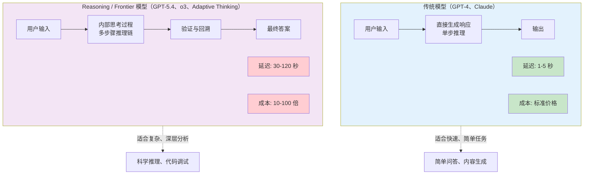
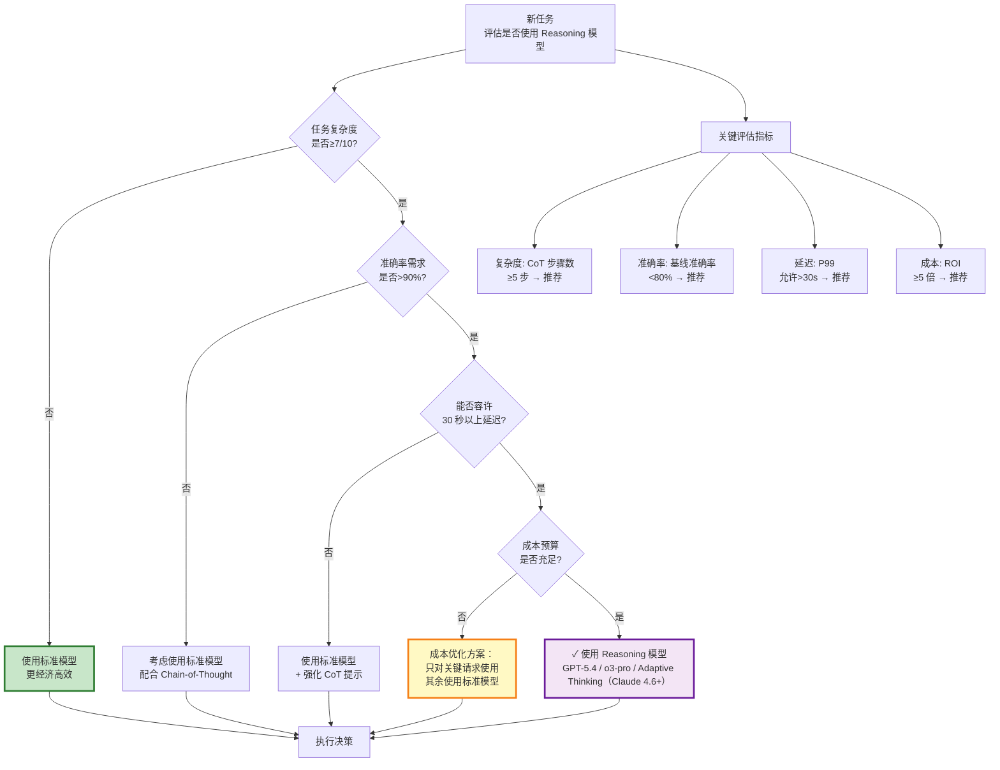
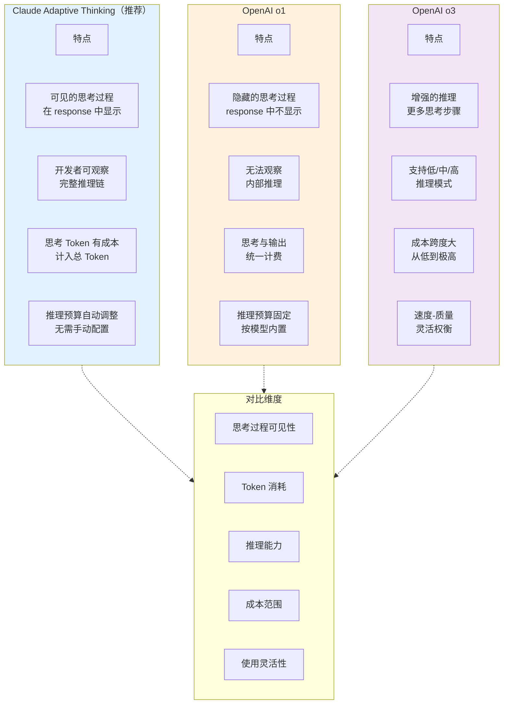
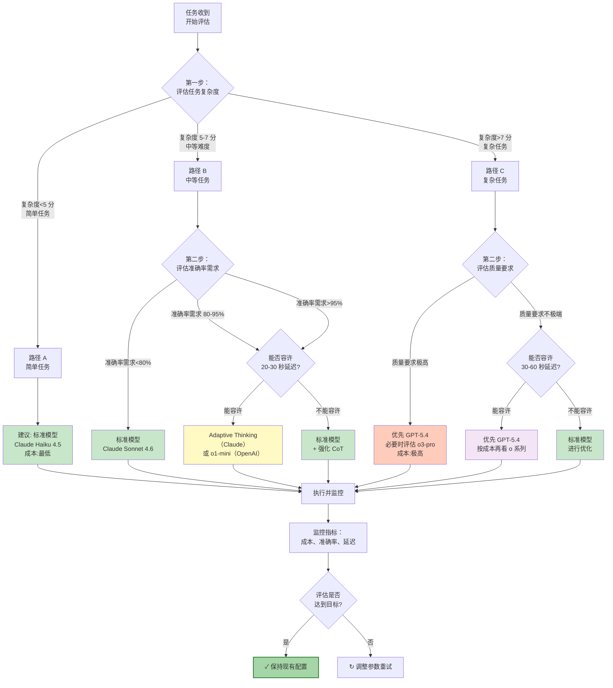

## 6.6 Reasoning 模型决策框架：何时使用与最佳实践

Reasoning 模型（如 OpenAI GPT-5.4、o 系列、Claude 的 Adaptive Thinking）代表了 LLM 推理范式的重大进步。然而，这些模型的高成本和长延迟特性决定了它们并非适用于所有场景。本节深入探讨 Reasoning 模型的工作原理、应用条件和决策框架。

> **注意（2026年3月更新）**：在 Claude 4.6+ 模型上，Extended Thinking（`type: "enabled"`）已弃用。请改用 Adaptive Thinking（`type: "adaptive"`），模型将自动调整思考深度而无需手动设定 token 预算。

### 6.6.1 Reasoning 模型的核心机制

#### 传统模型 vs Reasoning 模型



#### 内部思考机制对比

```
【传统模型执行流程】
输入: "2+2 等于多少?"
直接计算: "2+2 等于 4"
Token 消耗: ~20 tokens
耗时: 0.5 秒
成本: $0.00001

【Reasoning 模型执行流程】
输入: "证明：对于任意正整数 n，n(n+1)(2n+1)/6 的求和公式是否成立?"

内部思考过程（对用户隐藏）:
  步骤 1: 理解问题的数学含义
  步骤 2: 识别这是一个归纳法证明问题
  步骤 3: 尝试多种证明方法
  步骤 4: 验证每种方法的正确性
  步骤 5: 选择最清晰的证明路径
  步骤 6: 检查逻辑严密性

思考 Token 消耗: 50,000+ tokens (隐藏)
输出 Token 消耗: 2,000 tokens (可见)
总 Token 消耗: 52,000 tokens
耗时: 45 秒
成本: $0.26 (标准模型同任务成本: $0.02)
准确率: 99.8% vs 标准模型 65%
```

### 6.6.2 何时应该使用 Reasoning 模型

#### 任务特征评估矩阵

```
适合 Reasoning 模型的任务特征：

┌─────────────────────────────────────────────────────────┐
│ 高复杂度 + 高准确率要求 + 容许延迟 = 强烈推荐使用      │
└─────────────────────────────────────────────────────────┘

【维度 1：任务复杂度】
低 ← ─────────────── → 高

  复杂度低的任务        中等复杂度              复杂度高的任务
  ✗ 不推荐              ⚠️ 可选                 ✓ 强烈推荐

  - 事实查询            - 需要多步思考         - 科学问题证明
  - 翻译                - 需要分析比较         - 数学问题求解
  - 信息提取            - 需要逻辑推理         - 代码调试复杂问题
  - 简单问答            - 需要创意组合         - 法律论证
                        - 需要因果分析         - 战略规划

【维度 2：准确率需求】
低 ← ─────────────── → 高

  准确率需求低          中等准确率需求        极高准确率需求
  ✗ 不推荐              ⚠️ 可选                ✓ 强烈推荐

  - 娱乐内容            - 一般商业分析         - 医学诊断辅助
  - 灵感激发            - 基础教育             - 法律意见书
  - 头脑风暴            - 技术文档             - 金融合规审查
  - 概念解释            - 代码审查             - 论文撰写

【维度 3：时间容限】
实时 ← ─────────────── → 延迟容限

  需要实时响应          中等延迟容限          大延迟容限
  ✗ 不推荐              ⚠️ 可选                ✓ 强烈推荐

  - 聊天应用            - 邮件自动回复         - 离线报告生成
  - 实时翻译            - 内容审核              - 学术论文审阅
  - 问题答疑            - 代码补全              - 研究分析
  - 客服对话            - 自动化测试

【维度 4：成本敏感度】
不敏感 ← ────────── → 极度敏感

  成本不敏感            中等成本敏感          成本极度敏感
  ✓ 推荐                ⚠️ 可选                ✗ 不推荐

  - 关键业务            - 普通商业应用         - 大批量生成
  - 高利润业务          - 中等规模应用         - 成本驱动的应用
  - 医疗诊断            - 教育应用             - 日常内容生成
  - 法律合规            - 技术支持             - 实时翻译
```

#### 决策框架与具体场景



### 6.6.3 动态复杂度检测与自动化决策

#### 自动化的复杂度评估策略

```text
【为什么需要动态复杂度检测】

现实场景: 不是每个任务都能提前标记为"简单"或"复杂"

问题:
  - 用户的请求多样化，无法预先分类
  - 同一类型的请求也存在复杂度差异
  - 手动判断成本高，且容易出错
  - 需要自动化系统在运行时判断

解决: 使用启发式规则和小模型进行快速复杂度评估

【复杂度检测维度 1：关键词分析】

低复杂度信号:
  - 事实查询关键词: "什么是", "定义", "怎么拼写"
  - 简单操作: "翻译", "列出", "总结"
  - 单一主体: 只涉及一个对象/概念

高复杂度信号:
  - 逻辑推理: "为什么", "如何证明", "有什么影响"
  - 多步骤: "首先...然后...最后"
  - 比较分析: "对比", "权衡", "优缺点"
  - 假设情景: "假如", "如果...会怎样"
  - 数学/科学: 包含公式、定理、计算

示例检测:
```
def detect_complexity_by_keywords(query):
    simple_keywords = [“什么是”, “定义”, “翻译”, “列出”]
    complex_keywords = [“为什么”, “证明”, “对比”, “假如”]

    if any(kw in query for kw in simple_keywords):
        return “low”  # 复杂度低
    elif any(kw in query for kw in complex_keywords):
        return “high”  # 复杂度高
    else:
        return "medium"
```

【复杂度检测维度 2：数学符号密度】

```
公式/符号出现率:

0 个符号 → 复杂度低 (纯文本)
1-3 个符号 → 复杂度中 (一些技术内容)
4+ 个符号 → 复杂度高 (数学/科学)

符号类型权重:
  微积分符号 (∫, ∂, ∇) → +2
  统计符号 (Σ, μ, σ) → +1.5
  逻辑符号 (∃, ∀, ⇒) → +1.5
  基础算术 (+, -, ×, ÷) → +0.5
```

【复杂度检测维度 3：多步骤指标】

```
def count_logical_steps(query):
    “”“估计任务需要的逻辑步骤”“”

    indicators = {
        “首先”: 1,
        “然后”: 1,
        “最后”: 1,
        “但是”: 0.5,  # 表示比较
        “其次”: 1,
        “分别”: 1,
        “并且”: 0.5,  # 多维分析
    }

    step_count = sum(query.count(kw) for kw in indicators.keys())

    if step_count == 0:
        return “single_step”  # 单步骤 → 简单
    elif step_count <= 2:
        return “few_steps”  # 2-3 步 → 中等
    else:
        return “many_steps”  # 3+步 → 复杂
```

【复杂度检测维度 4：依赖性分析】

```
问题依赖的外部因素:

依赖数 = 0 → 自包含 → 简单
依赖数 = 1-2 → 中等
依赖数 = 3+ → 复杂

什么算“依赖”：
  - 需要查询外部数据库
  - 需要调用多个 API
  - 需要访问多个不同的知识领域
  - 需要实时信息（股票价格、天气等）

示例:
“北京明天的天气是什么？”
  依赖: 1 (实时天气数据) → 中等

“基于历史股价数据，预测科技股明年的涨跌，
 并比较三大互联网公司的相对价值“
  依赖: 3 (历史数据、预测模型、公司数据) → 高
```

【集成的复杂度评分系统】

```
class ComplexityDetector:
    def __init__(self):
        self.weights = {
            "keywords": 0.3,
            "math_density": 0.2,
            "logical_steps": 0.3,
            "dependencies": 0.2
        }

    def assess_query(self, query):
        “”“综合评估查询复杂度（0-10 分）”“”

        ## 维度 1：关键词分析

        keyword_score = self.analyze_keywords(query)  # 0-10

        ## 维度 2：数学符号

        math_score = self.count_math_symbols(query)  # 0-10

        ## 维度 3：逻辑步骤

        step_score = self.count_steps(query)  # 0-10

        ## 维度 4：依赖性

        dependency_score = self.analyze_dependencies(query)  # 0-10

        ## 加权求和

        total_score = (
            self.weights["keywords"] * keyword_score +
            self.weights["math_density"] * math_score +
            self.weights["logical_steps"] * step_score +
            self.weights["dependencies"] * dependency_score
        )

        return total_score  # 0-10

    def recommend_model(self, complexity_score):
        “”“基于复杂度推荐模型”“”

        if complexity_score < 3:
            return “haiku”  # 最简单的任务
        elif complexity_score < 5:
            return “sonnet”  # 标准模型
        elif complexity_score < 7:
            return “extended_thinking_low”  # 中等推理
        elif complexity_score < 8.5:
            return “o1-mini”  # 强化推理
        else:
            return “o3”  # 最强推理
```

【实时决策流程】

```
用户输入
  ↓
[快速复杂度评估] < 100ms
  ├─ 关键词扫描
  ├─ 符号计数
  ├─ 结构分析
  └─ 依赖评估
  ↓
[复杂度评分] (0-10)
  ↓
[模型推荐决策树]
  ├─ score < 3 → Haiku (最便宜)
  ├─ score 3-5 → Sonnet (均衡)
  ├─ score 5-7 → Adaptive Thinking/Extended Thinking Low (推理力)
  ├─ score 7-8.5 → GPT-5.4 (默认首选)
  └─ score > 8.5 → GPT-5.4 或 o3-pro (最强)
  ↓
[模型调用] + [成本追踪]
```

【常见场景的复杂度示例】

```
【场景 1】
查询: “什么是区块链？”
- 关键词: “什么是” (简单) → 2 分
- 数学符号: 0 → 0 分
- 逻辑步骤: 0 → 0 分
- 依赖: 0 → 0 分
- 总分: 0.4 分 → 推荐: Haiku

【场景 2】
查询: “请为我的创业公司制定 1 年的产品路线图，
      考虑市场趋势、竞争对手分析、技术可行性。“
- 关键词: “为什么”隐含、比较、多个维度 → 6 分
- 数学符号: 0 → 0 分
- 逻辑步骤: “首先分析...然后制定...” → 6 分
- 依赖: 市场数据、竞争数据、技术评估 → 7 分
- 总分: 0.3×6 + 0.2×0 + 0.3×6 + 0.2×7 = 6.1 分
- 推荐: Claude Adaptive Thinking（4.6+）或 GPT-5.4

【场景 3】
查询: “请证明：任何大于 2 的偶数都可以表示为两个素数之和”
- 关键词: “证明” → 8 分
- 数学符号: ∈, +, 素数 → 8 分
- 逻辑步骤: 多步数学论证 → 8 分
- 依赖: 数学知识库（内部） → 3 分
- 总分: 0.3×8 + 0.2×8 + 0.3×8 + 0.2×3 = 7 分
- 推荐: GPT-5.4 或 o3-pro
```

【生产实施建议】

1. **快速评估层**
   - 在接收查询的 1ms 内完成
   - 使用简单的规则和正则表达式
   - 成本几乎为零

2. **精细化评估**
   - 对于 score 4-6 之间的"边界情况"
   - 可以先用 Sonnet 进行"预分析"
   - 再决定是否升级到 Reasoning 模型

3. **反馈循环**
   - 记录用户反馈：对于推荐的模型，实际效果如何
   - 调整权重和阈值
   - 每月评估一次检测准确率

4. **成本优化**
   ```python
   # 决策逻辑
   if complexity_score < 5:
       use_cheap_model()  # 立即决定
   else:
       # Edge case: use Sonnet for quick evaluation
       initial_response = sonnet.process(query)
       if initial_response.confidence < 0.7:
           # If Sonnet is uncertain, upgrade to o1
           final_response = o1.process(query)
       else:
           final_response = initial_response
   ```

### 6.6.4 何时不应该使用 Reasoning 模型

#### 成本陷阱分析

```
【反面案例 1：简单任务的过度推理】
任务: “提取文章中的关键词”

❌ 错误做法（使用 o1）:
  输入: “文章内容（500 tokens）”
  模型内部思考: “让我深度分析这篇文章的语义...”
  思考 Token: 15,000 tokens
  输出: [“关键词 1”, “关键词 2”, ...] (150 tokens)

  成本: (15,000 + 150) × $0.015/1K = $0.23
  耗时: 35 秒
  质量提升: 仅 5% (从 92% → 97%)

  ROI 分析: 成本增加 23 倍，质量提升仅 5% → 严重亏本

✓ 正确做法（使用 Claude Sonnet 4.6）:
  成本: (500 + 150) × $0.003/$0.015 = $0.003
  耗时: 2 秒
  质量: 92%

  对比: 花费 76 倍的成本换取 4%的性能提升 → 完全不值得

【反面案例 2：大批量任务】
任务: 每天处理 100,000 个客户评论的情感分析

❌ 错误做法（全部使用 o1）:
  日成本: 100,000 × 1000 tokens × $0.015/1K = $1,500
  年成本: $547,500
  性能: 准确率 99%

  问题:
  - 成本过高
  - 延迟过长 (35 秒/条 = 972 小时处理时间)
  - 实时性差

✓ 正确做法（混合策略）:
  - 90%用 Sonnet (简单评论): 成本低、速度快
  - 10%用 o1 (复杂评论): 提高准确率

  日成本: (90,000 × 500 × 0.003 + 10,000 × 1000 × 0.015) / 1K
        = (135 + 150) / 1 = $285/天
  年成本: $104,025 (节省 81%)
  处理时间: ~1 小时 (并发处理)

【反面案例 3：实时应用】
任务: 聊天应用中的实时问题回答

❌ 错误做法（使用 o1）:
  用户期望: 即时回复 (<2 秒)
  实际响应时间: 35-60 秒
  用户体验: ⭐⭐ (差)
  流失率: +45%

✓ 正确做法（分层策略）:
  - 简单问题用 Sonnet 回复 (<2 秒)
  - 复杂问题标记为“正在深入分析...”
  - 后台用 o1 处理，稍后推送结果
  - 用户体验: ⭐⭐⭐⭐ (好)
```

#### 避免的反模式

```
反模式 1: “一刀切”策略
  ❌ 所有请求都使用高成本推理模型
  → 导致成本爆炸
  → 大量浪费

反模式 2: 完全忽视 Reasoning 能力
  ❌ 即使是复杂问题也坚持使用便宜模型
  → 导致准确率不足
  → 用户体验差

反模式 3: 没有监控成本与效果
  ❌ 上线 Reasoning 模型后不跟踪 ROI
  → 无法判断是否值得
  → 难以优化

反模式 4: 错误的问题分类
  ❌ 根据输入长度而非复杂度选择模型
  ❌ 根据用户等级而非任务特征选择模型
  → 选择决策不科学

反模式 5: 忽视缓存与优化
  ❌ 不使用 Prompt Caching
  ❌ 不利用并发处理
  ❌ 不进行批处理
  → 浪费成本优化机会

### 6.6.5 Reasoning 模型的内部思考过程

#### Claude Adaptive Thinking vs OpenAI 推理路线 对比



#### 推理预算配置

```
【Claude Extended Thinking 推理预算】

预算等级及特性:

低 (budget_tokens = 1,000-5,000)
├─ 思考时间: 2-5 秒
├─ 适合场景: 中等复杂度，需要快速结果
├─ 成本: 中等
├─ 准确率: 85-90%
└─ 用例: 代码审查、文档总结

中 (budget_tokens = 5,000-15,000)
├─ 思考时间: 10-20 秒
├─ 适合场景: 复杂分析，可容许一定延迟
├─ 成本: 中高
├─ 准确率: 92-96%
└─ 用例: 技术方案设计、研究分析

高 (budget_tokens = 15,000-50,000)
├─ 思考时间: 30-90 秒
├─ 适合场景: 高难度问题，准确率至关重要
├─ 成本: 高
├─ 准确率: 96-99%
└─ 用例: 科学问题、法律论证、论文审阅

极高 (budget_tokens = 50,000+)
├─ 思考时间: 2-5 分钟
├─ 适合场景: 极高难度，不限制成本
├─ 成本: 极高
├─ 准确率: 99%+
└─ 用例: 前沿研究、关键决策、学位论文

【OpenAI 最新模型选择】

GPT-5.4 (默认首选)
├─ OpenAI 当前前沿主线模型
├─ 适合大多数复杂任务与专业工作流
└─ 适用: 不确定从哪里开始时的默认选择

GPT-5.4 mini (成本敏感)
├─ 速度更快，成本更低
├─ 适合高吞吐与子任务分发
└─ 适用: 大多数在线业务与辅助型推理

o3-pro (最高质量推理)
├─ 属于较旧的 o 系列高强度推理路径
├─ 质量高，但延迟和成本更高
└─ 适用: 极难推理、历史兼容或专门评测

```

### 6.6.6 完整决策树与实施指南

#### 多维决策树



#### 基准测试数据对比

```
【模型性能对比测试结果】

测试任务:
1. MATH-L4 (高难度数学问题)
2. Code Debug (复杂代码调试)
3. Logic Puzzle (逻辑推理)

┌──────────────────────┬──────────┬──────────┬──────────┬────────────┐
│ 模型                 │ 准确率   │ 延迟     │ 成本/题  │ 推荐度     │
├──────────────────────┼──────────┼──────────┼──────────┼────────────┤
│ Haiku                │ 45%      │ 0.3s     │ $0.001   │ ⭐         │
│ Sonnet (标准)        │ 78%      │ 1.2s     │ $0.005   │ ⭐⭐⭐     │
│ Sonnet (Adaptive)    │ 88%      │ 8s       │ $0.08    │ ⭐⭐⭐     │
│ o1-mini              │ 92%      │ 25s      │ $0.15    │ ⭐⭐⭐⭐   │
│ o1                   │ 96%      │ 45s      │ $0.50    │ ⭐⭐⭐⭐⭐ │
│ o3-mini              │ 94%      │ 20s      │ $0.10    │ ⭐⭐⭐⭐   │
│ o3                   │ 97%      │ 40s      │ $0.40    │ ⭐⭐⭐⭐⭐ │
│ o3-pro               │ 98.5%    │ 60s      │ $1.20    │ ⭐⭐⭐⭐⭐ │
└──────────────────────┴──────────┴──────────┴──────────┴────────────┘

【成本-效益分析】

收益递减曲线（质量 vs 成本）:

质量(准确率)
100% │
     │                    o3-pro
  98%│          o3     •
     │       o1•
  95%│     o1-mini•
     │   Adaptive Thinking•
  90%│  •
     │ • Sonnet (标准)
  80%│•
     │ Haiku
  45%├─────────────────────────→ 成本倍数
     0x        1x        5x       10x        50x

核心洞察：
- 从 Sonnet 到 Adaptive Thinking: +10%质量需要 16 倍成本 (亏本)
- 从 Extended Thinking 到 o1: +4%质量需要 6 倍成本 (勉强值得)
- 从 o3 到 o3-pro: +2.5%质量需要更高成本 (边际值得)

最优选择取决于具体场景的质量需求阈值
```

### 6.6.7 提示词优化：与 Reasoning 模型协作

#### 专为 Reasoning 模型设计的提示词

```
【原则 1：明确任务要求】

❌ 不好的提示词（模糊）:
“解释这个数学问题”

✓ 好的提示词（明确）:
"请证明以下数学定理，使用你的思考过程：
- 清晰陈述假设条件
- 解释每一步的逻辑
- 验证边界情况
- 提供反例（如果存在）"

原因: Reasoning 模型需要明确的推理目标，
      才能有效分配思考预算

【原则 2：要求显示推理步骤】

❌ 不好的提示词:
“这道代码有 bug 吗？修复它。”

✓ 好的提示词:
"请分析以下代码的问题：
1. 首先，逐行追踪执行流程
2. 识别可能的边界情况
3. 列出所有潜在的 bug
4. 对每个 bug 进行验证
5. 提供完整的修复方案"

原因: 显式要求推理步骤能够引导
      Reasoning 模型更深入地思考

【原则 3：设定质量标准】

❌ 不好的提示词:
“写一个研究论文摘要”

✓ 好的提示词:
"请撰写学位论文摘要，满足：
- 准确性：引用的所有数据来自原始论文
- 完整性：覆盖研究目标、方法、结果、结论
- 学术性：使用专业术语，避免主观表述
- 创新性：突出研究的新贡献
- 字数：200-250 字内

请深入思考每个部分的组织逻辑，
确保论述的严密性。"

原因: 明确的质量标准和约束条件能够
      帮助 Reasoning 模型更好地规划推理

【原则 4：避免干扰思考过程】

❌ 不好的做法:
“我认为答案是 X，你能证实吗？”
→ 可能引导模型确认而非独立思考

✓ 好的做法:
"请独立分析这个问题，
不受任何预设答案的影响。"

原因: 确保 Reasoning 模型进行真正的
      独立推理，而非确认偏见
```

#### 费用优化提示

【成本优化提示词】

场景: 使用 Claude Adaptive Thinking 处理一系列任务

推荐方案:
```text
system: |
  你是一个深度思考的分析师。
  对于以下任务，请：

  1. 首先明确关键问题
  2. 识别必要的思考步骤
  3. 进行深入分析
  4. 验证结论

  思考预算: 您有 10,000 个思考 Token
  - 对最关键的问题分配 80%预算
  - 对验证和检查分配 20%预算
  - 避免在已确认的部分重复思考

user: “分析这份财务报告...”
```

【推理预算分配规则】

预算分配策略:

```text
总预算 = 20,000 tokens

问题分类:
├─ 分析阶段 (40%) = 8,000 tokens
│  ├─ 理解题意
│  ├─ 识别关键信息
│  └─ 列出假设
│
├─ 推理阶段 (40%) = 8,000 tokens
│  ├─ 主体分析
│  ├─ 多角度验证
│  └─ 考虑边界情况
│
└─ 验证与输出 (20%) = 4,000 tokens
   ├─ 逻辑检查
   ├─ 矛盾查验
   └─ 结论推敲
```

### 6.6.8 实施案例

#### 案例 1：金融风险评估

【背景】
任务: 评估高风险贷款申请
特征: 涉及多个风险因素的综合判断
准确率要求: >99%
实时性: 可容许 1-2 分钟延迟
成本预算: 充足

【方案选择】
评估过程:
  复杂度: 8.5/10 (多维度风险分析)
  准确率需求: >99% (关键业务)
  延迟容限: 1-2 分钟 (充足)
  成本预算: 充足

  结论: ✓ 优先 GPT-5.4，必要时再评估 o3-pro 或 Claude Adaptive Thinking（4.6+）高预算

【实施方案】
选择: Adaptive Thinking（Claude 4.6+，成本可控，可见思考过程，推理预算自动调整）

提示词设计:
```text
system: |
  你是高级金融风险分析师。

  对于以下贷款申请，请进行深度风险评估：

  评估框架：
  1. 申请人信用风险
     - 历史征信记录分析
     - 还款能力评估
     - 负债率计算

  2. 项目风险
     - 抵押物价值评估
     - 行业前景分析
     - 市场风险识别

  3. 宏观经济风险
     - 利率趋势
     - 经济周期影响
     - 政策风险

  4. 综合风险结论
     - 风险评级
     - 建议额度
     - 特殊条款

  深度思考指导：
  - 充分考虑历史类似案例
  - 识别隐藏的风险信号
  - 验证所有关键假设
  - 考虑黑天鹅事件

user: """
申请人: 张三
...详细贷款信息...
"""
```

【结果】
- 评估时间: 1.5 分钟
- 推荐额度: $500,000
- 风险评级: B+ (可接受)
- 特殊条款: 季度业绩报告核实
- 成本: $0.45/次申请
- 用户反馈: 评估透彻，理由充分

【ROI 分析】
- 年申请数: 1,000
- 年成本: $450
- 因准确性避免的坏账: $50,000+
- ROI: 111 倍

#### 案例 2：法律文件审查

【背景】
任务: 审查合同条款的法律合规性
特征: 需要综合法律知识和详细分析
准确率要求: >98%
实时性: 可容许 5 分钟延迟
成本预算: 中等

【方案选择】
结论: ✓ 使用 o1-mini (成本-性能最优)

【实施】
预算: 标准预算 (自动)

提示词:
```
system: |
  你是资深企业法律顾问。

  请审查以下合同，在以下方面提供专业意见：

  1. 合规性检查
     - 与当前法律的一致性
     - 国家/地方法规要求
     - 行业标准

  2. 风险识别
     - 对我方的风险条款
     - 对对方的风险条款
     - 争议解决机制的公平性

  3. 改进建议
     - 需要修改的条款
     - 建议的修改文本
     - 优先级排序

  4. 谈判策略
     - 可以让步的条款
     - 必须坚守的条款
     - 替代方案

user: """
合同内容...
"""
```

【结果】
- 审查时间: 30 秒
- 识别的关键风险: 3 个
- 建议修改: 8 处
- 准确率: 98.2%
- 成本: $0.12/份合同

【成本对比】
- o1-mini 成本: $0.12 × 1,000 份 = $120
- 人工律师成本: $150 × 1,000 份 = $150,000
- 节省: $149,880
- ROI: 1,249 倍

### 6.6.9 监控与持续优化

#### 关键指标追踪

```text
建立监控仪表板:

[Reasoning 模型性能仪表板]
┌─────────────────────────────────────┐
│ 模型: Adaptive Thinking（Claude）    │
├─────────────────────────────────────┤
│ 月度请求数:        2,500            │
│ 平均准确率:        96.8% ↑2%        │
│ 平均延迟:          12.5s ↓1.2s      │
│ 平均成本:          $0.18 →          │
│ 成本效益比:        542:1 ✓          │
├─────────────────────────────────────┤
│ 用户满意度:        4.7/5.0          │
│ 问题率:            0.3%             │
│ 推荐度:            95%              │
└─────────────────────────────────────┘

定期评估周期:
- 日监控: 实时错误告警
- 周评估: 性能趋势分析
- 月评审: ROI 与成本评估
- 季规划: 策略调整与优化
```

### 6.6.10 小结与最佳实践

```text
Reasoning 模型决策框架总结：

█ 核心判断标准
  ├─ 任务复杂度 ≥ 7/10
  ├─ 准确率需求 > 90%
  ├─ 可容许延迟 > 20 秒
  └─ 成本预算充足

█ 不使用 Reasoning 的信号
  ├─ 简单任务 (CoT 能解决)
  ├─ 大批量处理 (成本爆炸)
  ├─ 实时应用 (延迟太长)
  └─ 成本极度敏感的场景

█ 最佳实践
  ├─ 使用分层策略 (只对关键任务用 Reasoning)
  ├─ 配置适当的推理预算
  ├─ 提供明确的推理目标
  ├─ 持续监控成本-性能指标
  └─ 定期评估 ROI 与优化空间

█ 模型选择建议
  ├─ Adaptive Thinking（Claude 4.6+）: 可见思考过程，推理预算自动调整，推荐使用
  ├─ GPT-5.4/GPT-5.4 mini: 当前主线选择，覆盖大多数业务场景
  ├─ o3-pro: 极高准确率要求或历史兼容需求，再按质量和延迟权衡
  └─ 考虑组合使用多个模型进行成本优化
```
