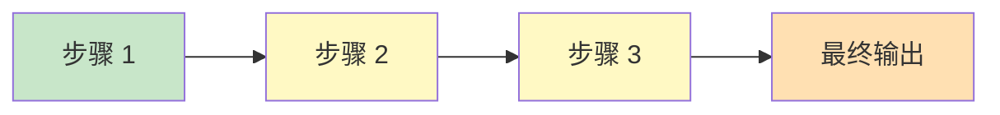
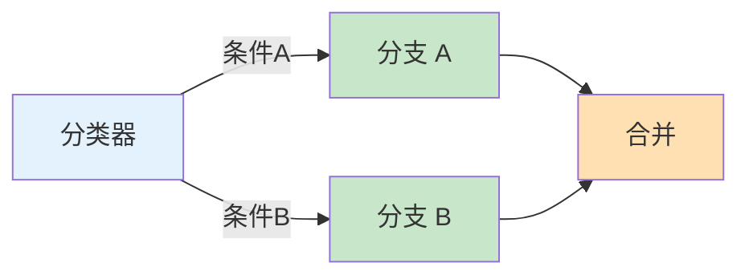
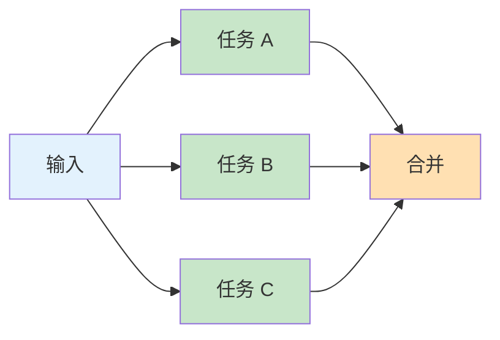
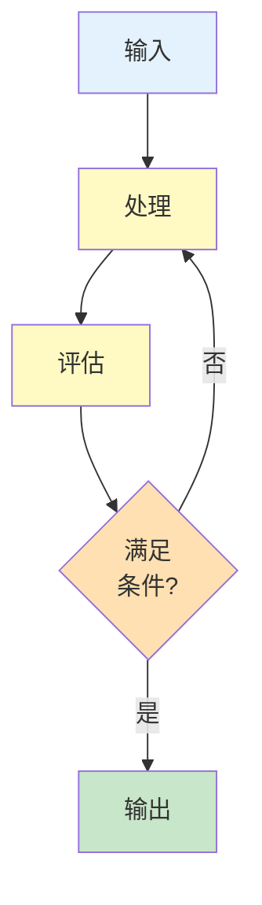
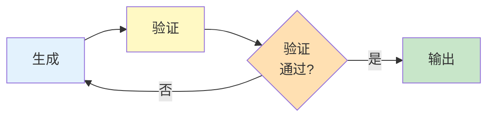
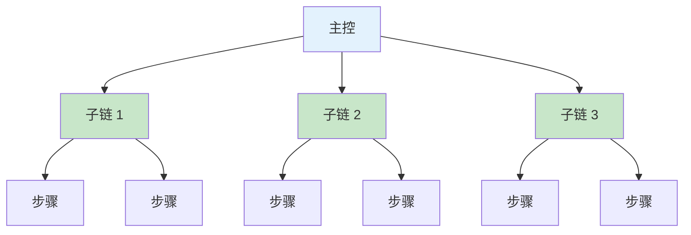

## 7.2 提示词链的设计模式

提示词链的设计模式是经过验证的解决方案模板，可以帮助快速构建可靠的多步骤工作流。本节将介绍几种常用的设计模式。

### 7.2.1 模式一：顺序链

最基本的模式，步骤按顺序执行，前一步的输出是后一步的输入。



**适用场景**：流水线式处理，如文档处理管道

**实现示例**：

```text
# 文档摘要生成管道

步骤 1：文档预处理
输入：原始文档
输出：清理后的文本

步骤 2：关键信息提取
输入：清理后的文本
输出：关键信息列表

步骤 3：摘要生成
输入：关键信息列表
输出：最终摘要
```

### 7.2.2 模式二：分支链

根据条件选择不同的处理路径。



**适用场景**：不同类型输入需要不同处理

**实现示例**：

```python
# 智能客服分支处理

def process_query(user_input):
    # 步骤 1：意图分类
    intent = classify_intent(user_input)
    
    # 步骤 2：分支处理
    if intent == "product_inquiry":
        response = handle_product_inquiry(user_input)
    elif intent == "order_status":
        response = handle_order_status(user_input)
    elif intent == "complaint":
        response = handle_complaint(user_input)
    else:
        response = handle_general(user_input)
    
    return response
```

### 7.2.3 模式三：并行链

多个步骤同时执行，最后合并结果。



**适用场景**：多个独立分析可并行执行

**实现示例**：

```text
# 产品评论多维度分析

并行任务：
任务 A：情感分析 → {"sentiment": "positive", ...}
任务 B：主题提取 → {"topics": ["质量", "价格"], ...}
任务 C：建议提取 → {"suggestions": ["改进包装"], ...}

合并步骤：
综合三个分析结果生成完整报告
```

### 7.2.4 模式四：循环链

重复执行某个步骤直到满足条件。



**适用场景**：需要迭代优化直到达标

**实现示例**：

```text
# 文本改写迭代优化

初始文本 → 改写版本 1 → 质量评估(不满足)
                          ↓
          改写版本 2 ← 反馈优化方向
                ↓
          质量评估(满足) → 输出最终版本

最大迭代次数限制：3 次
```

### 7.2.5 模式五：验证链

生成结果后进行验证，必要时重新生成。



**适用场景**：需要确保输出符合特定标准

**实现示例**：

```text
# JSON 生成与验证

步骤 1：生成 JSON
提示词："将以下信息转换为 JSON 格式..."
输出：{"name": "张三", "age": 25, ...}

步骤 2：验证
检查项：
- JSON 格式是否有效？
- 必填字段是否完整？
- 字段值是否在有效范围？

验证通过 → 返回结果
验证失败 → 附带错误信息重新生成（最多 3 次）
```

### 7.2.6 模式六：层级链

多层级的任务分解和执行。



**适用场景**：大型复杂任务的多级分解

**实现示例**：

```text
# 完整报告生成

主控：报告规划
├── 子链 1：数据收集与处理
│   ├── 数据提取
│   └── 数据清洗
├── 子链 2：分析模块
│   ├── 趋势分析
│   ├── 对比分析
│   └── 异常检测
└── 子链 3：报告生成
    ├── 内容撰写
    ├── 图表建议
    └── 格式化输出
```

### 7.2.7 模式选择指南

```text
任务特征                    推荐模式
───────────────────────────────────────
线性处理流程                顺序链
需要根据类型分类处理        分支链
多个独立分析可并行          并行链
需要迭代优化                循环链
输出需要验证                验证链
多层级复杂任务              层级链
```

### 7.2.8 模式组合

实际应用中，通常需要组合多种模式：

```text
示例：智能文档处理系统

1. 顺序链：文档上传 → 格式转换 → 文本提取
2. 分支链：根据文档类型选择处理策略
3. 并行链：同时进行摘要、关键词、实体提取
4. 验证链：验证提取结果的准确性
5. 顺序链：整合结果 → 生成报告
```

### 延伸思考

1. 顺序链、并行链、条件链——哪种模式最能减少总延迟？哪种最能提高输出质量？
2. 在“生成-验证”模式中，如果验证步骤也可能犯错，你会如何设计“验证的验证”？
