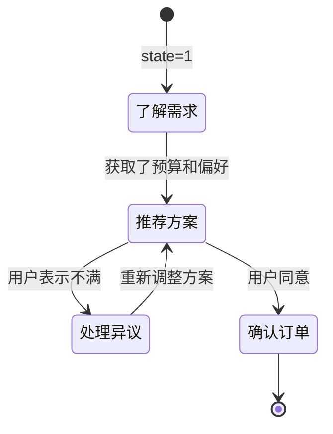

## 7.5 多轮对话管理

在传统的单轮提示词工程中，我们将所有指令、背景和问题一次性发送给模型，模型返回结果，任务结束。但在实际应用（如 AI 助手、客服机器人、互动式数据分析）中，**多轮对话**是最常见的交互模式。

将提示词工程扩展到多轮对话场景，会面临指令漂移、上下文长度爆炸、状态丢失等独特挑战。本节将介绍管理多轮对话状态的最佳实践。

### 7.5.1 对话历史的剪裁与摘要策略

随着对话轮数增加，保留完整的对话历史很快会耗尽模型的上下文窗口，并大幅增加 API 调用成本。

常用的历史压缩策略包括：

1. **固定窗口截断 (Sliding Window)**
   最简单的策略，始终保留 系统提示词（system prompt） 和最近 $N$ 轮对话。
   *优点*：实现极简，成本可控。
   *缺点*：会导致模型彻底"忘记" $N$ 轮之前的重要设定或前提条件。

2. **动态摘要 (Dynamic Summarization)**
   当对话长度达到阈值时，在后台启动一个独立模型调用，将早期的闲聊摘要成一句核心状态。
   ```
   [前 10 轮对话压缩] 
   System Context: "用户正在计划去日本东京的蜜月旅行，预算两万人民币，偏好美食和自然风光，已经排除了浅草寺和迪士尼。"
   ```

3. **关键实体提取 (Key-Value State)**
   针对表单填写、客诉登记等特定领域对话，使用信息抽取技术，时刻维护一个状态共享对象。
   ```json
   {
       "user_name": "张三",
       "order_id": null,
       "issue_type": "refund",
       "sentiment": "angry"
   }
   ```

### 7.5.2 多轮上下文中的指令漂移 (Instruction Drift)

**指令漂移**是指在长对话中，随着最新一轮User输入的增加，模型逐渐"忘记"了 系统提示词（system prompt） 中定义的初始行为准则。

假设 系统提示词（system prompt） 要求："你是一个法务助手，请始终以中日双语输出结果。" 在第 1 轮对话时模型做得很好，但到第 15 轮，用户输入大段中文案卷材料后，模型可能直接就用中文回答了。

**应对指令漂移的提示词"刷新"技巧：**

1. **指令后置 (Late-binding Prompt)**
   不要仅仅依赖 系统提示词（system prompt）。在组装 API 请求时，在整个对话数组的最后（即最新的一条 User Message 中），隐式地附加或者重复最核心的约束规则。
   ```python
   # 请求组装时
   messages.append({
       "role": "user", 
       "content": f"{user_input}\n\n[系统规则提示：请务必确保以中日双语回复，且使用敬语。]"
   })
   ```

2. **强制结构化响应**
   通过前文 [3.5 结构化输出](../03_prompt_structure/3.5_structured_output.md) 的技巧，强制模型每轮回答都必须填入规范格式，以此锁死它的行为边界，极大降低漂移概率。

### 7.5.3 状态机模式：管理复杂的引导流程

对于多轮问卷、面试陪练或剧本杀等应用，对话不仅是闲聊，而是有阶段性的。这时应当结合**状态机 (State Machine)**进行提示词管理。

系统维护一个内部 `state`，根据当前状态组装不同的提示词：



**对应每种状态的后台逻辑**：

*   **State=1 (了解需求)**：提示词重点是"尽可能多提问，提取必填实体"。
*   **State=2 (推荐方案)**：提示词重点是"根据提取的实体检索知识库，以专业话术进行推销"。
*   **State=3 (处理异议)**：提示词重点是"安抚情绪，提供备选方案"。

在这种架构下，实际上**每一轮对话发给大模型的 系统提示词（system prompt） 都是不一样的**。这比试图用一个大而全的 系统提示词（system prompt） 去覆盖所有可能的分支，效果要稳定得多。

### 思考

1. 设想你正在开发一个"模拟面试官" AI，面试分为自我介绍、专业技能问答、反问三个环节。你会如何设计它的多轮提示词策略？
2. 在固定窗口截断、动态摘要、关键实体提取中，哪个方案对延迟的要求最高？哪个方案的 API 成本最低？
