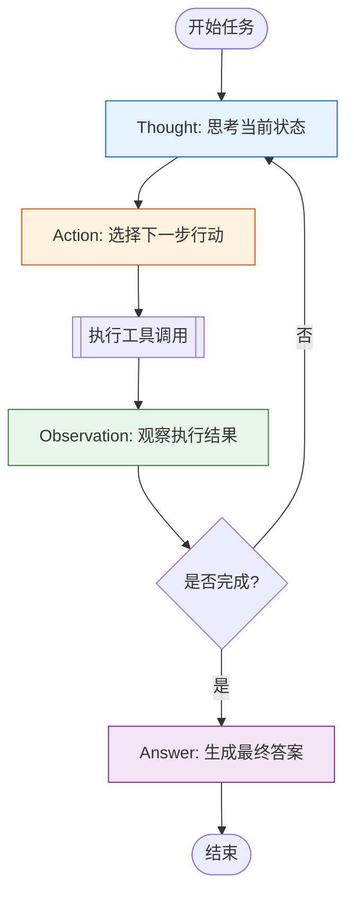

# 第八章：ReAct 与工具使用

## 8.1 ReAct 框架：推理与行动的结合

在提示词工程的发展历程中，**ReAct (Reasoning and Acting)** 框架的提出是一个重要的里程碑。它由 [Yao et al. (2022)](https://arxiv.org/abs/2210.03629) 首次提出，核心思想是将大语言模型（LLM）的**推理能力**（Reasoning）与**行动能力**（Acting）有机结合，使模型能够像人类一样，在解决问题时交替进行思考和行动，从而解决需要实时信息或多步骤交互的复杂任务。

### 核心原理：超越思维链

在 ReAct 出现之前，主流的提示技术主要分为两类：
1.  **推理型（如 CoT）**：让模型生成推理步骤，但不与外部世界交互。这限制了模型获取新知识的能力，容易产生幻觉。
2.  **行动型（如 WebGPT）**：让模型生成指令调用工具，但缺乏对行动策略的显式推理。

ReAct 巧妙地融合了这两者，形成了一个**"思考-行动-观察"（Thought-Action-Observation）**的闭环。

#### ReAct 的工作流程

ReAct 的决策过程可以形象地描述为以下循环：



*图 8.1-1：ReAct 的标准决策循环*

在这个循环中：
-   **Thought（思考）**：模型分析当前的任务状态、已有的信息，规划下一步应该做什么。这一步利用了 LLM 的逻辑推理能力。
-   **Action（行动）**：模型决定调用哪个外部工具（如搜索引擎、计算器、API），并生成具体的调用参数。
-   **Observation（观察）**：工具执行后返回的结果（如搜索结果片段、计算数值、API 响应）。这部分信息被回填到模型的上下文中。

通过这种方式，ReAct 实际上是在**利用外部工具来扩展模型的上下文窗口和知识边界**。

### 实战示例：ReAct 解决复杂问题

让我们通过一个具体案例，对比标准提示与 ReAct 的差异。

**任务**：*"除了 Apple，哪家公司发布的消费级 AR 眼镜在 2024 年销量最高？它的主要卖点是什么？"*

#### ❌ 标准提示（容易失败）

> **用户**：除了 Apple，哪家公司发布的消费级 AR 眼镜在 2024 年销量最高？它的主要卖点是什么？
>
> **模型**：2024 年销量最高的消费级 AR 眼镜可能是 Xreal（原 Nreal）的 Air 2 系列。它的主要卖点包括轻便的机身设计、高清的 Micro-OLED 显示屏以及相对亲民的价格。
>
> **分析**：这个回答可能是基于模型训练数据的"幻觉"或过时信息，缺乏实时数验证。

#### ✅ ReAct 提示（准确可靠）

> **系统提示词**：
> 你是一个智能助手。在回答问题前，请遵循 ReAct 格式：先思考（Thought），再行动（Action），观察结果（Observation），最后回答（Answer）。
> 可用工具：
> - `search(query)`: 搜索引擎
> - `browser(url)`: 浏览网页内容
>
> **模型执行过程**：
>
> **Thought 1**: 用户询问 2024 年销量最高的非 Apple AR 眼镜。我需要先查找 2024 年 AR 眼镜市场的销量统计数据或报告。
> **Action 1**: `search("best selling consumer AR glasses 2024 market share excluding Apple")`
> **Observation 1**: [搜索结果]根据 IDC 和 Counterpoint 的报告，2024 年 Ray-Ban Meta 智能眼镜销量显著增长。Xreal 保持在纯 AR 眼镜领域的领先地位。Rokid 也有较大市场份额...
>
> **Thought 2**: 搜索结果提到了 Ray-Ban Meta 和 Xreal。Ray-Ban Meta 本质上是智能音频眼镜，但也常被归类在广义 AR/智能眼镜中。Xreal 是纯 AR 眼镜。我需要确认"消费级 AR 眼镜"的具体定义下谁的销量最高，并查找其卖点。
> **Action 2**: `search("Ray-Ban Meta vs Xreal Air 2 sales 2024")`
> **Observation 2**: [搜索结果] Ray-Ban Meta 在 2024 年出货量突破 100 万台，远超其他竞品。虽主要是音频+拍摄，但被广泛视为最成功的智能眼镜产品。Xreal Air 2 Pro 销量在数十万量级。
>
> **Thought 3**: 既然 Ray-Ban Meta 销量断层领先，且符合"消费级"定义，我应该重点介绍它。接下来查找它的主要卖点。
> **Action 3**: `browser("https://www.meta.com/smart-glasses/")`
> **Observation 3**: [网页内容] 卖点：1. 标志性的 Wayfarer 设计；2. 1200MP 超广角相机；3. Meta AI 语音助手集成；4. 开放式音频体验；5. 直播功能。
>
> **Thought 4**: 我已经有了足够的信息：销量最高的是 Ray-Ban Meta，卖点也已明确。
> **Answer**: 除去 Apple Vision Pro（通常被视为空间计算设备），2024 年销量最高的消费级智能/AR 眼镜是 **Ray-Ban Meta** 系列。
>
> 它的主要卖点包括：
> 1.  **时尚设计**：保持了 Ray-Ban 经典的 Wayfarer 外观，佩戴感与普通墨镜无异。
> 2.  **第一视角拍摄**：配备 1200 万像素摄像头，支持照片拍摄和视频录制，并可直接在 Instagram/Facebook 直播。
> 3.  **Meta AI 集成**：内置语音助手，支持多模态询问（"Hey Meta, look and tell me..."）。
> 4.  **开放式音频**：无需耳塞即可享受音乐和通话。

### ReAct 的代码实现逻辑

在实际开发中，ReAct 并不神秘，其实质是一个 `While` 循环。以下是一个简化的 Python 实现伪代码：

```python
def react_loop(query, tools, max_steps=10):
    messages = [
        {"role": "system", "content": SYSTEM_PROMPT},
        {"role": "user", "content": query}
    ]
    
    step_count = 0
    while step_count < max_steps:
        # 1. 调用 LLM 生成 Thought 和 Action
        response = llm.generate(messages)
        message = response.choices[0].message
        messages.append(message)
        
        # 2. 检查是否决定结束（生成 Answer）
        if "Answer:" in message.content:
            return extract_answer(message.content)
            
        # 3. 解析 Action
        tool_name, tool_args = parse_action(message.content)
        
        # 4. 执行 Action (Execute)
        if tool_name in tools:
            observation = tools[tool_name](tool_args)
            
            # 5. 将 Observation 回填给 LLM
            messages.append({
                "role": "tool",
                "content": f"Observation: {observation}"
            })
        else:
            messages.append({
                "role": "system", 
                "content": "Error: Tool not found."
            })
            
        step_count += 1
        
    return "Task timed out."
```

### ReAct 的优势与局限

#### 核心优势
1.  **可解释性强**：不仅知道结果，还能通过 Thought 看到模型的决策路径。
2.  **实时性与准确性**：通过工具获取最新信息（如天气、股价），解决了 LLM 知识截止的问题。
3.  **鲁棒性**：面对工具调用失败或信息不全，模型可以通过 Thought 自我纠正（Self-Correction）。

#### 潜在局限
1.  **延迟较高**：每一轮"思考-行动"都需要一次 LLM 调用和一次工具调用，多轮交互会导致显着的延迟。
2.  **上下文消耗**：Thought、Action 和 Observation 的历史记录会迅速占用上下文窗口，可能导致"遗忘"最初的指令。
3.  **循环陷阱**：模型有时会陷入死循环（如反复搜索同一个无效关键词），需要设置最大步数限制和检测机制。

### 小结

ReAct 框架是现代 Agent 系统的基石。它不仅让 LLM "动"了起来，更重要的是赋予了行动以"理性"。通过将推理过程显式化，ReAct 大幅提升了模型解决复杂、多步骤问题的能力。在下一节中，我们将深入探讨 ReAct 实现的关键——**函数调用（Function Calling）**。

### 延伸阅读

-   [ReAct: Synergizing Reasoning and Acting](https://arxiv.org/abs/2210.03629) - 原始论文
-   [LangChain Agents](https://python.langchain.com/docs/modules/agents/) - LangChain 中的 Agent 实现
-   [AutoGPT](https://github.com/Significant-Gravitas/AutoGPT) - 基于类似原理的自主 Agent 项目
