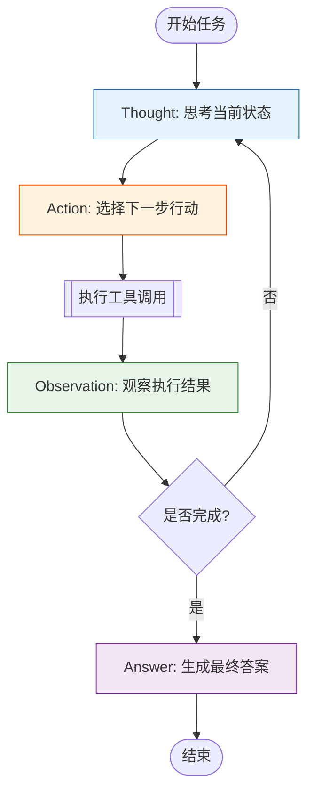

## 8.1 ReAct 框架：推理与行动的结合

在提示词工程的发展历程中，**ReAct (Reasoning and Acting)**框架的提出是一个重要的里程碑。它由 [Yao et al. (2022)](https://arxiv.org/abs/2210.03629) 首次提出，核心思想是将大语言模型的**推理能力**（ Reasoning）与 **行动能力**（ Acting）有机结合，使模型能够像人类一样，在解决问题时交替进行思考和行动，从而解决需要实时信息或多步骤交互的复杂任务。

### ReAct 在 2026 年的时代背景

需要澄清的是，**ReAct 本质上是一个理论框架和设计思想**，而非特定的实现方式。在 2022-2023 年间，ReAct 的应用确实主要依赖显式的文本解析（即手动提取"Thought-Action-Observation"的循环过程）。但到了 2025-2026 年，情况已发生根本性转变。

**关键转变**：当今主流大语言模型（如 GPT-5.5、Claude Opus 4.7、Gemini 3.1 Pro）已原生集成了**工具调用能力**（Function Calling / Tool Use）。这意味着：
- 不再需要手动解析文本中的"Action"字段
- 不再需要开发者编写复杂的状态机来管理"Thought-Action-Observation"循环
- 模型可以直接调用函数，系统自动处理响应回填

**但 ReAct 为什么仍然重要？** 因为它是**智能体架构设计的思想基础**。即使工具调用已原生集成，理解 ReAct 的"推理→行动→观察"设计思想，仍然是：
- 设计高效的智能体 prompt 的关键
- 在定制化场景（如离线环境、特定工作流）中手工实现工具调用的必修课
- 理解多轮推理和自适应决策的心智模型

因此，本章首先介绍 ReAct 的原理与实现，然后在 8.2 小节讲解如何利用现代 API 的原生工具调用功能，将这些原理转化为实际生产代码。

### 8.1.1 核心原理：超越思维链

在 ReAct 出现之前，主流的提示技术主要分为两类：
1.  **推理型（如 CoT）**：让模型生成推理步骤，但不与外部世界交互。这限制了模型获取新知识的能力，容易产生幻觉。
2.  **行动型（如 WebGPT）**：让模型生成指令调用工具，但缺乏对行动策略的显式推理。

ReAct 巧妙地融合了这两者，形成了一个 **“思考-行动-观察”（ Thought-Action-Observation）** 的闭环。

#### ReAct 的工作流程

ReAct 的决策过程可以形象地描述为以下循环：


```mermaid
flowchart TB
    Start(["开始任务"]) --> Thought["Thought: 思考当前状态"]
    Thought --> Action["Action: 选择下一步行动"]
    Action --> Execute[["执行工具调用"]]
    Execute --> Observation["Observation: 观察执行结果"]
    Observation --> Check{"是否完成?"}
    Check -->|"否"| Thought
    Check -->|"是"| Answer["Answer: 生成最终答案"]
    Answer --> Stop(["结束"])

    style Thought fill:#e3f2fd,stroke:#1565c0
    style Action fill:#fff3e0,stroke:#e65100
    style Observation fill:#e8f5e9,stroke:#2e7d32
    style Answer fill:#f3e5f5,stroke:#7b1fa2
```

*图 8-1： ReAct 的标准决策循环*

在这个循环中：
-   **Thought（思考）**：模型分析当前的任务状态、已有的信息，规划下一步应该做什么。这一步利用了 LLM 的逻辑推理能力。
-   **Action（行动）**：模型决定调用哪个外部工具（如搜索引擎、计算器、API），并生成具体的调用参数。
-   **Observation（观察）**：工具执行后返回的结果（如搜索结果片段、计算数值、API 响应）。这部分信息被回填到模型的上下文中。

通过这种方式， ReAct 实际上是在 **利用外部工具来扩展模型的上下文窗口和知识边界**。

### 8.1.2 实战示例： ReAct 解决复杂问题

让我们通过一个具体案例，对比标准提示与 ReAct 的差异。

**任务**：*“请比较 2025 年两类 Meta 智能眼镜：Ray-Ban Meta Gen 2（无显示）与 Meta Ray-Ban Display（带显示），并说明不要混淆二者。”*

#### ❌ 标准提示（容易失败）

> **用户**：请比较 2025 年两类 Meta 智能眼镜：Ray-Ban Meta Gen 2（无显示）与 Meta Ray-Ban Display（带显示）。
>
> **模型**：Ray-Ban Meta Gen 2 和 Meta Ray-Ban Display 都是带显示的 AR 眼镜，只是价格和外观不同。
>
> **分析**：这个回答混淆了“无显示的 AI 智能眼镜”和“带显示的智能眼镜”，缺乏来源验证。

#### ✅ ReAct 提示（准确可靠）

> **系统提示词**：
> 你是一个智能助手。在回答问题前，请遵循 ReAct 格式：先思考，再行动，观察结果，最后回答。
> 可用工具：
> - `search(query)`: 搜索引擎
> - `browser(url)`: 浏览网页内容
>
> **模型执行过程**：
>
> **Thought 1**: 用户要求比较两个具体产品。我需要先确认两个产品的官方定位和关键差异。
> **Action 1**: `search("Ray-Ban Meta Gen 2 official features 2025")`
> **Observation 1**: [搜索结果] Meta 官方介绍 Ray-Ban Meta Gen 2 是无显示智能眼镜，重点包括 3K 视频、最长约 8 小时电池、实时翻译和 Meta AI。
>
> **Thought 2**: 还需要确认 Meta Ray-Ban Display 的官方能力，尤其是它是否带显示。
> **Action 2**: `search("Meta Ray-Ban Display official Neural Band 2025")`
> **Observation 2**: [搜索结果] Meta Ray-Ban Display 带镜片内显示，并配套 Meta Neural Band，可用于查看消息、导航、预览照片和与 Meta AI 交互。
>
> **Thought 3**: 两者都属于智能眼镜，但产品类型不同。回答时应先澄清分类，再比较适用场景。
>
> **Answer**: **Ray-Ban Meta Gen 2** 是无显示的 AI 智能眼镜，核心卖点是拍摄、音频、实时翻译、Meta AI 和更长续航；**Meta Ray-Ban Display** 是带镜片内显示的智能眼镜，并通过 Meta Neural Band 提供更丰富的控制方式。
>
> 两者不要混淆：Gen 2 更像日常拍摄与 AI 助手眼镜；Display 才是带视觉显示层的产品。若问题讨论“AR 显示”，应优先看 Display 或其他带显示设备，而不是把所有智能眼镜都归入同一类。

### 8.1.3 ReAct 的代码实现逻辑

在实际开发中， ReAct 并不神秘，其实质是一个 `While` 循环。以下是一个简化的 Python 实现伪代码：

```python
def react_loop(query, tools, max_steps=10):
    messages = [
        {"role": "system", "content": SYSTEM_PROMPT},
        {"role": "user", "content": query}
    ]

    step_count = 0
    while step_count < max_steps:
        # 1. 调用 LLM 生成 Thought 和 Action
        response = llm.generate(messages)
        message = response.choices[0].message
        messages.append(message)

        # 2. 检查是否决定结束（生成 Answer）
        if "Answer:" in message.content:
            return extract_answer(message.content)

        # 3. 解析 Action
        tool_name, tool_args = parse_action(message.content)

        # 4. 执行 Action (Execute)
        if tool_name in tools:
            observation = tools[tool_name](tool_args)

            # 5. 将 Observation 回填给 LLM
            messages.append({
                "role": "tool",
                "content": f"Observation: {observation}"
            })
        else:
            messages.append({
                "role": "system",
                "content": "Error: Tool not found."
            })

        step_count += 1

    return "Task timed out."
```

### 8.1.4 ReAct 的优势与局限

#### 核心优势

1.  **可解释性强**：不仅知道结果，还能通过 Thought 看到模型的决策路径。
2.  **实时性与准确性**：通过工具获取最新信息（如天气、股价），解决了 LLM 知识截止的问题。
3.  **鲁棒性**：面对工具调用失败或信息不全，模型可以通过 Thought 自我纠正。

#### 潜在局限

1.  **延迟较高**：每一轮“思考-行动”都需要一次 LLM 调用和一次工具调用，多轮交互会导致显着的延迟。
2.  **上下文消耗**： Thought、Action 和 Observation 的历史记录会迅速占用上下文窗口，可能导致“遗忘”最初的指令。
3.  **循环陷阱**：模型有时会陷入死循环（如反复搜索同一个无效关键词），需要设置最大步数限制和检测机制。

### 想一想

1. ReAct 让模型在“推理”和“行动”之间交替——这和人类解决问题的方式有什么相似之处？有什么关键差异？
2. 如果 ReAct 循环中某一步工具调用失败了，你会如何设计 fallback 策略？
