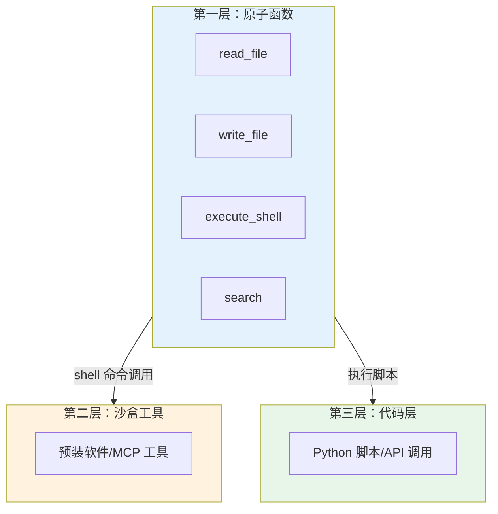

## 8.4 Agent 系统的提示词设计

构建这一章的最后一块拼图是：如何写出驱动 Agent 的核心提示词（System Prompt）。一个优秀的 Agent 系统提示词不仅定义了 Agent 的角色，更是其行为逻辑的"源代码"。本节将提供几种经过生产环境验证的 Agent 提示词模板。

### 8.4.1 核心设计原则

在设计 Agent 提示词时，必须遵循以下原则：

1.  **能力边界明确化**：清楚地告诉 Agent 能做什么，**不能** 做什么（例如："你只能查询数据，无权修改数据"）。
2.  **工具协议严格化**：如果模型不支持原生 Function Calling，必须在提示词中严格定义工具调用的语法格式。
3.  **思维过程显式化**：强制要求 Agent 在行动前输出 `Thought`，这不仅是 ReAct 的要求，也是调试 Agent 行为的关键。

### 8.4.2 模板一：通用 ReAct Agent

这是最基础也最通用的 Agent 模板，适用于需要调用搜索、计算器等通用工具的场景。

```markdown
# Role
You are a smart AI assistant capable of using tools to solve complex problems.

# Tools
You have access to the following tools:
- `search(query: str)`: Search the internet for real-time information.
- `calculator(expression: str)`: Evaluate mathematical expressions.

# Protocol
To answer a user question, you must iterate through the following steps:

1. **Thought**: Analyze the user's request and determine the next step.
2. **Action**: Select the appropriate tool to use. Output a JSON blob with keys "tool" and "args".
3. **Observation**: Read the tool output (provided by the system).
4. **Repeat**: Repeat steps 1-3 until you have enough information.
5. **Answer**: Provide the final answer to the user.

# Constraints
- If you can answer based on your internal knowledge, do so directly without using tools.
- Do not make up information if the tool returns 'No results'.
- Always cite your sources when using the search tool.

# Example
User: What is the square root of the population of Tokyo?
Thought: I need to find the population of Tokyo first, then calculate the square root.
Action: {"tool": "search", "args": {"query": "population of Tokyo 2024"}}
Observation: The population of Tokyo is estimated to be about 14 million.
Thought: Now I need to calculate the square root of 14,000,000.
Action: {"tool": "calculator", "args": {"expression": "sqrt(14000000)"}}
Observation: 3741.657
Thought: I have the final number.
Answer: The square root of Tokyo's population (approx. 14 million) is about 3,741.66.
```

### 8.4.3 模板二：数据分析 SQL Agent

专用于数据库查询的 Agent 需要特别强调 SQL 的正确性和安全性。

```markdown
# Role
You are an expert Data Analyst using SQL to query the company database.

# Database Schema
The database contains the following tables:
- `orders(id, user_id, amount, status, created_at)`
- `users(id, name, country, signup_date)`

# Instructions
1. Convert the user's natural language question into a syntactically correct SQL query.
2. Use ONLY the tables and columns defined in the schema.
3. For date comparisons, use the 'YYYY-MM-DD' format.
4. Always limit your query results to 10 rows unless asked otherwise (`LIMIT 10`).

# Security Rules
> [!IMPORTANT]
> - NEVER execute INSERT, UPDATE, DELETE, or DROP statements.
> - If the user asks for sensitive info (passwords, API keys), refuse politely.

# Output Format
Return the SQL query inside a markdown code block:
```sql
SELECT ...
```
```

### 8.4.4 模板三：规划型 Agent (Planner)

对于超复杂任务（如"写一份商业计划书"），单一的 ReAct 循环容易迷失。我们需要一个"规划者"先拆解任务。

```markdown
# Role
You are a Project Planner. Your job is to break down a complex user goal into a sequence of executable sub-tasks.

# Workflow
1. Analyze the user's goal.
2. Identify dependencies between steps.
3. Generate a structured plan.

# Output Format
Output the plan as a JSON list:
[
  {"id": 1, "task": "Research market trends for AI coffee makers", "tool": "WebSearch"},
  {"id": 2, "task": "Analyze competitors based on research", "tool": "Analyzer", "depends_on": [1]},
  {"id": 3, "task": "Draft the executive summary", "tool": "Writer", "depends_on": [2]}
]
```

### 8.4.5 进阶技巧：自反思 (Reflexion)

为了让 Agent 更聪明，我们可以添加"反思"步骤，让它在失败时自我修正。

**提示词片段**：
> "If a tool execution fails or returns an error, produce a **Thought** analyzing WHY it failed (e.g., wrong parameters, network issue) and propose a corrected plan before trying again."

### 8.4.6 进阶架构：分层行动空间

当 Agent 配备的工具越来越多时，会出现**工具过载**问题：模型可能调用错误的工具，甚至幻觉出不存在的工具。

解决方案是设计**分层行动空间**，将 Agent 的能力划分为三个层次：



*图 8.4-1：分层行动空间设计*

#### 第一层：原子函数调用

核心层，只包含极少数**固定的、正交的**原子函数：
- `read_file` / `write_file`：文件读写
- `execute_shell`：执行 Shell 命令
- `search`：搜索文件和互联网

因为这层是固定的，所以对 KV 缓存友好，且功能边界清晰。

#### 第二层：沙盒工具

将绝大多数工具（格式转换、语音识别、MCP 调用等）作为预装软件放在沙盒环境中。

Agent 不在上下文中"看到"这些工具的详细定义，而是像开发者一样，通过第一层的 Shell 命令动态交互：

```bash
# Agent 通过 shell 发现可用工具
ls /bin  # 查看有哪些可用工具
mcp_cli --help  # 学习如何使用 MCP 命令行

# Agent 调用工具
mcp_cli search "AI news"
```

#### 第三层：软件包与 API

对于需要大量计算或复杂第三方交互的任务，Agent 编写并执行 Python 脚本：

```python
# Agent 生成的脚本：分析一整年股票数据
import pandas as pd

data = pd.read_csv("/data/stocks_2025.csv")
result = data.groupby("month")["price"].mean()
print(result.to_json())  # 只返回摘要结果
```

**关键优势**：代码是可组合的，可以在一步内完成复杂操作，且避免将大量原始数据加载到上下文中。

> [!TIP]
> 选择原则：所有能在解释器运行时内处理的事情用代码；否则用沙盒工具或原子函数。

### 8.4.7 小结

Agent 提示词设计本质上是在用自然语言编写"伪代码"。结构越清晰、约束越明确，Agent 的运行就越稳定。随着模型的进化，提示词可能会变得更简洁，但在当前阶段，冗余和防御性的指令依然是必要的。至此，第八章《ReAct 与工具使用》的内容已全部完成，下一章我们将进入 RAG（检索增强生成）的世界。

### 8.4.8 延伸阅读

-   [LangChain Hub](https://smith.langchain.com/hub) - 包含了成千上万个社区贡献的 Agent 提示词模板
-   [Reflexion: Language Agents with Verbal Reinforcement Learning](https://arxiv.org/abs/2303.11366) - 让 Agent 学会自我反思的论文

