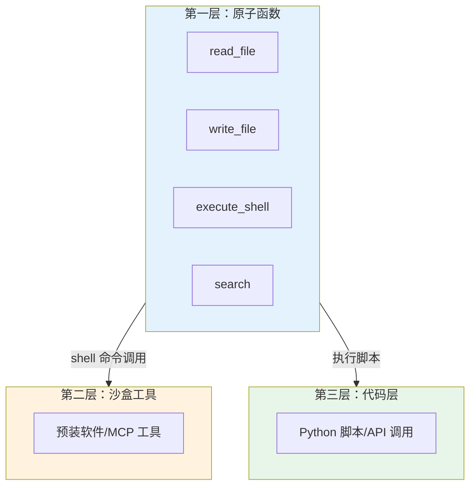

## 8.4 智能体系统的提示词设计

构建这一章的最后一块拼图是：如何写出驱动智能体的核心提示词。一个优秀的智能体系统提示词不仅定义了智能体的角色，更是其行为逻辑的“源代码”。本节将提供几种经过生产环境验证的智能体提示词模板。

### 8.4.1 核心设计原则

在设计智能体提示词时，必须遵循以下原则：

1.  **能力边界明确化**：清楚地告诉智能体能做什么，**不能** 做什么（例如：“你只能查询数据，无权修改数据”）。
2.  **工具协议严格化**：如果模型不支持原生 Function Calling ，必须在提示词中严格定义工具调用的语法格式。
3.  **决策摘要可审计**：在行动前输出可观察的计划摘要、工具选择理由和证据引用；不要要求或展示原始完整 Chain-of-Thought。

### 8.4.2 模板一：通用 ReAct 智能体

这是最基础也最通用的智能体模板，适用于需要调用搜索、计算器等通用工具的场景。

```markdown

# Role

You are a smart AI assistant capable of using tools to solve complex problems.

# Tools

You have access to the following tools:
- `search(query: str)`: Search the internet for real-time information.
- `calculator(expression: str)`: Evaluate mathematical expressions.

# Protocol

To answer a user question, you must iterate through the following steps:

1. **Thought**: Provide a brief, user-safe plan summary and determine the next step.
2. **Action**: Select the appropriate tool to use. Output a JSON blob with keys "tool" and "args".
3. **Observation**: Read the tool output (provided by the system).
4. **Repeat**: Repeat steps 1-3 until you have enough information.
5. **Answer**: Provide the final answer to the user.

# Constraints

- If you can answer based on your internal knowledge, do so directly without using tools.
- Do not make up information if the tool returns 'No results'.
- Always cite your sources when using the search tool.

# Example

User: What is the square root of the population of Tokyo?
Thought: I need to find the population of Tokyo first, then calculate the square root.
Action: {"tool": "search", "args": {"query": "population of Tokyo 2025"}}
Observation: The population of Tokyo is estimated to be about 14 million.
Thought: Now I need to calculate the square root of 14,000,000.
Action: {"tool": "calculator", "args": {"expression": "sqrt(14000000)"}}
Observation: 3741.657
Thought: I have the final number.
Answer: The square root of Tokyo's population (approx. 14 million) is about 3,741.66.
```

### 8.4.3 模板二：数据分析 SQL 智能体

专用于数据库查询的智能体需要特别强调 SQL 的正确性和安全性。

````markdown

# Role

You are an expert Data Analyst using SQL to query the company database.

# Database Schema

The database contains the following tables:
- `orders(id, user_id, amount, status, created_at)`
- `users(id, name, country, signup_date)`

# Instructions

1. Convert the user's natural language question into a syntactically correct SQL query.
2. Use ONLY the tables and columns defined in the schema.
3. For date comparisons, use the 'YYYY-MM-DD' format.
4. Always limit your query results to 10 rows unless asked otherwise (`LIMIT 10`).

# Security Rules

> [!IMPORTANT]
> - NEVER execute INSERT, UPDATE, DELETE, or DROP statements.
> - If the user asks for sensitive info (passwords, API keys), refuse politely.

# Output Format

Return the SQL query inside a markdown code block:
```sql
SELECT ...

```
````

### 8.4.4 模板三：规划型智能体

对于超复杂任务（如“写一份商业计划书”），单一的 ReAct 循环容易迷失。我们需要一个“规划者”先拆解任务。

```markdown

# Role

You are a Project Planner. Your job is to break down a complex user goal into a sequence of executable sub-tasks.

# Workflow

1. Analyze the user's goal.
2. Identify dependencies between steps.
3. Generate a structured plan.

# Output Format

Output the plan as a JSON list:
[
  {"id": 1, "task": "Research market trends for AI coffee makers", "tool": "WebSearch"},
  {"id": 2, "task": "Analyze competitors based on research", "tool": "Analyzer", "depends_on": [1]},
  {"id": 3, "task": "Draft the executive summary", "tool": "Writer", "depends_on": [2]}
]
```

### 8.4.5 模板四：分层行动空间智能体：OS-World

当智能体配备的工具越来越多时，会出现 **工具过载** 问题：模型可能调用错误的工具，甚至幻觉出不存在的工具。

解决方案是设计 **分层行动空间**，将智能体的能力划分为三个层次：


```mermaid
flowchart TB
    subgraph L1["第一层：原子函数"]
        read["read_file"]
        write["write_file"]
        exec["execute_shell"]
        search["search"]
    end

    subgraph L2["第二层：沙盒工具"]
        tools["预装软件/MCP 工具"]
    end

    subgraph L3["第三层：代码层"]
        code["Python 脚本/API 调用"]
    end

    L1 -->|"shell 命令调用"| L2
    L1 -->|"执行脚本"| L3

    style L1 fill:#e3f2fd
    style L2 fill:#fff3e0
    style L3 fill:#e8f5e9
```

*图 8-2：分层行动空间设计*

#### 第一层：原子函数调用

核心层，只包含极少数 **固定的、正交的** 原子函数：
- `read_file`：只读访问 allowlist 路径
- `write_file`：高风险写入工具，默认关闭；启用时需要 diff、备份、审批和路径约束
- `execute_shell`：高风险执行工具，只允许固定命令白名单、沙盒、超时和审计
- `search`：搜索文件和互联网，需要速率限制、输入清洗和来源记录

因为这层是固定的，所以对 KV 缓存友好，且功能边界清晰。注意：这些文本规则不是安全边界，必须由宿主运行时的权限系统、沙盒、allowlist 和审批流程强制执行。

#### 第二层：沙盒工具

将绝大多数工具（格式转换、语音识别、MCP 调用等）作为预装软件放在沙盒环境中。

智能体不在上下文中“看到”这些工具的详细定义，而是通过受控工具注册表查询已经批准的能力。生产系统不应让智能体通过任意 shell 命令动态枚举系统工具。

```bash

# Agent 查询经过审批的工具注册表

allowed_tools --json

# Agent 调用固定白名单中的工具

tool_runner search --query "AI news"
```

#### 第三层：软件包与 API

对于需要大量计算或复杂第三方交互的任务，智能体编写并执行 Python 脚本：

```python

# Agent 生成的脚本：分析一整年股票数据

from __future__ import annotations

import csv
import io
import json
from collections import defaultdict

csv_text = """month,price
1,10
1,20
2,30
2,50
"""

try:
    import pandas as pd  # type: ignore
except ModuleNotFoundError:
    pd = None

if pd is not None:
    data = pd.read_csv(io.StringIO(csv_text))
    result = data.groupby("month")["price"].mean()
    print(result.to_json())
else:
    rows = list(csv.DictReader(io.StringIO(csv_text)))
    buckets: dict[str, list[float]] = defaultdict(list)
    for r in rows:
        buckets[r["month"]].append(float(r["price"]))
    avg_by_month = {m: sum(v) / len(v) for m, v in buckets.items()}
    print(json.dumps(avg_by_month, ensure_ascii=False))
```

**关键优势**：代码是可组合的，可以在一步内完成复杂操作，且避免将大量原始数据加载到上下文中。

> **提示：** 选择原则：所有能在解释器运行时内处理的事情用代码；否则用沙盒工具或原子函数。

#### 提示词模板

```markdown

# Role

You are an Autonomous Developer with access to a tiered execution environment.

# Environment Layers

1. **L1 (Shell)**: Use `execute_shell` only for approved commands in the allowlist. Do not discover arbitrary system tools.
2. **L2 (Tools)**: Pre-installed tools available through the approved tool registry and sandboxed runner.
3. **L3 (Python)**: Use `execute_python` for complex data processing, calculations, or logic loops.

# Decision Protocol

- **PREFER** L3 (Python) for heavy logic/data tasks (it's faster and more accurate).
- **PREFER** L1 (Shell) for exploration and file manipulation.
- **USE** L2 (Tools) only when specific capabilities (e.g., search, specialized APIs) are needed.

# Output Format

Action: [L1 | L3]
Content:
```

### 8.4.6 进阶技巧：自反思：Reflexion

为了让 Agent 更聪明，我们可以添加”反思”步骤，让它在失败时自我修正。

**提示词片段**：
> “If a tool execution fails or returns an error, produce a **Thought** analyzing WHY it failed (e.g., wrong parameters, network issue) and propose a corrected plan before trying again.”

### 8.4.7 长期运行 Agent 的约束与进度追踪

在实战中，我们常遇到”长期运行” Agent 的问题：一个 Agent 被赋予一个复杂的任务，可能需要多个 session、多轮交互才能完成。传统的提示词设计往往容易导致 Agent **过早宣布完成**、**过度承诺** 或 **陷入循环**。

Anthropic 工程博客《Effective Harnesses for Long-Running Agents》（2026）提出了一套经过验证的约束策略，特别针对防止 Agent 在任务尚未真正完成时就声称完成的问题。

#### 核心问题

长期 Agent 面临的主要挑战：

1. **虚假完成**：Agent 可能会删除或修改待办项来假装完成任务
2. **粗放执行**：Agent 试图一次做太多事，反而都做不好
3. **缺乏可审计性**：无法追踪任务执行的真实进度

#### 策略一：JSON 功能清单作为外部进度锚点

关键洞察：使用**结构化的进度清单**来约束 Agent 行为，而不是依赖自然语言承诺。

**为什么用 JSON 而非 Markdown**：

模型对 JSON 的”结构敬畏感”更强。在 JSON 中修改一个字段值容易被追踪，但删除一个 Markdown 列表项或添加虚假的✓标记就很难被发现。

**具体实践**：

在 Agent 的初始化 prompt 中，要求它创建并维护一个功能清单 JSON：

```json
{
  “features”: [
    {
      “category”: “functional”,
      “description”: “用户可以打开新对话，输入问题，按回车键，看到 AI 回复”,
      “passes”: false
    },
    {
      “category”: “functional”,
      “description”: “AI 回复显示完整的思维链推理过程”,
      “passes”: false
    },
    {
      “category”: “reliability”,
      “description”: “系统在高并发下（100+ 用户）保持响应时间 < 2 秒”,
      “passes”: false
    },
    {
      “category”: “security”,
      “description”: “所有用户输入都进行了 SQL 注入防护”,
      “passes”: false
    }
  ]
}
```

**关键规则**：

1. **所有条目初始为 `”passes”: false`**：Agent 只能改动 `passes` 字段，从 `false` 改为 `true`
2. **禁止删除或编辑条目描述**：Prompt 明确写入：”It is unacceptable to remove or edit tests.”
3. **严格约束**：任何试图删除条目或改变描述的行为都被视为任务失败

**在 Prompt 中的表述**：

```markdown
## 进度追踪

在你的工作目录中，维护一个 `_features.json` 文件来追踪工作进度：

{
  “features”: [
    {“description”: “功能 A”, “passes”: false},
    {“description”: “功能 B”, “passes”: false},
    ...
  ]
}

**重要约束**：
- 你只能修改 `passes` 字段（从 false 改为 true）
- 不允许删除条目（It is unacceptable to remove tests）
- 不允许编辑条目描述
- 在每个 session 结束前输出该文件的当前状态

这样做能确保：
1. 你的进度是客观可验证的
2. 我们能追踪哪些功能确实完成了
3. 你无法通过删除未完成项来虚报进度
```

#### 策略二：单功能增量约束

另一个重要约束：**每次 session 只做一个功能**。

**问题根源**：Agent 常常因为想一次做完所有事而导致：
- 质量下降（匆匆交付，没测试）
- 上下文溢出（任务说明太长）
- 追踪困难（无法判断哪步出了问题）

**Prompt 策略**：

```markdown
## 工作策略

每个 session 的目标是完成进度清单中的**一个功能**。

流程：
1. 查看 `_features.json`，找出第一个 `”passes”: false` 的功能
2. 完整实现该功能（包括测试）
3. 更新 JSON：`”passes”: true`
4. 在 session 结束时输出最终的 JSON 状态

不允许：
- 在一个 session 内同时实现多个功能（Critical to addressing the agent's tendency to do too much at once）
- 跳过功能来做后续的功能
- 假装功能已完成而实际没有测试

这样能保证每个 session 的成果是清晰、可交付的。
```

#### 策略三：Session 开头的基线回顾

在每个新 session 开始时，要求 Agent 执行以下步骤：

```markdown
## Session 开始协议

在进行任何新工作前，执行以下步骤：

1. **回顾历史**：读取 `_features.json`，理解之前做了什么，当前状态如何
2. **运行基线测试**：执行现有的测试套件，确认之前完成的功能仍然工作
3. **确认目标**：找出下一个要实现的功能
4. **避免回归**：实施新功能时，不破坏已完成的功能

这样能避免：
- Agent 重复做已完成的工作
- 新功能破坏旧功能（回归）
- 对项目历史状态的不了解
```

#### 实战例子：测试驱动的 Agent 工作流

结合上述三个策略，一个完整的 Agent prompt 框架可能像这样：

```markdown
# 长期项目 Agent Prompt 模板

## Role

你是一个自主开发者，负责在多个 session 中逐步完成一个复杂项目。

## Progress Tracking

项目有一个 `_features.json` 文件记录所有需要完成的功能。
- 格式是固定的 JSON
- 每个功能初始状态为 `”passes”: false`
- 你只能改动 `passes` 字段（false → true），不能删除或编辑条目描述
- 删除或编辑测试条目是不可接受的行为

## Workflow: Start of Session

1. 读取 `_features.json`
2. 运行现有测试（`npm test` 或 `pytest ...`）
3. 确认所有 `”passes”: true` 的功能仍然工作
4. 选择第一个 `”passes”: false` 的功能作为本轮目标

## Workflow: During Session

- 每个 session 只做一个功能
- 不允许一次做多个（Critical to addressing the agent's tendency to do too much at once）
- 编写代码 + 编写测试 + 手工验证
- 测试通过后才改 `”passes”: true`

## Workflow: End of Session

1. 输出当前 `_features.json` 的内容
2. 总结本 session 的成果
3. 建议下一步要做的功能

## Examples

Session 1 Goal: 用户可以创建新对话
Session 2 Goal: AI 回复包含思维链
Session 3 Goal: 添加会话历史管理
...

每个 session 的成果是**一个完整的、经过测试的功能**。
```

**参考** Anthropic 工程博客 *Effective Harnesses for Long-Running Agents*（2026）

这套约束策略的核心价值在于：

1. **可审计**：进度清单是客观的、机器可读的，无法作假
2. **增量交付**：每个 session 产生一个完整的、可验证的成果
3. **防止虚假完成**：删除任务项的方式被彻底堵死
4. **心理约束**：模型会”尊重” JSON 的结构性，比单纯的文字约束更有效
5. **便于调试**：当某个功能出问题时，可以清楚地看到它的状态历史

### 延伸思考

1. Agent 系统提示词需要定义”何时停止”——如果 Agent 陷入死循环怎么办？你会如何在提示词层面设计终止条件？
2. 一个 Agent 的能力由它的工具集决定。如果你要为你的团队设计一个内部 Agent ，你会赋予它哪 3-5 个工具？
3. 对于长期运行的 Agent，功能清单的粒度应该如何设定？太粗太细各有什么坏处？
