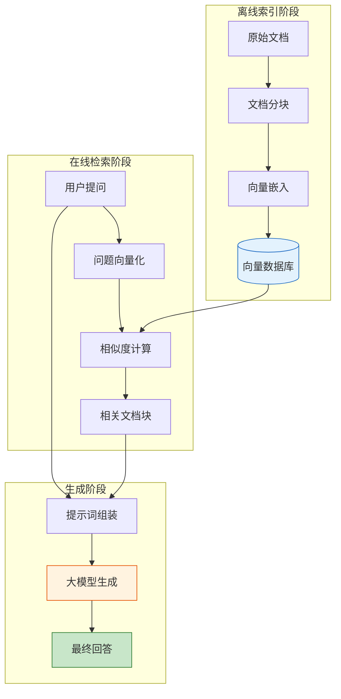

## 9.1 RAG 系统的核心原理

检索增强生成（Retrieval-Augmented Generation, RAG）是由 [Lewis et al. (2020)](https://arxiv.org/abs/2005.11401) 提出的架构，它已成为解决大语言模型"幻觉"和"知识过时"问题的标准解决方案。本节将深入剖析 RAG 的核心架构及其演进。

### 9.1.1 为什么需要 RAG？

大语言模型虽然博学，但存在天然的缺陷：
1.  **知识截止**：GPT-4 的知识截止于其训练结束的那一天。
2.  **幻觉问题**：模型倾向于自信地编造事实。
3.  **私有数据不可见**：模型无法回答关于企业内部文档或个人数据的问题。

RAG 通过在生成回答前"外挂"一个知识库，让模型能够"开卷考试"，从而解决了上述问题。

### 9.1.2 RAG 的标准架构

RAG 系统并非单一的模型，而是由三个核心组件协同工作的管道：**索引**、**检索** 和 **生成**。

*图 9.1-1：RAG 系统的标准三阶段架构*

#### 1. 索引阶段 (Indexing)
这是知识库的构建过程，通常在离线进行：
-   **数据提取**：从 PDF、Word、HTML 等源提取文本。
-   **分块 (Chunking)**：将长文本切分为小片段（如 512 token）。这是一门艺术，切分太大会包含噪音，切分太小会丢失上下文。
-   **嵌入 (Embedding)**：使用 Embedding 模型（如 OpenAI text-embedding-3）将文本转化为向量。
-   **存储**：将向量及其元数据存入向量数据库（如 Milvus, Pinecone）。

#### 2. 检索阶段 (Retrieval)
这是 RAG 以"准确性"决胜的关键：
-   系统将用户的 Query 转化为向量。
-   在数据库中进行 ANN（近似最近邻）搜索，找到在语义空间最接近的 Top-K 个文档块。
-   *注：高级 RAG 会在此阶段引入混合检索和重排序。*

#### 3. 生成阶段 (Generation)
-   **上下文注入**：将检索到的片段填入系统提示词中（通常使用 `<context>` 标签包裹）。
-   **溯源引用**：要求模型在回答时标注信息来源（如 `[1]`）。

### 9.1.3 RAG 架构的演进

随着技术的发展，RAG 已经从最初的形态进化出了多种变体：

#### Naive RAG (初级 RAG)
最基础的"检索-生成"流程。
-   **优点**：实现简单，开发极为迅速。
-   **缺点**：精度低，容易检索到不相关内容，且容易受"中间迷失"（Lost in the Middle）现象影响。

#### Advanced RAG (高级 RAG)
针对初级 RAG 的痛点进行了优化：
-   **检索前优化**：查询重写、查询扩展。
-   **检索后优化**：重排序、上下文压缩。
-   **混合检索**：结合关键词搜索（BM25）和向量搜索。

#### Modular RAG (模块化 RAG)
将 RAG 拆解为可插拔的模块，支持更复杂的 Orchestration（编排）：
-   **路由模块**：决定是否需要检索，或者去哪个库检索。
-   **记忆模块**：结合多轮对话历史进行检索。
-   **自修正模块**：如果检索结果不佳，自动触发新的搜索。

### 9.1.4 核心挑战与评估

构建 RAG 容易，但构建 **好** 的 RAG 很难。主要的挑战包括：

1.  **检索质量**：检索不到相关文档（召回率低），或者检索了一堆噪音。
2.  **生成忠实度**：模型无视检索到的文档，继续产生幻觉。
3.  **复杂推理**：对于需要跨多个文档整合信息才能回答的问题，传统 RAG 表现不佳。

为了量化解决这些问题，引入了 **RAGAS** 或 **TruLens** 等评估框架，通过"忠实度"（Faithfulness）和"答案相关性"（Answer Relevance）等指标来科学度量 RAG 系统的表现。

### 想一想

1. RAG 的本质是"让模型开卷考试"——但"开卷"是否总比"闭卷"好？什么情况下你反而不需要 RAG？
2. 索引、检索、生成这三个阶段中，你认为哪个阶段对最终回答质量的影响最大？为什么？
