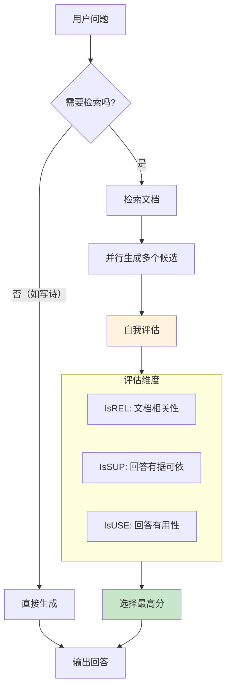
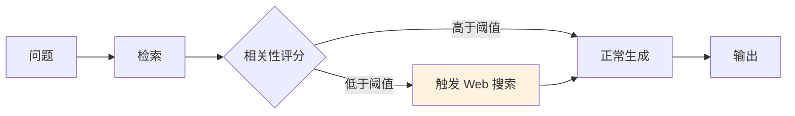

## 9.4 高级 RAG 架构与前沿趋势

随着 RAG 技术的成熟，简单的“Retrieve-Then-Read”管道已难以满足复杂场景的需求。本节将介绍几种代表当前最前沿水平的高级 RAG 架构。

### 1. 模块化与自适应 RAG

传统的 RAG 是一条固定的流水线：检索 → 生成。而新一代 RAG 架构将各个环节解耦，并根据问题的难度动态调整策略。

#### Self-RAG：自反思检索增强

由 Akari Asai 等人提出的 Self-RAG 是最具影响力的自适应架构，核心思想是 **“按需检索”**和**“自我反思”**。



*图 9-2： Self-RAG 工作流程*

**关键创新点**：
- **按需检索**：模型首先判断是否需要外部知识，避免不必要的检索开销
- **多候选生成**：并行生成多个回答版本，增加命中最优解的概率
- **自我打分**：通过三个维度评估回答质量，实现自动质量控制

#### CRAG：纠错式检索增强

CRAG 的核心在于 **检测并纠正检索失败**。



*图 9-3： CRAG 纠错流程*

**核心机制**：
- 当检索结果相关性低于阈值时，判定为“知识盲区”
- 自动触发 Web 搜索作为兜底，而不是强行用无关文档回答
- 有效降低了因检索失败导致的幻觉

### 2. GraphRAG：融合知识图谱

向量检索擅长语义相似度，但无法处理复杂的 **结构化关系**（如“Alice 的老板的老板是谁？”）。Microsoft 提出的 GraphRAG 将知识图谱引入 RAG。

-   **Indexing**: 从文档中抽取实体和关系，构建图谱。
-   **Retrieval**:
    -   先在图谱中进行多跳查询，找到关联路径。
    -   同时进行向量搜索。
    -   融合两者的结果。
-   **优势**: 在需要全局概览和复杂推理的场景下， GraphRAG 显著优于传统 RAG。

### 3. 长上下文 RAG 架构

随着 Gemini 3 Pro (1M context) 和 Claude 4.6 (1M context) 的出现，一种观点认为 “RAG 已死， Long Context 即未来”。

**现状与融合**：
-   **大海捞针 (Needle In A Haystack)**：虽然窗口大了，但模型在超长文中提取细节的能力仍有波动。
-   **经济性**：每次把 100 本书塞进 Context 极其昂贵且慢。
-   **未来可能的架构**：**RAG + Long Context**。RAG 负责粗筛出 Top-50 文档（依然很大），然后利用 Long Context 模型一次性阅读这 50 个文档进行综合，替代传统的 Top-5 切片。

### 4. RAG 评估体系

没有评估就在“裸奔”。业界主流的评估框架是 **RAGAS** (Retrieval Augmented Generation Assessment)。

#### 核心指标

1.  **Context Precision (检索精确度)**
    -   *定义*：检索到的文档中，真正相关的文档排在前面的比例。
    -   *问题*：如果相关文档排在第 10 位，模型可能看不到。

2.  **Context Recall (检索召回率)**
    -   *定义*：知识库中所有能回答该问题的文档，被检索出来的比例。
    -   *问题*：如果漏掉了关键文档，答案就不完整。

3.  **Faithfulness (忠实度)**
    -   *定义*：生成的 Answer 中的每一句话，是否都能从 Context 中找到依据？
    -   *目标*：检测幻觉。

4.  **Answer Relevance (答案相关性)**
    -   *定义*：生成的 Answer 是否直接回答了用户的 Query？
    -   *目标*：防止答非所问。

### 5. RAG 模型微调

通用模型虽好，但在特定垂类领域（如医疗、法律、内部代码库）往往“水土不服”。微调是跨越“最后 5% 准确率”的关键。

#### 5.1 Embedding 模型微调

*   **目的**：让 Embedding 模型理解特定领域的语义相似性。
*   **效果**：通常能带来 **2% - 5%** 的检索准确率提升。
*   **方法**：使用生成的（ Query, Positive Document, Negative Document）三元组数据进行微调。

#### 5.2 Reranker 模型微调

*   **目的**：让重排序模型对齐业务的排序逻辑。
*   **效果**：效果往往比微调 Embedding 更显著（**+4% 以上**）。
*   **场景**：当通用 Reranker 无法区分某些极其相似但对业务至关重要的细微差别时。

### 5. Agentic RAG：智能体驱动的自适应检索

2024-2026 年，随着原生工具调用能力的成熟和多轮推理的进阶，**Agentic RAG** 成为 RAG 演进的新方向。它突破了传统 RAG 的”单次检索+生成”模式，转向”多轮自适应检索”。

#### Agentic RAG 的核心特征

**传统 RAG 的限制**：
- 一次性检索（通常 Top-5 或 Top-10 文档）
- 被动回答（按照检索结果组织生成）
- 无自验证机制

**Agentic RAG 的突破**：
- **多轮检索**：模型在生成过程中主动判断是否需要补充检索
- **查询改写**：自动调整搜索关键词以获取更精准的结果
- **检索路由**：智能选择查询哪个知识源（向量库、知识图谱、Web 搜索等）
- **多跳推理**：结合第 8 章的 ReAct 思想，进行复杂的多步推理和验证

#### 工作流示例

```mermaid
flowchart TB
    Query[“用户问题”] --> Decompose[“分解问题<br/>(ReAct Thought)”]
    Decompose --> NeedRetrieval{“是否需要检索?”}
    
    NeedRetrieval -->|是| Rewrite[“查询改写<br/>(优化关键词)”]
    Rewrite --> RouteQuery{“选择检索源”}
    
    RouteQuery -->|向量库相关| VectorRetrieval[“向量检索”]
    RouteQuery -->|复杂关系| GraphRetrieval[“图谱查询”]
    RouteQuery -->|实时信息| WebSearch[“Web 搜索”]
    
    VectorRetrieval --> Retrieve[“综合检索结果”]
    GraphRetrieval --> Retrieve
    WebSearch --> Retrieve
    
    Retrieve --> Verify{“信息充分?”}
    Verify -->|否| IterativeRetrieval[“迭代检索<br/>(多跳)”]
    IterativeRetrieval --> Retrieve
    
    Verify -->|是| Generate[“生成回答”]
    NeedRetrieval -->|否| Generate
    Generate --> SelfCheck{“答案可信?”}
    
    SelfCheck -->|否| Refine[“精化与验证”]
    Refine --> Retrieve
    SelfCheck -->|是| Output[“最终输出”]
    
    style Decompose fill:#e3f2fd
    style Rewrite fill:#fff3e0
    style Generate fill:#e8f5e9
    style SelfCheck fill:#f3e5f5
```

*图 9-4：Agentic RAG 的多轮自适应流程*

#### 核心能力拆解

1. **查询改写**：不是直接用用户提问检索，而是先通过 LLM 改写成更易检索的形式
   ```
   用户问题：「谁赢了 2024 年欧洲杯决赛？」
   改写后：「2024年欧洲足球锦标赛决赛冠军」
   ```

2. **检索路由**：根据问题类型自动选择最合适的知识源
   - 事实类问题 → 向量库
   - 关系查询 → 知识图谱
   - 实时新闻 → Web 搜索

3. **多跳推理**：结合工具调用的多轮对话，支持”先检索 A，基于结果再检索 B”的复杂流程

4. **自验证**：生成答案后，自动检查答案中的事实是否都有检索文档支撑，必要时触发补充检索

#### 与第 8 章的交叉

Agentic RAG 本质上是将第 8 章讲述的 **ReAct + 工具调用** 应用于 RAG 场景。其”分解→检索→验证→迭代”的循环正是 ReAct 框架的具体体现。两者的关键区别在于：
- **ReAct（8.1）**：通用的”推理+行动”框架，适用于任何需要工具的任务
- **Agentic RAG（9.4）**：将 ReAct 特化于信息检索与综合场景，融合了 RAG 的特定优化

### 讨论

1. Graph RAG 和传统向量 RAG 各自适合什么类型的知识？你的业务数据更适合哪种？
2. “自适应 RAG”让模型自己决定是否需要检索——这是否引入了新的不确定性？你如何对此进行质量控制？
3. Agentic RAG 引入了多轮检索，这会显著增加延迟和成本——你如何在准确性和效率间取得平衡？
