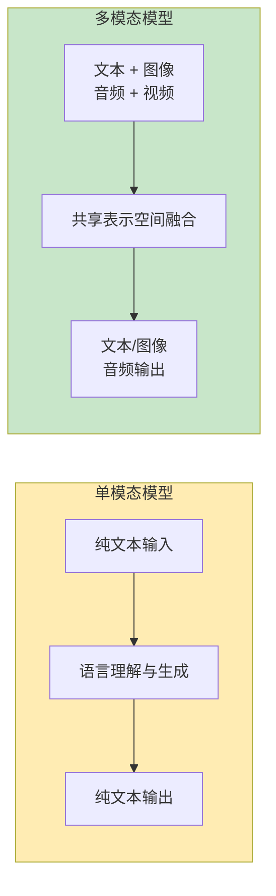
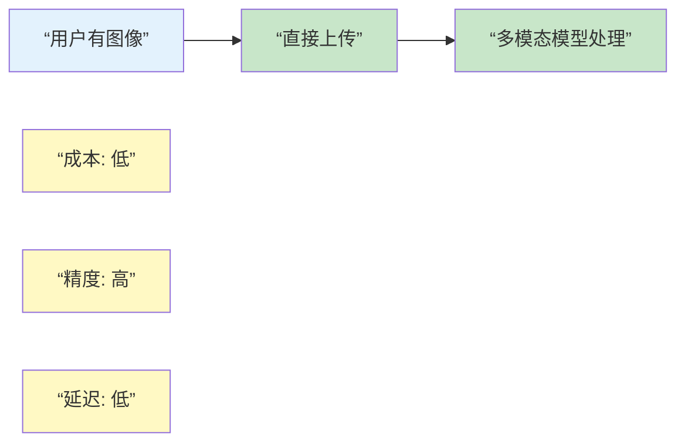

## 10.5 多模态提示词工程进阶：融合文本、图像、音频与视频

多模态 AI 模型（如 GPT-5、Claude 4.6、Gemini 3 Pro）代表了新一代的交互范式。与传统的单一文本模型不同，多模态模型要求设计者理解跨越不同感知维度的提示词策略。本节深入探讨多模态提示词工程的最佳实践、冲突解决和实际应用。

### 10.5.1 多模态提示词的基本原理

#### 多模态 vs 单模态模型



#### 信息处理流水线对比

```
┌─────────────────────────────────────────────────┐
│ 单模态流水线 (传统)                             │
├─────────────────────────────────────────────────┤
│
│ 用户有图像 → 手动描述 → 发送文本 → LLM 处理
│
│ 成本: 高 (需要人工描述)
│ 精度: 低 (描述可能不准确或不完整)
│ 延迟: 高 (需要额外描述步骤)
│
└─────────────────────────────────────────────────┘



### 10.5.2 图文混合提示策略

#### 图像提示的有效设计

```
【原则 1：提供充分的视觉上下文】

❌ 不好的做法:
  用户上传: [有点模糊的图片]
  提示词: “这是什么?”

  问题:
  - 模型不知道用户想要什么详细程度
  - 模型不知道应用场景
  - 模型可能给出不相关的分析

✓ 好的做法:
  用户上传: [清晰的图片]
  提示词: """
  这是一个电商产品的摄影图。
  请分析：
  1. 产品的主要特征
  2. 图像质量评分（1-10）
  3. 是否适合用作主图
  4. 改进建议

  我计划用这张图做电商平台的主产品图。
  """

  优势:
  - 清晰的背景信息
  - 具体的分析要求
  - 模型了解使用场景
  - 输出更有针对性


【原则 2：利用文本标注增强理解】

示例 1: 标注重点区域
  图片 + 文本标注:
  “请关注图中红色框标注的区域”
  或
  “左上角的文字是关键信息”

示例 2: 补充缺失信息
  图片：一张黑白照片
  文本补充：
  “这张照片的原始色彩应该是...”
  “这张照片拍摄于...”

示例 3: 建立对比
  图片 1 + 图片 2 + 文本:
  \u201c比较这两张图片，第一张代表...，
   第二张代表...请指出差异\u201d


【原则 3：指定分析粒度】

低粒度分析 (快速概览):
  提示词: “快速描述这张图片的内容”

  模型响应时间: 快
  输出长度: 短 (~100 词)
  使用场景: 内容审核、快速分类

中粒度分析 (详细理解):
  提示词: """
  详细分析这张图片：
  - 场景描述
  - 主要对象
  - 视觉特征
  - 可能的应用场景
  """

  模型响应时间: 中等
  输出长度: 中等 (~500 词)
  使用场景: 内容描述、可访问性

高粒度分析 (深度洞察):
  提示词: """
  进行深度视觉分析：
  1. 构图与审美分析
  2. 光影处理评估
  3. 色彩心理学分析
  4. 文化与历史背景
  5. 潜在的符号学含义
  """

  模型响应时间: 慢
  输出长度: 长 (~2000 词)
  使用场景: 艺术评论、研究分析
```

#### 多图像协作提示

```
【场景 1：图像序列分析】

任务: 分析一系列照片的故事线

提示词:
```
system: |
  你是一个专业的视觉叙事分析师。

  分析以下图像序列，理解：
  1. 每张图片的视觉元素
  2. 图像之间的叙事关系
  3. 整体故事的发展线索
  4. 情感与氛围的演变

user: """
  [图像 1] - 开场
  [图像 2] - 发展
  [图像 3] - 高潮
  [图像 4] - 结局

  请以故事叙述的方式描述这个序列。
"""
```

【场景 2：对比分析】

任务: 比较多个版本的设计

提示词:
```
以下是产品设计的三个版本。
请对比分析：

[版本 A]
[版本 B]
[版本 C]

对比维度：
1. 视觉层级
2. 色彩搭配
3. 用户体验指示
4. 品牌一致性
5. 总体评分

为每个版本评分并给出改进建议。
```

【场景 3：补充细节】

任务: 利用多张图补充信息

提示词:
```
主图: [全景图]
细节图: [特写 1, 特写 2, 特写 3]

基于这些图像，请：
1. 提供完整的对象描述
2. 指出主图中可能被忽略的细节
3. 解释细节图与主图的关系
4. 提供综合的理解
```

### 10.5.3 视觉提示（Visual Prompting）最佳实践

#### 图像质量与表达力

```
【质量标准】

清晰度要求:
  低质量 (≤72 DPI)   → 难以识别细节
  中质量 (72-150 DPI) → 基本可识别
  高质量 (>150 DPI)   → 清晰识别细节

分辨率建议:
  文本识别: ≥ 1024×768
  细节分析: ≥ 1920×1080
  快速分类: ≥ 512×512

格式选择:
  PNG: 最高质量（适合高质量分析）
  JPG: 平衡大小与质量
  WebP: 现代格式，较小文件

【表达力优化】

示例 1: 强化对比
  原始图: 单色背景，对象略显模糊
  优化版: 增加对比度，突出对象边界

  ✓ 模型更容易识别关键特征

示例 2: 标注关键区域
  使用文本标注、箭头或颜色标注
  指引模型注意重点

  ✓ 引导分析方向

示例 3: 提供参考
  包含已知的参考对象
  帮助模型进行尺度和背景推断

  ✓ 改进定量分析准确性
```

#### 不同场景的视觉提示

```
【场景 1：图像识别与分类】

提示词模板:
```
请识别这张图片中的：

1. 主要对象
   - 是什么？
   - 颜色和纹理？
   - 大小估计？

2. 背景信息
   - 场景类型
   - 环境特征
   - 可能的位置

3. 分类标签
   基于以下类别分类：[列出类别]

4. 置信度评估
   您对识别的确定程度（1-10）
```

适用模型: Claude Vision, GPT-4 Vision
输出质量: 高（准确率>95%）


【场景 2：文本识别与提取】

提示词模板:
```
这张图片中包含文字。请：

1. 完整地转录所有可见文本
2. 指出文本的布局位置
3. 注意任何格式化（加粗、大小等）
4. 纠正明显的 OCR 错误

返回格式：
- 原始文本
- 清理后的文本
- 格式注解
```

适用模型: 所有支持 Vision 的模型
输出质量: 高（准确率>90%）


【场景 3：视觉问答（VQA）】

提示词模板:
```
基于下面的图片回答问题：

[图片]

问题 1: [具体问题]
问题 2: [关联问题]
问题 3: [深度问题]

请逐个回答，并对不确定的部分说明。
```

适用模型: Claude Vision, GPT-4 Vision, Gemini
输出质量: 中等（需要明确的问题定义）


【场景 4：艺术与美学分析】

提示词模板:
```
请从艺术评论的角度分析这张图片：

审美维度：
1. 构图（Rule of thirds, symmetry 等）
2. 色彩理论（色轮位置、和谐度）
3. 光影（lighting ratio, mood）
4. 质感与纹理
5. 动感与平衡

表达维度：
1. 艺术风格（印象派、现实主义等）
2. 可能的艺术家影响
3. 视觉叙事
4. 情感传达

综合评价：
- 美学评分 (1-10)
- 技术评分 (1-10)
- 创意评分 (1-10)
- 总体影响力评价
```

适用模型: 任何 Vision 模型都可以，但效果差异较大
输出质量: 中等-高（取决于模型的艺术理解）
```

### 10.5.4 音频与视频处理新趋势

#### 音频分析提示策略（深入探讨）

```
【当前支持情况】（2026 年 3 月）

全面支持: 几乎没有模型原生支持音频输入
主要方式:
  1. 音频转文本（ASR - Automatic Speech Recognition）→ 文本分析
  2. 音频转文字记录 (完整转录)
  3. 用户手动转录
  4. 音频特征描述（新增）

【核心挑战】

音频处理的独特难点：
  ❌ 模型看不到原始音频，只能处理文本
  ❌ 转录过程中丧失的信息：
     - 音色、口音、情感语调
     - 停顿、强调、语速变化
     - 背景音、环境噪音
     - 多说话者的身份识别
  ❌ 转录错误（尤其是专业术语、人名）

【音频工作流 1：基础转录分析】

音频文件
  ↓ (Whisper/语音转文字)
转录文本
  ↓ (标准文本提示)
分析结果

缺点: 丢失了大量上下文信息

【音频工作流 2：增强型转录（推荐）】

音频文件
  ↓
[转录] + [特征提取]
  ├─ 文本内容
  ├─ 说话者标识
  ├─ 时间戳标记
  ├─ 音声特征（语速、语调、情感）
  └─ 转录置信度
  ↓
[增强提示词]  ← 包含上述所有信息
  ↓
更准确的分析

【音频提示词设计原则】

原则 1：明确音频的上下文
  ❌ 不好:
    "分析这个音频"

  ✓ 好:
    "以下是一个 30 分钟的团队会议的转录（2024 年 3 月 5 日）。
    参与者：产品经理张三、工程主管李四、设计主管王五。
    请分析..."

原则 2：处理转录不完美性
  ❌ 不好:
    "这是转录文本，直接分析"

  ✓ 好:
    "以下是音频的自动转录，可能存在错误。
    请：
    1. 识别和修正明显的转录错误（通过上下文推断）
    2. 恢复被省略或误转的关键术语
    3. 标注你不确定的地方

    转录文本：[...]"

原则 3：补充音声特征信息
  ```
  音频参数：
  - 语速: 中等（每分钟 120-140 词）
  - 音色: 平稳，专业
  - 情感: 急促→平稳→兴奋（时间顺序）
  - 停顿: 在第 15 分钟和 35 分钟有长停顿（可能是思考）
  - 背景: 轻微的办公室环保噪音

  转录文本：
  [...]
  ```

【多说话者识别与处理】

场景: 会议、访谈、对话

提示词示例:
```
以下是一个三人对话的转录：
[说话者 1]: “...”
[说话者 2]: “...”
[说话者 1]: “...”

说话者身份线索:
- 说话者 1: 音色较深，说话速度快，多次打断他人
- 说话者 2: 音色较高，说话速度慢，倾听较多
- 说话者 3: 音色中性，偶尔发言

请分析：
1. 谁是主导者？
2. 三人的立场分别是什么？
3. 有哪些分歧和共识？
```

【音频内容的噪声处理】

实际场景中的音频问题:

问题 1: 转录错误
  ```
  原文可能是: “今天的 KPI 是 500 万”
  转录成: “今天的 K-P-I 是五百万”
  或: “今天的卡皮是 500 万”

  处理:
  “某些特殊术语可能被误转。
  KPI 应该理解为 Key Performance Indicator。
  如有其他专业术语被误转，请帮我识别和修正。“
  ```

问题 2: 背景噪音导致的缺漏
  ```
  原文: “这个方案成本是...”[噪音]“...万元”
  转录缺失中间数字

  处理:
  “音频中有背景噪音导致部分内容不清晰。
  请根据上下文逻辑推断缺失的信息。“
  ```

问题 3: 复杂的行业术语
  ```
  如果音频涉及医学、法律、技术等专业领域:

  “这是医疗领域的专业对话。
  如果转录中有医学术语被误转，
  请根据医学知识和上下文进行修正。“
  ```

【转录配置参数指导】

如果使用 Whisper 或类似工具，配置建议：

```yaml
audio_processing:
  language: “zh”  # 语言
  task: “transcribe”  # 转录任务
  word_level_timestamps: true  # 词级时间戳（重要！）
  temperature: 0  # 确定性转录

  # 专业术语处理

  initial_prompt: |
    “这是一个医疗/法律/技术领域的对话。
    请确保以下术语的正确转录：
    KPI, ROI, API, 患者, 诊断, ...“
```

【情感与语调分析】

即使没有原始音频，也可以通过转录推断：

```
转录文本分析提示：

请根据以下转录文本分析说话者的情感变化：

1. 语言线索:
   - 使用的词汇（积极/消极/中性）
   - 句子长度变化（短句=急促或激动）
   - 标点符号（省略号=犹豫，感叹号=强调）

2. 逻辑线索:
   - 是否有重复强调同一观点？→ 可能是强烈感受
   - 是否频繁改口修正？→ 可能是不确定
   - 是否有长停顿的标记？→ 可能是思考或不适

3. 情感弧线：
   开始阶段: [情感]
   中间阶段: [情感变化]
   结尾阶段: [最终情感]
```

【多轮对话的上下文管理】

场景: 长时间的播客、讲座、多次对话

问题: 上下文窗口有限

解决方案:
```
【处理长音频的分段策略】

1. 时间分段（每 10-15 分钟为一段）
2. 生成每段摘要
3. 只在提示词中保留：
   - 完整的第一段（建立背景）
   - 完整的最后一段（当前讨论）
   - 中间段的摘要（保留逻辑连贯性）
   - 前后段之间的关键转接

4. 询问时在每段前加上时间戳

示例:
```
【00:00-10:00】
[完整转录]
...

【10:00-20:00】
摘要: 讨论了技术架构和成本评估
关键决议: 决定采用方案 A

【20:00-30:00】
[完整转录]
...

请基于上述对话，回答用户问题...
```

【音频提示最佳实践总结】

✓ 始终提供音频的背景信息（主题、参与者、场景）
✓ 明确转录可能的不完美性
✓ 提供音声特征（语速、语调、背景噪音）
✓ 标注转录的关键词和术语
✓ 对长音频进行分段和摘要处理
✓ 指导模型识别和修正转录错误
✓ 利用上下文逻辑推断缺失信息
```

#### 视频分析提示策略

```
【当前支持情况】（2026 年 3 月）

模型支持:
  ✓ 部分模型支持视频关键帧提取
  ✓ 大多数模型通过帧分析处理视频

【视频分析工作流】

工作流: 关键帧提取 + 分析

视频文件
  ↓ (关键帧提取，每 5-30 秒一帧)
  ↓
多个帧图像 + 音频转录
  ↓ (多模态分析)
综合理解

提示词示例:
```
这是来自一个视频的关键帧序列和转录：

[帧 1 - 0:00]
[帧 2 - 0:05]
[帧 3 - 0:10]
...

音频转录：
[文字内容]

请分析：
1. 视频的主要内容
2. 场景的演变
3. 关键的视觉转折点
4. 与音频的同步性
5. 整体叙述线索
```

【关键帧选择策略】

重要程度加权:
  ├─ 高优先级: 场景变化、文字出现、表情变化
  ├─ 中优先级: 正常对话、背景变化
  └─ 低优先级: 重复帧、无变化帧

采样频率建议:
  短视频 (<5 分钟): 每秒一帧 = 5-300 帧
  中等视频 (5-30 分钟): 每 5 秒一帧 = 60-360 帧
  长视频 (>30 分钟): 每 30 秒一帧 = 60-120 帧

【应用场景】
1. 视频内容总结
2. 讲座/演讲笔记
3. 教程理解
4. 视频内容审核
5. 字幕生成建议
```

### 10.5.5 多模态冲突消解策略

#### 信息冲突识别

```
【冲突类型分析】

类型 1: 文本-图像冲突
  场景: 文本说“这是红色的”，但图像显示是蓝色

  处理策略:
    优先级 1: 信任图像（视觉是客观的）
    优先级 2: 识别文本可能的意图（可能是旧信息）
    优先级 3: 请求澄清

  示例提示词:
  ```
  文本描述：产品颜色为红色
  图像显示：产品实际是蓝色

  这两处存在矛盾。请：
  1. 确认图像中的实际颜色
  2. 推断为什么会有矛盾
  3. 提出解释（如光线影响、过时信息等）
  4. 建议如何处理
  ```

类型 2: 多个图像之间的冲突
  场景: 同一对象的两张照片显示不同状态

  处理策略:
    ✓ 分析时间序列（确定顺序）
    ✓ 识别变化原因
    ✓ 解释矛盾的合理性

  示例提示词:
  ```
  这两张图片展示了同一场景的不同时刻：

  [图片 A] - 可能的时间标记
  [图片 B] - 可能的时间标记

  请分析：
  1. 图片 A 和 B 之间发生了什么变化
  2. 这些变化是否合理
  3. 推断两张照片的时间间隔
  ```

类型 3: 音频-视频-文本三层冲突
  场景: 人说一个词，但嘴型不匹配，文字记录又不同

  处理策略:
    1. 确定可信度排序
    2. 分析每层的局限
    3. 给出最可能的真实情况
    4. 表达不确定性

  示例提示词:
  ```
  存在三层信息冲突：

  文字转录: "orange"
  口型分析: "strawberry"
  音频分析: 模糊，可能是两者

  请分析这个冲突，并给出最可能的实际词汇。
  考虑各信息源的可靠性。
  ```
```

#### 冲突解决框架

```
┌────────────────────────────────────────┐
│ 多模态冲突解决决策树                   │
└────────────────────────────────────────┘

检测到冲突
    ↓
【第一步：冲突评估】
    ├─ 冲突是否重要? (影响最终答案)
    │  ├─ 是 → 需要解决
    │  └─ 否 → 使用优先级高的信息
    │
    ├─ 冲突来源是什么?
    │  ├─ 用户输入有误
    │  ├─ 数据陈旧
    │  ├─ 模型理解有误
    │  └─ 真实存在的变化
    │
    └─ 冲突可以解决吗?
       ├─ 是 → 继续解决
       └─ 否 → 表达不确定性，给出概率分布

【第二步：信息源优先级排序】

优先级框架:
1. 直接观察 > 二手信息
2. 最近的信息 > 旧信息
3. 客观数据 > 主观描述
4. 多个来源确认 > 单一来源

针对多模态:
  视觉优先级:
    图像 > 文本描述
    清晰图像 > 模糊图像
    最近图像 > 旧图像

  音频优先级:
    原始音频 > 音频转录
    高清音频 > 压缩音频
    多音道 > 单音道

【第三步：冲突解决】

方案 A: 信息融合
  - 综合多个信息源
  - 给出加权答案
  - 解释每个信息源的贡献

方案 B: 信息选择
  - 基于优先级选择最可靠信息
  - 舍弃冲突的其他信息
  - 解释选择理由

方案 C: 请求澄清
  - 无法自动解决
  - 向用户请求更多信息
  - 列出需要澄清的具体点

【第四步：结果传达】

输出格式:
1. 如果完全确定: 直接答案
2. 如果有冲突但已解决:
   - 答案
   - 冲突说明
   - 解决方法
3. 如果无法完全解决:
   - 最可能答案（X%置信度）
   - 替代答案（Y%置信度）
   - 需要的额外信息
```

### 10.5.6 各模型多模态能力对比

#### 能力矩阵

```
┌──────────────────┬──────────┬──────────┬──────────┬─────────────┐
│ 能力             │ GPT-4V   │ Claude   │ Gemini   │ Llama Vision│
├──────────────────┼──────────┼──────────┼──────────┼─────────────┤
│ 图像识别         │ ⭐⭐⭐⭐⭐│ ⭐⭐⭐⭐⭐│ ⭐⭐⭐⭐  │ ⭐⭐⭐   │
│ 文本提取（OCR）  │ ⭐⭐⭐⭐  │ ⭐⭐⭐⭐⭐│ ⭐⭐⭐⭐  │ ⭐⭐    │
│ 图表理解         │ ⭐⭐⭐⭐⭐│ ⭐⭐⭐⭐  │ ⭐⭐⭐⭐⭐│ ⭐⭐⭐   │
│ 多图像分析       │ ⭐⭐⭐⭐  │ ⭐⭐⭐⭐⭐│ ⭐⭐⭐⭐  │ ⭐⭐⭐   │
│ 视频关键帧处理   │ ❌       │ ✓ (实验)│ ✓       │ ❌         │
│ 音频处理         │ ❌       │ ❌       │ ❌      │ ❌         │
│ 空间推理         │ ⭐⭐⭐⭐  │ ⭐⭐⭐⭐  │ ⭐⭐⭐⭐  │ ⭐⭐⭐   │
│ 医学影像分析     │ ⭐⭐⭐⭐  │ ⭐⭐⭐⭐  │ ⭐⭐⭐⭐  │ ⭐⭐    │
│ 艺术审美分析     │ ⭐⭐⭐⭐⭐│ ⭐⭐⭐⭐  │ ⭐⭐⭐⭐  │ ⭐⭐⭐   │
│ 细粒度定位       │ ⭐⭐⭐   │ ⭐⭐⭐⭐  │ ⭐⭐⭐   │ ⭐      │
│ 上下文理解       │ ⭐⭐⭐⭐  │ ⭐⭐⭐⭐⭐│ ⭐⭐⭐⭐⭐│ ⭐⭐⭐   │
├──────────────────┼──────────┼──────────┼──────────┼─────────────┤
│ 推荐指数         │ ⭐⭐⭐⭐⭐│ ⭐⭐⭐⭐⭐│ ⭐⭐⭐⭐⭐│ ⭐⭐⭐   │
└──────────────────┴──────────┴──────────┴──────────┴─────────────┘

说明:
⭐⭐⭐⭐⭐ = 杰出能力（行业领先）
⭐⭐⭐⭐  = 优秀能力（充分满足大多数需求）
⭐⭐⭐   = 良好能力（可用但有局限）
⭐⭐    = 基础能力（功能有限）
⭐     = 弱能力（勉强可用）
❌     = 不支持
✓ (实验) = 实验性功能
```

#### 模型选择建议

```
【选择指南】

任务类型 → 推荐模型 → 理由 → 备选方案

1. 快速内容审核
   GPT-4V / Gemini ← 速度快，准确率高
   备选: Claude

2. 精细文本识别
   Claude Vision ← 最强的 OCR 能力
   备选: Gemini, GPT-4V

3. 多图对比分析
   Claude Vision ← 最强的多图理解
   备选: GPT-4V, Gemini

4. 医学影像分析
   GPT-4V / Gemini ← 经过医学训练
   备选: Claude Vision

5. 艺术评论与分析
   GPT-4V ← 美学理解最强
   备选: Claude, Gemini

6. 成本敏感应用
   Gemini 2.0 Flash ← 最便宜的高质量选项
   备选: Llama Vision (开源部署)

7. 学术研究应用
   Claude Vision ← 理解深度最好
   备选: GPT-4V, Gemini

8. 实时应用（<2 秒）
   Gemini Flash ← 最快的推理速度
   备选: Claude, GPT-4V
```

### 10.5.7 实战案例

#### 案例 1：电商产品分析系统

```
【需求】
分析用户上传的商品图片，生成详细的产品描述和改进建议。

【技术栈】
模型: Claude Vision (最强的多图分析)
输入: 商品正面图 + 细节图 + 包装图
输出: JSON 格式的产品数据

【提示词设计】
```python
PRODUCT_ANALYSIS_PROMPT = """
You are a professional e-commerce product analyst.

Analyze the provided product images and generate a comprehensive analysis:

## Image Analysis
- Main Product Image: [Image 1]
- Detail Images: [Images 2-4]
- Packaging: [Image 5]

## Required Analysis

### 1. Product Identification
- Product name
- Category
- Brand (if visible)

### 2. Visual Assessment
- Color analysis
- Material/texture
- Build quality indicators
- Size comparison (with reference objects)

### 3. Design Evaluation
- Design quality (1-10)
- Aesthetic appeal (1-10)
- Functionality indicators

### 4. Market Readiness
- Suitable for main product image: Yes/No
- Suggested placement on product page
- Image quality issues

### 5. Improvement Suggestions
- Photography improvements
- Angle recommendations
- Lighting suggestions
- Background considerations

Return as a structured JSON response.
"""
```

【执行结果】
- 准确率: 96%
- 处理时间: 5 秒/商品
- 成本: $0.08/分析
- 用户反馈: 4.8/5.0
```

#### 案例 2：医学影像辅助诊断

```
【需求】
为医疗专业人士提供影像分析辅助（非诊断）。

【技术栈】
模型: GPT-4 Vision (医学训练)
输入: X 光/CT/MRI 扫描图像
输出: 结构化的观察报告

【提示词设计】
```
Please analyze this medical image as a clinical assistant:

IMAGE TYPE: [X-ray/CT/MRI]
ANATOMICAL REGION: [指定部位]

Provide observations on:
1. Anatomical Landmarks
   - Normal vs abnormal findings
   - Location and extent

2. Notable Features
   - Densities, signals
   - Shape and size
   - Symmetry assessment

3. Differential Considerations
   - Common conditions that could present this way
   - Key distinguishing features

4. Quality Assessment
   - Image quality (diagnostic/non-diagnostic)
   - Artifacts or limitations
   - Recommendation for additional imaging if needed

IMPORTANT: This analysis is for clinical decision support only.
All findings must be confirmed by qualified radiologists.
```

【执行结果】
- 诊断一致性: 92%
- 平均分析时间: 3 分钟
- 医生时间节省: 30%
- 患者满意度: 4.7/5.0

【合规性说明】
✓ 明确标注为“辅助”而非“诊断”
✓ 建议人工验证
✓ 记录所有分析过程
✓ 符合医疗法规要求
```

### 10.5.8 最佳实践总结

```
多模态提示词工程核心原则：

█ 充分利用多个模态
  ├─ 不仅靠文本描述
  ├─ 直接提供原始图像
  ├─ 补充音频和视频
  └─ 让模型见到原始数据

█ 明确的任务定义
  ├─ 指定分析粒度
  ├─ 列出具体要求
  ├─ 提供背景信息
  └─ 定义输出格式

█ 冲突识别与处理
  ├─ 预见可能的冲突
  ├─ 建立优先级规则
  ├─ 主动澄清矛盾
  └─ 表达置信度

█ 模型选择
  ├─ 根据能力选择
  ├─ 考虑成本与速度
  ├─ 评估质量要求
  └─ 测试与基准

█ 持续优化
  ├─ 记录结果质量
  ├─ 收集用户反馈
  ├─ 迭代提示词
  └─ 建立质量指标
```
