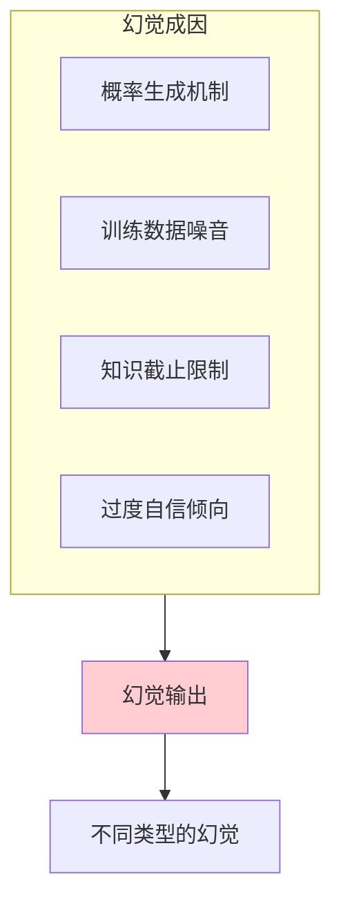
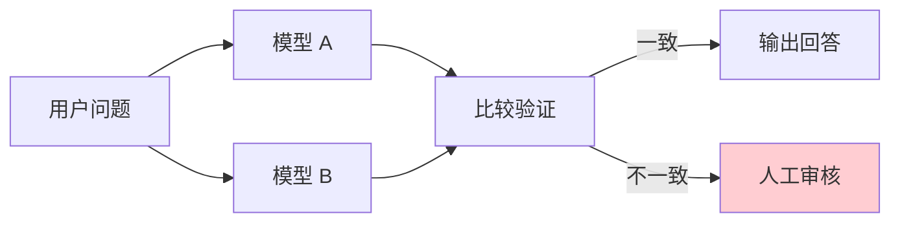

## 11.2 幻觉问题与事实性保障

幻觉（Hallucination）是指模型生成看似合理但实际错误或虚构的信息。这是大语言模型最具挑战性的问题之一，严重影响 AI 应用的可信度。本节深入探讨幻觉的成因、类型、检测方法和缓解策略。

### 11.2.1 理解幻觉的本质

#### 为什么大语言模型会产生幻觉

幻觉的根源在于大语言模型的工作机制：

1. **概率生成本质**：模型基于概率分布生成文本，并不真正"理解"事实
2. **训练数据局限**：训练数据可能包含错误、过时或矛盾的信息
3. **知识截止时间**：模型知识停留在训练时，无法获取最新信息
4. **过度自信倾向**：模型倾向于生成流畅、自信的回答，即使信息不确定



*图 11.2-1：幻觉的主要成因*

### 11.2.2 幻觉的类型

#### 1. 事实性幻觉（Factual Hallucination）

生成与客观事实不符的信息：

```
❌ 幻觉示例：
"爱因斯坦于 1921 年获得诺贝尔物理学奖，获奖原因是相对论。"

✓ 事实：
爱因斯坦确实于 1921 年获得诺贝尔物理学奖，但获奖原因是
光电效应的解释，而非相对论。
```

**常见表现**：
- 错误的日期、数字、人名
- 对历史事件的错误描述
- 科学概念的误解

#### 2. 虚构性幻觉（Fabrication）

凭空捏造不存在的内容：

```
❌ 幻觉示例：
"根据《自然》杂志 2024 年发表的研究，Smith 等人发现..."

问题：
这篇论文可能根本不存在，作者、期刊、内容都是虚构的。
```

**常见表现**：
- 虚构的学术引用
- 不存在的法律条款
- 编造的产品特性

#### 3. 逻辑幻觉（Logical Hallucination）

推理过程存在逻辑错误：

```
❌ 幻觉示例：
"因为 A > B，B > C，所以 C > A"

问题：
推理结论与前提矛盾。
```

**常见表现**：
- 前后矛盾的陈述
- 错误的因果推断
- 数学计算错误

#### 4. 语境幻觉（Contextual Hallucination）

忽略或曲解提供的上下文：

```
用户："根据下面这篇公司年报，2024 年的利润是多少？"
[年报显示利润为 500 万]

❌ 幻觉回答：
"根据公司年报，2024 年利润为 800 万元，同比增长 20%。"

问题：
模型编造了数据，而非从提供的文档中提取。
```

### 11.2.3 幻觉的严重程度评估

| 严重程度 | 描述 | 示例场景 |
|---------|------|---------|
| **低** | 无关紧要的细节错误 | 文章润色中的轻微措辞问题 |
| **中** | 可能误导但可验证 | 产品描述中的参数小错误 |
| **高** | 可能造成实际损害 | 医疗建议、法律条款错误 |
| **严重** | 涉及安全或合规风险 | 关键决策依据的虚假信息 |

### 11.2.4 检测幻觉的方法

#### 方法一：自我一致性检验

让模型多次回答同一问题，检查答案的一致性：

```python
def check_consistency(prompt, n_samples=5):
    responses = [call_llm(prompt) for _ in range(n_samples)]
    
    # 比较关键信息是否一致
    key_facts = [extract_key_facts(r) for r in responses]
    consistency_score = calculate_overlap(key_facts)
    
    return {
        "responses": responses,
        "consistency": consistency_score,
        "is_reliable": consistency_score > 0.8
    }
```

#### 方法二：LLM-as-Fact-Checker

使用另一个模型实例进行事实核查：

```xml
<task>
请核查以下回答的事实准确性：
</task>

<response_to_check>
{response}
</response_to_check>

<instructions>
1. 识别回答中的所有事实性断言
2. 对每个断言评估：
   - 是否可验证
   - 是否与你的知识一致
   - 置信度（高/中/低/无法判断）
3. 标注可能存在问题的部分
</instructions>

<output_format>
{
  "claims": [
    {"claim": "...", "verifiable": true/false, "confidence": "...", "issue": "..."}
  ],
  "overall_reliability": "...",
  "recommendations": [...]
}
</output_format>
```

#### 方法三：外部知识验证

结合 RAG 或搜索工具验证关键信息：

```python
def verify_with_external_sources(response):
    # 提取关键断言
    claims = extract_claims(response)
    
    results = []
    for claim in claims:
        # 搜索相关信息
        search_results = web_search(claim)
        
        # 比对验证
        verification = compare_with_sources(claim, search_results)
        results.append(verification)
    
    return results
```

### 11.2.5 减少幻觉的策略

#### 策略一：提示词层面的约束

**明确要求事实性**：

```xml
<instructions>
回答要求：
1. 只使用提供的参考资料中的信息
2. 对于不在资料中的问题，明确回答"根据提供的资料无法确定"
3. 不要推测或补充资料中没有的信息
4. 引用信息时标注来源位置
</instructions>
```

**强制承认不确定性**：

```
当你不确定某个信息时，请使用以下表述：
- "根据我的知识，这可能是..."
- "我无法确认这一点，建议查阅..."
- "这超出了我的可靠知识范围"

禁止使用的表述：
- 在不确定时说"是的，确实如此"
- 编造引用或来源
- 猜测具体的数字或日期
```

#### 策略二：系统架构层面

**RAG（检索增强生成）**：

```
外部知识源 → 检索相关文档 → 注入上下文 → 生成回答
```

优势：
- 提供最新、可验证的信息
- 回答可追溯到具体来源
- 减少模型"编造"的空间

**多模型验证**：



*图 11.2-2：多模型交叉验证架构*

#### 策略三：输出后处理

**置信度标注**：

```python
def add_confidence_markers(response):
    """为回答中的断言添加置信度标记"""
    
    high_confidence = ["根据提供的资料", "可以确认"]
    medium_confidence = ["可能", "通常情况下"]
    low_confidence = ["据推测", "无法确定但"]
    
    # 分析并标注
    return annotated_response
```

**事实核查流程**：

```
生成回答 → 提取关键断言 → 核查每个断言 → 标注或修正 → 输出
```

### 11.2.6 不同场景的幻觉风险管理

| 应用场景 | 风险等级 | 推荐策略 |
|---------|---------|---------|
| 创意写作 | 低 | 允许一定自由度 |
| 信息摘要 | 中 | RAG + 来源标注 |
| 客户服务 | 中高 | 知识库约束 + 人工兜底 |
| 医疗/法律建议 | 高 | 多重验证 + 人工复核 + 免责声明 |
| 金融决策 | 高 | 严格事实验证 + 审计追踪 |

### 11.2.7 实战案例：构建抗幻觉的问答系统

```xml
<system>
你是一个严谨的知识助手。遵循以下规则：

1. 信息来源规则：
   - 优先使用 <documents> 中的内容
   - 标注每个关键信息的来源段落编号
   - 无法从文档中找到时，明确说明

2. 不确定性处理：
   - 对于模糊或矛盾的信息，列出不同观点
   - 使用"根据文档第X段..."等引用格式
   - 区分"文档明确指出"和"可能推断"

3. 禁止事项：
   - 不要编造文档中没有的数据或引用
   - 不要过度解读或推测
   - 不要在缺乏依据时给出确定性表述
</system>

<documents>
{retrieved_documents}
</documents>

<user_query>
{question}
</user_query>
```


### 思考

1. 设计一个**验证提示词**（Verification Prompt），专门用于检查模型上一次输出是否存在事实性错误。
2. 在您的业务中，如果模型产生了幻觉，哪个环节（Input/Process/Output）是实施拦截的最后一道防线？
