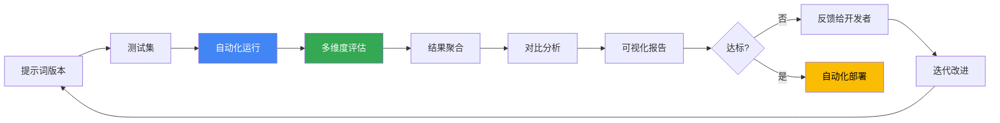

## 12.3.1 评估工具与平台详解

### 12.3.1.1 为什么需要专门的评估工具

手动评估提示词的问题：

```text
问题 1：评估成本高
- 每个版本需要手工运行测试用例
- 多个评估维度需要逐一检查
- 难以进行大规模数据集上的评估

问题 2：不够一致
- 人工评分存在主观偏差
- 不同时间的评分标准可能漂移
- 很难复现和追踪历史评估

问题 3：无法持续监控
- 只能在发布前评估，无法持续跟踪
- 难以及时发现生产环境中的性能退化
```

专门的评估工具提供的能力：

- 自动化运行大规模测试集
- 一致性的评估标准与结果存储
- 与 CI/CD 流程集成
- 多维度指标的可视化展示
- 版本对比与回归检测

### 12.3.1.2 开源评估框架对比

#### Promptfoo

**简介**：Promptfoo 是最受欢迎的开源提示词评估框架，提供了从定义测试集到可视化报告的完整工作流。

**核心特性**：

```text
✓ 支持多个 LLM 提供商（OpenAI、Anthropic、Ollama 等）
✓ 声明式的 YAML 配置，易于版本管理
✓ Web UI 对比不同提示词版本的输出
✓ 内置多种评估函数（BLEU、ROUGE、相似度等）
✓ 支持自定义评估脚本
✓ 结果导出为 JSON、CSV 等多种格式
```

**安装与基本使用**：

```bash

# 安装

npm install -g promptfoo

# 初始化项目

promptfoo init

# 运行评估

promptfoo eval

# 启动 Web UI 查看结果

promptfoo view
```

**配置示例（promptfooconfig.yaml）**：

```yaml

# 定义提示词

prompts:
  - id: "v1_basic"
    raw: |
      请总结以下文本，输出 3-5 个要点。

      文本：{text}

  - id: "v2_structured"
    raw: |
      请总结以下文本。要求：
      - 输出 3-5 个要点
      - 使用简明扼要的语言
      - 按重要性排序

      文本：{text}

# 定义模型

providers:
  - id: "openai:gpt-5.4-mini"
  - id: "anthropic:claude-sonnet-4-6"

# 定义测试用例

tests:
  - vars:
      text: "人工智能正在改变世界。从医疗诊断到自动驾驶，AI 的应用越来越广泛。同时，我们也需要关注 AI 带来的伦理问题，如偏见和隐私保护。"

    # 定义评估方法
    assert:
      - type: "equals"
        value: "包含 AI 应用"
      - type: "contains-json"
      - type: "llm-rubric"
        rubric: "输出是否有逻辑问题或遗漏重点？"
        threshold: 0.8

  - vars:
      text: "这是另一个测试样本..."
    assert:
      - type: "javascript"
        script: |
          // 自定义评估逻辑
          const output = context.vars.output;
          return output.split('\n').length >= 3;

# 评估时的参数

defaultTest:
  options:
    temperature: 0.5
    max_tokens: 200
```

**输出示例**：

```text
Evaluated 2 prompts against 5 test cases

┌──────────────────────────────────┬───────────┬─────────────┐
│ Prompt                           │ Passed    │ Avg Score   │
├──────────────────────────────────┼───────────┼─────────────┤
│ v1_basic                         │ 4/5 (80%)│ 7.2/10      │
│ v2_structured                    │ 5/5 (100%)│ 8.5/10      │
└──────────────────────────────────┴───────────┴─────────────┘

v2_structured 在 3 个用例上表现更优
```

**最佳实践**：

```text
1. 将 promptfoo 配置纳入版本控制
2. 定期更新测试用例，保持覆盖面
3. 使用 CI/CD 集成，每次提交自动运行评估
4. 保留历史数据用于趋势分析
5. 对于主观任务，定期与人工评估对齐
```

#### DeepEval

**简介**：DeepEval 是一个专注于 LLM 应用质量评估的 Python 框架，强调与现代 ML 工作流的集成。

**核心特性**：

```text
✓ 基于 pytest 框架，易于集成测试流程
✓ 预定义的评估指标（准确性、相关性、幻觉等）
✓ 支持自定义评估标准和权重
✓ 与 Weights & Biases、MLflow 等工具集成
✓ 详细的评估报告与可视化
```

**安装与基本使用**：

```bash
pip install deepeval

# 运行评估

pytest test_my_prompts.py
```

**代码示例**：

```python
from deepeval import evaluate
from deepeval.metrics import AnswerRelevancyMetric
from deepeval.test_case import LLMTestCase

# 定义测试用例

test_cases = [
    LLMTestCase(
        input="什么是机器学习？",
        actual_output="机器学习是人工智能的一个分支，允许系统从数据中学习。",
        expected_output="机器学习是人工智能的一个分支，允许系统从数据中学习。"
    ),
    LLMTestCase(
        input="解释神经网络如何工作",
        actual_output="神经网络由相互连接的节点组成，模仿生物神经处理信息。",
        expected_output="神经网络由相互连接的节点组成，模仿生物神经..."
    )
]

# 定义评估指标

answer_relevancy_metric = AnswerRelevancyMetric(
    threshold=0.8,
    model="gpt-5.4-mini",
    include_reason=True
)

# 评估

results = evaluate(
    test_cases=test_cases,
    metrics=[answer_relevancy_metric]
)

# 分析结果

print(results)
```

**内置评估指标详解**：

| 指标 | 说明 | 使用场景 |
|------|------|---------|
| AnswerRelevancyMetric | 评估回答是否切中用户问题 | 问答、客服、助手回复 |
| FaithfulnessMetric | 评估回答是否忠于给定上下文 | RAG、知识库问答 |
| HallucinationMetric | 检查是否包含不受上下文支持的内容 | 需要事实准确的应用 |
| ToxicityMetric | 检查有害内容 | 所有面向用户的应用 |
| BiasMetric | 检查是否存在偏见 | 敏感领域（法律、医疗等） |
| SummarizationMetric | 评估摘要质量 | 文本摘要任务 |

#### Braintrust

**简介**：Braintrust 是一个企业级的 LLM 应用评估和监控平台，提供可视化界面和集成的工作流。

**核心特性**：

```text
✓ 无需代码的评估定义与设计
✓ 原生支持多个 LLM 提供商
✓ 自动进行 A/B 对比统计显著性检验
✓ 生产环境监控与告警
✓ 团队协作与权限管理
```

**工作流**：

```text
1. 定义评估维度和标准
2. 创建测试数据集
3. 运行批量评估
4. 查看对比结果和统计分析
5. 配置监控规则
6. 将最佳版本发布到生产
```

### 12.3.1.3 自动化评估流程的设计

#### 完整的评估流水线架构



#### Python 实现框架

```python
from typing import List, Dict
from dataclasses import dataclass
from enum import Enum
import json

class EvaluationStatus(Enum):
    """评估状态"""
    PENDING = "pending"
    RUNNING = "running"
    COMPLETED = "completed"
    FAILED = "failed"

@dataclass
class EvaluationConfig:
    """评估配置"""
    prompt_version: str
    test_set_path: str
    metrics: List[str]
    min_pass_rate: float = 0.8
    min_quality_score: float = 7.0
    model: str = "gpt-5.4-mini"
    temperature: float = 0.7
    timeout_seconds: int = 300

class PromptEvaluationPipeline:
    """提示词评估流水线"""

    def __init__(self, llm_client, storage_client):
        self.llm = llm_client
        self.storage = storage_client
        self.history = []

    def run_evaluation(self, config: EvaluationConfig) -> Dict:
        """运行完整评估"""

        # 1. 加载测试集
        test_cases = self._load_test_set(config.test_set_path)

        # 2. 读取提示词
        prompt_template = self._load_prompt(config.prompt_version)

        # 3. 批量运行测试
        outputs = self._batch_generate(prompt_template, test_cases, config)

        # 4. 评估输出
        metric_results = self._evaluate_outputs(
            outputs,
            test_cases,
            config.metrics
        )

        # 5. 聚合结果
        report = self._aggregate_results(metric_results, config)

        # 6. 持久化结果
        self._save_results(config.prompt_version, report)

        return report

    def _batch_generate(self, prompt_template: str, test_cases: List,
                       config: EvaluationConfig) -> List[str]:
        """批量生成模型输出"""
        outputs = []

        for case in test_cases:
            try:
                # 格式化提示词
                formatted_prompt = prompt_template.format(**case)

                # 调用模型
                response = self.llm.generate(
                    prompt=formatted_prompt,
                    temperature=config.temperature,
                    max_tokens=config.max_tokens
                )

                outputs.append(response)

            except Exception as e:
                print(f"Error processing case {case['id']}: {e}")
                outputs.append(None)

        return outputs

    def _evaluate_outputs(self, outputs: List[str], test_cases: List,
                         metrics: List[str]) -> Dict:
        """评估输出"""
        results = {metric: [] for metric in metrics}

        for output, case in zip(outputs, test_cases):
            if output is None:
                continue

            for metric in metrics:
                if metric == "accuracy":
                    score = self._metric_accuracy(output, case["expected"])
                elif metric == "relevance":
                    score = self._metric_relevance(output, case["input"])
                elif metric == "consistency":
                    score = self._metric_consistency(output)
                elif metric == "safety":
                    score = self._metric_safety(output)
                else:
                    score = 0.0

                results[metric].append(score)

        return results

    def _aggregate_results(self, metric_results: Dict,
                          config: EvaluationConfig) -> Dict:
        """聚合评估结果"""

        import numpy as np

        aggregated = {}
        for metric, scores in metric_results.items():
            aggregated[metric] = {
                "mean": np.mean(scores),
                "std": np.std(scores),
                "min": np.min(scores),
                "max": np.max(scores)
            }

        # 计算是否通过
        pass_rate = np.mean([
            1 if s >= config.min_quality_score else 0
            for scores in metric_results.values()
            for s in scores
        ])

        return {
            "config": config.__dict__,
            "metrics": aggregated,
            "pass_rate": pass_rate,
            "passed": pass_rate >= config.min_pass_rate,
            "timestamp": self._get_timestamp()
        }

    def _save_results(self, version: str, report: Dict):
        """保存评估结果"""
        self.storage.save(
            f"evaluations/{version}/{self._get_timestamp()}.json",
            json.dumps(report, indent=2)
        )
        self.history.append(report)

    # 评估指标实现方法
    def _metric_accuracy(self, output: str, expected: str) -> float:
        """准确性评估"""
        # 实现准确性计算逻辑
        pass

    def _metric_relevance(self, output: str, input_text: str) -> float:
        """相关性评估"""
        # 实现相关性计算逻辑
        pass

    def _metric_consistency(self, output: str) -> float:
        """一致性评估"""
        # 实现一致性计算逻辑
        pass

    def _metric_safety(self, output: str) -> float:
        """安全性评估"""
        # 实现安全性计算逻辑
        pass

    def _get_timestamp(self) -> str:
        from datetime import datetime
        return datetime.now().isoformat()

# 使用示例

config = EvaluationConfig(
    prompt_version="v2.3",
    test_set_path="test_cases.json",
    metrics=["accuracy", "relevance", "consistency", "safety"],
    min_pass_rate=0.85,
    model="gpt-5.4-mini"
)

# 实例化评估管道

pipeline = PromptEvaluationPipeline(llm_client, storage_client)

# 运行评估

report = pipeline.run_evaluation(config)

# 输出结果

if report["passed"]:
    print("✓ 评估通过！可以发布")
else:
    print("✗ 评估失败，需要改进")
    for metric, stats in report["metrics"].items():
        print(f"{metric}: {stats['mean']:.2f} ± {stats['std']:.2f}")
```

### 12.3.1.4 回归测试防止性能退化

#### 为什么需要回归测试

```text
场景：
- 版本 v2.0 的评估得分是 0.92
- 你优化了指令用词，发布了 v2.1
- 但 v2.1 在某些边界情况上表现下降了

如果没有完整的测试集和回归测试，
这种退化可能不会被及时发现。
```

#### 回归测试实现

```python
class RegressionTestSuite:
    """回归测试套件"""

    def __init__(self, baseline_version: str):
        self.baseline = self._load_baseline(baseline_version)

    def run_regression_test(self, new_version: str,
                           test_cases: List) -> Dict:
        """对比新版本与基准版本"""

        baseline_results = self.baseline["metrics"]
        new_results = self._evaluate_version(new_version, test_cases)

        regression_report = {
            "improved": [],
            "degraded": [],
            "unchanged": [],
            "overall_change": 0.0
        }

        for metric in baseline_results:
            baseline_score = baseline_results[metric]["mean"]
            new_score = new_results[metric]["mean"]

            change = new_score - baseline_score

            if change > 0.05:  # 改进超过 5%
                regression_report["improved"].append({
                    "metric": metric,
                    "baseline": baseline_score,
                    "new": new_score,
                    "improvement": change
                })
            elif change < -0.05:  # 退化超过 5%
                regression_report["degraded"].append({
                    "metric": metric,
                    "baseline": baseline_score,
                    "new": new_score,
                    "degradation": -change
                })
            else:
                regression_report["unchanged"].append(metric)

        # 检查是否出现回归
        has_regression = len(regression_report["degraded"]) > 0

        regression_report["passed"] = not has_regression

        return regression_report

    def _load_baseline(self, version: str) -> Dict:
        """加载基准版本的评估结果"""
        # 从存储中加载
        pass

    def _evaluate_version(self, version: str, test_cases: List) -> Dict:
        """评估版本"""
        # 使用前面的评估流水线
        pass

# 在 CI/CD 中使用

def ci_check_regression(new_version: str):
    """在部署前检查回归"""

    baseline = "v2.0"  # 当前生产版本
    suite = RegressionTestSuite(baseline)

    # 加载完整测试集
    test_cases = load_full_test_set()

    report = suite.run_regression_test(new_version, test_cases)

    if not report["passed"]:
        print("❌ 检测到性能退化，阻止部署：")
        for item in report["degraded"]:
            print(f"  - {item['metric']}: "
                  f"{item['baseline']:.3f} → {item['new']:.3f} "
                  f"(-{item['degradation']:.1%})")
        return False

    print("✅ 回归测试通过，可以部署")
    return True
```

### 12.3.1.5 与 CI/CD 的集成

#### GitHub Actions 示例

```yaml

# .github/workflows/prompt-evaluation.yml

name: Prompt Evaluation & Regression Test

on:
  pull_request:
    paths:
      - 'prompts/**'
      - 'tests/**'

jobs:
  evaluate:
    runs-on: ubuntu-latest

    steps:
      - uses: actions/checkout@v3

      - name: Set up Python
        uses: actions/setup-python@v4
        with:
          python-version: '3.11'

      - name: Install dependencies
        run: |
          pip install -r requirements.txt
          pip install promptfoo deepeval

      - name: Run prompt evaluation
        env:
          OPENAI_API_KEY: ${{ secrets.OPENAI_API_KEY }}
        run: |
          python scripts/evaluate_prompts.py

      - name: Run regression tests
        run: |
          python scripts/regression_test.py

      - name: Upload evaluation results
        uses: actions/upload-artifact@v3
        with:
          name: evaluation-results
          path: results/

      - name: Comment PR with results
        uses: actions/github-script@v6
        with:
          script: |
            const fs = require('fs');
            const results = JSON.parse(
              fs.readFileSync('results/summary.json', 'utf8')
            );

            const comment = `
            ## Prompt Evaluation Results

            - **Pass Rate**: ${results.pass_rate}%
            - **Quality Score**: ${results.avg_score}/10
            - **Regression Check**: ${results.no_regression ? '✅ PASSED' : '❌ FAILED'}
            `;

            github.rest.issues.createComment({
              issue_number: context.issue.number,
              owner: context.repo.owner,
              repo: context.repo.repo,
              body: comment
            });
```

### 12.3.1.6 评估工具选型指南

| 工具 | 最佳用途 | 学习曲线 | 成本 |
|------|---------|---------|------|
| **Promptfoo** | 快速原型与本地评估 | 低 | 免费开源 |
| **DeepEval** | 深度集成到 Python 工作流 | 中 | 免费开源 |
| **Braintrust** | 企业级监控与团队协作 | 中 | 按使用付费 |
| **LangSmith** | LangChain 生态集成 | 低 | 免费+付费 |

### 实践建议

1. **快速开始**：使用 Promptfoo 建立基础评估框架，熟悉评估工作流
2. **逐步深化**：根据需求引入 DeepEval 的自定义评估指标
3. **规模化**：当团队扩大或需要生产监控时，考虑 Braintrust 等平台
4. **持续改进**：实施回归测试，防止性能退化
5. **自动化部署**：集成 CI/CD，让评估成为发布流程的一部分

### 扩展思考

1. 如果你的评估指标设计得不当，工具再强大也无用。你如何判断自己的评估指标是否真正反映了“好提示词”？
2. 评估工具如何与“人工评估”的黄金标准保持一致性？
