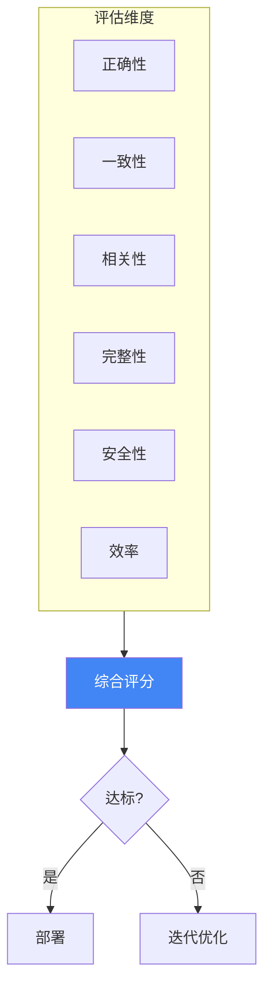
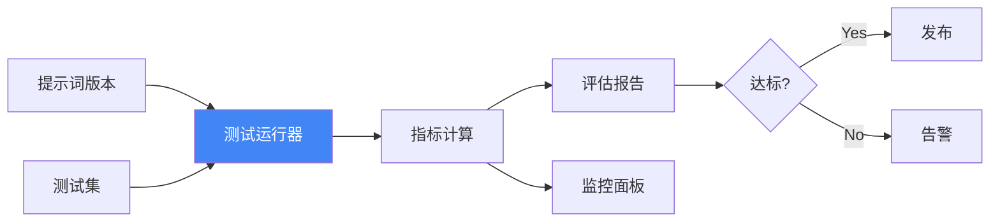

## 12.3 评估体系与质量度量

系统化的评估是提示词工程质量保障的基础。一个好的提示词不仅要能完成任务，还需要在准确性、一致性、效率等多个维度上表现出色。本节深入探讨如何建立完整的提示词评估体系。

### 12.3.1 为什么需要系统化评估

```
问题："这个提示词好不好？"

模糊的回答："感觉还不错" ❌
量化的回答："准确率 92%，一致性 0.85，平均延迟 1.2s" ✓
```

系统化评估能够：
- 量化提示词的性能表现
- 比较不同提示词版本的效果
- 识别需要改进的具体方面
- 建立持续优化的反馈循环

### 12.3.2 评估维度框架

#### 核心评估维度

| 维度 | 定义 | 代表指标 |
|------|------|----------|
| **正确性** | 输出是否符合预期 | 准确率、F1、BLEU |
| **一致性** | 多次运行是否稳定 | 方差、一致性得分 |
| **相关性** | 是否回答了问题 | 相关度评分 |
| **完整性** | 是否覆盖所有要点 | 覆盖率 |
| **安全性** | 是否存在有害内容 | 违规率 |
| **效率** | 资源消耗是否合理 | Token 数、延迟 |



*图 12.3-1：提示词评估维度框架*

### 12.3.3 评估方法详解

#### 方法一：基于标准答案的评估

适用于有明确正确答案的任务（如分类、问答）。

**实现示例**：

```python
from typing import List, Dict

def evaluate_with_ground_truth(
    prompt: str,
    test_cases: List[Dict],
    llm_client
) -> Dict:
    """基于标准答案评估提示词"""
    
    results = {
        "correct": 0,
        "total": len(test_cases),
        "details": []
    }
    
    for case in test_cases:
        # 调用模型
        output = llm_client.generate(
            prompt.format(input=case["input"])
        )
        
        # 比对答案
        is_correct = normalize(output) == normalize(case["expected"])
        
        results["details"].append({
            "input": case["input"],
            "expected": case["expected"],
            "actual": output,
            "correct": is_correct
        })
        
        if is_correct:
            results["correct"] += 1
    
    results["accuracy"] = results["correct"] / results["total"]
    return results
```

**常用指标**：

| 指标 | 适用场景 | 计算方式 |
|------|---------|---------|
| 准确率 | 分类任务 | 正确数 / 总数 |
| 精确率 | 正类重要时 | TP / (TP + FP) |
| 召回率 | 漏检代价高时 | TP / (TP + FN) |
| F1 分数 | 平衡场景 | 2 × P × R / (P + R) |
| BLEU | 文本生成 | n-gram 匹配度 |
| ROUGE | 摘要任务 | 与参考摘要重叠度 |

#### 方法二：LLM-as-Judge 评估

使用大模型作为评判者，适用于无标准答案的开放式任务。

**评估提示词模板**：

```xml
<task>
请作为专业评估员，对以下 AI 回答进行评分。
</task>

<question>
{original_question}
</question>

<answer_to_evaluate>
{model_response}
</answer_to_evaluate>

<evaluation_criteria>
请从以下维度进行 1-10 分评估：

1. **准确性**：信息是否正确？
2. **完整性**：是否全面回答了问题？
3. **清晰度**：表达是否清楚易懂？
4. **有用性**：回答对用户是否有帮助？
5. **简洁性**：是否没有多余信息？
</evaluation_criteria>

<output_format>
{
  "scores": {
    "accuracy": <1-10>,
    "completeness": <1-10>,
    "clarity": <1-10>,
    "helpfulness": <1-10>,
    "conciseness": <1-10>
  },
  "overall": <1-10>,
  "reasoning": "评分理由..."
}
</output_format>
```

**LLM-as-Judge 的最佳实践**：

```
1. 使用强大的模型作为评判者（如 GPT-4、Claude Opus）
2. 提供清晰的评估标准和示例
3. 对于主观任务，使用多个评判者取平均
4. 定期检验评判者与人工评估的一致性
```

**减少 Judge 偏差**：

```python
def reduce_judge_bias(question, response, judge_model):
    """使用位置交换和多次采样减少偏差"""
    
    scores = []
    
    # 多次采样
    for _ in range(3):
        score = judge_model.evaluate(question, response)
        scores.append(score)
    
    # 返回中位数
    return {
        "median_score": np.median(scores),
        "variance": np.var(scores)
    }
```

#### 方法三：A/B 对比评估

比较两个提示词版本的相对效果。

**实现流程**：

```python
def ab_comparison(prompt_a: str, prompt_b: str, test_cases: List) -> Dict:
    """A/B 对比评估"""
    
    results = {"a_wins": 0, "b_wins": 0, "ties": 0}
    
    for case in test_cases:
        output_a = llm.generate(prompt_a.format(**case))
        output_b = llm.generate(prompt_b.format(**case))
        
        # 使用 LLM-as-Judge 进行对比
        comparison = judge_llm.compare(
            question=case["question"],
            response_a=output_a,
            response_b=output_b
        )
        
        if comparison["winner"] == "A":
            results["a_wins"] += 1
        elif comparison["winner"] == "B":
            results["b_wins"] += 1
        else:
            results["ties"] += 1
    
    return results
```

**对比评估提示词**：

```xml
<task>
比较以下两个回答，判断哪个更好。
</task>

<question>{question}</question>

<response_a>
{response_a}
</response_a>

<response_b>
{response_b}
</response_b>

<instructions>
1. 仔细比较两个回答的质量
2. 考虑准确性、完整性、清晰度
3. 选择更好的一个，或判定为平局
4. 解释选择理由
</instructions>

<output_format>
{
  "winner": "A" | "B" | "Tie",
  "reasoning": "..."
}
</output_format>
```

#### 方法四：一致性评估

评估同一提示词多次运行结果的稳定性。

```python
def consistency_evaluation(
    prompt: str,
    test_input: str,
    n_runs: int = 10,
    temperature: float = 0.7
) -> Dict:
    """评估输出一致性"""
    
    outputs = []
    for _ in range(n_runs):
        output = llm.generate(prompt.format(input=test_input))
        outputs.append(output)
    
    # 计算语义相似度矩阵
    embeddings = [get_embedding(o) for o in outputs]
    similarities = cosine_similarity(embeddings)
    
    return {
        "mean_similarity": np.mean(similarities),
        "min_similarity": np.min(similarities),
        "outputs": outputs
    }
```

### 12.3.4 构建评估测试集

#### 测试集设计原则

```
1. 代表性：覆盖真实使用场景的各种情况
2. 多样性：包含简单、中等、困难的案例
3. 边界覆盖：包含边界情况和异常输入
4. 平衡性：各类别案例数量适当
```

#### 测试集结构示例

```python
test_suite = {
    "metadata": {
        "name": "客服问答评估集",
        "version": "1.2",
        "created_at": "2026-01-14"
    },
    "test_cases": [
        # 基础案例
        {
            "id": "basic_001",
            "category": "product_inquiry",
            "difficulty": "easy",
            "input": "这款手机支持 5G 吗？",
            "expected": {"answer_contains": ["支持", "5G"]},
            "tags": ["product", "specification"]
        },
        # 边界案例
        {
            "id": "edge_001",
            "category": "out_of_scope",
            "difficulty": "hard",
            "input": "你觉得人生的意义是什么？",
            "expected": {"should_redirect": True},
            "tags": ["off-topic", "boundary"]
        }
    ]
}
```

### 12.3.5 自动化评估流水线



*图 12.3-2：自动化评估流水线*

**流水线代码框架**：

```python
class PromptEvaluationPipeline:
    def __init__(self, llm_client, judge_client):
        self.llm = llm_client
        self.judge = judge_client
    
    def run_evaluation(
        self,
        prompt: str,
        test_suite: Dict,
        config: EvalConfig
    ) -> EvaluationReport:
        """运行完整的评估流程"""
        
        results = []
        
        for case in test_suite["test_cases"]:
            # 1. 生成输出
            output = self.llm.generate(prompt.format(**case))
            
            # 2. 多维度评估
            scores = self.judge.evaluate(
                question=case["input"],
                response=output,
                criteria=config.criteria
            )
            
            # 3. 记录结果
            results.append({
                "case_id": case["id"],
                "output": output,
                "scores": scores
            })
        
        # 4. 汇总统计
        return self.aggregate_results(results)
```

### 12.3.6 监控与持续评估

#### 生产环境监控

```python
# 生产环境输出采样评估
def production_sampling_eval(
    output_log: List[Dict],
    sample_rate: float = 0.01
) -> Dict:
    """对生产输出进行抽样评估"""
    
    sample = random.sample(
        output_log, 
        int(len(output_log) * sample_rate)
    )
    
    scores = []
    for record in sample:
        score = judge_llm.evaluate(
            record["input"], 
            record["output"]
        )
        scores.append(score)
    
    return {
        "sample_size": len(sample),
        "avg_score": np.mean(scores),
        "score_distribution": get_distribution(scores)
    }
```

#### 评估仪表板指标

| 指标 | 计算周期 | 告警阈值 |
|------|---------|---------|
| 平均质量分 | 每小时 | < 7.0 |
| 一致性得分 | 每日 | < 0.8 |
| 安全违规率 | 实时 | > 0.1% |
| 平均 Token 数 | 每小时 | > 预期 150% |
| P95 延迟 | 每分钟 | > 3s |

### 12.3.7 评估最佳实践

#### Do's ✓

- 建立代表性、多样化的测试集
- 多维度综合评估，不只看单一指标
- 自动化评估流程，集成到 CI/CD
- 定期回顾和更新测试集
- 保留评估历史，跟踪趋势变化

#### Don'ts ✗

- 仅依赖主观判断评价提示词质量
- 测试集过小或覆盖面不足
- 只在开发阶段评估，忽视生产监控
- 忽视边界情况和异常输入
- 评估标准不一致，难以比较版本


### 延伸思考

1. "用 LLM 评估 LLM 的输出"是否可靠？这种评估本身会有什么偏差？你会如何校准？
2. 对于你的业务场景，"准确性"和"用户满意度"哪个更重要？如何设计评估指标来反映这一优先级？
