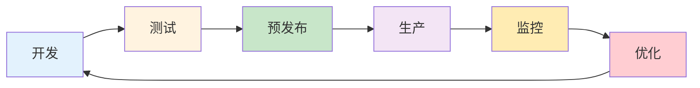

## 12.4 PromptOps：提示词运维实践

随着企业 AI 应用的规模化，提示词管理面临与传统软件相似的运维挑战：如何保证稳定性、如何安全发布、如何持续优化。PromptOps 借鉴 DevOps 理念，将软件工程最佳实践引入提示词生命周期管理，形成系统化的运维方法论。

### 12.4.1 PromptOps 的核心理念

#### 从 DevOps 到 PromptOps

| DevOps 实践 | PromptOps 对应 |
|------------|---------------|
| 代码版本控制 | 提示词版本管理 |
| CI/CD 流水线 | 提示词测试与发布流水线 |
| 监控告警 | 输出质量与性能监控 |
| 灰度发布 | 提示词灰度切换 |
| A/B 测试 | 提示词效果对比 |
| 回滚机制 | 快速切回历史版本 |

#### 提示词生命周期



*图 12.4-1：提示词生命周期*

### 12.4.2 版本控制最佳实践

#### 目录结构

建立规范的提示词仓库结构：

```
prompts/
├── production/               # 生产环境（软链接指向具体版本）
│   ├── customer_service.yaml → ../versions/customer_service/v2.1.0.yaml
│   └── content_moderation.yaml → ../versions/content_moderation/v1.3.0.yaml
│
├── versions/                 # 历史版本
│   ├── customer_service/
│   │   ├── v1.0.0.yaml
│   │   ├── v2.0.0.yaml
│   │   └── v2.1.0.yaml
│   └── content_moderation/
│       ├── v1.0.0.yaml
│       └── v1.3.0.yaml
│
├── development/              # 开发中版本
│   └── customer_service_v3.yaml
│
└── tests/                    # 测试用例
    ├── customer_service/
    │   └── test_cases.yaml
    └── content_moderation/
        └── test_cases.yaml
```

#### 版本命名规范

采用语义化版本号（Semantic Versioning）：

```
MAJOR.MINOR.PATCH

MAJOR: 不兼容的重大变更（如输出格式改变）
MINOR: 向后兼容的功能改进（如新增处理能力）
PATCH: 向后兼容的问题修复（如措辞优化）
```

#### 提示词配置文件格式

```yaml
# customer_service_v2.1.0.yaml
metadata:
  name: customer_service
  version: 2.1.0
  description: 客服对话提示词
  author: prompt_team
  created_at: 2025-01-10
  last_updated: 2025-01-14
  model_compatibility:
    - gpt-4-turbo
    - claude-3-sonnet
  
config:
  model: gpt-4-turbo
  temperature: 0.3
  max_tokens: 1000
  
prompts:
  system: |
    你是[公司名称]的智能客服助手。
    
    核心职责：
    1. 回答产品和服务相关问题
    2. 处理订单查询和退换货
    3. 收集用户反馈
    
    行为准则：
    - 保持专业、友好的语气
    - 如遇无法处理的问题，引导用户联系人工客服
    - 不透露内部流程和系统信息
    
  user_template: |
    用户历史：{user_history}
    当前问题：{user_message}
    
tags:
  - customer_service
  - production
  
changelog:
  - version: 2.1.0
    date: 2025-01-14
    changes:
      - 优化了退换货流程引导
      - 增加了情感识别响应
  - version: 2.0.0
    date: 2025-01-01
    changes:
      - 重构提示词结构
      - 采用 XML 标签分隔
```

### 12.4.3 环境管理

#### 多环境配置

```yaml
# environments.yaml
environments:
  development:
    description: 开发环境，快速迭代
    model: gpt-3.5-turbo  # 降低成本
    rate_limit: 100/min
    logging: verbose
    
  staging:
    description: 预发布环境，全面测试
    model: gpt-4-turbo
    rate_limit: 500/min
    logging: standard
    
  production:
    description: 生产环境，稳定运行
    model: gpt-4-turbo
    rate_limit: 1000/min
    logging: minimal
    fallback_model: gpt-3.5-turbo
```

#### 环境切换

```python
class PromptManager:
    def __init__(self, environment="development"):
        self.env = environment
        self.config = load_env_config(environment)
        
    def get_prompt(self, prompt_name):
        if self.env == "production":
            return load_prompt(f"production/{prompt_name}.yaml")
        elif self.env == "staging":
            return load_prompt(f"staging/{prompt_name}.yaml")
        else:
            return load_prompt(f"development/{prompt_name}.yaml")
            
    def deploy_to_staging(self, prompt_name, version):
        """将指定版本部署到预发布环境"""
        source = f"versions/{prompt_name}/{version}.yaml"
        target = f"staging/{prompt_name}.yaml"
        symlink(source, target)
        
    def deploy_to_production(self, prompt_name, from_staging=True):
        """将预发布版本提升到生产环境"""
        if from_staging:
            source = f"staging/{prompt_name}.yaml"
        target = f"production/{prompt_name}.yaml"
        symlink(source, target)
        log_deployment(prompt_name, self.get_version(source))
```

### 12.4.4 监控与告警

#### 核心监控指标

```yaml
# monitoring_config.yaml
metrics:
  performance:
    - name: response_latency_p50
      description: 响应延迟中位数
      threshold: 2000ms
      
    - name: response_latency_p99
      description: 响应延迟99分位
      threshold: 5000ms
      
  quality:
    - name: user_satisfaction_rate
      description: 用户满意度评分
      threshold: 4.0/5.0
      
    - name: escalation_rate
      description: 转人工率
      threshold: 15%
      
    - name: rejection_rate
      description: 安全拒绝率
      threshold: 5%
      
  cost:
    - name: tokens_per_conversation
      description: 每次对话token消耗
      threshold: 2000
      
    - name: daily_cost
      description: 日成本
      threshold: $500
      
alerts:
  - condition: response_latency_p99 > 5000ms for 5min
    severity: warning
    notify: [slack_channel]
    
  - condition: rejection_rate > 10% for 10min
    severity: critical
    notify: [slack_channel, pagerduty]
    
  - condition: daily_cost > $1000
    severity: warning
    notify: [email_team, slack_channel]
```

#### 监控仪表盘

关键仪表盘应包含：

```
┌─────────────────────────────────────────────────────────────┐
│                    PromptOps Dashboard                       │
├─────────────────┬─────────────────┬─────────────────────────┤
│  响应延迟 (P50) │  成功率         │  日成本                  │
│    1.2s         │   98.5%        │   $423                  │
│  ▲ +5%          │   ▼ -0.2%      │   ▲ +12%                │
├─────────────────┴─────────────────┴─────────────────────────┤
│                    实时请求趋势                              │
│  ████████████████████▓▓▓▓░░░░░░                            │
│  0h            12h            24h                           │
├─────────────────────────────────────────────────────────────┤
│  活跃版本        │  最近告警                                │
│  ─────────────   │  ─────────────────────────────           │
│  customer_svc    │  [WARN] latency_spike - 10:23            │
│    v2.1.0        │  [INFO] version_deployed - 09:15         │
│  content_mod     │                                          │
│    v1.3.0        │                                          │
└─────────────────────────────────────────────────────────────┘
```

### 12.4.5 灰度发布策略

#### 流量切换

```python
class GradualRollout:
    def __init__(self, old_version, new_version):
        self.old_version = old_version
        self.new_version = new_version
        self.new_version_percentage = 0
        
    def get_prompt(self, request_id):
        """根据流量百分比返回对应版本"""
        if hash(request_id) % 100 < self.new_version_percentage:
            return self.new_version
        return self.old_version
        
    def increase_traffic(self, percentage):
        """增加新版本流量占比"""
        self.new_version_percentage = min(100, self.new_version_percentage + percentage)
        log(f"New version traffic: {self.new_version_percentage}%")
        
    def rollback(self):
        """回滚到旧版本"""
        self.new_version_percentage = 0
        log("Rolled back to old version")
```

#### 灰度发布流程

```
阶段1: 1% 流量 (金丝雀)
  ↓ 监控1小时，确认无异常
阶段2: 10% 流量
  ↓ 监控4小时，对比新旧版本指标
阶段3: 50% 流量
  ↓ 监控24小时，收集用户反馈
阶段4: 100% 流量
  ↓ 持续监控，准备快速回滚
```

#### 自动化决策

```python
def auto_rollout_decision(metrics, thresholds):
    """基于指标自动决策是否继续灰度"""
    if metrics.error_rate > thresholds.error_rate_max:
        return "ROLLBACK", "Error rate exceeded threshold"
        
    if metrics.latency_p99 > thresholds.latency_max:
        return "ROLLBACK", "Latency exceeded threshold"
        
    if metrics.user_satisfaction < thresholds.satisfaction_min:
        return "HOLD", "User satisfaction below threshold"
        
    if metrics.sample_size < thresholds.min_samples:
        return "HOLD", "Insufficient sample size"
        
    return "PROCEED", "All metrics within acceptable range"
```

### 12.4.6 回滚机制

```python
class RollbackManager:
    def __init__(self):
        self.deployment_history = []
        
    def deploy(self, prompt_name, version):
        """部署新版本并记录历史"""
        previous = get_current_version(prompt_name)
        self.deployment_history.append({
            "prompt": prompt_name,
            "from_version": previous,
            "to_version": version,
            "timestamp": now(),
            "deployed_by": current_user()
        })
        set_production_version(prompt_name, version)
        
    def rollback(self, prompt_name, steps=1):
        """回滚到之前的版本"""
        history = [h for h in self.deployment_history if h["prompt"] == prompt_name]
        if len(history) < steps:
            raise Error("Insufficient history for rollback")
            
        target = history[-steps]["from_version"]
        set_production_version(prompt_name, target)
        log(f"Rolled back {prompt_name} to {target}")
        
    def emergency_rollback(self, prompt_name):
        """紧急回滚到最后已知稳定版本"""
        stable = get_last_stable_version(prompt_name)
        set_production_version(prompt_name, stable)
        notify_team(f"Emergency rollback: {prompt_name} -> {stable}")
```

### 12.4.7 小结

PromptOps 将 DevOps 的成熟实践引入提示词管理，形成从开发、测试、部署到监控的完整运维体系。核心实践包括：规范化的版本控制结构和语义化版本号、多环境管理和配置隔离、全面的监控指标和告警机制、渐进式的灰度发布策略、以及可靠的回滚机制。通过系统化的 PromptOps 实践，企业可以在保证稳定性的同时持续优化 AI 应用的效果。

### 12.4.8 延伸阅读

- [Google SRE Book](https://sre.google/sre-book/table-of-contents/) - Site Reliability Engineering 经典
- [The DevOps Handbook](https://itrevolution.com/the-devops-handbook/) - DevOps 最佳实践
- [PromptLayer](https://promptlayer.com/) - 提示词版本管理平台
- [LangSmith](https://smith.langchain.com/) - LangChain 的运维与监控平台
