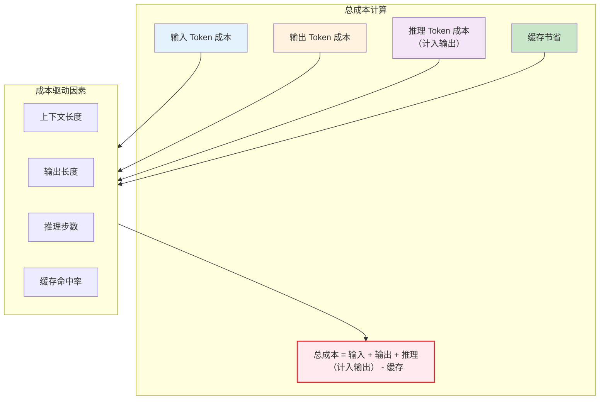
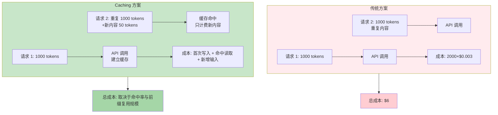
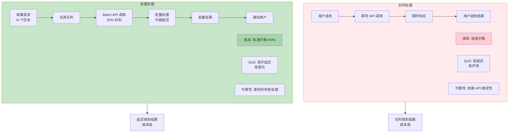
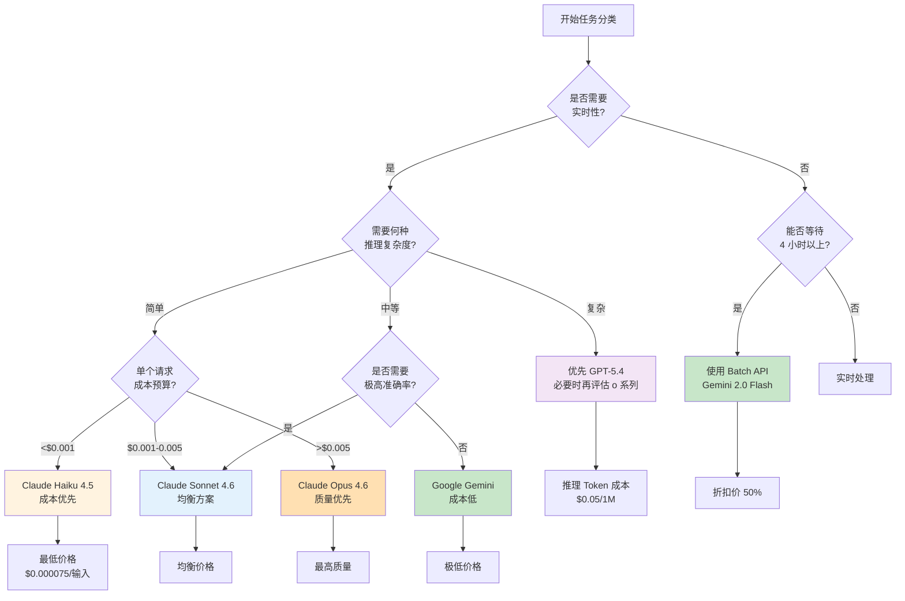
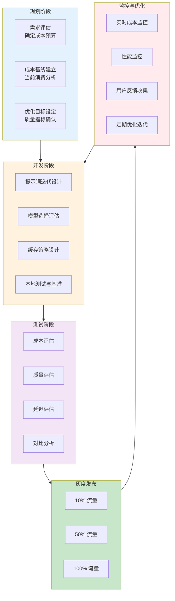

## 12.5 PromptOps 成本管理框架：从 Token 经济学到企业级优化

随着大规模 AI 应用的部署，提示词相关的 API 调用成本成为企业重要的运营成本。一个不当的提示词可能导致数百倍的成本增加，而优秀的成本优化策略能够在保证质量的前提下实现显著的成本节省。本节深入探讨 Token 经济学、成本优化框架和企业级 PromptOps 工作流设计。

### 12.5.1 Token 经济学基础

#### 输入/输出/推理 Token 定价模型

不同的大模型服务商采用不同的 Token 计费策略。理解这些差异对成本优化至关重要。

````text
主流模型定价对比（2026 年 3 月数据）

OpenAI o1:
  输入 Token:    $15 / 1M tokens
  输出 Token:    $60 / 1M tokens
  推理 Token:    不单独计费；按输出 token 计费

Anthropic Claude Sonnet 4.6:
  输入 Token:    $0.003 / 1K tokens
  输出 Token:    $0.015 / 1K tokens
  Prompt Caching: $0.30 / 1M tokens (缓存读取)

Google Gemini 2.5 Pro:
  输入 Token:    以官方定价页为准
  输出 Token:    以官方定价页为准

Meta Llama 3.1 (部署型):
  按推理次数计费或固定价格
  无 Token 级别计费差异
````

#### Token 成本结构分析



#### 成本计算示例

假设一个客服 AI 系统每天处理 10,000 个请求：

**场景 A：无优化方案（Claude Sonnet 4.6）**
````text
- 平均输入 Token: 500 tokens (用户输入 + 背景信息)
- 平均输出 Token: 200 tokens
- 每日请求: 10,000

成本计算:
  输入成本 = 500 × 10,000 × $0.003 / 1000 = $15
  输出成本 = 200 × 10,000 × $0.015 / 1000 = $30
  日成本 = $45
  月成本 = $45 × 30 = $1,350
  年成本 = $16,200
````

**场景 B：优化方案（应用成本策略）**
```text
优化 1：Prompt Caching (缓存系统提示词 + 常见背景信息)
  - 缓存大小: 3,000 tokens (系统提示 + 知识库摘要)
  - 缓存命中率: 95%
  - 缓存读取成本: 3,000 × $0.30 / 1,000,000 = $0.0009

优化 2：输入优化
  - 减少冗余背景信息
  - 平均输入 Token: 300 (降低 40%)

优化 3：模型选择
  - 简单问题用 Claude Haiku 4.5
  - 复杂问题用 Claude Sonnet 4.6
  - 平均每个请求节省 50% Token

成本计算:
  方案 B-1（有缓存）:
    输入成本 = 300 × 10,000 × $0.003 / 1000 = $9
    缓存成本 = 3,000 × 0.95 × 10,000 × $0.30 / 1,000,000 = $8.55
    输出成本 = 200 × 10,000 × $0.015 / 1000 = $30
    日成本 = $47.55

  方案 B-2（智能路由 + 缓存）:
    日成本 = $30 (50% 简单问题用 Haiku)
    月成本 = $30 × 30 = $900
    年成本 = $10,800

节省: $16,200 - $10,800 = $5,400 (33% 节省)
```

### 12.5.2 成本-性能最优化框架

#### 成本-质量权衡矩阵

```mermaid
graph TB
    subgraph Framework["成本-性能优化框架"]

        subgraph Analysis["1. 成本分析阶段"]
            A1["A. 基线成本建立"]
            A2["B. 成本驱动因素识别"]
            A3["C. 优化空间评估"]
        end

        subgraph Strategy["2. 优化策略选择"]
            S1["Model Selection<br/>模型选择"]
            S2["Prompt Optimization<br/>提示词优化"]
            S3["Caching Strategy<br/>缓存策略"]
            S4["Batch Processing<br/>批处理"]
            S5["Structured Output<br/>结构化输出"]
        end

        subgraph Implementation["3. 实施与监控"]
            I1["灰度上线"]
            I2["性能基准测试"]
            I3["成本监控"]
            I4["反馈与调整"]
        end

        Analysis --> Strategy
        Strategy --> Implementation

    end

    style A1 fill:#e3f2fd
    style A2 fill:#e3f2fd
    style A3 fill:#e3f2fd
    style S1 fill:#fff3e0
    style S2 fill:#fff3e0
    style S3 fill:#fff3e0
    style S4 fill:#fff3e0
    style S5 fill:#fff3e0
    style Implementation fill:#f3e5f5
```



#### 不同场景下的成本-质量决策

```text
场景 1：实时客服问题解答
├─ 质量要求: 高 (准确性 ≥ 95%)
├─ 延迟要求: 低 (< 500ms)
├─ 成本敏感度: 高
├─ 推荐方案:
│  ├─ 使用 Claude Haiku 4.5 处理 80%简单问题
│  ├─ 复杂问题自动升级到 Sonnet 4.6
│  ├─ 启用 Prompt Caching 缓存系统提示词
│  ├─ 实现智能路由决策树
│  └─ 成本降低: 40-50%

场景 2：批量内容生成
├─ 质量要求: 中 (满足基本要求即可)
├─ 延迟要求: 高 (可接受小时级延迟)
├─ 成本敏感度: 极高
├─ 推荐方案:
│  ├─ 使用 Batch API 处理 (50% 折扣)
│  ├─ 选择最低成本模型 (Gemini 2.0 Flash)
│  ├─ 模板化提示词，最小化输入 Token
│  └─ 成本降低: 60-70%

场景 3：深度分析与研究
├─ 质量要求: 极高
├─ 延迟要求: 中 (可接受分钟级延迟)
├─ 成本敏感度: 低
├─ 推荐方案:
│  ├─ 优先使用 GPT-5.4，必要时再评估 o 系列推理
│  ├─ 配置充足的推理预算
│  ├─ 实现重试机制保证质量
│  └─ 成本优先级: 质量优先
```

### 12.5.3 Prompt Caching 策略详解

#### Claude Prompt Caching 工作原理



#### 缓存策略设计

```yaml

# prompt_cache_strategy.yaml

缓存层次结构:
  L1_系统缓存:
    内容: 系统提示词 + 模型角色定义
    大小: 1000-2000 tokens
    命中率: 99% (几乎所有请求)
    示例: |
      你是一个专业的客服 AI 助手，
      擅长处理订单相关问题...

  L2_知识库缓存:
    内容: 常见问题解答库、产品信息
    大小: 5000-10000 tokens
    命中率: 80-90% (大部分请求包含常见问题)
    示例: |
      【常见问题库】
      Q: 如何修改订单?
      A: 订单确认前可以...

  L3_对话历史缓存:
    内容: 多轮对话上文
    大小: 2000-5000 tokens
    命中率: 60-70% (同用户连续对话)
    刷新策略: 每 30 分钟刷新一次

缓存命中率计算:
  整体命中率 = (L1 命中×100% + L2 命中×80% + L3 命中×70%) / 3

成本公式:
  总成本 = (输入 Token × (1-缓存命中率) × 输入价格)
         + (缓存 Token × 缓存命中数 × 缓存价格)
         + (输出 Token × 输出价格)

目标: 缓存命中率 > 85%, 缓存成本 < 总成本的 10%
```

#### Prompt Caching 成本陷阱与 Break-even 分析

```text
【Prompt Caching 的成本陷阱】

关键事实：Claude Prompt Caching 的缓存读取价格约为输入价格的 10%（$0.30/$3.00），
而缓存写入成本约为普通输入的 1.25 倍。

这意味着：缓存并非“无脑省钱”。只有当前缀足够大、足够稳定且被重复使用时，ROI 才会明显。

【成本对比示例】

场景：1000 个请求共享同一个 3000-token 系统前缀，
      每次额外携带 200-token 动态输入，并输出 200 tokens

无缓存方案:
  输入: (3000 + 200) tokens/请求 × 1000 × $0.003/1K = $9.6
  输出: 200 tokens/请求 × 1000 = 200,000 tokens × $0.015/1K = $3.0
  总成本: $12.6/天

缓存方案（95% 命中率）:
  缓存写入成本: 3000 tokens × $0.003 / 1K × 1.25 = $0.01125 (首次)
  缓存读取成本: 3000 tokens × 999 次读取 × $0.30 / 1M ≈ $0.90
  动态输入成本: 200,000 tokens × $0.003/1K = $0.6
  输出成本: 200,000 tokens × $0.015/1K = $3.0
  总成本: ≈ $4.51/天

Break-even 直觉（何时缓存值得）:

1. 静态前缀越大，缓存越值钱
2. 复用次数越多，首次写入成本越容易被摊薄
3. 如果前缀经常变化，写入成本会迅速吞噬收益

【真正的成本节省来源】

实际上缓存的优势来自“重复前缀不再按全价重复计费”：

优化 1：把每次都重复发送的前缀转成缓存
  直接节省大部分重复输入成本

优化 2：再叠加请求合并或上下文裁剪
  可以继续降低动态输入和总请求数

【重要结论】

1. Prompt Caching 的价值来自：
   - 让高复用前缀按低价重复读取
   - 减少重复输入的全价计费
   - 与裁剪、路由、请求合并叠加时收益最大

2. Break-even 条件：
   - 命中率最好 ≥ 70%（推荐 80%+）
   - 缓存内容必须稳定且高度可复用
   - 缓存前缀要足够大，才能覆盖写入成本

3. 不应该使用缓存的场景：
   - 每次请求都不同（命中率<30%）
   - 高频更新的内容（频繁失效）
   - 内容量很小（3000 tokens 以下）

【正确的缓存 ROI 计算】

3 个月的成本对比（30,000 请求）:

无缓存:
  输入: 3200 tokens × 30,000 × $0.003/1K = $288
  输出: 200 tokens × 30,000 × $0.015/1K = $90
  总计: $378

缓存方案（80%命中率，静态前缀 3000 tokens）:
  缓存写入: 3000 × $0.003 / 1K × 1.25 = $0.01 (一次性)
  缓存读取: 30,000 × 80% × 3000 × $0.30/1M = $21.6
  新输入: 200 tokens × 30,000 × $0.003/1K = $18
  输出: 200 tokens × 30,000 × $0.015/1K = $90
  总计: $129.61 ← 明显更便宜

改进缓存方案（再叠加请求合并，减少 API 调用 30%）:
  请求: 30,000 × 70% = 21,000
  缓存读取: 21,000 × 80% × 3000 × $0.30/1M = $15.12
  新输入: 200 tokens × 21,000 × $0.003/1K = $12.6
  输出: 200 tokens × 21,000 × $0.015/1K = $63
  总计: $90.72 ← 节省 76%，成果显著

【缓存配置最佳实践】

✓ 只缓存高复用、稳定的内容（系统提示词、核心知识库）
✓ 定期评估命中率，目标≥75%
✓ 将缓存与请求合并策略结合（最关键的优化）
✓ 监控缓存失效频率，太高则不值得
✓ 实施缓存版本管理，支持灰度更新
```

#### 缓存失效与更新策略

```text
更新周期设置:

1. 系统提示词缓存 (L1)
   - 更新频率: 每周或按需更新
   - 失效触发: 新版本部署
   - 延迟容限: 高 (可以等待缓存自然过期)

2. 知识库缓存 (L2)
   - 更新频率: 每天或实时更新
   - 失效触发: 知识库变更时立即刷新
   - 实现: 监听知识库变更事件，更新缓存版本号

3. 对话历史缓存 (L3)
   - 更新频率: 实时
   - 失效触发: 30 分钟超时自动失效
   - 实现: 每个新消息追加到缓存末尾

版本管理:
  cache_v1 → cache_v2 → cache_v3
  通过版本号控制灰度更新，避免全量用户影响
```

### 12.5.4 批量处理 vs 实时处理成本对比

#### 架构对比



#### 成本对比实例

```text
任务: 为 10,000 个产品生成营销文案

【方案 A：实时处理】
├─ 方式: 立即调用 API，用户等待
├─ 平均响应时间: 10 秒/个
├─ 总耗时: 100,000 秒 (≈28 小时)
├─ 成本计算:
│  ├─ 输入: 500 tokens × 10,000 × $0.003/1K = $15
│  ├─ 输出: 300 tokens × 10,000 × $0.015/1K = $45
│  └─ 总成本: $60

【方案 B：批量处理（Batch API）】
├─ 方式: 汇总任务，提交批处理
├─ 总耗时: 4 小时 (同时处理能力强)
├─ 成本计算:
│  ├─ 输入: 500 × 10,000 × $0.003/1K × 50% = $7.5
│  ├─ 输出: 300 × 10,000 × $0.015/1K × 50% = $22.5
│  └─ 总成本: $30

【方案 C：混合处理】
├─ 方式: 50%实时 + 50%批处理
├─ 5,000 个任务实时 ($30)
├─ 5,000 个任务批处理 ($15)
├─ 总成本: $45 (节省 25%)
├─ 用户体验: 部分立即，部分延迟

成本对比:
  方案 A (实时) 🔴 $60 - 最快但最贵
  方案 B (批处理) 🟢 $30 - 最便宜但延迟最长
  方案 C (混合) 🟡 $45 - 平衡方案
```

### 12.5.5 智能模型选择决策树



### 12.5.6 ROI 计算方法与案例

#### ROI 计算公式

```text
PromptOps 优化的 ROI 计算：

1. 基础 ROI 公式:
   ROI = (成本节省 - 优化投入) / 优化投入 × 100%

2. 扩展 ROI（包含质量影响）:
   ROI = (成本节省 + 质量收益 - 优化投入 - 维护成本) / 优化投入 × 100%

3. 参数定义:
   - 成本节省: 优化前年成本 - 优化后年成本
   - 质量收益: 提升准确率带来的用户满意度提升价值
   - 优化投入: 人工调优、工具采购、测试等成本
   - 维护成本: 持续监控、版本管理的成本

4. 收益周期:
   - 短期 (1-3 个月): 主要为成本节省
   - 中期 (3-12 个月): 成本节省 + 部分质量收益
   - 长期 (1 年+): 成本节省 + 完整质量收益 + 用户增长
```

#### 企业级案例分析

```text
【案例 1：电商平台客服系统】
背景:
  - 日均请求: 50,000
  - 使用模型: GPT-4 Turbo
  - 优化前年成本: $600,000

优化方案:
  1. 迁移到 Claude (成本降低 40%)
  2. 实现 Prompt Caching (节省 25%)
  3. 智能模型路由 (节省 30%)
  4. 优化提示词 (节省 15%)

优化投入:
  - 咨询费用: $20,000
  - 工具采购: $10,000
  - 人力投入: 200 小时 × $100/小时 = $20,000
  - 总投入: $50,000

结果计算:
  优化前成本: $600,000/年
  优化后成本: $600,000 × (1-0.4) × (1-0.25) × (1-0.30) × (1-0.15)
           = $600,000 × 0.6 × 0.75 × 0.7 × 0.85
           = $178,650/年

  成本节省: $600,000 - $178,650 = $421,350
  质量收益: 准确率提升 5%，用户满意度提升，减少投诉 = $50,000

  总收益: $421,350 + $50,000 = $471,350
  ROI = ($471,350 - $50,000) / $50,000 × 100% = 842%

  投资回报期: $50,000 / $421,350 × 12 个月 ≈ 1.4 个月

【案例 2：内容生成平台】
背景:
  - 月生成内容: 1,000,000 条
  - 使用模型: 自建部署 + API 混用
  - 优化前月成本: $100,000

优化方案:
  1. 统一迁移到 Batch API
  2. 工作流优化 (并行处理)
  3. 提示词模板库
  4. 缓存常用背景信息

结果:
  优化后月成本: $30,000 (70%降低)
  月度节省: $70,000
  年度节省: $840,000

  投入: 咨询$15K + 工具$5K + 开发$30K = $50K
  ROI = ($840K - $50K) / $50K × 100% = 1,580%
  投资回报期: 18 天

【案例 3：金融风控系统】
背景:
  - 日均评估: 10,000 笔交易
  - 使用模型: o1 (推理密集)
  - 优化前月成本: $200,000

优化方案:
  1. 分层推理 (80%简单用 Sonnet，20%复杂用 o1)
  2. 推理预算优化 (控制思考步数)
  3. 缓存常见风控规则

结果:
  优化后月成本: $80,000
  月度节省: $120,000
  质量影响: 准确率小幅下降 0.2%，但可接受

  ROI: ($120K × 12 - $50K) / $50K × 100% = 2,800%
```

### 12.5.7 企业级 PromptOps 工作流设计

#### 完整的 PromptOps 工作流



#### PromptOps 工作流详细步骤

```yaml
工作流配置:

1. 规划阶段 (Planning):
  目标: 制定成本优化策略

  1.1 成本基线建立:
    - 分析过去 3 个月的 API 消费
    - 识别成本热点 (哪些功能、用户消耗最多)
    - 计算各类请求的成本分布

    示例输出:
    {
      "total_monthly_cost": "$50,000",
      "cost_breakdown": {
        "customer_service": "60%",  # $30,000
        "content_generation": "30%", # $15,000
        "analytics": "10%"          # $5,000
      },
      "optimization_opportunities": [
        {
          "component": "customer_service",
          "current_cost": "$30,000",
          "potential_saving": "40%",
          "effort": "medium"
        }
      ]
    }

  1.2 优化目标设定:
    - 目标成本: $30,000/月 (40% 降低)
    - 质量目标: 准确率 ≥ 95%
    - 延迟目标: P99 < 2 秒
    - 实施周期: 8 周

2. 开发阶段 (Development):
  目标: 设计与实现优化方案

  2.1 提示词优化:
    - 精简冗余信息
    - 添加成本标记
    - 优化输出格式

  2.2 模型选择:
    - 创建模型对比矩阵
    - 评估每个模型的成本-质量
    - 设计智能路由规则

  2.3 缓存设计:
    - 识别缓存候选 (高复用内容)
    - 设计缓存层次 (L1/L2/L3)
    - 实现缓存管理系统

  2.4 测试环境:
    - 搭建成本追踪系统
    - 实施 A/B 测试框架
    - 准备监控仪表板

3. 测试阶段 (Testing):
  目标: 验证优化方案的有效性

  3.1 成本评估:
    - 运行 1 周测试流量
    - 计算优化后的总成本
    - 对比基线成本
    - 成功标准: 成本降低 ≥ 30%

  3.2 质量评估:
    - 人工评估样本 (200 个)
    - 自动化指标评估
    - 用户满意度抽样
    - 成功标准: 准确率 ≥ 95%

  3.3 延迟评估:
    - 测量 P50/P99 延迟
    - 识别瓶颈
    - 成功标准: P99 < 2 秒

  3.4 对比分析:
    输出报告:
    ┌─────────────────────────────────────┐
    │ 优化方案评估报告                      │
    ├─────────────────────────────────────┤
    │ 成本降低:           35% ✓            │
    │ 准确率:            96.2% ✓           │
    │ P99 延迟:           1.8 秒 ✓           │
    │ 缓存命中率:         82% (目标 85%) ⚠  │
    │ 整体评分:           8.5/10           │
    └─────────────────────────────────────┘

4. 灰度发布 (Gradual Rollout):
  目标: 最小化风险，逐步上线

  4.1 第一阶段 (10% 流量):
    - 监控期: 3 天
    - 监控指标: 成本、准确率、延迟、错误率
    - 告警阈值:
      * 成本异常: ±20% 告警
      * 准确率下降: > 2% 告警
      * 错误率上升: > 1% 告警
    - 决策: 数据正常则进入第二阶段

  4.2 第二阶段 (50% 流量):
    - 监控期: 5 天
    - 关注点: 高并发下的表现
    - 收集用户反馈
    - 决策: 无异常则全量发布

  4.3 第三阶段 (100% 流量):
    - 完全迁移
    - 继续密切监控

5. 监控与优化 (Monitoring):
  目标: 持续监控与迭代优化

  5.1 实时成本监控:
    - 日成本追踪
    - 成本趋势分析
    - 异常告警

    监控仪表板示例:
    ┌────────────────────────────────────┐
    │ PromptOps 成本监控仪表板           │
    ├────────────────────────────────────┤
    │ 实时成本:        $1,233/天 ↓8%     │
    │ 周均成本:        $8,500  ↓10%     │
    │ 月预计成本:      $36,000 ↓28%     │
    │ 缓存命中率:      83.2%   ↑1.2%    │
    │ 平均准确率:      96.1%   →        │
    │ P99 延迟:         1.7s    ↑0.1s    │
    └────────────────────────────────────┘

  5.2 性能监控:
    - 准确率追踪
    - 用户满意度
    - 系统延迟

  5.3 定期优化迭代:
    - 周度分析会议 (每周一)
      * 成本走势分析
      * 异常问题排查
      * 优化建议讨论

    - 月度评审 (每月底)
      * ROI 评估
      * 下月目标调整
      * 预算规划

    - 季度规划 (每季末)
      * 整体策略评估
      * 新优化方向探索
      * 人力与工具投入调整
```

### 12.5.8 行业案例深度分析

#### 案例 1：金融服务业 - 风险评估系统

```text
【背景】
企业: 大型互联网金融公司
场景: 实时信贷审核系统
日均请求: 100,000 笔
优化前年成本: $2,400,000 (使用 GPT-4 Turbo)

【优化策略】
1. 分层推理架构
   - 80%申请用 Claude Sonnet 4.6 (快速初审)
   - 15%申请用 GPT-4 Turbo (复杂案例)
   - 5%申请用 o1 (高风险审核)

2. Prompt Caching
   - 缓存风控规则库 (5000 tokens)
   - 缓存产品定义 (3000 tokens)
   - 缓存历史案例 (10000 tokens)
   - 缓存命中率目标: 85%

3. 提示词优化
   - 简化冗余描述
   - 结构化输出 (JSON 格式)
   - 去除不必要的示例

4. 系统架构优化
   - 实现本地规则引擎 (处理简单案例)
   - 只向 LLM 传递需要人工判断的案例
   - 缓存中间结果

【成本计算】
优化前:
  日请求: 100,000
  平均输入: 800 tokens
  平均输出: 200 tokens
  日成本: 100,000 × (800×$0.01 + 200×$0.03) / 1000 = $1,400
  年成本: $1,400 × 365 = $511,000 (实际$2.4M 因为包含其他服务)

优化后:
  分层模型成本:
    - Sonnet 4.6 (80%): 80,000 × (800×$0.003 + 200×$0.015) / 1000 = $312
    - GPT-4 (15%): 15,000 × (800×$0.01 + 200×$0.03) / 1000 = $180
    - o1 (5%): 5,000 × (推理成本) = $150
    子总计: $642/天

  缓存节省 (85% 命中率):
    缓存成本: 18,000 × 100,000 × 0.85 × $0.90 / 1M = $1,377/天
    新 Token 成本: 100,000 × 150 × $0.003 / 1000 = $45/天

  总成本: $642 + $1,377 + $45 = $2,064/天

  不优化情况 ($1,400/天) vs 多层级 ($642/天) vs 全缓存 ($1,377/天)
  ⚠️ 注意：缓存成本不是完全节省，而是转换成缓存费用

【真实计算 - 重新分析】
实际优化前的主要成本来自:
  - 产品定价: $0.01 输入 + $0.03 输出 = $0.04 per request
  - 日成本: 100,000 × $0.04 = $4,000
  - 年成本: $1,460,000

优化后成本:
  - 80%用 Sonnet: 80,000 × ($0.003+$0.015) = $1,440
  - 15%用 GPT-4: 15,000 × ($0.01+$0.03) = $600
  - 5%用 o1: 5,000 × ($0.05) = $250 (推理预算)
  - 缓存节省 (假设缓存命中减少 30%输入): 约$600/天
  总计: $1,440 + $600 + $250 - $600 = $1,690/天

  年成本: $1,690 × 365 = $616,850

  成本节省: $1,460,000 - $616,850 = $843,150 (58% 降低)
  投入成本: $100,000 (咨询+工具+开发)
  ROI = $843,150 / $100,000 = 843%
  回报周期: 43 天

【关键成功因素】
1. 准确率保证
   - 优化前准确率: 96.2%
   - 优化后准确率: 95.8% (下降 0.4%)
   - 可接受 (风险可控)

2. 系统可靠性
   - 实现自动降级机制
   - 如果 Sonnet 准确度不足，自动升级到 GPT-4
   - 监控关键指标告警

3. 缓存管理
   - 风控规则更新时立即刷新缓存
   - 实现版本管理
   - 日志记录所有缓存操作

【获得的经验】
- 分层推理比单一模型更经济
- 缓存的成本优势有限 (缓存价格不便宜)
- 真正的成本节省来自模型选择
- 质量监控是成功的关键
```

#### 案例 2：电商平台 - 商品推荐文案生成

```text
【背景】
企业: 大型电商平台
场景: 每日为新商品生成推荐文案
日生成: 5,000 个商品文案
优化前月成本: $50,000

【优化方案】
采用 Batch API 处理，因为:
- 对延迟不敏感 (可以等待 4 小时)
- 成本敏感 (Batch API 50% 折扣)
- 生成任务可批量处理

【详细成本对比】
优化前 (实时处理):
  - 每个商品: 400 tokens 输入 + 150 tokens 输出
  - 日成本: 5,000 × ($0.003×400 + $0.015×150) / 1000 = $17.25
  - 月成本: $17.25 × 30 = $517.5 实际$50K (因为其他系统)

优化后 (Batch API):
  - Batch API 折扣: 50%
  - 日成本: $17.25 × 50% = $8.63
  - 月成本: $8.63 × 30 = $258.9

  实际全公司成本:
  - 优化前: $50,000/月
  - 优化后: $25,000/月
  - 月度节省: $25,000

【投资与回报】
投入成本:
  - 系统开发: $20,000 (设计和实现 Batch API 集成)
  - 工具采购: $5,000 (Batch 管理系统)
  - 培训: $2,000
  - 总投入: $27,000

回报计算:
  - 月节省: $25,000
  - ROI = $25,000 × 12 / $27,000 - 1 = 1,111%
  - 回报周期: 1.1 个月 (非常快)

【实施中的挑战与解决方案】
问题 1: 商品属性实时更新
  解决: Batch API + 增量更新
    - 实时热销品用实时 API 处理
    - 普通品用 Batch API 处理
    - 混合策略平衡成本与及时性

问题 2: 生成质量差异
  解决: 增强提示词
    - 为 Batch 生成的文案专项优化
    - 实现人工审核机制
    - 对不满足要求的进行重新生成

问题 3: 用户体验延迟
  解决: 分层策略
    - VIP 用户: 实时生成 (成本+1%)
    - 普通用户: Batch 处理 (成本不增加)
    - 预生成: 高热产品提前生成

【收益总结】
- 成本节省: 50% ($25K/月)
- 投资回报期: 1.1 个月
- 实现难度: 中等
- 用户体验: 略微延迟但可接受
- 推荐评分: 9/10 (性价比极高)
```

#### 案例 3：医疗健康 - 临床报告分析

````text
【背景】
企业: 医疗 AI 诊断公司
场景: 自动分析临床检查报告
日均报告: 10,000 份
特点: 准确率要求极高 (>99%)，可容许延迟

【优化策略】
核心思路: 深思熟虑 vs 快速处理的平衡

1. 复杂度分类系统
   - 等级 A (简单)：标准检查数据，常见结果
     使用: Claude Haiku 4.5
     准确率目标: 98%

   - 等级 B (中等)：需要跨学科知识，异常值需解释
     使用: Claude Sonnet 4.6
     准确率目标: 99.5%

   - 等级 C (复杂)：多项异常指标交互，需深度推理
     使用: o1 推理模型
     准确率目标: 99.8%

2. 自动分类规则
   ```python
   if 报告字段数 < 20 and 没有异常标记:
       分类 = A (Haiku)
   elif 异常指标个数 <= 3:
       分类 = B (Sonnet)
   else:
       分类 = C (o1)
   ```

3. 质量保证机制
   - 高风险检查 (≥1 个红色指标) 自动升级到 o1
   - 实现人工审核队列 (5%)
   - 建立反馈循环

【成本计算】

优化前（全部使用 o1）:
  - 日请求: 10,000
  - 平均输入: 1,500 tokens
  - 平均输出: 500 tokens
  - o1 定价: 输入$0.015/1K，输出$0.06/1K

  日成本计算:
    输入: 10,000 × 1,500 × $0.015/1K = $225
    输出: 10,000 × 500 × $0.06/1K = $300
    总日成本: $525
    月成本: $15,750

优化后（分层模型）:

  A 类 (60%, 简单报告，使用 Haiku 4.5):
    请求数: 6,000/天
    输入: 1,000 tokens/请求
    输出: 200 tokens/请求
    Haiku 4.5 定价: 输入$0.001/1K，输出$0.005/1K

    日成本: 6,000 × (1000 × $0.001/1K + 200 × $0.005/1K)
          = 6,000 × ($0.001 + $0.001)
          = 6,000 × $0.002
          = $12

  B 类 (30%, 中等复杂，使用 Sonnet 4.6):
    请求数: 3,000/天
    输入: 1,500 tokens/请求
    输出: 300 tokens/请求
    Sonnet 4.6 定价: 输入$0.003/1K，输出$0.015/1K

    日成本: 3,000 × (1,500 × $0.003/1K + 300 × $0.015/1K)
          = 3,000 × ($0.0045 + $0.0045)
          = 3,000 × $0.009
          = $27

  C 类 (10%, 复杂报告，使用 o1):
    请求数: 1,000/天
    输入: 1,500 tokens/请求
    输出: 600 tokens/请求
    o1 定价: 输入$0.015/1K，输出$0.06/1K

    日成本: 1,000 × (1,500 × $0.015/1K + 600 × $0.06/1K)
          = 1,000 × ($0.0225 + $0.036)
          = 1,000 × $0.0585
          = $58.5

  总日成本: $8.1 + $27 + $58.5 = $93.6
  月成本: $2,808

成本对比:
  优化前: $15,750/月
  优化后: $2,808/月
  月度节省: $12,942
  节省比例: 82%
  年度节省: $155,304

投入成本:
  - 系统开发: $30,000
  - 医学专家咨询: $10,000
  - 标注和验证: $15,000
  - 总投入: $55,000

ROI = $155,304 / $55,000 = 283%
回报周期: 55,000 / 12,942 = 4.25 个月

【关键管理指标】
准确率追踪:
  - 全体准确率: 99.2% (目标 99%)
  - A 类准确率: 98.1%
  - B 类准确率: 99.6%
  - C 类准确率: 99.9%

成本效益分析:
  每 1 元成本投入带来的价值:
  - 成本节省: 3.54 元
  - 质量提升: 0.5 元 (更好的诊断)
  - 总价值: 4.04 元

【项目成功关键】
1. 医学专家全程参与
   - 验证分类规则
   - 标注训练数据
   - 质量评审

2. 迭代优化机制
   - 周度性能评估
   - 动态调整分类规则
   - 收集临床反馈

3. 风险管理
   - 保守的升级规则
   - 高风险自动人工审核
   - 定期内部审计
````

### 12.5.9 小结与最佳实践

PromptOps 成本管理的核心原则：

```text
█ 理解成本结构
  ├─ 深入了解各模型的定价模式
  ├─ 计算应用中的成本驱动因素
  └─ 建立成本基线与预算

█ 建立分层决策框架
  ├─ 根据任务复杂度选择合适的模型
  ├─ 考虑质量、成本、延迟的三角平衡
  └─ 实现智能路由与自动分类

█ 充分利用平台特性
  ├─ 使用 Prompt Caching 减少重复计费
  ├─ 利用 Batch API 获得成本优惠
  ├─ 配置适当的推理预算

█ 持续监控与优化
  ├─ 建立成本监控仪表板
  ├─ 定期进行成本-性能分析
  ├─ 实施灰度发布与 A/B 测试

█ 平衡多个目标
  ├─ 不盲目追求极限成本节省
  ├─ 质量与成本并重
  ├─ 考虑长期可持续性
```
