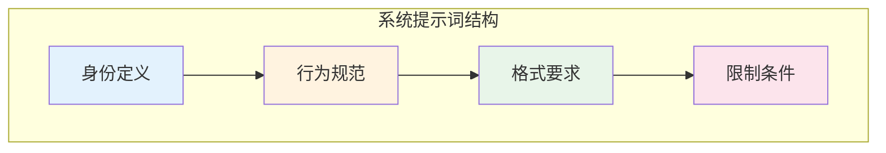

## 13.1 OpenAI GPT 系列最佳实践

> **说明：** 本节所涉及的 API 参数、模型特性及最佳实践基于 2026 年初的版本编写。由于 OpenAI 平台更新频繁，在实际应用中请参考最新的官方文档。

OpenAI 是大语言模型商业化的先驱，其 GPT 系列是应用最广泛的语言模型。本节深入介绍针对 GPT 系列的提示词优化策略，涵盖从 GPT-4.5 Turbo 到最新的 GPT-5.x 推理模型。

> **注意（平台变更）**：OpenAI 官方公告称，自 **2026 年 2 月 13 日** 起，GPT-4o 将从 **ChatGPT** 中退役；同时明确说明该变更 **不影响 API**。如果你的系统强绑定某个模型版本，请以官方最新公告/文档为准，并通过回归测试验证迁移影响。

### 13.1.1 GPT 模型系列概览

OpenAI 目前提供多个系列的模型，适用于不同场景：

| 模型系列 | 核心特点 | 适用场景 |
|---------|---------|----------|
| GPT-5.2 | 最新旗舰、扩展上下文、低幻觉 | 复杂分析、高精度任务 |
| GPT-5.1 | 高性能、增强推理 | 通用高级任务 |
| GPT-4.5 Turbo | 3x 更快、256K 上下文、70% 成本降低 | 高性价比首选 |
| o1/o3 | 内置推理链、深度思考 | 数学、编程、逻辑推理 |
| GPT-4o | 多模态、快速响应（ChatGPT 侧退役） | 通用任务、实时交互 |
| GPT-4o mini | 成本优化、快速 | 简单任务、高并发场景 |

### 13.1.2 系统提示词设计

GPT 模型对系统提示词有出色的遵从性，这是设计提示词的核心要素。

#### 基本结构

```python
messages = [
    {
        "role": "system",
        "content": """你是一位专业的数据分析师，具备以下特点：
- 擅长解读复杂数据并提供可操作的洞察
- 回答简洁、结构清晰
- 在不确定时会明确说明假设条件

输出要求：
1. 使用 Markdown 格式
2. 关键数据用表格呈现
3. 结论放在最前面"""
    },
    {
        "role": "user",
        "content": "分析这份销售数据..."
    }
]
```

#### 系统提示词的关键要素



*图 13.1-1：系统提示词的四个核心层次*

- **身份定义**：明确模型扮演的角色和专业领域
- **行为规范**：定义回答风格、语气和处理方式
- **格式要求**：指定输出的结构和格式
- **限制条件**：设定边界和禁止事项

### 13.1.3 函数调用与结构化输出

GPT 系列原生支持函数调用和结构化输出，是构建 Agent 系统的关键能力。

#### 函数定义示例

```python
tools = [
    {
        "type": "function",
        "function": {
            "name": "get_weather",
            "description": "获取指定城市的天气信息",
            "parameters": {
                "type": "object",
                "properties": {
                    "city": {
                        "type": "string",
                        "description": "城市名称，如：北京、上海"
                    },
                    "unit": {
                        "type": "string",
                        "enum": ["celsius", "fahrenheit"],
                        "description": "温度单位"
                    }
                },
                "required": ["city"]
            }
        }
    }
]
```

#### 结构化输出

2024 年 OpenAI 推出的结构化输出功能，确保模型输出严格符合指定的 JSON Schema：

```python
try:
    from pydantic import BaseModel
except ModuleNotFoundError:
    class BaseModel:
        def __init__(self, **data):
            for k, v in data.items():
                setattr(self, k, v)

        def model_dump(self):
            return dict(self.__dict__)

from openai import OpenAI

client = OpenAI()
messages = [{"role": "user", "content": "分析这款产品：智能手表"}]

class ProductAnalysis(BaseModel):
    product_name: str
    sentiment: str  # positive, negative, neutral
    key_points: list[str]
    confidence_score: float

response = client.beta.chat.completions.parse(
    model="gpt-4o",
    messages=messages,
    response_format=ProductAnalysis
)

# 返回结果自动解析为 Python 对象
analysis = response.choices[0].message.parsed
print(analysis.model_dump() if hasattr(analysis, "model_dump") else analysis)
```

**结构化输出的优势**：

- 100% 符合 Schema，无需后处理验证
- 支持复杂嵌套结构
- 与 Pydantic 无缝集成

### 13.1.4 o1/o3 推理模型策略

o1 和 o3 是 OpenAI 专为复杂推理设计的模型，它们内置了思维链能力，使用策略与传统 GPT 有显著不同。

#### 核心差异

| 维度 | GPT-4 系列 | o1/o3 系列 |
|------|-----------|-----------|
| 思维链 | 需显式要求 | 内置自动执行 |
| 响应时间 | 秒级 | 可能需要分钟级 |
| 系统提示词 | 完整支持 | 部分限制 |
| 推理控制 | 无 | 支持推理预算设置 |

#### o1/o3 的提示词策略

```
❌ 不需要的写法：
"请一步步思考，展示你的推理过程..."

✅ 推荐的写法：
"证明：对于所有大于2的偶数n，存在两个质数p和q使得n=p+q"
```

**关键原则**：

1. **直接陈述问题**：无需要求"逐步思考"，模型会自动进行
2. **提供充分上下文**：复杂问题需要完整的背景信息
3. **设置推理预算**：通过 `reasoning_effort` 参数控制推理深度

```python
from openai import OpenAI

client = OpenAI()
problem_statement = "证明：对于所有大于2的偶数 n，存在两个质数 p 和 q 使得 n=p+q。"

response = client.chat.completions.create(
    model="o3",
    messages=[{"role": "user", "content": problem_statement}],
    reasoning_effort="high"  # low, medium, high
)

print(response.choices[0].message.content)
```

### 13.1.5 高级技巧

#### 1. 使用分隔符组织复杂提示词

```
### 13.1.6 背景信息 ###
{context}

### 13.1.7 任务要求 ###
{task}

### 13.1.8 输出格式 ###
{format}
```

#### 2. 利用 JSON 模式确保格式一致

```python
from openai import OpenAI

client = OpenAI()
messages = [{"role": "user", "content": "用 JSON 输出：{\"hello\": \"world\"}"}]

response = client.chat.completions.create(
    model="gpt-4o",
    messages=messages,
    response_format={"type": "json_object"}
)

print(response.choices[0].message.content)
```

#### 3. 温度参数调优

| 任务类型 | 推荐 Temperature |
|---------|-----------------|
| 代码生成、事实问答 | 0 - 0.3 |
| 通用对话、文案写作 | 0.5 - 0.7 |
| 创意写作、头脑风暴 | 0.8 - 1.0 |

#### 4. 多轮对话中的上下文管理

```python
# 保持关键信息在上下文开头和结尾
system_prompt = "你是一个有帮助的助手。"
important_context = "【关键信息】用户正在做产品选型。"
current_question = "请给出建议。"
key_reminder = "务必输出要点列表。"

messages = [
    {"role": "system", "content": system_prompt},
    {"role": "user", "content": important_context},  # 开头
    # ... 中间对话 ...
    {"role": "user", "content": current_question + "\n\n" + key_reminder}  # 结尾
]

print(messages)
```

### 13.1.9 常见问题与解决方案

| 问题 | 解决方案 |
|------|---------|
| 输出格式不稳定 | 使用 Structured Outputs 或 JSON 模式 |
| 模型"跑题" | 在系统提示词中明确任务边界 |
| 回答过长 | 指定字数限制或使用 `max_tokens` |
| 幻觉问题 | 结合 RAG，要求引用来源 |


### 动手试试

1. 对比 GPT 系列的"推理模型"（o 系列）和"常规模型"（GPT-4.5）处理同一个复杂任务的效果差异——什么时候推理模型明显更好？
2. 试着用 system message 和 developer message 分别设置同一条指令，观察它们对模型行为影响的区别。
