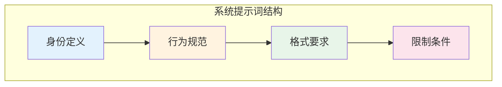

## 13.1 OpenAI GPT 系列最佳实践

> **说明（核验日期：2026-05-18）：** 本节所涉及的 API 参数、模型特性及最佳实践基于 2026 年 5 月的官方文档编写。由于 OpenAI 平台更新频繁，在实际应用中请参考最新的官方文档。

OpenAI 是大语言模型商业化的先驱，其 GPT 系列是应用最广泛的语言模型。本节深入介绍针对 GPT 系列的提示词优化策略，涵盖从 GPT-4o 到最新的 GPT-5.x 推理模型。OpenAI 官方模型页说明最新模型可通过 Responses API 使用；对新项目而言，Responses API 与 Agents SDK 通常是构建工具调用、状态管理和智能体工作流的主入口，Chat Completions 更适合作为兼容旧代码和简单对话的稳定接口。

> **注意（平台变更）**：模型可用性、上下文窗口和价格更新很快。如果你的系统强绑定某个模型版本，请以官方最新公告/文档为准，并通过回归测试验证迁移影响。

### 13.1.1 GPT 模型系列概览

OpenAI 目前提供多个系列的模型，适用于不同场景：

| 模型系列 | 核心特点 | 适用场景 |
|---------|---------|----------|
| GPT-5.5 | 官方当前前沿模型；1M 上下文，128K 最大输出 | 复杂分析、高精度任务、代理工作流 |
| GPT-5.4 | 1M 上下文；价格低于 GPT-5.5 | 通用高级任务、成本敏感的复杂任务 |
| GPT-5.4 mini | 400K 上下文；低延迟、低成本 | 高吞吐子任务、批量处理 |
| GPT-5.1 | 400K 上下文，128K 最大输出 | 历史兼容、迁移过渡 |
| o 系列（o1/o3） | 较早一代推理优先路线 | 数学、编程、逻辑推理（历史与专门场景） |
| GPT-4o | 较早的多模态 GPT 模型 | 既有系统兼容、实时交互 |
| GPT-4o mini | 成本优化、快速 | 简单任务、高并发场景 |

### 13.1.2 系统提示词设计

GPT 模型对系统提示词有出色的遵从性，这是设计提示词的核心要素。

#### 基本结构

```python
messages = [
    {
        "role": "system",
        "content": """你是一位专业的数据分析师，具备以下特点：
- 擅长解读复杂数据并提供可操作的洞察
- 回答简洁、结构清晰
- 在不确定时会明确说明假设条件

输出要求：
1. 使用 Markdown 格式
2. 关键数据用表格呈现
3. 结论放在最前面"""
    },
    {
        "role": "user",
        "content": "分析这份销售数据..."
    }
]
```

#### 系统提示词的关键要素


```mermaid
flowchart TB
    subgraph SystemPrompt["系统提示词结构"]
        Identity["身份定义"]
        Behavior["行为规范"]
        Format["格式要求"]
        Constraints["限制条件"]
    end

    Identity --> Behavior --> Format --> Constraints

    style Identity fill:#e3f2fd
    style Behavior fill:#fff3e0
    style Format fill:#e8f5e9
    style Constraints fill:#fce4ec
```

*图 13-1：系统提示词的四个核心层次*

- **身份定义**：明确模型扮演的角色和专业领域
- **行为规范**：定义回答风格、语气和处理方式
- **格式要求**：指定输出的结构和格式
- **限制条件**：设定边界和禁止事项

### 13.1.3 函数调用与结构化输出

GPT 系列原生支持函数调用和结构化输出，是构建 智能体（agent） 系统的关键能力。

#### Responses API 与 Agents SDK

OpenAI 的 Responses API 支持文本、图像、文件输入，能够通过 `previous_response_id` 或 `conversation` 管理状态，并可直接接入 Web Search、File Search、Computer Use、Code Interpreter 等内置工具。需要自己掌控工具循环、状态持久化和服务边界时，可直接使用 Responses API；需要运行多步工作流、handoff、guardrails、tracing、sessions 或沙箱型 agent 时，应优先评估 Agents SDK。

```python
from openai import OpenAI

client = OpenAI()

response = client.responses.create(
    model="gpt-5.4",
    instructions="你是严谨的技术研究助手，回答必须列出来源。",
    input="检索 Docker Model Runner 的核心用途，并给出三条应用建议。",
    tools=[{"type": "web_search"}],
)

print(response.output_text)
```

函数调用仍是连接私有系统的主力方式；区别在于，新项目通常把函数工具挂到 Responses API 或 Agents SDK 上，而不是只围绕 `chat.completions.create()` 组织整个应用。

#### 函数定义示例

```python
tools = [
    {
        "type": "function",
        "function": {
            "name": "get_weather",
            "description": "获取指定城市的天气信息",
            "parameters": {
                "type": "object",
                "properties": {
                    "city": {
                        "type": "string",
                        "description": "城市名称，如：北京、上海"
                    },
                    "unit": {
                        "type": "string",
                        "enum": ["celsius", "fahrenheit"],
                        "description": "温度单位"
                    }
                },
                "required": ["city"]
            }
        }
    }
]
```

#### 结构化输出

2024 年 OpenAI 推出的结构化输出功能，确保模型输出严格符合指定的 JSON Schema：

```python
try:
    from pydantic import BaseModel
except ModuleNotFoundError:
    class BaseModel:
        def __init__(self, **data):
            for k, v in data.items():
                setattr(self, k, v)

        def model_dump(self):
            return dict(self.__dict__)

from openai import OpenAI

client = OpenAI()
messages = [{"role": "user", "content": "分析这款产品：智能手表"}]

class ProductAnalysis(BaseModel):
    product_name: str
    sentiment: str  # positive, negative, neutral
    key_points: list[str]
    confidence_score: float

response = client.beta.chat.completions.parse(
    model="gpt-5.4",
    messages=messages,
    response_format=ProductAnalysis
)

# 返回结果自动解析为 Python 对象

analysis = response.choices[0].message.parsed
print(analysis.model_dump() if hasattr(analysis, "model_dump") else analysis)
```

**结构化输出的优势**：

- 显著提升输出符合 Schema 的概率，但服务边界仍应保留 JSON Schema 校验、失败重试和降级路径
- 支持复杂嵌套结构
- 与 Pydantic 无缝集成

### 13.1.4 o 系列推理模型策略

o 系列是 OpenAI 较早一代专为复杂推理设计的路线。当前默认前沿主线已经转向 GPT-5.5，但理解 o 系列仍有助于把握推理模型的演进脉络。

#### 核心差异

| 维度 | GPT 系列 | o 系列 |
|------|-----------|-----------|
| 思维链 | 需显式要求 | 内置自动执行 |
| 响应时间 | 秒级 | 可能需要分钟级 |
| 系统提示词 | 完整支持 | 部分限制 |
| 推理控制 | 无 | 支持推理预算设置 |

#### o 系列的提示词策略

```text
❌ 不需要的写法：
"请一步步思考，展示你的推理过程..."

✅ 推荐的写法：
"证明：对于所有大于 2 的偶数 n，存在两个质数 p 和 q 使得 n=p+q"
```

**关键原则**：

1. **直接陈述问题**：无需要求“逐步思考”，模型会自动进行
2. **提供充分上下文**：复杂问题需要完整的背景信息
3. **设置推理预算**：通过 `reasoning_effort` 参数控制推理深度

```python
from openai import OpenAI

client = OpenAI()
problem_statement = "证明：对于所有大于 2 的偶数 n，存在两个质数 p 和 q 使得 n=p+q。"

response = client.chat.completions.create(
    model="o3",
    messages=[{"role": "user", "content": problem_statement}],
    reasoning_effort="high"  # low, medium, high
)

print(response.choices[0].message.content)
```

### 13.1.5 高级技巧

#### 1. 使用分隔符组织复杂提示词

```text

### 背景信息 ###

{context}

### 任务要求 ###

{task}

### 输出格式 ###

{format}
```

#### 2. 利用 JSON 模式确保格式一致

```python
from openai import OpenAI

client = OpenAI()
messages = [{"role": "user", "content": "用 JSON 输出：{\"hello\": \"world\"}"}]

response = client.chat.completions.create(
    model="gpt-5.4",
    messages=messages,
    response_format={"type": "json_object"}
)

print(response.choices[0].message.content)
```

#### 3. 温度参数调优

| 任务类型 | 推荐 Temperature |
|---------|-----------------|
| 代码生成、事实问答 | 0 - 0.3 |
| 通用对话、文案写作 | 0.5 - 0.7 |
| 创意写作、头脑风暴 | 0.8 - 1.0 |

#### 4. 多轮对话中的上下文管理

```python

# 保持关键信息在上下文开头和结尾

system_prompt = "你是一个有帮助的助手。"
important_context = "【关键信息】用户正在做产品选型。"
current_question = "请给出建议。"
key_reminder = "务必输出要点列表。"

messages = [
    {"role": "system", "content": system_prompt},
    {"role": "user", "content": important_context},  # 开头
    # ... 中间对话 ...
    {"role": "user", "content": current_question + "\n\n" + key_reminder}  # 结尾
]

print(messages)
```

### 13.1.6 常见问题与解决方案

| 问题 | 解决方案 |
|------|---------|
| 输出格式不稳定 | 使用 Structured Outputs 或 JSON 模式 |
| 模型“跑题” | 在系统提示词中明确任务边界 |
| 回答过长 | 指定字数限制或使用 `max_tokens` |
| 幻觉问题 | 结合 RAG，要求引用来源 |

### 动手试试

1. 对比 GPT 系列的“推理模型”（o 系列）和“常规模型”（GPT-4o）处理同一个复杂任务的效果差异——什么时候推理模型明显更好？
2. 试着用 system message 和 developer message 分别设置同一条指令，观察它们对模型行为影响的区别。
