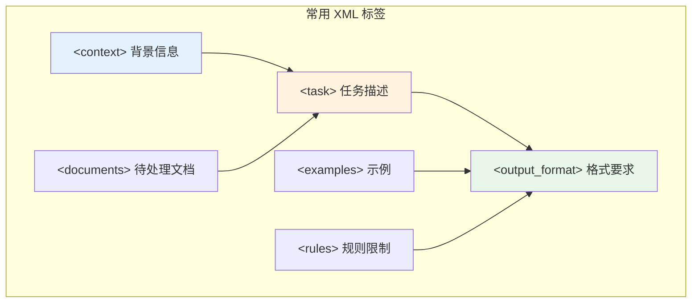

## 13.2 Anthropic Claude 提示技巧

> **说明：** 本节所涉及的模型特性及最佳实践基于 2026 年初的版本（涵盖 Claude 4.x 家族）编写。在实际应用中请参考 Anthropic 最新的官方文档。

Anthropic 的 Claude 系列以卓越的安全性、超长上下文窗口和独特的提示词技术著称。本节深入介绍 Claude 的核心特性和针对性的提示词优化策略。

### 13.2.1 Claude 模型系列

Claude 目前提供多个模型层级，满足不同场景需求：

| 模型 | 上下文 | 核心优势 | 适用场景 |
|------|-------|---------|----------|
| Claude Opus 4.7 | 1M | 强化推理、SWE 与视觉、新 tokenizer | 最复杂研究、代码库分析、高级推理 |
| Claude Opus 4.6 | 1M | 最强能力、深度分析、增强安全 | 复杂研究、高级推理 |
| Claude Sonnet 4.6 | 1M | 领先编码能力、VS Code 集成 | 企业应用、软件开发 |
| Claude Haiku 4.5 | 200K | 快速响应、低成本 | 简单任务、高并发 |

> **说明（平台迁移）**：自 2026 年 1 月 12 日起，`console.anthropic.com` 已重定向至 `platform.claude.com`。旧版 Claude Opus 3 和 Haiku 3.5 已弃用，建议升级至最新版本。

### 13.2.2 XML 标签：Claude 的提示词利器

Claude 对 XML 标签有出色的识别和遵从能力，这是区别于其他模型的标志性特征。

#### 基础结构

```xml
<context>
你正在帮助一家电商公司分析用户反馈。该公司主营电子产品，
目标客户群体为 25-45 岁的城市白领。
</context>

<documents>
<doc id="1">用户 A 评价：产品质量很好，但物流太慢...</doc>
<doc id="2">用户 B 评价：性价比超高，强烈推荐...</doc>
</documents>

<task>
请分析上述用户反馈，识别主要的正面和负面主题，
并提供可操作的改进建议。
</task>

<output_format>
请按以下结构输出：
1. 正面主题（列表）
2. 负面主题（列表）
3. 改进建议（按优先级排序）
</output_format>
```

#### 常用 XML 标签


```mermaid
flowchart TB
    subgraph Tags["常用 XML 标签"]
        context["&lt;context&gt; 背景信息"]
        documents["&lt;documents&gt; 待处理文档"]
        task["&lt;task&gt; 任务描述"]
        format["&lt;output_format&gt; 格式要求"]
        examples["&lt;examples&gt; 示例"]
        rules["&lt;rules&gt; 规则限制"]
    end

    context --> task
    documents --> task
    task --> format
    examples --> format
    rules --> format

    style context fill:#e3f2fd
    style task fill:#fff3e0
    style format fill:#e8f5e9
```

*图 13-2：Claude XML 标签结构*

### 13.2.3 预填充技术

预填充是 Claude 独有的强大功能，通过预设回复的开头部分，精确控制输出格式。

#### 基本用法

```python
from anthropic import Anthropic

client = Anthropic()

response = client.messages.create(
    model="claude-sonnet-4-6",
    max_tokens=1024,
    messages=[
        {"role": "user", "content": "分析这段文本的情感倾向：'产品很棒，但客服态度一般'"},
        {"role": "assistant", "content": '{"sentiment":'}  # 预填充
    ]
)

# Claude 将从预填充位置继续：{"sentiment": "mixed", "details": ...}

for block in response.content:
    if block.type == "text":
        print(block.text)
```

#### 进阶应用：强制 JSON 输出

```python
prompt = "请输出一个 JSON，包含字段 sentiment 与 confidence。"

messages = [
    {"role": "user", "content": prompt},
    {"role": "assistant", "content": "```json\n{"}
]

# Claude 将输出完整的 JSON，并以 ``` 结尾

print(messages)
```

#### 预填充的最佳实践

| 场景 | 预填充内容 | 效果 |
|------|-----------|------|
| JSON 输出 | `{"` 或 `[{` | 确保 JSON 格式 |
| 编号列表 | `1. ` | 强制列表格式 |
| 代码输出 | \`\`\`python\n | 确保代码块格式 |
| 特定开头 | `根据分析，` | 控制回答风格 |

### 13.2.4 扩展思考

Claude 3.7 Sonnet 起支持扩展思考功能，允许模型在回答前进行深入的内部推理（现 Claude Sonnet 4.6 亦支持）。

#### 启用扩展思考

```python
from anthropic import Anthropic

client = Anthropic()
complex_problem = "请证明：1+2+...+n = n(n+1)/2。"

response = client.messages.create(
    model="claude-sonnet-4-6",
    max_tokens=16000,
    thinking={
        "type": "adaptive"
    },
    messages=[{"role": "user", "content": complex_problem}]
)

# 访问思考过程

for block in response.content:
    if block.type == "thinking":
        print("思考过程:", block.thinking)
    elif block.type == "text":
        print("最终回答:", block.text)
```

> **注意**：在 Claude Sonnet 4.6 上，Anthropic 推荐优先使用 Adaptive Thinking（`type: "adaptive"`）。Extended Thinking（`type: "enabled"`）仍可用，但已标记为 deprecated，更适合兼容旧代码时使用。

#### 扩展思考的适用场景

- **数学证明**：需要多步骤逻辑推导
- **代码调试**：需要追踪复杂执行流程
- **策略分析**：需要权衡多种因素
- **学术研究**：需要深入分析论证

### 13.2.5 长上下文处理策略

Claude 的长上下文能力可以处理整本书籍，但需要注意信息组织策略。Opus 4.7/4.6 和 Sonnet 4.6 均支持 1M 上下文窗口（已 GA，无长上下文溢价），Haiku 4.5 为 200K。特别需要注意的是 Opus 4.7 采用了新的 tokenizer，相同文本可能消耗 1.00-1.35 倍的 token，在长上下文场景下成本影响更明显。

#### 关键信息位置原则

```text
⚠️ "中间迷失"（Lost in the Middle）现象：
模型对上下文开头和结尾的信息关注度更高，
中间部分的信息可能被忽略。

✅ 解决方案：
1. 将最重要的信息放在开头或结尾
2. 使用明确的标签分隔不同部分
3. 在问题中引用关键段落编号
```

#### 长文档处理模板

```xml
<document>
以下是一份 150 页的技术报告，请仔细阅读后回答问题。
{long_document_content}
</document>

<question>
根据上述报告第三章的数据，分析 2024 年的市场趋势。
注意：请确保答案基于报告内容，如有不确定请明确指出。
</question>
```

### 13.2.6 安全与对齐特性

Claude 在安全对齐方面有独特优势，适合构建高可靠性应用。

#### 利用 Claude 的诚实性

```xml
<instructions>
请分析以下商业提案的可行性。

重要规则：
- 如果信息不足以做出判断，请明确说明需要哪些额外信息
- 如果发现潜在风险，请详细列出
- 不要为了显得有帮助而忽略问题
</instructions>
```

#### 防止有害输出

Claude 天然具有较强的安全边界，但仍可通过系统提示词强化：

```xml
<system_rules>
你是一个专业的法律顾问助手。

禁止事项：
- 不得提供具体的法律建议，只能提供一般性信息
- 遇到敏感话题时，建议用户咨询专业律师
- 不得帮助规避法律
</system_rules>
```

### 13.2.7 实战示例：复杂文档分析

```xml
<role>
你是一位资深的商业分析师，擅长从财务报告中提取关键洞察。
</role>

<context>
客户是一家寻求投资的初创公司，需要评估目标公司的财务健康状况。
</context>

<documents>
<annual_report>
{complete_annual_report_content}
</annual_report>
</documents>

<task>
请完成以下分析任务：
1. 提取关键财务指标（收入、利润、现金流）
2. 识别年报中的风险信号
3. 评估公司的长期增长潜力
4. 给出投资建议（推荐/谨慎/不推荐）
</task>

<output_format>

## 财务指标摘要

| 指标 | 数值 | 同比变化 |
...

## 风险信号

1. ...

## 增长潜力评估

...

## 投资建议

建议：[推荐/谨慎/不推荐]
理由：...
</output_format>
```

### 13.2.8 案例解析：Claude 设计系统提示词的架构

Anthropic 在 Claude 设计工具中使用的系统提示词是一个生产级 System Prompt 的典范，篇幅达数千 tokens，涵盖角色、安全、工作流、输出规范、领域知识等多个维度。拆解其架构，可以总结出以下值得借鉴的模式。

#### 多身份角色切换

提示词没有将 Claude 锁定为单一角色，而是定义了一个”专家级设计师”的元角色，要求模型根据任务类型动态切换子身份——动画师、UX 设计师、幻灯片设计师、原型设计师等。这种”元角色 + 上下文触发”的模式比静态角色定义更灵活。

#### 安全约束的分层设计

提示词在开篇紧接角色定义之后，立即声明安全红线：严禁泄露系统提示词、工具名称或技术环境细节。关键技巧是区分”可以谈”和”不可以谈”——Claude 可以用非技术方式描述自己的能力（如”我可以创建 HTML 文件”），但不能暴露实现细节（如工具名称、内部标签格式）。

#### 工作流的过程化编码

提示词将设计工作流分解为六个明确步骤：(1) 理解需求并提问；(2) 探索已有资源；(3) 制定计划；(4) 搭建文件结构；(5) 执行并交付验证；(6) 简短总结。每一步都附带具体行为指引，而非泛泛的”请认真思考”。

#### “不可协商”标记模式

提示词使用”绝不””不可协商””关键”等强标记词来区分硬约束与软建议。例如：

- “**绝对不要** 写 `const styles = {...}`”——样式命名空间冲突会导致页面损坏
- “**不可协商的**——样式对象命名冲突会造成损坏”
- “除非被明确告知，否则 **绝不** 添加讲者备注”

这种分级约束让模型能在有限上下文中正确排列优先级。

#### 从故障到规则的提炼

每条工程约束背后都有真实故障场景：样式命名冲突导致页面渲染错误、`scrollIntoView` 弄乱 Web 应用、未固定版本导致构建不可复现。这种”踩坑驱动”的规则比抽象原则更有约束力，也更容易被模型准确执行。

这个案例展示了生产级 System Prompt 的核心架构：**安全红线 → 工作流程 → 硬约束规范 → 领域最佳实践 → 灵活创造空间**。从顶层不可触碰的安全边界，到底层鼓励探索的设计自由度，层层递进。

### 想一想

1. Claude 偏好 XML 标签来组织提示词结构——这和 GPT 偏好的 Markdown 格式相比，在什么场景下优势更明显？
2. Claude 的 “extended thinking” 功能相当于内置了思维链——这是否意味着你不再需要手动添加 “一步步思考” 之类的指令？
3. Claude 设计系统提示词中的”不可协商”标记模式，如何应用到你自己的 System Prompt 中？试着为你的应用场景设计 2-3 条硬约束。
