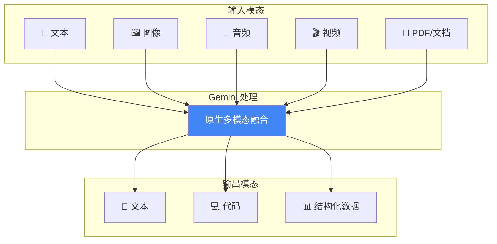

## 13.3 Google Gemini 提示策略

> **说明：** 本节内容基于 2026 年初 Gemini 模型家族的能力编写。考虑到多模态模型的快速演进，在实际应用中请参考 Google 最新的开发者文档。

Google 的 Gemini 是从设计之初就采用原生多模态架构的大语言模型系列。本节深入介绍 Gemini 的核心特性和针对性的提示词优化策略。

### 13.3.1 Gemini 模型系列

Gemini 提供多个模型层级，覆盖不同的能力和成本需求：

| 模型 | 上下文窗口 | 核心特点 | 适用场景 |
|------|-----------|---------|----------|
| Gemini 3 | 2M+ tokens | 最新旗舰、个人智能集成 | 最复杂任务、跨应用分析 |
| Gemini 2.0 Pro | 2M tokens | 最强能力、多模态 | 复杂分析、长文档 |
| Gemini 2.0 Flash | 1M tokens | 快速响应、高性价比 | 实时交互、批量处理 |
| Gemini 2.0 Flash-Lite | 1M tokens | 成本优化、极速 | 高并发场景 |
| Gemini Nano | 设备端 | 轻量级、离线运行 | 移动端本地应用 |

> **2M Token 上下文**：Gemini 的超长上下文窗口目前是业界最大，可处理约 150 万字的中文文本，或约 1 小时的视频内容。

### 13.3.2 原生多模态能力

Gemini 的核心优势在于从架构层面就支持多种模态的融合处理。

#### 多模态输入示例

```python
import os
import google.generativeai as genai

api_key = os.getenv("GEMINI_API_KEY") or os.getenv("GOOGLE_API_KEY")
genai.configure(api_key=api_key)

model = genai.GenerativeModel("gemini-2.0-pro")
product_image = b"<demo_image_bytes>"
audio_clip = b"<demo_audio_bytes>"

# 混合多种模态
response = model.generate_content([
    "请分析这张产品图片和用户反馈音频，给出综合评估：",
    product_image,   # PIL Image
    audio_clip,      # 音频文件
    "补充信息：这是一款智能手表，目标用户是运动爱好者。"
])

print(response)
```

#### 支持的模态类型



*图 13.3-1：Gemini 多模态处理流程*

### 13.3.3 多模态提示词设计

#### 图像理解与分析

```
请详细分析这张建筑图片：

[图片]

分析维度：
1. 建筑风格（古典/现代/后现代等）
2. 主要建筑材料
3. 设计特色和创新点
4. 预估建造年代

请用专业但易懂的语言解释，适合建筑爱好者阅读。
```

#### 视频内容分析

```
请分析这段教学视频：

[视频]

分析要求：
1. 提取关键知识点（按时间戳标注）
2. 评估教学方法的有效性
3. 识别可能confused观众的部分
4. 生成 5 个检验理解的问题

输出格式：Markdown 带时间戳
```

#### 跨模态推理

```
这是一份手写数学作业的照片：

[图片]

请完成以下任务：
1. 识别所有数学表达式
2. 检查计算过程是否正确
3. 对于错误的步骤，指出错在哪里并给出正确解法
4. 给出整体评分（满分100分）
```

### 13.3.4 超长上下文处理策略

Gemini 的 2M token 上下文可以处理：
- 约 150 万字的中文文本
- 整本小说或技术书籍
- 约 1 小时的视频
- 约 10 小时的纯音频

#### 长文档处理最佳实践

```
<document>
以下是《三国演义》全文，共约 80 万字：
{entire_book_content}
</document>

<question>
请分析全书中诸葛亮的人物形象变化：
1. 出山前（隆中对之前）
2. 辅佐刘备时期
3. 托孤后独掌大权时期
4. 北伐时期

每个时期请引用原文中的具体章节和段落作为支撑。
</question>
```

#### 信息检索模式

对于超长文档中的精确查找：

```
在上述文档中，找出所有提到"战略"或"策略"的段落，
并按以下格式列出：

| 位置 | 原文摘录 | 上下文主题 |
|-----|---------|-----------|
```

### 13.3.5 Google 生态集成

Gemini 与 Google 产品生态深度集成，可利用这些能力增强应用。

#### 与 Google Search 结合

```python
# 使用 Grounding 功能接入最新信息
import os
import google.generativeai as genai

api_key = os.getenv("GEMINI_API_KEY") or os.getenv("GOOGLE_API_KEY")
genai.configure(api_key=api_key)

model = genai.GenerativeModel("gemini-2.0-pro")

response = model.generate_content(
    "2024年诺贝尔物理学奖得主是谁？获奖原因是什么？",
    tools=[{"google_search": {}}]  # 启用搜索增强
)

print(response)
```

#### 与 Google Workspace 协作

```
你可以访问用户的 Google Drive 文档。

任务：
1. 阅读名为"Q3财务报告"的 Google Sheets
2. 分析销售趋势
3. 生成一份摘要，可以直接粘贴到 Google Docs
```

### 13.3.6 结构化输出指定

Gemini 支持严格的输出格式控制：

```python
import os
import google.generativeai as genai
from google.generativeai.types import GenerationConfig

api_key = os.getenv("GEMINI_API_KEY") or os.getenv("GOOGLE_API_KEY")
genai.configure(api_key=api_key)

model = genai.GenerativeModel("gemini-2.0-pro")
prompt = "对这段文本做情感分析并输出 JSON。"

config = GenerationConfig(
    response_mime_type="application/json",
    response_schema={
        "type": "object",
        "properties": {
            "sentiment": {"type": "string", "enum": ["positive", "negative", "neutral"]},
            "confidence": {"type": "number"},
            "keywords": {"type": "array", "items": {"type": "string"}}
        }
    }
)

response = model.generate_content(prompt, generation_config=config)

print(response)
```

### 13.3.7 提示词模板示例

#### 综合分析模板

```
角色：资深数据分析师

任务：
分析提供的多模态数据，生成综合报告。

输入数据：
- 图片：[产品图片]
- 文档：[用户调研报告PDF]  
- 数据：[销售数据CSV]

分析维度：
1. 产品视觉吸引力评估
2. 用户反馈主题分析
3. 销售数据趋势
4. 综合建议

输出要求：
- 结构化 Markdown 报告
- 包含数据可视化描述
- 可操作的建议清单
```

### 13.3.8 常见问题与解决方案

| 问题 | 解决方案 |
|------|---------|
| 视频分析不够细致 | 指定具体时间段，或要求逐分钟分析 |
| 图像细节遗漏 | 要求"仔细观察图片的每个区域" |
| 长文档遗忘开头 | 在问题中引用关键段落位置 |
| 输出过于冗长 | 明确字数限制，使用结构化输出 |


### 延伸思考

1. Gemini 的原生多模态能力意味着你可以在一个提示中混合文本、图像甚至视频。你认为哪个多模态组合在你的业务中最有实用价值？
2. 同样的任务，在 GPT、Claude、Gemini 上分别需要不同的提示词优化。维护多平台提示词的成本是否值得？你会如何管理？
