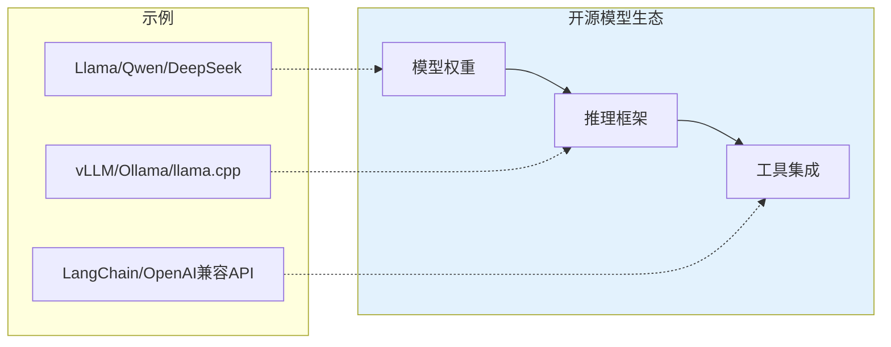

## 13.4 开源模型的提示词适配

开源大语言模型如 Llama、Qwen、DeepSeek 等提供了本地部署的灵活性和数据隐私保障。本节深入介绍开源模型的特点和提示词适配策略。

### 开源模型生态概览

当前主流的开源大语言模型：

| 模型系列 | 开发者 | 参数规模 | 核心优势 |
|---------|-------|---------|---------|
| Llama 3.x | Meta | 8B-405B | 社区活跃、生态完善 |
| Qwen 2.5 | 阿里 | 0.5B-72B | 中文优化、多语言 |
| DeepSeek V3 | DeepSeek | 671B (MoE) | 推理能力强、代码优秀 |
| Mistral/Mixtral | Mistral AI | 7B-8x22B | 高效架构、欧洲开源先锋 |
| ChatGLM | 智谱AI | 6B-130B | 中文原生、学术背景 |



*图 13.4-1：开源模型技术栈*

### 提示词模板格式

**使用正确的模板格式是开源模型获得良好效果的关键前提。**

#### Llama 3 格式

Llama 3 使用特殊的 header 标记格式：

```
<|begin_of_text|><|start_header_id|>system<|end_header_id|>

你是一个专业的助手，擅长回答技术问题。<|eot_id|>
<|start_header_id|>user<|end_header_id|>

请解释量子计算的基本原理。<|eot_id|>
<|start_header_id|>assistant<|end_header_id|>

```

#### ChatML 格式（Qwen、Yi 等）

ChatML 是一种被广泛采用的标准格式：

```
<|im_start|>system
你是一个专业的助手，擅长回答技术问题。<|im_end|>
<|im_start|>user
请解释量子计算的基本原理。<|im_end|>
<|im_start|>assistant
```

#### Alpaca 格式（通用微调模型）

许多基于 Alpaca 微调的模型使用这种简单格式：

```
Below is an instruction that describes a task. Write a response that appropriately completes the request.

### Instruction:
请解释量子计算的基本原理。

### Response:
```

### 模型特定的提示词策略

#### Llama 3 系列

Llama 3 是目前社区生态最完善的开源模型。

**特点**：
- 强大的指令遵循能力
- 代码生成能力优秀
- 多语言支持良好（但中文能力弱于 Qwen）

**提示词建议**：
- 使用英文效果通常优于中文
- 可以使用较少的 few-shot 示例
- 对结构化输出（如 JSON）支持良好

```python
# 使用 Ollama 调用 Llama 3
import ollama

response = ollama.chat(
    model='llama3.1:70b',
    messages=[
        {'role': 'system', 'content': 'You are a helpful coding assistant.'},
        {'role': 'user', 'content': 'Write a Python function to calculate fibonacci numbers.'}
    ]
)
```

#### Qwen 2.5 系列

Qwen 是目前中文能力最强的开源模型之一。

**特点**：
- 中文理解和生成能力优秀
- 多语言支持（含代码）
- 提供多种规模（0.5B 到 72B）

**提示词建议**：
- 可以直接使用中文提示词
- 对复杂任务分解响应良好
- 支持 function calling

```python
# Qwen 中文提示词示例
prompt = """
你是一位专业的文案编辑。请将以下技术文档改写为面向普通用户的产品说明：

原文：
本系统采用微服务架构，通过 Kubernetes 编排容器化部署，
支持水平扩展和自动故障恢复。

要求：
1. 去除技术术语
2. 突出用户价值
3. 控制在100字以内
"""
```

#### DeepSeek 系列

DeepSeek 在代码和数学推理方面表现出色。

**特点**：
- MoE 架构，高效推理
- 代码生成能力接近 GPT-4
- 支持长上下文（128K）

**提示词建议**：
- 数学和编程任务优先考虑
- 可以要求详细的推理过程
- 支持中英文混合

### 本地部署与推理优化

#### 推理框架选择

| 框架 | 特点 | 适用场景 |
|------|------|---------|
| Ollama | 简单易用 | 个人学习、快速原型 |
| vLLM | 高吞吐量 | 生产环境、高并发 |
| llama.cpp | CPU 友好 | 边缘设备、CPU 推理 |
| TGI | HuggingFace 生态 | 企业级部署 |

#### 使用 Ollama 快速部署

```bash
# 安装模型
ollama pull qwen2.5:14b

# 运行对话
ollama run qwen2.5:14b "请用Python写一个快速排序算法"

# 作为 API 服务
ollama serve
```

#### OpenAI 兼容 API

大多数推理框架提供 OpenAI 兼容的 API，方便迁移：

```python
from openai import OpenAI

# 指向本地服务
client = OpenAI(
    base_url="http://localhost:11434/v1",  # Ollama 地址
    api_key="unused"  # 本地部署通常不需要密钥
)

response = client.chat.completions.create(
    model="qwen2.5:14b",
    messages=[
        {"role": "system", "content": "你是一个有帮助的助手"},
        {"role": "user", "content": "你好！"}
    ]
)
```

### 开源模型的能力边界

与闭源模型相比，开源模型的注意事项：

| 维度 | 优势 | 局限 |
|------|------|------|
| 数据隐私 | 数据不出本地 | - |
| 定制自由 | 可微调适配 | 需要技术能力 |
| 成本 | 推理成本低 | 部署成本 |
| 能力 | 特定任务可优化 | 通用能力通常弱于顶级闭源模型 |
| 更新 | 版本迭代快 | 需要跟踪社区动态 |

### 提示词适配最佳实践

1. **确认模板格式**：使用模型官方推荐的提示词模板
2. **测试基准任务**：在关键任务上对比不同模型
3. **调整期望**：小模型能力有限，任务可能需要简化
4. **利用量化**：4bit/8bit 量化可大幅降低显存需求
5. **关注社区**：HuggingFace、GitHub 有丰富的微调版本

### 小结

开源模型为需要数据隐私、成本优化或深度定制的场景提供了重要选择。在使用开源模型时，关键是选择正确的提示词模板格式、了解各模型的能力特点，并根据实际需求选择合适的部署方案。

Llama 3 生态最完善，Qwen 中文最优，DeepSeek 代码推理最强——根据任务特点选择合适的模型，是成功应用开源模型的关键。

### 延伸阅读

- [Meta Llama](https://llama.meta.com/) - Llama 官方网站
- [Qwen GitHub](https://github.com/QwenLM/Qwen2.5) - Qwen 开源仓库
- [DeepSeek](https://www.deepseek.com/) - DeepSeek 官方网站
- [Ollama](https://ollama.com/) - 本地模型运行工具
- [vLLM](https://github.com/vllm-project/vllm) - 高性能推理引擎
- [Hugging Face Open LLM Leaderboard](https://huggingface.co/spaces/open-llm-leaderboard/open_llm_leaderboard) - 开源模型评测榜单
