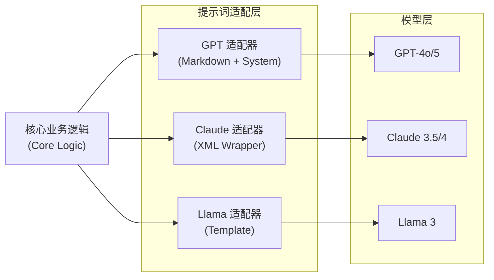

## 13.5 跨模型提示词策略 (Cross-Platform Strategy)

随着企业级 AI 应用的普及，开发者常面临一个棘手的工程问题：**提示词是否应该绑定到特定模型？**

如果我有多个模型（例如 GPT-4 用于复杂推理，Claude 3.5 用于长文档分析，Llama 3 用于即时响应），是否需要维护多套完全不同的提示词？

本节将深入探讨提示词的"移植性"问题，并提供生产环境下的最佳实践。

### 13.5.1 提示词的"移植性"矩阵

不同模型由于训练数据分布、指令微调策略的差异，对提示词格式的偏好也不同。以下是主流模型对提示词语法的偏好矩阵：

| 特性 | OpenAI GPT 系列 | Anthropic Claude 系列 | Google Gemini 系列 | Meta Llama 系列 |
| :--- | :--- | :--- | :--- | :--- |
| **首选格式** | Markdown | XML 标签 | Markdown / 自由文本 | 特殊 Token / Markdown |
| **系统提示词** | 强依赖 (System Role) | 强依赖 (System 参数) | 支持 | 依赖模板格式 |
| **少样本示例** | 消息历史 (User/Assistant) | XML 包装 `<example>` | 消息历史 | 消息历史 |
| **思维链触发** | 需显式要求或 o1 自动 | 支持 `thinking` 参数 | 自然语言引导 | 自然语言引导 |
| **结构化输出** | JSON Schema / Function | 预填充 (Prefill) | JSON Schema | 语法约束 (Grammar) |

**结论**：
1.  **Markdown 是通用语**：几乎所有模型都能很好地理解 Markdown 格式（标题、列表、代码块）。
2.  **XML 是 Claude 的原生语**：虽然 GPT 也能理解 XML，但 Claude 对 XML 的结构化指令遵循度极高。
3.  **负面约束**：不同模型对"不要做某事"的敏感度不同，Claude 通常比 GPT 更遵守安全边界。

### 13.5.2 核心策略：适配器模式 (Adapter Pattern)

在软件工程中，适配器模式用于连接不兼容的接口。在提示词工程中，我们推荐采用 **"核心逻辑复用 + 格式层适配"** 的策略，而不是维护多套完全独立的代码。

#### 架构设计



*图 13.5-1：提示词适配器架构*

#### 代码实现示例 (Python)

以下是一个简单的适配器实现，演示如何根据目标模型动态组装提示词：


- **目的**：说明该示例要实现的能力与约束。
- **输入**：关键输入包括 system/user 消息、必要变量（如 `{query}`、`{context}`）、以及 API 参数。
- **输出**：模型输出遵循指定格式；如涉及工具则产出 `tool_calls`，如涉及结构化输出则产出符合 schema 的 JSON。
- **注意**（可选）：生产环境需做输入校验、失败兜底、以及日志与回归测试。

```python
class PromptAdapter:
    def __init__(self, core_instruction, context_data):
        self.instruction = core_instruction
        self.context = context_data

    def to_gpt(self):
        """构建 GPT 风格的提示词结构"""
        return [
            {
                "role": "system",
                "content": f"### Instructions\n{self.instruction}\n\n### Format\nPlease respond in Markdown."
            },
            {
                "role": "user",
                "content": f"### Context\n{self.context}"
            }
        ]

    def to_claude(self):
        """构建 Claude 风格的 XML 提示词"""
        xml_prompt = f"""
        <system_instructions>
        {self.instruction}
        </system_instructions>

        <context>
        {self.context}
        </context>

        Please follow the instructions to analyze the context.
        """
        # 注意：Claude API 通常将 system prompt 作为独立参数传递，
        # 或者是 user message 的一部分，取决于具体 SDK 版本。
        return [{"role": "user", "content": xml_prompt}]

# 使用示例
core_logic = "分析这段文本的情感，提取关键实体。"
data = "用户对新产品的电池续航非常满意，但认为价格太高。"

adapter = PromptAdapter(core_logic, data)

# 调用 GPT
gpt_messages = adapter.to_gpt()
# client.chat.completions.create(model="gpt-4o", messages=gpt_messages)

# 调用 Claude
claude_messages = adapter.to_claude()
# client.messages.create(model="claude-3-5-sonnet", messages=claude_messages)
```

**适配器的价值**：
*   **业务逻辑解耦**：当业务规则变更（例如"增加一步情感分析"）时，只需修改 Core Logic，所有模型自动生效。
*   **模型无感替换**：应用层代码不需要关心底层调用的具体模型格式。

### 13.5.3 元提示词 (Meta-Prompting) 自动转换

对于非常复杂的提示词，手动编写适配器可能很繁琐。一种更高级的技巧是使用 **元提示词**，让一个强模型（如 GPT-4 或 Claude Opus）充当"编译器"，将一个通用提示词"编译"为特定模型的最佳格式。

#### 转换器提示词示例


**目的**：提供可复用的提示词模板，便于直接迁移到业务任务。
**输入**：模板变量（如 `{topic}`/`{audience}`/`{constraints}`）+ 任务输入。
**输出**：模型按模板约束生成内容，结构与格式可直接用于下游处理。
**注意**（可选）：对关键约束（格式/安全/范围）做显式声明，减少模型自由发挥。

```markdown
# Role
You are a Prompt Engineering Expert specializing in model adaptation.

# Task
Convert the following [Generic Prompt] into a format optimized for [Target Model].

# Target Model Specifications
- **If Claude**: Use XML tags (<task>, <rules>) to structure the prompt. Put context in <context>. Use <thinking> for reasoning.
- **If GPT**: Use clear Markdown headers (# Task, # Context). Separate System and User roles clearly.
- **If Llama**: Use strict instruction following verifyable structure.

# Generic Prompt
"""
请分析简历中的技能点，并匹配职位描述。输出 JSON 格式。
职位描述：...
简历内容：...
"""

# Output
Output ONLY the converted prompt.
```

### 13.5.4 生产环境建议

1.  **通用任务**
    *   **场景**：摘要、翻译、简单的文本处理。
    *   **建议**：使用标准的 **Markdown** 格式。这是目前兼容性最好的"最大公约数"。

2.  **高精度业务**
    *   **场景**：复杂的逻辑推理、代码生成、格式要求极严的 API 调用。
    *   **建议**：使用适配器模式。针对主力模型（如 GPT-4）进行深度优化，针对备选模型（如 Llama 3）进行特定格式调整。

3.  **微调模型**
    *   **场景**：使用私有数据微调过的垂直领域模型。
    *   **建议**：**必须绑定**。微调模型通常对特定的 Prompt Template 过拟合，更改提示词结构可能会导致性能大幅下降。

### 思考

1.  您目前的系统中使用了几种模型？是否遇到过 Prompt 在 A 模型表现好，在 B 模型表现差的情况？
2.  在您的业务场景下，是维护多套 Prompt 的成本更高，还是编写适配器代码的成本更高？
