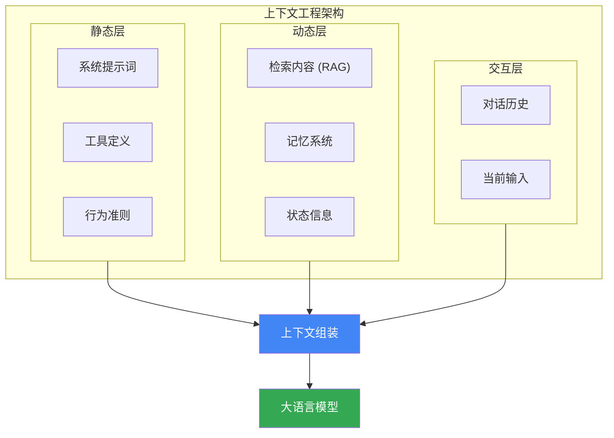

## 14.1 从提示词工程到上下文工程

随着 AI 应用复杂度的增加，业界正在经历从"提示词工程"向"上下文工程"的范式演进。这一转变反映了对 AI 系统整体架构设计的更高层次思考。

### 14.1.1 什么是上下文工程

**[上下文工程（Context Engineering）](https://yeasy.gitbook.io/context_engineering_guide/)** 关注的不仅是提示词文本本身，而是 **整个上下文窗口的系统性设计与管理**。

```
传统提示词工程：优化一段静态的指令文本
         ↓
上下文工程：动态组装整个模型输入的信息架构
```

Anthropic 的研究团队指出："真正决定 Agent 行为的不只是提示词，而是包括系统指令、工具定义、检索内容、对话历史等在内的完整上下文。"

### 14.1.2 为什么上下文工程至关重要

最新研究表明，Agent 系统的性能高度依赖于上下文的质量。对 Agent 技能的一项广泛评估显示：
- **80% 的性能方差** 来自上下文回填的质量（Context Stuffing），即能否准确提供相关的背景知识和工具定义。
- **10% 的性能方差** 来自探索能力（Exploration），即 Agent 尝试使用不同工具的策略。
- **仅 5% 的性能方差** 来自模型本身（Model Choice）的能力差异。

这有力地证明了：**优化上下文比单纯更换更强的模型能带来更大的效果提升。**

### 14.1.3 核心概念对比

| 维度 | 提示词工程 | 上下文工程 |
|------|-----------|-----------|
| **关注点** | 静态指令优化 | 整体上下文管理 |
| **信息来源** | 预设文本 | 动态检索与组装 |
| **时间跨度** | 单次交互 | 跨会话持久化 |
| **组件** | 单一提示词 | 多组件协同编排 |
| **复杂度** | 文本层面 | 系统架构层面 |

### 14.1.4 上下文失效模式

在设计复杂的上下文系统时，必须警惕随着上下文增长而出现的"衰退"现象。主要有三种典型的失效模式：

1. **中段丢失（Lost-in-the-Middle）**
   模型倾向于关注上下文的开头（系统指令）和结尾（最新对话），而忽略中间部分的信息。这意味着检索到的关键文档如果被埋没在长上下文的中间，可能会被模型"视而不见"。

2. **上下文中毒（Context Poisoning）**
   当检索器召回了大量表面相关但实际无关的信息（Distractors）时，这些噪音会显著降低模型的推理能力。与其提供大量低质量的参考资料，不如提供少量高精度的信息。

3. **上下文冲突（Context Clash）**
   当系统提示词、记忆模块和检索内容中包含相互矛盾的指令或事实时，模型的行为将变得不可预测。优秀的上下文工程需要包含冲突消解机制。

### 14.1.5 上下文工程的核心组件



*图 14.1-1：上下文工程的核心组件架构*

#### 静态层：系统级设定

- **系统提示词**：定义 Agent 的身份、能力边界和行为规范
- **工具定义**：描述可调用的外部能力（API、函数等）
- **行为准则**：安全规则、输出格式、交互风格

#### 动态层：实时信息注入

- **检索内容**：通过 RAG 获取的相关知识
- **记忆系统**：短期工作记忆和长期知识存储
- **状态信息**：当前任务进度、环境变量等

#### 交互层：对话上下文

- **对话历史**：多轮交互的完整记录
- **当前输入**：用户的即时请求

### 14.1.6 MCP：上下文工程的标准化

**MCP（Model Context Protocol）** 是 Anthropic 于 2024 年发布的开放协议，旨在标准化 AI 应用与上下文源之间的连接方式。

#### MCP 的核心理念

MCP 解决的核心问题是：**如何让 AI 应用安全、高效地访问各种数据源和工具？**


*图 14.1-2：MCP 协议连接 AI 应用与数据源*

#### MCP 的三大核心能力

1. **Resources（资源）**
   - 提供数据读取接口
   - 例如：读取文件、查询数据库

2. **Tools（工具）**
   - 提供可执行的操作
   - 例如：发送邮件、调用 API

3. **Prompts（提示模板）**
   - 提供可复用的提示词模板
   - 例如：代码审查模板、文档总结模板

#### MCP 配置示例

```json
{
  "mcpServers": {
    "filesystem": {
      "command": "npx",
      "args": ["-y", "@modelcontextprotocol/server-filesystem", "/Users/user/projects"]
    },
    "github": {
      "command": "npx",
      "args": ["-y", "@modelcontextprotocol/server-github"],
      "env": {
        "GITHUB_TOKEN": "your_token"
      }
    }
  }
}
```

### 14.1.7 上下文工程的关键技术

#### 1. 动态上下文组装

根据任务需求实时构建最优上下文：

```python
class ContextBuilder:
    def build_context(self, user_query: str) -> str:
        context_parts = []
        
        # 基础系统指令（始终包含）
        context_parts.append(self.system_prompt)
        
        # 根据查询检索相关知识
        if self.requires_knowledge(user_query):
            relevant_docs = self.rag.retrieve(user_query, top_k=5)
            context_parts.append(self.format_documents(relevant_docs))
        
        # 加载相关记忆
        if self.has_relevant_memory(user_query):
            memories = self.memory.recall(user_query)
            context_parts.append(self.format_memories(memories))
        
        # 添加当前对话历史（保留最近N轮）
        context_parts.append(self.format_history(self.conversation[-10:]))
        
        return self.compose(context_parts)
```

#### 2. 上下文压缩与优化

面对有限的上下文窗口，需要智能压缩：

- **对话历史压缩**：保留关键信息，摘要化早期对话
- **检索结果去重**：合并语义相似的片段
- **重要性排序**：将关键信息放在开头和结尾

#### 3. 上下文卸载（Context Offloading）

生产级 Agent 系统的核心策略是：**不要把所有东西都硬塞进上下文窗口，而是将信息卸载到外部存储，在需要时精确检索回来**。

这种模式的核心思想是：将文件系统作为 Agent 的"外部记忆"。

**典型应用场景**：

| 场景 | 卸载策略 |
|------|---------|
| 冗长的工具输出 | 写入文件，上下文中只保留文件路径 |
| 对话历史 | 压缩为摘要，完整版存为日志文件 |
| 终端会话输出 | 同步到本地文件系统 |

```python
# 上下文卸载示例：将工具输出写入文件
def execute_tool_with_offloading(tool_name, args):
    result = execute_tool(tool_name, args)
    
    if len(result) > MAX_CONTEXT_LENGTH:
        # 卸载到文件系统
        file_path = f"/tmp/tool_output_{tool_name}_{timestamp}.log"
        write_to_file(file_path, result)
        return f"结果已保存到 {file_path}，可用 tail 或 grep 命令查看"
    
    return result
```

**关键优势**：
- 让 Agent 可以用 `tail`、`grep` 等命令按需检索信息
- 避免上下文窗口被一次性填满
- 信息未丢失，只是"外部化"了

#### 4. 动态上下文发现（Dynamic Context Discovery）

与传统的"静态注入"模式不同，动态发现模式让 Agent 自己去查找需要的信息：

```
传统模式：将所有可能相关的信息一次性塞入上下文
     ↓
动态发现：在上下文中只放索引，让 Agent 按需检索详情
```

**实现思路**：

1. **索引层**：系统提示词中只包含资源的名称列表
2. **发现层**：详细定义存储在文件系统中，Agent 用搜索工具主动查找

```xml
<available_tools>
以下工具可用，详细定义见 /docs/tools/ 目录：
- web_search
- database_query
- file_processor
- mcp_client

需要使用工具时，请先查阅对应的定义文件。
</available_tools>
```

这种模式的效果：在实际测试中，对于调用了多种工具的任务，Token 消耗可降低 40-50%。

#### 5. 结构化的上下文缩减系统

当上下文持续增长时，需要分阶段执行缩减：

**第一阶段：紧凑化（Compaction）**

这是一种**无损、可逆**的缩减，剥离任何能从外部状态重建的信息：

```python
# 紧凑化示例
def compact_tool_history(history):
    for record in history:
        if record["tool"] == "write_file":
            # 文件内容可从磁盘重建，只保留路径
            record["content"] = f"[已写入: {record['path']}]"
    return history
```

> [!TIP]
> 紧凑化通常只应用于最早的 50% 历史记录，保留最新的完整工具调用作为 Few-shot 示例。

**第二阶段：摘要化（Summarization）**

当紧凑化收益有限时，启动有损压缩：

1. 将完整上下文转储到日志文件（创建快照）
2. 生成摘要替代原始内容
3. 保留最后几次完整的工具调用记录

```xml
<context_summary>
## 之前的工作摘要
- 完成了用户数据分析（详见 /logs/session_001.log）
- 生成了 3 份报告草稿
- 最新修改：更新了执行摘要部分

如需详细信息，可搜索上述日志文件。
</context_summary>
```

#### 6. 记忆系统分层

```
短期记忆（上下文窗口内）
    ↓ 选择性持久化
工作记忆（会话级存储）
    ↓ 提取关键信息
长期记忆（向量数据库）
```

### 14.1.8 实践指南：设计上下文工程系统

#### 设计原则

1. **模块化**：将上下文来源拆分为独立模块
2. **优先级**：明确不同信息的重要程度排序
3. **可观测性**：记录每次上下文的组成结构
4. **容错性**：单个模块失败不影响整体

#### 上下文预算分配示例

对于 128K token 的上下文窗口：

| 组件 | 预算分配 | 说明 |
|------|---------|------|
| 系统提示词 | 5K | 核心指令和规则 |
| 工具定义 | 5K | 函数签名和说明 |
| 检索内容 | 50K | RAG 返回的知识 |
| 对话历史 | 30K | 最近的对话轮次 |
| 工作记忆 | 20K | 任务相关记忆 |
| 用户输入 | 8K | 当前请求 |
| 预留输出 | 10K | 模型生成空间 |

### 14.1.9 上下文工程的未来方向

1. **自适应上下文**：AI 自主决定需要哪些上下文信息
2. **跨模态上下文**：统一管理文本、图像、音频等多模态信息
3. **协作式上下文**：多个 Agent 共享和协调上下文状态
4. **上下文安全**：防止敏感信息泄露和上下文污染

### 14.1.10 设计哲学：避免过度工程化

来自生产级 Agent 系统的经验表明，上下文工程的核心哲学是：

> **"少即是多"** — 提供给模型的初始细节越少，效果反而越好，因为能让 Agent 更轻松地自行抓取相关上下文。

> **"少构建，多理解"** — 上下文工程的目标是让模型的工作变得更简单，而不是更难。

实践中最大的突破往往不是来自增加更多的上下文管理层或巧妙的检索技巧，而是来自**简化**——移除不必要的技巧，对模型多一点信任。

设计思路的转变：

```
从：如何把更多信息塞进上下文
到：怎么给 Agent 创建一个信息丰富、易于探索的外部环境
```

随着基础模型能力的提升，把主动权交给模型将成为趋势。

### 14.1.11 小结

上下文工程代表了 AI 应用开发从"优化一段提示词"到"设计整个信息架构"的范式升级。

核心实践要点：
1. **上下文卸载**：将信息外部化到文件系统，按需检索
2. **动态发现**：让 Agent 自己查找需要的信息
3. **分阶段缩减**：紧凑化（无损）→ 摘要化（有损保险）
4. **避免过度工程**：简化架构，信任模型能力

掌握上下文工程的核心在于：理解上下文窗口是宝贵的"认知带宽"，需要通过系统化的方法来管理静态指令、动态知识和交互历史的协同。这将成为构建下一代 AI 应用的关键能力。


