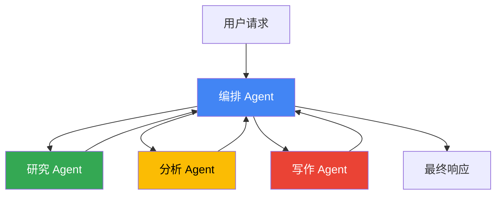
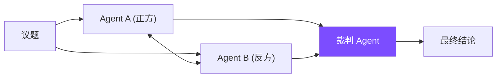
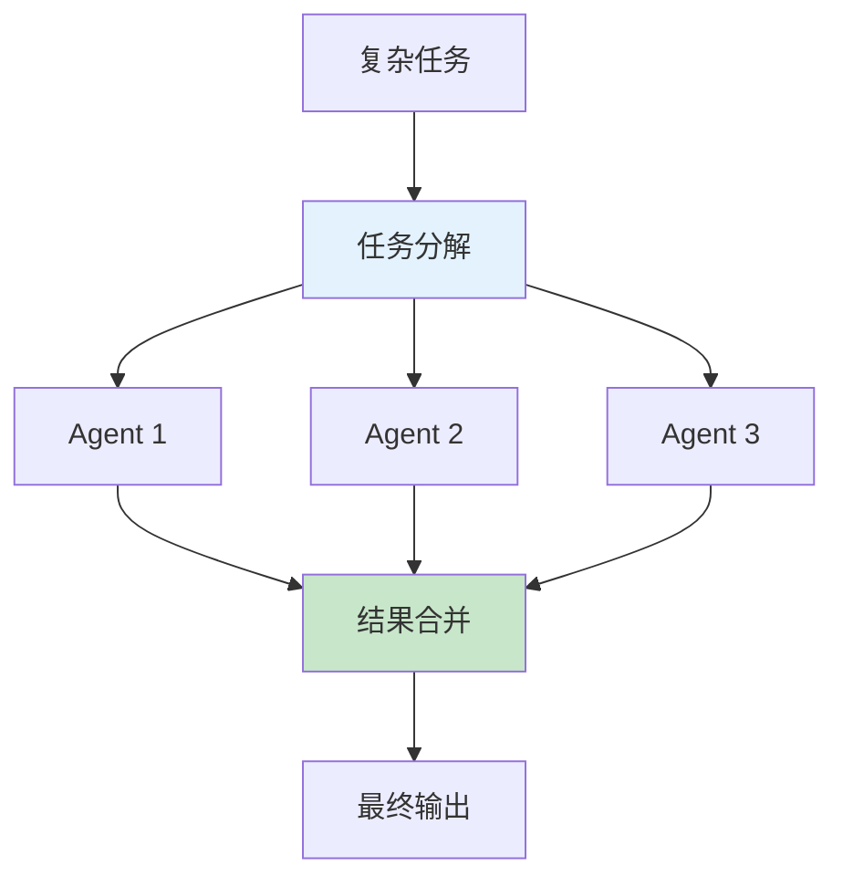
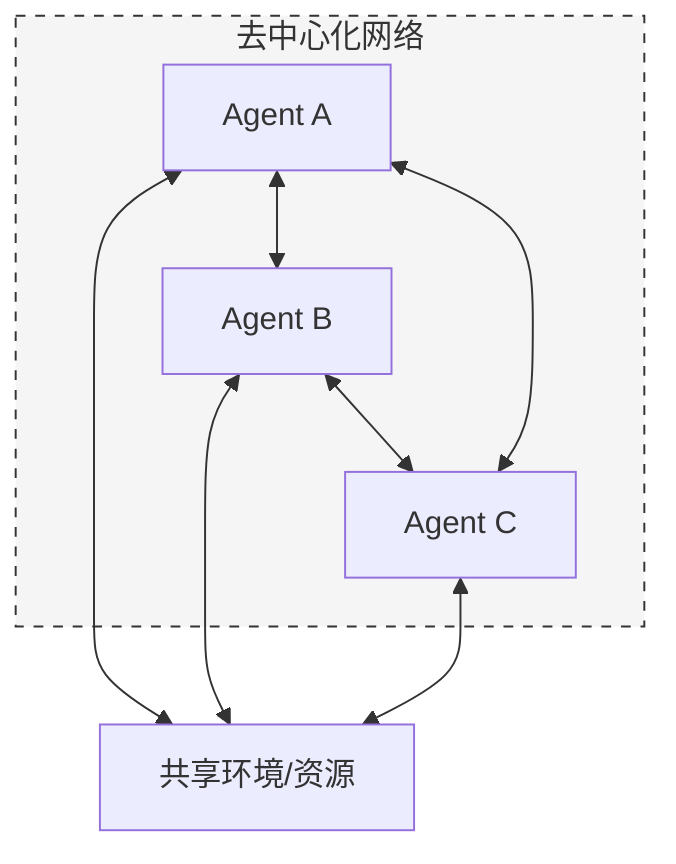
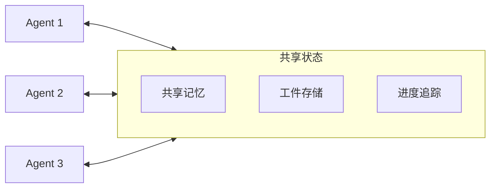
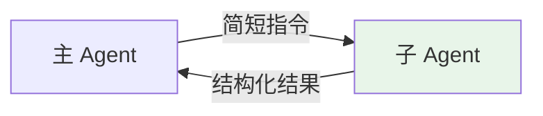

## 14.2 多 Agent 协作与编排

多 Agent 系统是 AI 应用的重要发展方向，通过让多个专业化 Agent 分工协作，可以解决单一 Agent 难以处理的复杂任务。本节深入探讨多 Agent 架构设计、协作模式和提示词策略。

### 14.2.1 为什么需要多 Agent

单一 Agent 面临的挑战：

| 挑战 | 单 Agent 局限 | 多 Agent 优势 |
|------|-------------|--------------|
| 能力边界 | 需要全能型提示词 | 专业化分工 |
| 上下文限制 | 所有信息挤在一个窗口 | 各自维护相关上下文 |
| 复杂任务 | 难以处理多步骤流程 | 流水线式处理 |
| 可维护性 | 巨型提示词难以调试 | 模块化易于优化 |

### 14.2.2 多 Agent 架构模式

#### 1. 层级式架构



*图 14.2-1：层级式多 Agent 架构*

**特点**：
- 中央编排 Agent 负责任务分解和结果整合
- 子 Agent 专注各自领域
- 通信清晰，便于调试

**编排 Agent 提示词示例**：

```xml
<role>
你是一个任务编排专家，负责分解复杂任务并协调多个专业 Agent 完成工作。
</role>

<available_agents>
- ResearchAgent: 负责信息检索和资料收集
- AnalysisAgent: 负责数据分析和逻辑推理
- WritingAgent: 负责内容创作和文档输出
</available_agents>

<instructions>
1. 分析用户任务，确定需要哪些 Agent 参与
2. 制定执行计划（顺序或并行）
3. 调用 Agent 并传递必要上下文
4. 整合各 Agent 结果，生成最终响应
</instructions>

<output_format>
{
  "plan": [执行步骤],
  "agent_calls": [调用详情],
  "final_response": "整合后的回答"
}
</output_format>
```

#### 2. 对话式协作

多个 Agent 通过对话讨论得出结论：



*图 14.2-2：对话式协作模式*

**应用场景**：
- 需要多角度分析的决策问题
- 代码审查（一方写代码，一方审查）
- 创意评估（提出方案 vs 挑战方案）

#### 3. 流水线模式

任务在多个 Agent 间顺序传递：

```
用户输入 → Agent A（理解）→ Agent B（处理）→ Agent C（输出）→ 最终结果
```

**示例：内容创作流水线**

```python
pipeline = [
    {"agent": "ResearchAgent", "task": "收集相关资料"},
    {"agent": "OutlineAgent", "task": "生成文章大纲"},
    {"agent": "DraftAgent", "task": "撰写初稿"},
    {"agent": "EditorAgent", "task": "编辑润色"},
    {"agent": "FactCheckAgent", "task": "事实核查"}
]
```

#### 4. 并行协作模式

多个 Agent 同时处理不同子任务：



*图 14.2-3：并行协作模式*

#### 5. 蜂群模式

不同于层级式架构，蜂群模式是一种去中心化的协作方式：



**特点**：
- **去中心化**：没有指挥官，Agent 之间平等交互。
- **自我组织**：通过简单的个体交互涌现出复杂的群体行为。
- **高鲁棒性**：单个 Agent 的失败不会导致系统瘫痪。

**应用场景**：
- 下一代游戏 NPC 生态
- 大规模社会模拟
- 开放结局的创意写作及头脑风暴

### 14.2.3 主流多 Agent 框架

#### LangGraph

LangGraph 使用图结构表示 Agent 工作流：

```python
from typing import TypedDict

from langgraph.graph import StateGraph, END

def research_agent(state: dict) -> dict:
    return {"current_agent": "research", "result": "（示例）research done"}

def analysis_agent(state: dict) -> dict:
    return {"current_agent": "analyze", "result": (state.get("result", "") + " -> analysis")}

def writing_agent(state: dict) -> dict:
    return {"current_agent": "write", "result": (state.get("result", "") + " -> write")}

def should_continue(state: dict) -> str:
    return "end"

user_query = "写一份关于 AI 发展趋势的简短综述。"

# 定义状态
class AgentState(TypedDict):
    messages: list
    current_agent: str
    result: str

# 构建图
workflow = StateGraph(AgentState)

# 添加节点
workflow.add_node("research", research_agent)
workflow.add_node("analyze", analysis_agent)
workflow.add_node("write", writing_agent)

# 定义边（流转逻辑）
workflow.add_edge("research", "analyze")
workflow.add_conditional_edges(
    "analyze",
    should_continue,
    {"continue": "write", "end": END}
)

# 编译运行
app = workflow.compile()
result = app.invoke({"messages": [user_query]})

print(result)
```

#### CrewAI

CrewAI 采用"团队"隐喻组织多个 Agent：

```python
from crewai import Agent, Task, Crew

def search_tool(q: str) -> str:
    return f"search({q})"

def scrape_tool(url: str) -> str:
    return f"scrape({url})"

# 定义 Agent
researcher = Agent(
    role='研究员',
    goal='收集和整理相关信息',
    backstory='你是一位经验丰富的研究员...',
    tools=[search_tool, scrape_tool]
)

writer = Agent(
    role='作家',
    goal='撰写高质量的内容',
    backstory='你是一位资深内容创作者...'
)

# 定义任务
research_task = Task(
    description='研究{topic}的最新动态',
    agent=researcher
)

write_task = Task(
    description='基于研究结果撰写文章',
    agent=writer,
    context=[research_task]  # 依赖研究任务的结果
)

# 组建团队执行
crew = Crew(agents=[researcher, writer], tasks=[research_task, write_task])
result = crew.kickoff(inputs={'topic': 'AI发展趋势'})

print(result)
```

#### AutoGen

Microsoft 的 AutoGen 支持灵活的多 Agent 对话：

```python
import autogen
from autogen import AssistantAgent, UserProxyAgent

# 创建 Agent
assistant = AssistantAgent(
    name="助手",
    system_message="你是一个有帮助的AI助手",
    llm_config={"model": "gpt-4"}
)

code_reviewer = AssistantAgent(
    name="代码审查员",
    system_message="你是一个严格的代码审查员，关注代码质量和安全性",
    llm_config={"model": "gpt-4"}
)

user_proxy = UserProxyAgent(name="用户代理")

# 发起群聊
groupchat = autogen.GroupChat(
    agents=[user_proxy, assistant, code_reviewer],
    messages=[]
)

print(groupchat)
```

### 14.2.4 Agent 间通信设计

#### A2A Protocol

Google 提出的 A2A 协议标准化了 Agent 间通信：

```json
{
  "message_type": "task_request",
  "from_agent": "orchestrator",
  "to_agent": "research_agent",
  "task": {
    "id": "task_001",
    "description": "搜索2024年AI发展趋势",
    "context": {...},
    "expected_output": "研究报告"
  },
  "priority": "high",
  "timeout_seconds": 300
}
```

#### 状态共享策略



*图 14.2-4：Agent 状态共享机制*

### 14.2.5 实战协作模式

生产级多 Agent 系统通常采用以下两种通信模式：

#### 模式一：任务委托（通过通信实现隔离）

这是经典的主-子 Agent 设置，核心思想是：**主 Agent 发任务，子 Agent 交结果，中间过程免打扰**。



**特点**：
- 子 Agent 的上下文完全独立，从零开始
- 适用于"过程不重要，只关心结果"的任务
- 例如：代码搜索、数据查询、格式转换

从主 Agent 视角，它只是调用了一个函数，但背后实际上是另一个拥有独立工作流的子 Agent 在执行。这种模式也被称为 **"Agent 即工具"**。

#### 模式二：信息同步（通过共享上下文实现协作）

对于高度依赖历史信息的复杂任务，子 Agent 需要继承完整的上下文：

```xml
<inherited_context>
<!-- 子 Agent 获得主 Agent 的完整历史记录 -->
<!-- 但拥有自己独立的系统提示词和行动空间 -->
</inherited_context>
```

**适用场景**：
- 深度研究报告（需要综合大量中间结果）
- 跨步骤的分析任务
- 需要上下文连贯性的创作任务

> **警告：** 共享上下文模式成本较高：每个子 Agent 启动时都需要 Prefill 大量输入，且无法复用主 Agent 的 KV 缓存。应根据任务性质灵活选择。

#### Agent 化的 MapReduce

当需要从多个并行子 Agent 收集结果时，关键挑战是如何获得结构一致的输出：

**解决方案三要素**：

1. **共享沙箱**：所有 Agent 共享同一个文件系统，信息传递只需传递文件路径
2. **输出 Schema**：主 Agent 预先定义结构化的输出模式
3. **约束解码**：强制子 Agent 的输出严格符合 Schema

```python
# 定义输出 Schema
result_schema = {
    "status": "enum: success | partial | failed",
    "summary": "string",
    "data": "array",
    "confidence": "float"
}

# 子 Agent 必须按此格式提交结果
class SubAgent:
    def submit_result(self, *, schema: dict) -> None:
        print("submit_result schema keys:", list(schema.keys()))

sub_agent = SubAgent()
sub_agent.submit_result(schema=result_schema)
```

这种设计的核心思路是：**使用结构化输出作为"契约"，保证信息在 Agent 间完整、一致地传递**。

### 14.2.6 多 Agent 提示词设计原则

#### 1. 明确角色边界

```xml
<role>
你是研究 Agent，专注于信息收集和整理。

你的职责：
- 使用搜索工具查找信息
- 整理和总结发现
- 标注信息来源

你不负责：
- 最终决策
- 内容创作
- 与用户直接交互
</role>
```

#### 2. 定义交接协议

```xml
<handoff_protocol>
当完成任务后，请输出以下格式：

## 任务完成报告
- 状态: [完成/部分完成/需要帮助]
- 结果摘要: [核心发现]
- 详细内容: [完整结果]
- 下一步建议: [给后续 Agent 的建议]
- 需要上报的问题: [如有]
</handoff_protocol>
```

#### 3. 错误处理机制

```xml
<error_handling>
如果遇到以下情况，请采取相应措施：

1. 工具调用失败 → 重试最多3次，仍失败则报告编排Agent
2. 信息不足 → 明确列出缺少什么信息
3. 任务超出能力范围 → 说明原因并建议转交给哪个Agent
4. 结果置信度低 → 标注不确定性，建议人工审核
</error_handling>
```


### 延伸思考

1. 多 Agent 协作和"一个 Agent + 多工具"相比，优势在哪里？什么程度的复杂性才值得引入多 Agent 架构？
2. 当两个 Agent 对同一问题给出矛盾的建议时，系统应该如何仲裁？你会如何在编排层面解决这个问题？
