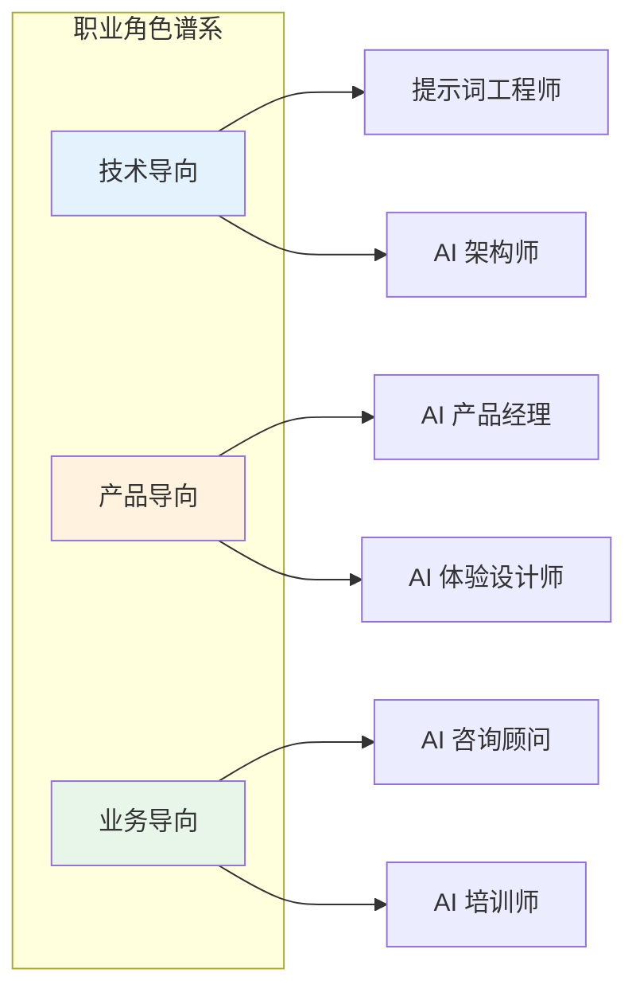

## 14.3 提示词工程的职业发展

提示词工程已成为一个新兴的专业领域，催生了相关的职业机会和技能需求。本节探讨提示词工程师的职业路径、核心技能和发展方向。

### 新兴职业角色

随着 AI 应用的普及，与提示词工程相关的职业角色不断涌现：

| 职业角色 | 核心职责 | 技能侧重 |
|---------|---------|---------|
| 提示词工程师 | 设计和优化提示词系统 | 技术+语言 |
| AI 产品经理 | 定义 AI 产品需求和体验 | 产品+用户 |
| AI 解决方案架构师 | 设计企业级 AI 架构 | 架构+集成 |
| AI 安全专家 | 保障 AI 系统安全合规 | 安全+风控 |
| AI 训练师 | 优化模型行为和输出 | 数据+评估 |
| AI 应用开发者 | 构建 AI 驱动的应用 | 开发+集成 |



*图 14.3-1：AI 相关职业角色分布*

### 核心技能体系

#### 技术技能

1. **语言模型原理**
   - 理解 Transformer 架构和注意力机制
   - 掌握 Token、上下文窗口等核心概念
   - 了解不同模型的能力特点

2. **提示词设计**
   - 掌握各类提示技术（Few-shot、CoT、ReAct 等）
   - 能够针对不同任务设计有效提示词
   - 熟悉多个平台的特定技巧

3. **系统集成**
   - RAG 系统设计与实现
   - Agent 工作流编排
   - API 集成与工具调用

4. **评估与优化**
   - 设计评估指标和测试用例
   - A/B 测试与迭代优化方法
   - 性能监控与分析

```
技术技能层级：
┌────────────────────────────────────────┐
│ 高级：上下文工程、多Agent系统、自动化优化  │
├────────────────────────────────────────┤
│ 中级：RAG、Agent、函数调用、安全防护      │
├────────────────────────────────────────┤
│ 基础：提示词结构、Few-shot、CoT、格式控制  │
└────────────────────────────────────────┘
```

#### 软技能

1. **清晰的语言表达**
   - 将复杂需求转化为精确指令
   - 理解语言的歧义和精确性

2. **系统思维**
   - 从整体架构角度思考问题
   - 考虑边界条件和异常处理

3. **持续学习**
   - AI 领域技术更新极快
   - 需要持续跟踪最新进展

4. **跨领域沟通**
   - 与业务、产品、技术团队协作
   - 将专业知识转化为通俗表达

### 职业发展路径

#### 路径一：技术专家路线

```
初级提示词工程师
    ↓ 2-3年
高级提示词工程师（专注特定领域/平台）
    ↓ 3-5年
AI 解决方案架构师 / 技术负责人
    ↓ 持续深耕
首席 AI 架构师 / 技术顾问
```

#### 路径二：产品管理路线

```
AI 产品助理
    ↓ 2-3年
AI 产品经理
    ↓ 3-5年
高级 AI 产品经理 / 产品总监
    ↓ 持续发展
AI 产品负责人 / CPO
```

#### 路径三：咨询与培训路线

```
AI 应用实践者
    ↓ 积累案例
AI 咨询顾问 / 培训讲师
    ↓ 建立影响力
独立顾问 / 行业专家 / 创业者
```

### 学习资源与路径

#### 入门阶段（1-3 个月）

| 资源类型 | 推荐内容 |
|---------|---------|
| 官方指南 | OpenAI、Anthropic、Google 官方文档 |
| 在线课程 | DeepLearning.AI 提示词工程课程 |
| 实践平台 | ChatGPT、Claude、AI Studio 日常使用 |

#### 进阶阶段（3-6 个月）

| 资源类型 | 推荐内容 |
|---------|---------|
| 高级技术 | RAG、Agent、多模态提示 |
| 开发框架 | LangChain、LlamaIndex 实战 |
| 项目实践 | 构建完整的 AI 应用 |

#### 专业阶段（6-12 个月）

| 资源类型 | 推荐内容 |
|---------|---------|
| 深度专精 | 选择特定领域（如代码生成、客服系统） |
| 社区参与 | 开源贡献、技术分享、行业交流 |
| 认证考试 | 相关平台的开发者认证 |

### 行业薪资参考（2025-2026）

以下为美国市场参考数据：

| 职位级别 | 年薪范围（USD） |
|---------|----------------|
| 初级提示词工程师 | $80K - $120K |
| 高级提示词工程师 | $130K - $180K |
| AI 产品经理 | $150K - $250K |
| AI 解决方案架构师 | $180K - $300K |

> **注**：薪资因地区、公司规模、个人能力差异较大，以上仅供参考。

### 保持竞争力的建议

1. **建立作品集**
   - 记录优化案例和效果数据
   - 开源个人项目或工具
   - 撰写技术博客或教程

2. **跟踪前沿发展**
   - 关注主要模型厂商的更新
   - 阅读最新的研究论文
   - 参与技术社区讨论

3. **发展复合能力**
   - 结合特定领域专业知识
   - 培养产品思维和商业理解
   - 提升沟通和协作能力

4. **构建人脉网络**
   - 参加行业会议和活动
   - 加入专业社区和组织
   - 与同行建立联系

### 小结

提示词工程正从一项技能发展为一个专业领域，提供了广阔的职业发展空间。成功的关键在于：扎实的技术基础、持续的学习能力、清晰的语言表达，以及与业务场景的深度结合。

无论选择技术专家、产品管理还是咨询培训路线，核心都是将 AI 能力转化为实际价值。随着 AI 应用的深入，提示词工程师将成为连接技术与业务的关键角色。

### 延伸阅读

- [DeepLearning.AI Prompt Engineering Course](https://www.deeplearning.ai/short-courses/chatgpt-prompt-engineering-for-developers/) - 入门课程
- [Anthropic Prompt Engineering Guide](https://docs.anthropic.com/en/docs/build-with-claude/prompt-engineering) - Claude 提示词指南
- [AI Engineer World's Fair](https://www.ai.engineer/) - AI 工程师社区
- [LangChain Cookbook](https://python.langchain.com/docs/tutorials/) - 实战教程
