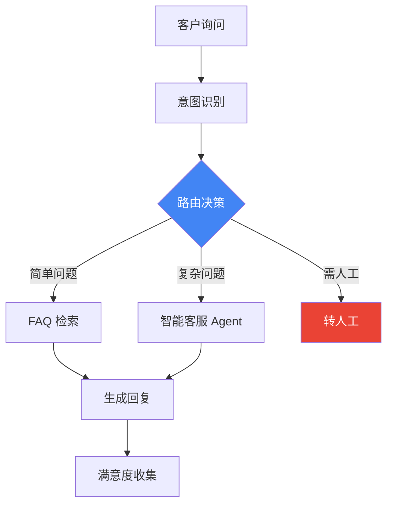
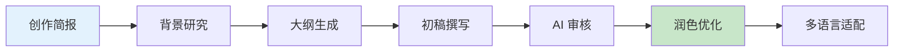
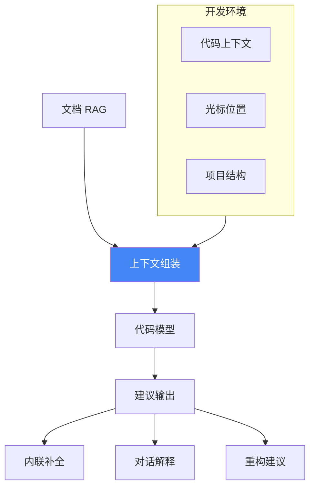
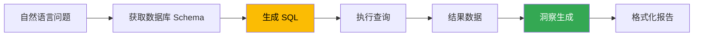
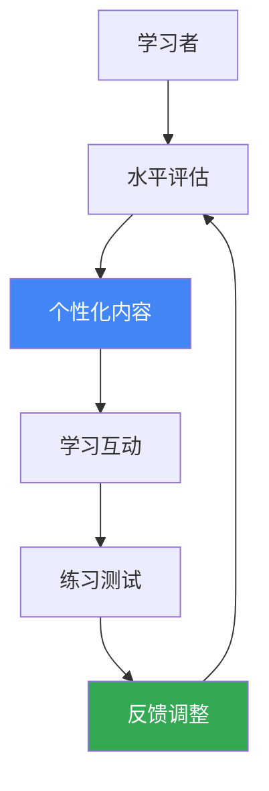

## 14.4 行业应用案例与最佳实践

提示词工程在各行各业都有广泛应用。本节通过深入的行业案例，展示提示词技术如何在实际场景中创造价值。

### 14.4.1 客户服务行业

#### 应用场景
- 智能客服与 FAQ 问答
- 工单分类与路由
- 客户反馈分析

#### 架构设计



*图 14.4-1：智能客服系统架构*

#### 关键提示词模式

```xml
<role>
你是一位专业的客服代表，代表 {company_name} 公司。

核心原则：
1. 始终保持友善和专业的态度
2. 优先使用知识库中的信息回答
3. 不确定时坦诚说明，并提供替代方案
4. 涉及账户敏感操作时，引导用户通过安全渠道处理
</role>

<knowledge_base>
{retrieved_documents}
</knowledge_base>

<conversation_history>
{chat_history}
</conversation_history>

<current_question>
{user_question}
</current_question>

<guidelines>
- 如果知识库中有答案，引用并回答
- 如果需要进一步信息，礼貌询问
- 如果超出能力范围，说明原因并转人工
- 回答语气温和，避免机械感
</guidelines>
```

#### 实施效果
- 首次响应时间：从 5 分钟降至 30 秒
- 人工客服工作量：减少 40-60%
- 客户满意度：维持或提升

---

### 14.4.2 内容创作行业

#### 应用场景
- 营销文案生成
- 技术文档撰写
- 多语言内容本地化
- SEO 优化内容

#### 创作流水线设计



*图 14.4-2：AI 辅助内容创作流程*

#### 关键提示词模式

**品牌调性融入**：

```xml
<brand_voice>
品牌：科技初创公司
调性：专业但不冷漠，创新但不浮夸
目标受众：25-40岁技术决策者
禁用词：革命性、颠覆性、史无前例
偏好词：实用、高效、可靠
</brand_voice>

<task>
为以下产品特性撰写营销文案：
{product_features}
</task>

<requirements>
1. 标题：8字以内，突出核心价值
2. 正文：100-150字，讲清楚用户收益
3. CTA：明确的行动号召
</requirements>
```

**迭代优化流程**：

```
第一轮：生成基础内容
    ↓ 人工反馈
第二轮：根据反馈调整（如"更口语化"、"突出价格优势"）
    ↓ 品控审核
第三轮：最终润色和格式规范
```

---

### 14.4.3 软件开发行业

#### 应用场景
- 代码生成与补全
- 代码审查与优化
- 文档自动生成
- 测试用例生成
- 遗留代码解释

#### 开发辅助架构



*图 14.4-3：AI 代码助手架构*

#### 关键提示词模式

**代码生成**：

```xml
<context>
项目语言：Python 3.11
框架：FastAPI
现有代码：
```python
{surrounding_code}
```
</context>

<task>
在标记位置实现以下功能：
{function_description}
</task>

<requirements>
1. 遵循项目现有代码风格
2. 添加类型注解
3. 处理常见异常
4. 包含简洁的 docstring
</requirements>
```

**代码审查**：

```
请审查以下代码变更：

```diff
{git_diff}
```

审查维度：
1. 逻辑正确性
2. 潜在的性能问题
3. 安全隐患
4. 代码可读性
5. 边界条件处理

请标注问题严重程度：🔴严重 🟡警告 🟢建议
```

---

### 14.4.4 数据分析行业

#### 应用场景
- 自然语言转 SQL
- 数据洞察生成
- 自动化报告
- 异常检测解释

#### 分析系统架构



*图 14.4-4：自然语言数据分析流程*

#### 关键提示词模式

**Text-to-SQL**：

```xml
<database_schema>
表名：sales
列：
- order_id (INT, 主键)
- customer_id (INT, 外键)
- product_name (VARCHAR)
- amount (DECIMAL)
- order_date (DATE)

表名：customers
列：
- customer_id (INT, 主键)
- name (VARCHAR)
- region (VARCHAR)
- signup_date (DATE)
</database_schema>

<rules>
1. 只使用 SELECT 语句，禁止修改数据
2. 使用明确的表别名
3. 日期使用 YYYY-MM-DD 格式
4. 大表查询添加 LIMIT
</rules>

<question>
{user_question}
</question>

请生成 SQL 查询，并解释查询逻辑。
```

---

### 14.4.5 教育培训行业

#### 应用场景
- 个性化学习路径
- 智能答疑解惑
- 自适应测试
- 学习内容生成

#### 教育 AI 设计原则



*图 14.4-5：自适应学习循环*

#### 关键提示词模式

**苏格拉底式引导**：

```xml
<role>
你是一位耐心的导师，采用苏格拉底式教学法。

核心原则：
1. 通过提问引导学生自己发现答案
2. 不直接给出答案，而是给予提示
3. 根据学生的回答调整问题难度
4. 鼓励学生解释自己的思考过程
</role>

<student_context>
年级：{grade}
科目：{subject}
当前理解水平：{level}
学习目标：{goal}
</student_context>

<question_from_student>
{student_question}
</question_from_student>

<teaching_approach>
1. 先了解学生已经知道什么
2. 找到最近发展区，设计引导问题
3. 逐步引导，每次只推进一小步
4. 学生得到正确答案后，帮助总结方法
</teaching_approach>
```

---

### 14.4.6 医疗健康行业

#### 应用场景
- 医学文献检索
- 临床决策支持
- 患者教育材料
- 医疗记录摘要

#### 安全设计要点

```xml
<critical_guidelines>
⚠️ 医疗 AI 应用必须遵守：

1. 不提供诊断或治疗建议
2. 始终建议咨询专业医生
3. 来源必须可追溯
4. 敏感信息严格保护
5. 符合 HIPAA 等法规要求
</critical_guidelines>

<response_template>
这些信息仅供参考，不能替代专业医疗建议。
请务必咨询您的医生或医疗专业人员。

[信息内容]

参考来源：[可信来源列表]
</response_template>
```

---

### 14.4.7 跨行业通用最佳实践

| 实践领域 | 最佳做法 |
|---------|---------|
| **安全边界** | 明确定义 AI 的能力边界和禁止事项 |
| **人工兜底** | 设计清晰的转人工机制 |
| **持续优化** | 收集反馈数据，迭代改进提示词 |
| **可观测性** | 记录输入输出，便于调试和审计 |
| **A/B 测试** | 对比不同提示词版本的效果 |


### 思考

1. 结合您的实际业务场景，您认为 行业应用案例与最佳实践 最关键的应用价值体现在哪里？
