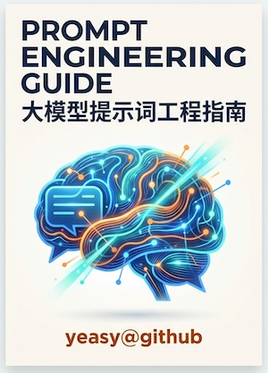
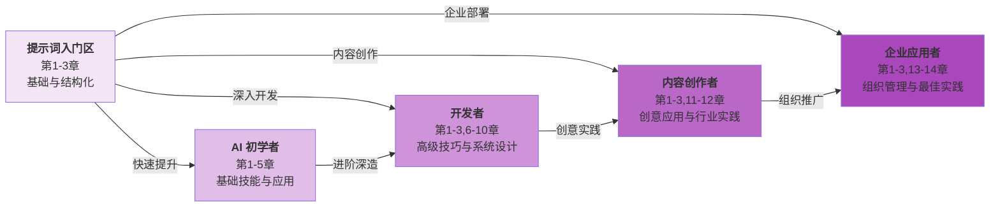

<div align="center">

# 大模型提示词工程指南

[](https://github.com/yeasy/prompt_engineering_guide)
[](https://creativecommons.org/licenses/by-nc-sa/4.0/)
[](https://github.com/yeasy/prompt_engineering_guide/releases)
[](https://yeasy.gitbook.io/prompt_engineering_guide)
[](https://github.com/yeasy/prompt_engineering_guide/releases/latest/download/prompt_engineering_guide.pdf)

> **与人工智能对话的艺术**



</div>

## 关于本书

在人工智能飞速发展的时代，大语言模型（Large Language Models, LLMs）已成为推动各行业变革的核心力量。无论是 [OpenAI 的 GPT 系列](https://chatgpt.com/)、[Anthropic 的 Claude](https://anthropic.com/claude)、[Google 的 Gemini](https://gemini.google.com/)，还是众多开源模型，这些 AI 系统正在重塑人们的工作方式、创作流程和问题解决思路。

然而，仅仅拥有访问权限并不足以释放这些模型的全部潜力。**提示词工程**——这门新兴学科——正是连接人类意图与 AI 能力的关键桥梁。一个精心设计的提示词可以将模糊的想法转化为精确的输出，将复杂的任务分解为可执行的步骤，将潜在的错误降到最低。

本书系统性地介绍提示词工程的核心概念、技术原理、实用技巧和高级策略。从基础的提示词结构设计，到高级的思维链推理、多模态提示、智能体（Agent） 系统构建，再到企业级的提示词运维最佳实践，本书将引导读者逐步掌握这门关键技能。

---

## 目标读者

本书适合以下读者群体：

- **AI 应用开发者**：希望在产品中集成大语言模型，需要掌握高效的提示词设计方法
- **产品经理与设计师**：需要理解如何通过提示词工程优化 AI 产品的用户体验
- **内容创作者与知识工作者**：希望利用 AI 工具提升写作、研究和创作效率
- **数据科学家与机器学习工程师**：希望深入理解提示词技术的原理及其在模型调优中的应用
- **企业决策者**：需要了解提示词工程在组织 AI 战略中的地位和价值
- **AI 爱好者与学习者**：对人工智能技术感兴趣，希望系统性学习提示词技能

无论技术背景如何，只要具备基本的计算机使用能力和对 AI 的好奇心，都能从本书中获益。

---

## 阅读收获

通过阅读本书，读者将能够：

### 理论基础

- 理解大语言模型的工作原理及其与提示词的交互机制
- 掌握提示词工程的核心概念、术语和理论框架
- 了解不同 AI 模型的特性及相应的提示词策略

### 实践技能

- 设计清晰、高效、可复用的提示词模板
- 运用少样本学习、思维链、ReAct 等高级提示技术
- 处理多模态输入（文本、图像、音频、视频）的提示词设计
- 构建复杂的提示词链和 智能体（Agent） 工作流

### 高级应用

- 实现检索增强生成系统的提示词优化
- 设计安全可靠的企业级提示词架构
- 建立提示词测试、评估和持续优化的工作流程
- 掌握自动化提示词生成与优化技术

### 行业洞察

- 了解提示词工程在各行业的应用案例和最佳实践
- 把握提示词工程的最新发展趋势和未来方向
- 理解从“提示词工程”到“上下文工程”的范式演进

---

## 本书特色

1. **体系完整**：从零基础到高级应用，构建完整的知识体系
2. **内容权威**：整合 OpenAI、Anthropic、Google 等官方指南及最新研究成果
3. **实践导向**：大量真实案例和可运行的代码示例
4. **与时俱进**：涵盖最新的技术趋势和最佳实践
5. **深入浅出**：复杂概念通过图解和类比使其易于理解

---

## 如何使用本书

本书按照“从入门到精通”的逻辑组织，建议读者按顺序阅读：

- **第一部分**（第1-4章）介绍基础知识，适合所有读者
- **第二部分**（第5-7章）深入核心技术，适合希望提升技能的实践者
- **第三部分**（第8-11章）探讨高级应用，适合有一定基础的开发者和专业人员
- **第四部分**（第12-14章）展望前沿趋势和行业实践，适合所有读者拓展视野

每章末尾设有”本章小结”，帮助读者巩固关键知识点。

---

## 五分钟快速上手

写出第一个高质量提示词，只需这 3 个步骤：

1. **理解提示词基础（ch1-2）**：掌握提示词的核心要素——角色、背景、任务、约束，理解为什么好提示词会产生好输出（2分钟）
2. **动手写出结构化提示词（ch3）**：按照模板编写你的第一个专业级提示词，包含系统提示、用户需求、输出格式（2分钟）
3. **对比优化效果（ch3 案例）**：看同一个需求的”差提示词”vs”好提示词”的输出差异，直观体会提示词优化的价值（1分钟）

完成这 3 步，你将掌握提示词工程的核心精髓！

## 学习路线图



### 学习角色对比

| 角色 | 推荐章节 | 学习重点 | 预期成果 |
|------|---------|---------|---------|
| **AI 初学者** | 第1-5章 | 基础概念、提示词结构、基础技巧、常见陷阱 | 掌握提示词的基本规律和写法 |
| **开发者** | 第1-3→6-10章 | 高级技巧、链式提示、RAG、智能体集成、测试评估 | 构建生产级提示词系统 |
| **内容创作者** | 第1-3→11-12章 | 创意写作、多模态提示、行业应用案例 | 运用 AI 提升创作效率和质量 |
| **企业应用者** | 第1-3→13-14章 | 企业级应用、提示词管理、团队协作、治理框架 | 在组织内推行提示词工程最佳实践 |

---

## 阅读方式

**在线阅读**：[GitBook 在线版](https://yeasy.gitbook.io/prompt_engineering_guide/)

## 下载离线版本

本书提供 PDF 版本供离线阅读，可前往 [GitHub Releases](https://github.com/yeasy/prompt_engineering_guide/releases/latest) 页面下载最新版本。

**本地阅读**（先安装 [mdPress](https://github.com/yeasy/mdpress)）：

```bash
brew tap yeasy/tap && brew install mdpress
mdpress serve
```

启动本地服务器后，访问 [本地阅读地址](http://localhost:4000)

---

## 推荐阅读

本书是 AI 技术丛书的一部分。以下书籍与本书形成自然衔接：

| 书名 | 与本书的关系 |
|------|------------|
| [《零基础学 AI》](https://github.com/yeasy/ai_beginner_guide) | AI 零基础入门，适合作为前置阅读 |
| [《大模型上下文工程权威指南》](https://github.com/yeasy/context_engineering_guide) | 本书的自然进阶——从提示词工程到上下文工程 |
| [《Claude 技术指南》](https://github.com/yeasy/claude_guide) | 在 Claude 平台上深入实践提示词技术 |
| [《智能体 AI 权威指南》](https://github.com/yeasy/agentic_ai_guide) | 将提示词技术应用于智能体系统设计 |
| [《大模型安全权威指南》](https://github.com/yeasy/ai_security_guide) | 提示词注入防御与安全提示词设计 |
| [《OpenClaw 从入门到精通》](https://github.com/yeasy/openclaw_guide) | 在开源智能体框架中实践提示词工程 |
| [《大模型原理与架构》](https://github.com/yeasy/llm_internals) | 深入理解大语言模型底层逻辑与架构 |

> 💡 **推荐路径**：零基础学 AI → **提示词工程（本书）** → 上下文工程 → 智能体 AI / Claude 技术指南 → 大模型安全

---

## 贡献与反馈

欢迎提交 [Issue](https://github.com/yeasy/prompt_engineering_guide/issues) 或 [PR](https://github.com/yeasy/prompt_engineering_guide/pulls)，尤其欢迎：错别字修正、失效链接修复、实践案例补充与可复用模板。

## 许可证

本书采用 [CC BY-NC-SA 4.0](https://creativecommons.org/licenses/by-nc-sa/4.0/) 授权。

---

*让我们[开始这段探索之旅](01_introduction/README.md)，掌握与 AI 高效对话的艺术！*
