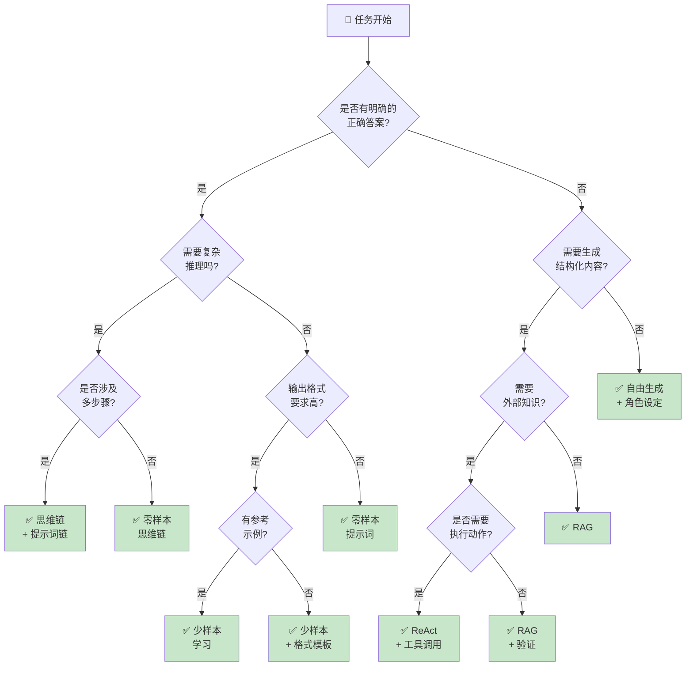

# 附录 F：提示词技术决策树

在实际应用中，当你面对一个新任务时，可能会困惑：“我应该用什么技术？是零样本还是少样本？需要思维链吗？”

本附录提供了一个实用的决策树，帮你快速选择合适的提示词工程技术。

## 快速参考决策树



## 详细决策指南

### 层次 1：区分任务类型

**问题：这是什么类型的任务？**

#### 有明确答案的任务

包括分类、信息提取、事实问答、代码生成等：

```text
示例：
- "这条评论的情感是正面还是负面？"
- "从文本中提取人名"
- "根据这份合同找出关键条款"
- "将这个函数从 JavaScript 改为 Python"
```

**特点**：
- 有标准答案或可验证的结果
- 可以通过自动化指标评估
- 容易定义测试用例

#### 开放式生成任务

包括创意写作、头脑风暴、内容创作、对话等：

```text
示例：
- "为这个产品写营销文案"
- "进行头脑风暴，想出 10 个新产品概念"
- "写一个关于 AI 的故事"
- "和我讨论如何学习编程"
```

**特点**：
- 没有唯一的“正确”答案
- 质量评估更主观
- 强调创意和多样性

### 层次 2：复杂性评估

**问题：任务需要多复杂的推理？**

#### 简单任务 → 零样本

```text
特征：
- 单步完成
- 不需要逻辑推理
- 模型能够直接理解

用零样本当：
- 任务清晰明确
- 模型在预训练中已充分学习
- 格式要求简单

示例提示词：
---
将以下句子翻译为英文：
"我喜欢这部电影"
---

成功率：90%+ （对于简单翻译）
```

#### 中等复杂度 → 少样本 + 思维链

```text
特征：
- 需要理解输入与输出的模式
- 涉及格式转换或简单推理

用少样本当：
- 输出格式不标准
- 需要示范模型的行为
- 模型需要"看到例子"才能理解

示例提示词：
---
从文本中提取实体。使用 JSON 格式。

示例：
输入：张三是一个医生，住在北京
输出：{"人名": "张三", "职业": "医生", "地点": "北京"}

输入：李四在上海工作，是一名律师
输出：{"人名": "李四", "职业": "律师", "地点": "上海"}

输入：王五是程序员，在杭州的阿里巴巴工作
输出：
---

成功率：70-85% （取决于示例质量）
```

#### 复杂任务 → 思维链（CoT）

```text
特征：
- 需要多步推理
- 中间步骤对理解关键
- 答案不能直接推导

用思维链当：
- 任务涉及逻辑推理
- 需要打破问题为子步骤
- 准确性要求高

示例提示词：
---
一个火车以 60 km/h 的速度运行。另一个火车以 40 km/h 的速度
从相反方向运行。两列火车之间的距离是 100 km。一只鸟以
120 km/h 的速度在两列火车之间飞行，直到它们碰撞。
鸟飞行了多远？

请逐步思考：
1. 首先，计算两列火车相对速度
2. 然后，计算碰撞所需的时间
3. 最后，根据时间和鸟的速度计算距离

答案：
---

成功率：85-95% （相比直接问增加 20-30%）
```

### 层次 3：外部知识需求

**问题：任务是否需要超出模型训练数据的信息？**

#### 不需要外部知识 → 纯提示词

```text
使用纯提示词当：
- 答案在模型的一般知识范围内
- 不需要最新信息
- 不需要特定的专有知识库

例子：
- 解释哲学概念
- 编写代码示例
- 进行语言转换
- 回答通用知识问题
```

#### 需要外部知识 → RAG（检索增强生成）

```text
使用 RAG 当：
- 需要最新的信息（新闻、股票价格）
- 需要专有知识库（公司文档、产品说明）
- 需要精确的引用来源
- 需要减少幻觉

示例流程：
1. 用户问："我们最新的产品政策是什么？"
2. 系统从知识库检索相关文档
3. 将文档作为上下文传递给模型
4. 模型在上下文中生成答案

改进：准确率从 60% 提升到 95%+
```

### 层次 4：交互与行动

**问题：模型是否需要执行实际的操作或调用外部系统？**

#### 纯信息生成 → 标准提示词

```text
场景：
- 信息问答
- 内容生成
- 分析与解释

不需要工具调用的提示词：
---
分析这份财务报表，总结关键发现。
---
```

#### 需要执行操作 → ReAct + 工具调用

```text
场景：
- 调用 API 查询数据
- 执行计算
- 访问系统
- 多步工作流

ReAct 框架提示词：
---
你是一个助手，可以使用以下工具：
- search_api(query): 搜索网络
- calculator(expression): 计算数学表达式
- get_weather(city): 获取天气

任务：告诉我北京明天的天气，并建议我应该穿什么

流程：
思考：我需要获取北京的天气预报
行动：get_weather("北京")
观察：[工具返回的结果]
思考：根据天气条件建议穿着
行动：无需调用工具，直接生成建议
---

关键点：
- 明确列出可用工具
- 使用"思考-行动-观察"循环
- 让模型自己决定何时调用工具
```

## 常见场景决策表

### 分类任务

```text
✓ 情感分析（Sentiment Analysis）
- 零样本：✓ 简单情感（正/负/中立）
- 少样本：✓ 复杂情感（混合、讽刺）
- 思维链：✗ 通常不需要

推荐：零样本起步，如果准确率 < 70% 加少样本

示例：
---
将以下评论分类为：正面、负面、中立

评论："这部电影很无聊，浪费了我的时间。"
分类：
---
```

### 信息抽取

```text
✓ 实体识别（Named Entity Recognition）
- 零样本：△ 只适合明显的实体
- 少样本：✓ 推荐，用示例定义实体类型
- 思维链：△ 当实体间有复杂关系时

推荐：少样本，配合 JSON 格式

示例：
---
从文本中提取人物、地点、组织机构。

示例：
文本："马斯克是特斯拉的CEO，公司总部在美国加州。"
结果：{"人物": "马斯克", "组织": "特斯拉", "地点": "美国加州"}

文本："李娜是中国网球运动员，曾效力于国家队。"
结果：
---
```

### 问答系统

```text
✓ 事实问答（Factual QA）
- 零样本：△ 常见问题可以
- 少样本：✓ 格式一致性
- RAG：✓✓✓ 强烈推荐，确保准确性

推荐：RAG + 思维链

示例：
---
[检索的上下文文档]

问题：产品保修期是多长？

基于上述文档，回答问题。如果文档中没有相关信息，说明"文档中未提及"。
---

✓ 开放式问答（Open-ended QA）
- 零样本：✓ 通用知识可以
- 少样本：△ 有益但非必需
- 思维链：✓ 建议使用

推荐：思维链
```

### 代码生成

```text
✓ 程序补全（Code Completion）
- 零样本：✓ 简单场景
- 少样本：✓✓ 推荐，用示例展示风格
- 特殊：考虑代码特定的微调模型

示例：
---
用 Python 写一个函数。

要求：
- 输入：列表
- 输出：排序后的列表
- 方法：快速排序

示例函数风格：
def bubble_sort(arr):
    for i in range(len(arr)):
        for j in range(len(arr)-1-i):
            if arr[j] > arr[j+1]:
                arr[j], arr[j+1] = arr[j+1], arr[j]
    return arr

请写快速排序函数：
---

推荐：少样本 + 代码格式模板
```

### 内容生成

```text
✓ 营销文案（Marketing Copy）
- 零样本：△ 可以，但可能不符合风格
- 少样本：✓✓ 推荐，定义风格和语调
- 角色设定：✓ 非常有用

示例：
---
你是一个经验丰富的市场营销专家，专门写电商产品描述。

语调：热情、专业、简洁
长度：100-150 字

示例：
产品：无线耳机
描述："解放你的双手！这款无线耳机采用最新的主动降噪技术，
让你在任何环境中享受清晰的音质。续航达 12 小时，快速充电
仅需 15 分钟。适合工作、运动、旅行。"

产品：智能手表
描述：
---

推荐：角色设定 + 少样本示例
```

### 数据转换

```text
✓ 格式转换（Format Conversion）
- 零样本：△ 简单格式
- 少样本：✓✓✓ 强烈推荐

示例：
---
将自然语言转换为 SQL 查询。

示例：
输入："找出 2024 年销售超过 10 万的产品"
输出：SELECT * FROM products WHERE sales > 100000 AND year = 2024;

输入："统计每个城市的订单数"
输出：SELECT city, COUNT(*) as order_count FROM orders GROUP BY city;

输入："列出今年评分最高的 5 个产品"
输出：
---

关键：提供 2-3 个高质量示例
```

## 性能优化决策

### 当准确率不达标时

```text
现象：准确率 60-70%，不符合要求

决策流程：
1. 是格式问题？→ 加少样本 + 格式模板
2. 是理解问题？→ 加思维链
3. 是知识不足？→ 加 RAG
4. 是极难的任务？→ 考虑微调或更强的模型

对应改进方案：
┌─────────────┬──────────────┬─────────────────┐
│ 问题类型     │ 具体表现      │ 推荐方案        │
├─────────────┼──────────────┼─────────────────┤
│ 格式错误     │ 格式不规范    │ 少样本 + 模板   │
│ 逻辑错误     │ 推理偏离      │ 思维链 + CoT   │
│ 知识错误     │ 答案错误/幻觉 │ RAG + 验证      │
│ 风格不符     │ 语气不对      │ 角色设定 + 示例 │
└─────────────┴──────────────┴─────────────────┘
```

### 当成本过高时

```text
现象：Token 使用过多，成本高

决策流程：
1. 是上下文太长？→ 精简或摘要
2. 是多次调用？→ 合并为一次
3. 是模型太强？→ 尝试更弱的模型
4. 是重复计算？→ 缓存结果

对应优化方案：
- 删除不必要的示例（保留 2-3 个高质量示例）
- 简化提示词措辞
- 减少上下文信息（检索相关信息，舍弃无关部分）
- 使用 prompt caching 缓存系统提示词
- 对小任务考虑使用 GPT-3.5 而非 GPT-4
```

### 当延迟过高时

```text
现象：响应时间 > 2 秒

决策流程：
1. 是模型推理慢？→ 尝试更小的模型或流式输出
2. 是数据检索慢？→ 优化 RAG 的检索性能
3. 是工具调用多？→ 合并或并行调用
4. 是生成内容长？→ 分页或流式返回

对应优化方案：
- 使用 stream API 流式返回
- 优化向量数据库查询（使用索引、缓存）
- 并行调用多个 API 而非串联
- 预计算常见问题的答案
```

## 技术组合矩阵

```text
        零样本    少样本    思维链    RAG    ReAct
分类      ✓        ✓✓      △        -      -
抽取      △        ✓✓✓     △        △      -
问答      ✓        ✓        ✓✓      ✓✓✓    -
生成      ✓✓       ✓        -        -      -
推理      △        ✓        ✓✓✓      △      -
决策      -        △        ✓✓       -      ✓✓✓
工作流    -        -        △        △      ✓✓✓

图例：
✓     可用
✓✓    推荐
✓✓✓   强烈推荐
△     在特定情况下有用
-     不适用
```

## 实践建议

### 快速迭代策略

```text
第 1 步：选择基础方案（5 分钟）
- 根据决策树选择初始技术
- 撰写最小化提示词
- 测试能否工作

第 2 步：评估效果（10 分钟）
- 在 5-10 个测试用例上运行
- 计算成功率
- 识别主要失败模式

第 3 步：有针对性改进（20 分钟）
- 根据失败模式选择优化策略
- 添加示例或思维链
- 再次测试

第 4 步：边界测试（10 分钟）
- 测试边界情况
- 检查特殊输入
- 评估稳定性

总时间：45 分钟内从 0 到可用的方案
```

### 避免的陷阱

```text
❌ 陷阱 1：一开始就用最复杂的技术
   → 从零样本开始，逐步升级

❌ 陷阱 2：添加过多的示例
   → 2-3 个高质量示例通常足够，更多反而会混淆

❌ 陷阱 3：忽视输入质量
   → 好的 RAG 检索 > 完美的提示词

❌ 陷阱 4：一成不变地使用一种技术
   → 定期重新评估，根据实际结果调整

❌ 陷阱 5：没有建立评估指标
   → 无法判断改进是否有效
```

## 总结

- **简单任务** → 零样本 + 清晰指令
- **格式问题** → 少样本 + 示例
- **推理问题** → 思维链
- **知识问题** → RAG
- **执行问题** → ReAct
- **准确率低** → 添加示例或思维链
- **成本高** → 精简上下文
- **延迟高** → 流式输出或更小的模型
